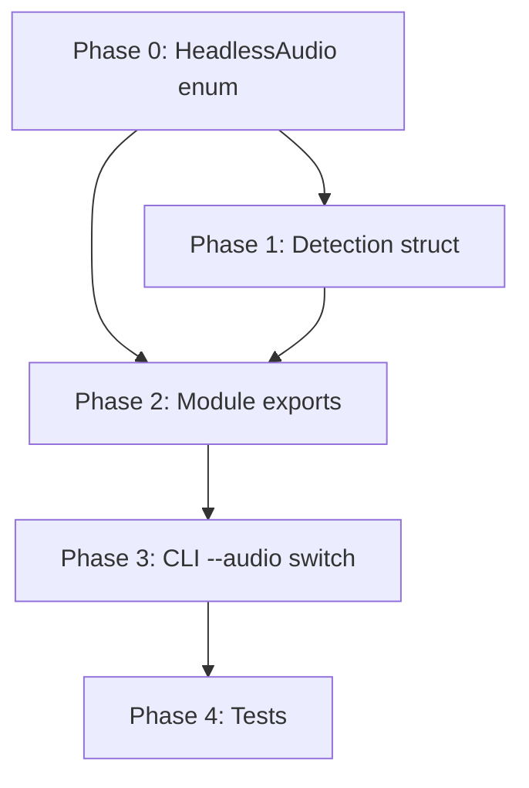

# Planning Process

- [x] Pre-flight Check [12:45:21]
    - [x] Catalogs validated
    - [x] Directories ready
    - [x] Budget estimated: simple (~25%)
- [x] Exploration complete [12:46:30]
    - [x] Patterns understood from TtsClients as template
    - [x] All 11 headless audio players identified from playa/README.md
- [ ] Plan ready for approval

## Plan

### Phase 0: Create HeadlessAudio enum and metadata table
**Agent:** `general-purpose` | **Skills:** rust | **Complexity:** Low
**Deps:** None | **Parallel:** No

**Goal:** Add the `HeadlessAudio` enum to `sniff/lib/src/programs/enums.rs` with all 11 variants and corresponding `HEADLESS_AUDIO_INFO` metadata table.

**Files:**
- `sniff/lib/src/programs/enums.rs`

**Deliver:**
```rust
// ============================================================================
// Headless Audio Player Enum
// ============================================================================

/// Headless audio players for CLI/background playback.
#[derive(
    Debug,
    Clone,
    Copy,
    PartialEq,
    Eq,
    Hash,
    Serialize,
    Deserialize,
    Display,
    EnumString,
    EnumIter,
    EnumCount,
    IntoStaticStr,
)]
#[strum(serialize_all = "snake_case")]
pub enum HeadlessAudio {
    Mpv,
    Ffplay,
    Vlc,
    MPlayer,
    GstreamerGstPlay,
    Sox,
    Mpg123,
    Ogg123,
    AlsaAplay,
    PulseaudioPaplay,
    Pipewire,
}

/// Metadata lookup table for headless audio players.
static HEADLESS_AUDIO_INFO: &[ProgramInfo] = &[
    ProgramInfo::standard(
        "mpv",
        "mpv",
        "CLI media player for audio-only playback",
        "https://mpv.io/",
    ),
    ProgramInfo::standard(
        "ffplay",
        "FFplay",
        "Minimal CLI player shipped with FFmpeg",
        "https://www.ffmpeg.org/ffplay.html",
    ),
    ProgramInfo::standard(
        "cvlc",
        "VLC",
        "Headless VLC playback via cvlc",
        "https://wiki.videolan.org/VLC_command-line_help/",
    ),
    ProgramInfo::standard(
        "mplayer",
        "MPlayer",
        "Classic CLI-oriented media player",
        "https://www.mplayerhq.hu/",
    ),
    ProgramInfo::standard(
        "gst-play-1.0",
        "GStreamer gst-play",
        "CLI front-end to GStreamer pipelines",
        "https://gstreamer.freedesktop.org/documentation/tools/gst-play.html",
    ),
    ProgramInfo::standard(
        "play",
        "SoX play",
        "Swiss-army knife for audio playback",
        "https://linux.die.net/man/1/sox",
    ),
    ProgramInfo::standard(
        "mpg123",
        "mpg123",
        "Lightweight console MP3 player",
        "https://www.mpg123.de/",
    ),
    ProgramInfo::standard(
        "ogg123",
        "ogg123",
        "CLI player for Ogg/Vorbis files",
        "https://github.com/xiph/vorbis-tools",
    ),
    ProgramInfo::standard(
        "aplay",
        "aplay",
        "ALSA low-level playback utility",
        "https://linux.die.net/man/1/aplay",
    ),
    ProgramInfo::standard(
        "paplay",
        "paplay",
        "Simple PulseAudio playback tool",
        "https://manpages.ubuntu.com/manpages/trusty/man1/paplay.1.html",
    ),
    ProgramInfo::standard(
        "pw-play",
        "PipeWire pw-play",
        "PipeWire CLI playback tool",
        "https://docs.pipewire.org/page_man_pw-cat_1.html",
    ),
];

impl ProgramMetadata for HeadlessAudio {
    fn info(&self) -> &'static ProgramInfo {
        &HEADLESS_AUDIO_INFO[*self as usize]
    }
}
```

**Pass when:**
- [ ] Enum has 11 variants matching README
- [ ] Info table has 11 entries
- [ ] `ProgramMetadata` trait implemented
- [ ] Add unit test: `test_headless_audio_count_matches_info`

---

### Phase 1: Create InstalledHeadlessAudio detection struct
**Agent:** `general-purpose` | **Skills:** rust | **Complexity:** Low
**Deps:** Phase 0 | **Parallel:** No

**Goal:** Create `sniff/lib/src/programs/headless_audio.rs` with detection struct following `tts_clients.rs` pattern.

**Files:**
- `sniff/lib/src/programs/headless_audio.rs` (new)

**Deliver:**
```rust
use serde::{Deserialize, Serialize};
use std::path::PathBuf;

use crate::programs::enums::HeadlessAudio;
use crate::programs::find_program::find_programs_parallel;
use crate::programs::schema::{ProgramError, ProgramMetadata};

/// Headless audio players found on the system.
#[derive(Debug, Clone, Serialize, Deserialize, Default, PartialEq, Eq)]
pub struct InstalledHeadlessAudio {
    /// mpv media player. [Website](https://mpv.io/)
    pub mpv: bool,
    /// FFplay from FFmpeg. [Website](https://www.ffmpeg.org/ffplay.html)
    pub ffplay: bool,
    /// VLC media player (cvlc). [Website](https://wiki.videolan.org/VLC_command-line_help/)
    pub vlc: bool,
    /// MPlayer media player. [Website](https://www.mplayerhq.hu/)
    pub mplayer: bool,
    /// GStreamer gst-play tool. [Website](https://gstreamer.freedesktop.org/)
    pub gstreamer_gst_play: bool,
    /// SoX play command. [Website](https://linux.die.net/man/1/sox)
    pub sox: bool,
    /// mpg123 MP3 player. [Website](https://www.mpg123.de/)
    pub mpg123: bool,
    /// ogg123 Vorbis player. [Website](https://github.com/xiph/vorbis-tools)
    pub ogg123: bool,
    /// ALSA aplay utility. [Website](https://linux.die.net/man/1/aplay)
    pub alsa_aplay: bool,
    /// PulseAudio paplay utility. [Website](https://manpages.ubuntu.com/)
    pub pulseaudio_paplay: bool,
    /// PipeWire pw-play/pw-cat. [Website](https://docs.pipewire.org/)
    pub pipewire: bool,
}

impl InstalledHeadlessAudio {
    /// Detect which headless audio players are installed on the system.
    pub fn new() -> Self {
        let programs = [
            "mpv",
            "ffplay",
            "vlc", "cvlc",
            "mplayer",
            "gst-play-1.0", "gst-play",
            "play", "sox",
            "mpg123",
            "ogg123",
            "aplay",
            "paplay", "pacat",
            "pw-cat", "pw-play",
        ];

        let results = find_programs_parallel(&programs);

        let has = |name: &str| results.get(name).and_then(|r| r.as_ref()).is_some();
        let any = |names: &[&str]| names.iter().any(|&name| has(name));

        Self {
            mpv: has("mpv"),
            ffplay: has("ffplay"),
            vlc: any(&["vlc", "cvlc"]),
            mplayer: has("mplayer"),
            gstreamer_gst_play: any(&["gst-play-1.0", "gst-play"]),
            sox: any(&["play", "sox"]),
            mpg123: has("mpg123"),
            ogg123: has("ogg123"),
            alsa_aplay: has("aplay"),
            pulseaudio_paplay: any(&["paplay", "pacat"]),
            pipewire: any(&["pw-cat", "pw-play"]),
        }
    }

    /// Re-check program availability and update all fields.
    pub fn refresh(&mut self) {
        *self = Self::new();
    }

    /// Returns the path to the specified audio player's binary if installed.
    pub fn path(&self, player: HeadlessAudio) -> Option<PathBuf> {
        if self.is_installed(player) {
            player.path()
        } else {
            None
        }
    }

    /// Returns the version of the specified audio player if available.
    pub fn version(&self, player: HeadlessAudio) -> Result<String, ProgramError> {
        if !self.is_installed(player) {
            return Err(ProgramError::NotFound(player.binary_name().to_string()));
        }
        player.version()
    }

    /// Returns the official website URL for the specified audio player.
    pub fn website(&self, player: HeadlessAudio) -> &'static str {
        player.website()
    }

    /// Returns a one-line description of the specified audio player.
    pub fn description(&self, player: HeadlessAudio) -> &'static str {
        player.description()
    }

    /// Checks if the specified audio player is installed.
    pub fn is_installed(&self, player: HeadlessAudio) -> bool {
        match player {
            HeadlessAudio::Mpv => self.mpv,
            HeadlessAudio::Ffplay => self.ffplay,
            HeadlessAudio::Vlc => self.vlc,
            HeadlessAudio::MPlayer => self.mplayer,
            HeadlessAudio::GstreamerGstPlay => self.gstreamer_gst_play,
            HeadlessAudio::Sox => self.sox,
            HeadlessAudio::Mpg123 => self.mpg123,
            HeadlessAudio::Ogg123 => self.ogg123,
            HeadlessAudio::AlsaAplay => self.alsa_aplay,
            HeadlessAudio::PulseaudioPaplay => self.pulseaudio_paplay,
            HeadlessAudio::Pipewire => self.pipewire,
        }
    }

    /// Returns a list of all installed headless audio players.
    pub fn installed(&self) -> Vec<HeadlessAudio> {
        use strum::IntoEnumIterator;
        HeadlessAudio::iter()
            .filter(|p| self.is_installed(*p))
            .collect()
    }
}
```

**Pass when:**
- [ ] Struct has 11 boolean fields
- [ ] `new()` uses `find_programs_parallel` with all alternate commands
- [ ] `is_installed()` match covers all 11 variants
- [ ] `installed()` returns filtered Vec

---

### Phase 2: Wire up module exports
**Agent:** `general-purpose` | **Skills:** rust | **Complexity:** Low
**Deps:** Phase 0, Phase 1 | **Parallel:** No

**Goal:** Update `mod.rs` to export new types and integrate with `ProgramsInfo`.

**Files:**
- `sniff/lib/src/programs/mod.rs`
- `sniff/lib/src/programs/enums.rs` (export)

**Changes to mod.rs:**
```rust
// Add module declaration
pub mod headless_audio;

// Add to pub use enums line:
pub use enums::{
    Editor, HeadlessAudio, LanguagePackageManager, OsPackageManager, TerminalApp, TtsClient, Utility,
};

// Add new pub use:
pub use headless_audio::InstalledHeadlessAudio;

// Update ProgramsInfo struct:
pub struct ProgramsInfo {
    // ... existing fields ...

    /// Headless audio players installed on the system.
    pub headless_audio: InstalledHeadlessAudio,
}

// Update detect() and refresh():
impl ProgramsInfo {
    pub fn detect() -> Self {
        Self {
            // ... existing ...
            headless_audio: InstalledHeadlessAudio::new(),
        }
    }

    pub fn refresh(&mut self) {
        // ... existing ...
        self.headless_audio.refresh();
    }
}
```

**Pass when:**
- [ ] Module exported
- [ ] `HeadlessAudio` enum exported
- [ ] `InstalledHeadlessAudio` exported
- [ ] `ProgramsInfo.headless_audio` field added
- [ ] `detect()` initializes headless_audio
- [ ] `refresh()` calls headless_audio.refresh()

---

### Phase 3: Add CLI --audio switch
**Agent:** `general-purpose` | **Skills:** rust, clap | **Complexity:** Low
**Deps:** Phase 2 | **Parallel:** No

**Goal:** Add `--audio` flag to CLI with proper integration.

**Files:**
- `sniff/cli/src/main.rs`
- `sniff/cli/src/output.rs`

**Changes to main.rs:**
```rust
// Add to Cli struct (Programs Flags section):
/// Show only headless audio players
#[arg(long, help_heading = "Programs Flags")]
audio: bool,

// Update active_filter_flags():
if self.audio {
    flags.push("--audio");
}

// Update output_filter():
if self.audio {
    return OutputFilter::HeadlessAudio;
}

// Update is_programs_mode():
fn is_programs_mode(&self) -> bool {
    self.programs
        || self.editors
        || self.utilities
        || self.language_package_managers
        || self.os_package_managers
        || self.tts_clients
        || self.terminal_apps
        || self.audio  // Add this
}
```

**Changes to output.rs:**

```rust
// Add to OutputFilter enum:
/// Show only headless audio players (programs subsection)
HeadlessAudio,

// Update print_programs_text match:
OutputFilter::HeadlessAudio => {
    print_headless_audio_section(&programs.headless_audio, verbose);
}

// Update print_all_programs:
fn print_all_programs(programs: &ProgramsInfo, verbose: u8) {
    // ... existing sections ...
    print_headless_audio_section(&programs.headless_audio, verbose);
}

// Add new function:
fn print_headless_audio_section(players: &sniff_lib::programs::InstalledHeadlessAudio, verbose: u8) {
    use sniff_lib::programs::ProgramMetadata;

    println!("=== Headless Audio Players ===");
    let installed = players.installed();
    if installed.is_empty() {
        println!("No headless audio players detected");
    } else {
        println!("Installed ({}):", installed.len());
        for player in &installed {
            let name = player.display_name();
            if verbose > 0 {
                let desc = player.description();
                println!("  {} - {}", name, desc);
                if verbose > 1 {
                    println!("    Website: {}", player.website());
                    if let Some(path) = players.path(*player) {
                        println!("    Path: {}", path.display());
                    }
                }
            } else {
                print!("  {}", name);
                println!();
            }
        }
    }
    println!();
}

// Update print_programs_json match:
OutputFilter::HeadlessAudio => serde_json::to_value(&programs.headless_audio)?,

// Update unreachable arms in apply_filter_to_json and print_text:
OutputFilter::HeadlessAudio  // add to existing arms
```

**Pass when:**
- [ ] `--audio` flag parses correctly
- [ ] `sniff --audio` shows only headless audio section
- [ ] `sniff --audio --json` outputs JSON
- [ ] `sniff --programs` includes headless audio
- [ ] `sniff --audio --cpu` returns mutual exclusion error

---

### Phase 4: Tests and validation
**Agent:** `general-purpose` | **Skills:** rust | **Complexity:** Low
**Deps:** Phase 3 | **Parallel:** No

**Goal:** Add tests and verify everything works.

**Files:**
- `sniff/lib/src/programs/enums.rs` (add test)
- `sniff/cli/src/main.rs` (add tests)

**Tests to add:**

In `enums.rs`:
```rust
#[test]
fn test_headless_audio_count_matches_info() {
    assert_eq!(HeadlessAudio::COUNT, HEADLESS_AUDIO_INFO.len());
}
```

In `main.rs` tests:
```rust
#[test]
fn single_audio_flag_is_valid() {
    let cli = parse_args(&["--audio"]).unwrap();
    assert!(cli.validate_filter_flags().is_ok());
}
```

**Manual verification:**
```bash
# Build
cargo build -p sniff-cli

# Test detection
cargo run -p sniff-cli -- --audio

# Test JSON output
cargo run -p sniff-cli -- --audio --json

# Test mutual exclusion
cargo run -p sniff-cli -- --audio --cpu  # Should error

# Test programs includes audio
cargo run -p sniff-cli -- --programs
```

**Pass when:**
- [ ] `cargo test -p sniff-lib` passes
- [ ] `cargo test -p sniff-cli` passes
- [ ] `cargo clippy --workspace` passes
- [ ] Manual tests show expected output

---

## Dependency Graph



## Risks

> No significant risks identified - this is a straightforward pattern replication task.

| Level | Category | Description | Affected | Mitigation |
|-------|----------|-------------|----------|------------|
| LOW | technical | Enum variant order must match info table order | Phase 0 | Add unit test to verify count matches |

## Lessons Learned

> None yet - will be populated during implementation.

## Package Changes

> No new dependencies required - uses existing strum, serde, etc.
