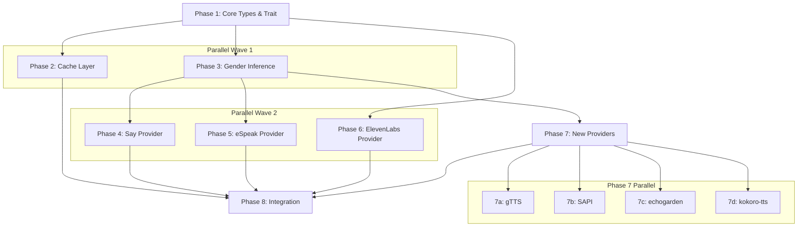

# Planning Process

- [x] Pre-flight Check [12:45:00]
    - [x] Catalogs validated (156 skills, 30 agents)
    - [x] Directories ready
    - [x] Budget estimated: complex (~55%)
- [x] Prep Started [12:45:30]
    - [x] Identified Skills [12:46:00]: rust, clap, tokio, thiserror, serde (required); color-eyre, sysinfo, which, pulldown-cmark (suggested)
    - [x] Identified Subagents [12:46:00]: Explore (assessment), Plan (planning), feature-tester-rust (testing), general-purpose (reviews)
- [x] Prep complete with ~50% context available [12:46:15]
- [x] Clarify & Research [12:47:00]
    - [x] Clarification questions presented
    - [x] User answered 3 questions [12:47:30]
        - Platforms: All platforms, all providers (say, echogarden, gTTS, SAPI, eSpeak, kokoro-tts)
        - Cache: Single JSON file with schema versioning
        - Scope: Core features only (is_ready, list_voices, info); defer download_voice()
    - [x] Requirements updated
- [ ] Codebase Assessment [12:48:00]
    - [x] Explore agent returned [12:48:30]
    - [x] Current state documented:
        - TtsExecutor: only speak() method
        - Types: Voice/Gender/VoiceQuality exist, Voice.gender is String not Gender enum
        - Detection: complete with caching via OnceLock
        - Providers: Say + eSpeak complete, ElevenLabs (cloud) complete, 10 others stubbed
        - Caching: HostTtsCapabilities types defined but unused
        - Dependencies: tokio, tempfile, which, schematic-schema, sniff-lib, thiserror
- [x] Planning Subagent [agent: **Plan**] started [12:49:00]
    - [x] subagent skills used: **rust, tokio, serde, thiserror**
    - [x] Planning completed [12:50:00]: 8 phases identified
- [x] Module Assessment (monorepo) [12:50:15]
    - [x] subagent skills used: rust, tokio
    - [x] Modules impacted: biscuit-speaks, so-you-say (CLI)
- [x] All Pre-review Steps complete [12:50:30]
    - ~40% context used (budget: 55%)
- [x] Reviews Started [12:50:45]
   - [x] Completeness Review: 5 high priority issues (language field missing, platform guards, cache location, schema versioning, language parsing)
   - [x] Concurrency Review: Phase 7 can be parallelized (4 providers), 40-45% timeline reduction possible
   - [x] Correctness Review: 3 errors (Gender::Unknown doesn't exist, AFIT syntax, Voice struct fields), 6 warnings
   - [x] Risk Assessment: 5 high risks (COM complexity, registry paths, trait breaking changes, CLI parser reliability, cross-platform testing)
- [x] Reviews Completed [12:51:30]
    - ~45% context used (budget: 55%)
- [x] Plan Finalization [12:52:00]
    - [x] Review recommendations incorporated
    - [x] Risks documented (5 high, 5 medium, 1 low)
    - [x] Dependency graph generated
- [x] Plan finalized [12:52:30]
- [x] Final Steps
    - [x] Lessons learned collected (4 items)
    - [x] Package changes documented (5 dependencies)
- [x] Summary reported [12:53:00]
    - Plan: `.ai/plans/2026-01-24.plan-for-tts-voice-inventory.md`
    - Phases: 8 (with Phase 7 parallelizable into 4 sub-phases)
    - Context: ~48% used (budget: 55%)

## Plan

### Phase 1: Expand Core Types and Trait Interface
**Agent:** `general-purpose` | **Skills:** rust, thiserror, serde | **Complexity:** Medium
**Deps:** None | **Parallel:** No

**Goal:** Extend `TtsExecutor` trait and refine types to support voice inventory.

**Deliver:**
- Update `Voice.gender` from `String` to `Gender` enum
- Add `Serialize`/`Deserialize` to `Voice`, `VoiceQuality`, `Gender`, `Language`
- Add `HostTtsCapability` struct with `provider`, `voices`, `available_voices` fields
- Add trait methods: `is_ready()`, `list_voices()`, `info()`
- Add error variants: `VoiceEnumerationFailed`, `CacheReadError`, `CacheWriteError`

**Pass when:**
- [ ] All types compile without errors
- [ ] `Voice.gender` is `Gender` enum (not `String`)
- [ ] `cargo check -p biscuit-speaks` succeeds
- [ ] Existing tests still pass

---

### Phase 2: Implement Cache Layer
**Agent:** `general-purpose` | **Skills:** rust, serde, tokio | **Complexity:** Medium
**Deps:** Phase 1 | **Parallel:** No

**Goal:** Create JSON-based cache system for host TTS capabilities.

**Deliver:**
- Create `src/cache.rs` with:
  - `read_from_cache() -> Result<HostTtsCapabilities, TtsError>`
  - `update_provider_in_cache(provider, voices, available) -> Result<(), TtsError>`
  - `bust_host_capability_cache() -> Result<(), TtsError>`
- Use temp file + rename for atomicity
- Add serde, serde_json, dirs dependencies

**Pass when:**
- [ ] Cache functions use `dirs` crate for home directory
- [ ] Write operations use atomic temp file pattern
- [ ] `cargo test -p biscuit-speaks cache::` passes

---

### Phase 3: Add Gender Inference Utility
**Agent:** `general-purpose` | **Skills:** rust | **Complexity:** Low
**Deps:** Phase 1 | **Parallel:** Yes (with Phase 2)

**Goal:** Integrate `gender_guesser` crate for voice name to gender inference.

**Deliver:**
- Add `gender_guesser` dependency
- Create `src/gender_inference.rs` with `infer_gender(name: &str) -> Gender`
- Map "male"→Male, "female"→Female, others→Any

**Pass when:**
- [ ] Function handles edge cases (empty string, special chars)
- [ ] Tests verify common names: "Samantha"→Female, "Albert"→Male

---

### Phase 4: Implement Say Provider Voice Inventory
**Agent:** `general-purpose` | **Skills:** rust, tokio | **Complexity:** Medium
**Deps:** Phase 1, Phase 3 | **Parallel:** No

**Goal:** Extend `SayProvider` with `is_ready()`, `list_voices()`, `info()`.

**Deliver:**
- Parse `say -v '?'` output for voice metadata
- Infer gender using `gender_inference::infer_gender(name)`
- Quality: `Good` for (Enhanced)/(Premium), `Low` for Eloquence (filter out), `Moderate` otherwise

**Pass when:**
- [ ] `is_ready()` returns true only on macOS with `say` binary
- [ ] `list_voices()` parses all format variations
- [ ] `cargo test -p biscuit-speaks providers::host::say::` passes

---

### Phase 5: Implement eSpeak Provider Voice Inventory
**Agent:** `general-purpose` | **Skills:** rust, tokio | **Complexity:** Medium
**Deps:** Phase 1, Phase 3 | **Parallel:** Yes (with Phase 4)

**Goal:** Extend `ESpeakProvider` with voice enumeration.

**Deliver:**
- Parse `espeak-ng --voices` fixed-width output
- Extract gender from Age/Gender field ("M"/"F"/"--")
- All voices get `VoiceQuality::Low` (formant synthesis)

**Pass when:**
- [ ] Parsing handles both `espeak-ng` and `espeak`
- [ ] Age/Gender field correctly parsed for all variants

---

### Phase 6: Implement ElevenLabs Provider Voice Inventory
**Agent:** `general-purpose` | **Skills:** rust, tokio | **Complexity:** Low
**Deps:** Phase 1 | **Parallel:** Yes (with Phase 4, 5)

**Goal:** Add `is_ready()` and `info()` to `ElevenLabsProvider`.

**Deliver:**
- `is_ready()`: check `ELEVENLABS_API_KEY` env var
- Transform existing `list_voices()` to return `Vec<Voice>`
- Quality: `Excellent` for all ElevenLabs voices

**Pass when:**
- [ ] `is_ready()` returns false when API key missing
- [ ] Gender correctly mapped from labels

---

### Phase 7: Implement New Providers (gTTS, SAPI, echogarden, kokoro-tts)
**Agent:** `general-purpose` | **Skills:** rust, tokio | **Complexity:** High
**Deps:** Phase 1, Phase 3 | **Parallel:** No

**Goal:** Create full implementations for 4 new TTS providers.

**Deliver:**
- **gTTS** (`src/providers/host/gtts.rs`): Parse `gtts-cli --all`, all voices `VoiceQuality::Good`
- **SAPI** (`src/providers/host/sapi.rs`): Windows COM interfaces, OneCore→Excellent, SAPI5→Good
- **echogarden** (`src/providers/host/echogarden.rs`): vits+kokoro engines, quality from suffix
- **kokoro-tts** (`src/providers/host/kokoro.rs`): Parse `--help-voices`, infer gender from prefix

**Pass when:**
- [ ] Each provider compiles on target platform
- [ ] `is_ready()` validates prerequisites (binaries, env vars)
- [ ] Voice enumeration parsing handles edge cases

---

### Phase 8: Integration and Cache Population
**Agent:** `general-purpose` | **Skills:** rust, tokio | **Complexity:** Medium
**Deps:** Phase 2, Phase 4-7 | **Parallel:** No

**Goal:** Wire cache system with provider implementations.

**Deliver:**
- Add `populate_cache_for_provider()` and `populate_cache_for_all_providers()`
- Create `examples/list_voices.rs` example
- Export public API from `src/lib.rs`

**Pass when:**
- [ ] Cache file created at `~/.biscuit-speaks-cache.json`
- [ ] `read_from_cache()` returns matching data
- [ ] Example compiles and runs

## Dependency Graph

**Critical Path:** Phase 1 → Phase 3 → Phase 7 → Phase 8

## Risks

> Implementation risks identified during planning with mitigation strategies.

| Level | Category | Description | Affected | Mitigation |
|-------|----------|-------------|----------|------------|
| HIGH | technical | Windows COM interfaces require RAII patterns; resource leaks cause crashes | Phase 7 (SAPI) | Use windows-rs examples, comprehensive CI testing; fallback to PowerShell subprocess |
| HIGH | technical | OneCore voices may not be accessible via standard COM; dual registry enumeration | Phase 7 (SAPI) | Start with SAPI5 voices only, defer OneCore |
| HIGH | technical | Adding methods to TtsExecutor trait breaks existing say/espeak/elevenlabs providers | Phase 1 | Use default trait implementations; create separate TtsVoiceExecutor trait if needed |
| HIGH | technical | CLI parser reliability - outputs vary widely across providers | Phase 4-7 | Comprehensive unit tests with real CLI samples, defensive parsing with logging |
| HIGH | scope | Can't test macOS `say` on Linux, SAPI on macOS - cross-platform testing gap | All | GitHub Actions matrix (macOS, Ubuntu, Windows), platform-specific skips, mocking |
| MEDIUM | dependency | gender_guesser accuracy may be low for non-Western names | Phase 3 | Fallback to Gender::Any when unknown, prefer explicit provider metadata |
| MEDIUM | technical | gTTS requires internet; may fail offline | Phase 7 (gTTS) | HEAD request check in is_ready(), cache connectivity status |
| MEDIUM | technical | Cache invalidation - no auto-detection of new voices installed | Phase 2, 8 | Add schema version field, document bust_cache() usage, add timestamp |
| MEDIUM | correctness | Gender enum uses `Any` not `Unknown` - plan inconsistent with actual enum | Phase 1 | Update plan to use Gender::Any for unknown cases |
| MEDIUM | correctness | Voice struct needs additional fields (identifier, priority, file) | Phase 1 | Extend Voice struct OR use provider-specific intermediate types |
| LOW | scope | 8 providers creates large testing surface | Phase 4-7 | Stagger rollout, implement say+ElevenLabs first, then eSpeak, then others

## Lessons Learned

> Discoveries about skills or memory resources that were inaccurate, incomplete, or missing.

- [FILE: voices.md]: Cache location stated as `~/.biscuit-speaks-cache` but should specify `.json` extension for clarity
- [FILE: voices.md]: Uses `Gender::Unknown` but actual enum has `Gender::Any` - needs reconciliation
- [FILE: voices.md]: Voice struct Language field expansion not specified (currently only English + Custom)
- [SKILL: rust]: AFIT (async functions in traits) syntax may vary - `impl Future + Send` pattern vs `async fn`

## Package Changes

> Dependencies to be added, updated, or removed during implementation.

- [ADD]: serde in cargo - JSON serialization for cache and Voice types
    - Already in dependency tree via schematic-schema, just need to enable derive feature
- [ADD]: serde_json in cargo - JSON parsing for cache file
    - Standard JSON crate, no concerns
- [ADD]: gender_guesser in cargo - Name-based gender inference
    - "What is the accuracy for non-Western names?"
    - "Does it handle empty strings gracefully?"
- [ADD]: dirs in cargo - Cross-platform home directory resolution
    - Verify version compatibility (workspace uses both 5.0 and 6.0)
- [ADD(windows)]: windows in cargo - SAPI COM interfaces (Windows-only)
    - Features: Win32_Media_Speech, Win32_System_Com
    - Only compiled on Windows via cfg gate
