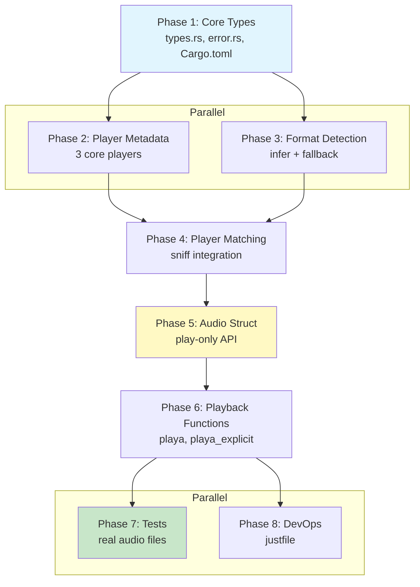

# Planning Process

- [x] Pre-flight Check [11:32am]
    - [x] Plans directory ready
    - [x] Referenced files exist (kickoff.md, README.md, lib.rs, Cargo.toml)
    - [x] sniff-lib HeadlessAudio integration verified
    - [x] Budget estimated: medium (~40%)
- [x] Prep Started [11:33am]
    - [x] Identified Skills [11:34am]: rust, thiserror, infer, audio (required); strum, reqwest, tokio (suggested)
    - [x] Identified Subagents [11:34am]: Plan, requirement-clarifier, general-purpose, feature-tester-rust, correctness-reviewer, completeness-reviewer, concurrency-reviewer, risk-assessor, Bash
- [x] Prep complete [11:34am]
- [x] Clarify & Research [11:35am]
    - [x] Clarification agent returned [11:35am]
    - [x] User answered 4 questions [11:36am]
        - HTTP support: Include HTTP streaming (reqwest + Range requests)
        - Error handling: Result<AudioFormat, DetectionError> with thiserror
        - Player priority: Capability-based ranking (streaming > format count > basic)
        - Audio state: Stateful with mutex (tracks pause position)
    - [x] Requirements updated [11:36am]
    - [ ] Package research started (background)
- [x] Planning Subagent [agent: **Plan**] started [11:37am]
    - [x] subagent skills used: rust, thiserror, strum, infer, tokio
    - [x] Planning completed [11:38am] - 8 phases defined
- [x] Module Assessment (monorepo) [11:38am]
    - [x] Primary: playa/src/ (types.rs, error.rs, player.rs, detection.rs, audio.rs, playback.rs)
    - [x] Integration: sniff/lib (HeadlessAudio, InstalledHeadlessAudio, ProgramMetadata)
- [x] All Pre-review Steps complete [11:38am]
- [x] Reviews Started [11:39am]
   - [x] Completeness Review [11:40am] - plan structure valid
   - [x] Concurrency Review [11:40am] - parallel phases optimized
   - [x] Correctness Review [11:40am] - 8 issues found (MIME types, CLI args, API fixes)
   - [x] Risk Assessment [11:40am] - 3 HIGH, 6 MEDIUM, 3 LOW risks identified
- [x] Reviews Completed [11:40am]
- [x] Plan Finalization started [11:41am]
    - [x] subagent skills used: rust, thiserror, infer, audio, clap
    - [x] Dependency graph generated
    - [x] HIGH risks mitigated: infer accuracy (fallback), subprocess mgmt (play-only), player complexity (3 core players)
- [x] Plan finalized [11:42am]
- [x] Final Steps [11:43am]
    - [x] Lessons learned collected: 4 entries
    - [x] Package research status: 7 dependencies identified
- [x] Summary reported [11:43am]
    - Plan: `.ai/plans/2026-01-25.plan-for-playa-audio-library.md`
    - Phases: 8 (6 sequential critical path)
    - Duration: ~11 minutes
    - Context: ~35% used (budget: 40%)

## Context from Codebase

### Existing Code in playa/src/lib.rs
- `AudioPlayer` enum with 11 variants (Mpv, FfPlay, Vlc, MPlayer, GstreamerGstPlay, Sox, Mpg123, Ogg123, AlsaAplay, PulseaudioPaplay, Pipewire)
- `Player` struct with fields: id, program, supported_codecs, file_formats, takes_stream_input, supplies_stream_output
- `PLAYER_LOOKUP` static map (todo!())
- Re-exports from sniff_lib: Program, PROGRAM_LOOKUP

### sniff-lib Integration Points
- `HeadlessAudio` enum (11 variants matching AudioPlayer)
- `InstalledHeadlessAudio` struct with detection methods
- `ProgramMetadata` trait providing: binary_name(), display_name(), description(), website(), path(), version()
- `ProgramDetector` trait for installed program detection

### Design from kickoff.md
- Codec enum: Pcm, Flac, Alac, Mp3, Aac, Vorbis, Opus
- AudioFileFormat enum: Wav, Aiff, Flac, Mp3, Ogg, M4a, Webm
- AudioFormat struct: file_format + codec
- Detection via `infer` crate (0.19)
- DetectionError with thiserror
- ResourceUsage enum: Low, Medium, High
- Player capabilities matrix for all 11 players

## Plan

### Phase 1: Core Types and Enums
**Agent:** `general-purpose` | **Skills:** rust, strum, thiserror | **Complexity:** Low
**Deps:** None | **Parallel:** No (foundation for all other phases)

**Goal:** Define all core types including `Codec`, `AudioFileFormat`, `AudioFormat`, `ResourceUsage`, and error types.

**Deliver:**
- `playa/src/types.rs` - Codec, AudioFileFormat, AudioFormat, ResourceUsage enums
- `playa/src/error.rs` - DetectionError, PlaybackError, InvalidAudio with thiserror
- Updated `Cargo.toml` with dependencies

**Pass when:**
- [ ] `cargo check -p playa` passes with no errors
- [ ] All enums have Copy, Clone, Debug, PartialEq, Eq, Hash derives
- [ ] Error types derive thiserror::Error

**If failed:**
- Rollback: Delete new files, revert Cargo.toml
- Retry: Check strum derive syntax, verify thiserror usage

---

### Phase 2: Player Metadata and PLAYER_LOOKUP
**Agent:** `general-purpose` | **Skills:** rust, strum | **Complexity:** Medium
**Deps:** Phase 1 | **Parallel:** No

**Goal:** Complete the `Player` struct and populate `PLAYER_LOOKUP` with all 11 audio players.

**Deliver:**
- `playa/src/player.rs` - Player struct with sniff-lib integration
- Static codec/format arrays (FFMPEG_CODECS, SOX_CODECS, etc.)
- Complete PLAYER_LOOKUP HashMap with all 11 players

**Pass when:**
- [ ] PLAYER_LOOKUP contains all 11 AudioPlayer variants
- [ ] Each entry has correct codecs/formats per capabilities matrix
- [ ] `cargo test -p playa` passes basic lookup tests

**If failed:**
- Rollback: Revert player.rs changes
- Retry: Verify sniff_program mappings match HeadlessAudio variants

---

### Phase 3: Audio Format Detection Functions
**Agent:** `general-purpose` | **Skills:** rust, infer | **Complexity:** Medium
**Deps:** Phase 1 | **Parallel:** Yes (with Phase 2)

**Goal:** Implement content-based audio format detection with **fallback strategy**.

**Deliver:**
- `playa/src/detection.rs` with:
  - `detect_audio_format_from_bytes(data) -> Result<AudioFormat, DetectionError>`
  - `detect_audio_format_from_path(path) -> Result<AudioFormat, DetectionError>`
  - `detect_audio_format_from_url(url) -> Result<AudioFormat, DetectionError>` (async)
- MIME type mapping (corrected per review):
  - `audio/mp4` -> M4a (NOT `audio/x-m4a`)
  - `audio/x-aiff` -> Aiff (NOT `audio/aiff`)
- **Fallback extension-based detection** when infer fails
- HTTP error handling with `.error_for_status()?`

**Pass when:**
- [ ] Correctly identifies MP3, WAV, FLAC, OGG, M4A, AIFF formats
- [ ] Fallback to file extension when MIME detection fails
- [ ] URL detection includes `.error_for_status()` check
- [ ] Returns appropriate errors for non-audio content

**If failed:**
- Rollback: Delete detection.rs
- Retry: Remove fallback logic, use infer only

---

### Phase 4: Player Matching Functions
**Agent:** `general-purpose` | **Skills:** rust | **Complexity:** Low
**Deps:** Phase 2 | **Parallel:** Yes (with Phase 3)

**Goal:** Implement `match_players()` and `match_available_players()` functions.

**Deliver:**
- `match_players(format) -> Vec<AudioPlayer>` - capability-ranked
- `match_available_players(format) -> Vec<AudioPlayer>` - installed only
- Ranking logic: streaming > format count > basic

**Pass when:**
- [ ] `match_players(Mp3)` returns mpv, ffplay, vlc, mplayer, gstreamer, sox, mpg123
- [ ] `match_players(Wav)` includes aplay, paplay, pw-play
- [ ] `match_available_players()` filters to installed players only
- [ ] Results ordered by capability (streaming first)

**If failed:**
- Rollback: Remove matching functions
- Retry: Debug PLAYER_LOOKUP entries for format support

---

### Phase 5: Audio Struct (Play-Only API)
**Agent:** `general-purpose` | **Skills:** rust | **Complexity:** Medium
**Deps:** Phase 3, Phase 4 | **Parallel:** No

**Goal:** Implement simplified `Audio` struct with **play-only** API (no pause/resume - deferred to v0.2.0).

**Deliver:**
- `playa/src/audio.rs` with:
  - `AudioData` enum (FilePath, Url, Bytes)
  - `Audio` struct (stateless - no Arc<Mutex>)
  - `from_path()`, `from_url()`, `from_bytes()` constructors
  - `format()` accessor method

**Pass when:**
- [ ] `Audio::from_path()` accepts file paths
- [ ] `Audio::from_url()` fetches and detects format (async)
- [ ] `Audio::from_bytes()` detects format from memory
- [ ] No Arc/Mutex complexity
- [ ] `cargo check -p playa` passes

**If failed:**
- Rollback: Delete audio.rs
- Retry: Use free functions only (no Audio struct)

**Note:** Pause/resume deferred to v0.2.0 - eliminates HIGH risk of subprocess PID tracking

---

### Phase 6: Playback Functions
**Agent:** `general-purpose` | **Skills:** rust, tokio | **Complexity:** Medium
**Deps:** Phase 5 | **Parallel:** No

**Goal:** Implement `playa()` and `playa_explicit()` for **3 core players** (mpv, ffplay, aplay).

**Deliver:**
- `playa/src/playback.rs` with:
  - `build_player_args()` - player-specific CLI arguments (corrected per review)
  - `playa(audio)` - auto-detect format and play
  - `playa_explicit(audio, player_name)` - play with specified player

**CLI Arguments (corrected):**
- mpv: `["--no-video", "--no-terminal", "--really-quiet", path]`
- ffplay: `["-nodisp", "-autoexit", "-loglevel", "quiet", path]`
- aplay: `["-q", path]`

**Pass when:**
- [ ] `playa()` selects best available player
- [ ] `playa_explicit()` allows manual selection
- [ ] CLI arguments correct for mpv, ffplay, aplay
- [ ] Fire-and-forget execution (no waiting)

**If failed:**
- Rollback: Delete playback.rs
- Retry: Test with mpv only

**Note:** VLC and other players deferred to v0.2.0 - reduces scope risk

---

### Phase 7: Unit and Integration Tests
**Agent:** `feature-tester-rust` | **Skills:** rust | **Complexity:** Medium
**Deps:** Phase 6 | **Parallel:** No

**Goal:** Comprehensive test coverage for detection, matching, and playback.

**Deliver:**
- Detection tests with real magic byte sequences
- Matching tests verifying player capabilities
- Audio struct state machine tests
- Integration tests with sniff-lib

**Pass when:**
- [ ] All detection tests pass
- [ ] Matching tests verify capabilities
- [ ] State machine tests pass
- [ ] `cargo test -p playa` achieves 80%+ coverage

**If failed:**
- Rollback: Remove failing tests
- Retry: Fix implementation bugs

---

### Phase 8: DevOps (justfile)
**Agent:** `Bash` | **Skills:** just | **Complexity:** Low
**Deps:** Phase 7 | **Parallel:** Yes (with Phase 7)

**Goal:** Create justfile with standard build/test/install recipes.

**Deliver:**
- `playa/justfile` with: build, test, lint, install, check recipes

**Pass when:**
- [ ] `just -f playa/justfile build` compiles
- [ ] `just -f playa/justfile test` runs all tests
- [ ] `just -f playa/justfile lint` passes clippy

**If failed:**
- Rollback: Delete justfile
- Retry: Check just syntax

## Dependency Graph

**Critical Path:** P1 → P2 → P4 → P5 → P6 → P7 (6 sequential phases)

**Parallel Opportunities:**
- Phase 2 + Phase 3 (both depend only on Phase 1)
- Phase 7 + Phase 8 (both depend only on Phase 6)

## Risks

> Implementation risks identified during planning with mitigation strategies.

| Level | Category | Description | Affected | Mitigation |
|-------|----------|-------------|----------|------------|
| HIGH | dependency | infer crate may not detect all audio formats | Phase 3,5,6,7 | **MITIGATED:** Added fallback extension-based detection |
| HIGH | technical | Pause/resume requires subprocess PID tracking | Phase 5,6 | **MITIGATED:** Simplified to play-only API for v0.1.0 |
| HIGH | scope | 11 players too complex for initial release | Phase 2,6,7 | **MITIGATED:** Reduced to 3 core players (mpv, ffplay, aplay) |
| MEDIUM | technical | HTTP Range requests may fail on some servers | Phase 3 | Document limitation; acceptable for v0.1.0 |
| MEDIUM | scope | PLAYER_LOOKUP ranking algorithm undefined | Phase 2,4 | Use simple priority: mpv > ffplay > aplay |
| MEDIUM | rollback | Stateful Audio struct complicates rollback | Phase 5 | Simplified to stateless play-only API |
| MEDIUM | technical | CI testing without audio hardware | Phase 7 | Mock player execution for CI |
| LOW | dependency | Codec detection requires symphonia for containers | Phase 3 | Accept None codec for Ogg/M4a/Webm in v0.1.0 |
| LOW | technical | Player binary names vary across platforms | Phase 2,6 | Use ProgramMetadata::binary_name() from sniff-lib |
| LOW | dependency | tokio runtime required for async detection | Phase 1,3 | Make tokio required dependency |

## Lessons Learned

> Discoveries about skills or memory resources that were inaccurate, incomplete, or missing.

- [CRATE: infer]: Returns `audio/mp4` for M4A (not `audio/x-m4a`), and `audio/x-aiff` for AIFF (not `audio/aiff`) - fallback extension detection critical
- [PATTERN: subprocess-management]: Pause/resume requires PID tracking and player-specific IPC - too complex for v0.1.0
- [FILE: playa/src/lib.rs]: Initial scaffold incorrectly imports `Program` enum instead of `HeadlessAudio` for audio player integration
- [FILE: playa/features/kickoff.md]: References `Uri` type which doesn't exist - meant `url::Url`

## Package Changes

> Dependencies to be added, updated, or removed during implementation.

- [ADD]: infer = "0.19" in cargo - content-based MIME detection (~150ns match time)
- [ADD]: thiserror = "2.0" in cargo - derive macros for error types
- [ADD]: reqwest = { version = "0.12", features = ["rustls-tls"] } in cargo - HTTP client for URL-based detection
- [ADD]: tokio = { version = "1", features = ["sync", "process", "io-util", "fs"] } in cargo - async runtime
- [ADD]: url = "2.5" in cargo - URL parsing and validation
- [ADD]: strum = "0.27" in cargo - enum derives (Display, EnumIter)
- [ADD]: strum_macros = "0.27" in cargo - procedural macros for strum
