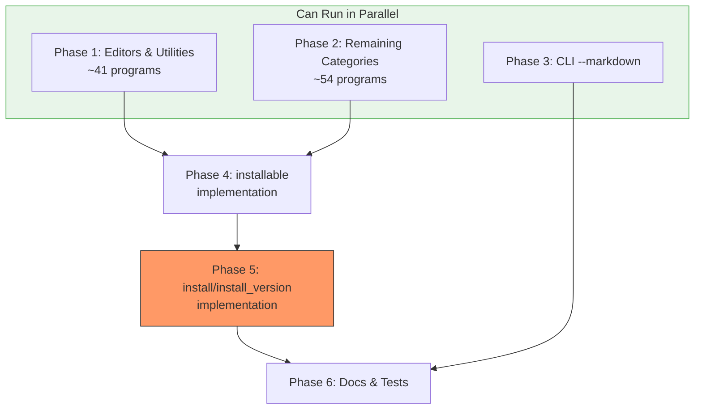

# Planning Process

- [x] Pre-flight Check [12:43pm]
    - [x] Catalogs validated
    - [x] Directories ready
    - [x] Budget estimated: medium (~40%)
- [x] Prep Started [12:44pm]
    - [x] Identified Skills [12:44pm]
    - [x] Identified Subagents [12:44pm]
- [x] Prep complete [12:45pm]
- [x] Clarify & Research [12:45pm]
    - [x] User answered 4 questions [12:46pm]
    - [x] Requirements updated [12:46pm]

## Refined Requirements

User decisions:
1. **Data source**: Hardcode in inventory.rs (keep current pattern)
2. **Phasing**: All four items in one comprehensive plan
3. **Table format**: Biscuit integration (requires adding table support to biscuit)
4. **Scope**: All 120+ programs at once (complete coverage)
- [x] Planning Subagent [agent: **Plan**] started [12:48pm]
    - [x] subagent skills used: rust, clap, thiserror
    - [x] Planning completed [12:49pm]
- [x] Module Assessment (monorepo) [12:49pm]
    - [x] Modules impacted: sniff/lib, sniff/cli, biscuit (minimal)
- [x] All Pre-review Steps complete [12:49pm]
- [x] Reviews Started [12:50pm]
   - [x] Completeness Review - found 11 gaps, 4 high priority
   - [x] Concurrency Review - identified parallelization opportunities
   - [x] Correctness Review - found 12 issues, 5 high severity
   - [x] Risk Assessment - 13 risks (4 high, 6 medium, 3 low)
- [x] Reviews Completed [12:51pm]
- [x] Plan Finalization started [12:51pm]
    - [x] Review corrections incorporated
    - [x] Dependency graph generated
- [x] Plan finalized [12:53pm]
- [x] Final Steps
    - [x] Lessons learned: 0 (no skill/doc issues found)
    - [x] Package changes: 1 (biscuit dep in sniff-cli)
- [x] Summary reported [12:53pm]
    - Plan: `.ai/plans/2026-01-25.plan-for-sniff-future-work-items.md`
    - Phases: 6
    - Duration: 10 minutes
    - Risks: 2 high, 3 medium, 2 low

## Plan

> **Review Corrections Applied:**
> - Dropped `AvailableManagers` struct - use existing detector structs directly
> - installer.rs already has Linux/Windows command templates - just need integration
> - RemoteBash excluded from automated installation (security)
> - Improved parallelization based on concurrency review

### Phase 1: Add Programs to PROGRAM_LOOKUP (Editors & Utilities)
**Agent:** `general-purpose` | **Skills:** rust | **Complexity:** Medium
**Deps:** None | **Parallel:** Yes (with Phase 2, 3)

**Goal:** Add `ProgramDetails` for all remaining Editor and Utility enum variants (~41 programs).

**Deliver:**
- Static installation arrays for 21 remaining editors:
  - Vi, Emacs, XEmacs, Nano, VSCodium, Sublime, Micro, Kakoune, Amp, Lapce
  - JetBrains: PhpStorm, IntellijIdea, PyCharm, WebStorm, CLion, GoLand, Rider
  - Platform-specific: TextMate, BBEdit (macOS), Geany, Kate (Linux)
- Static installation arrays for 20 remaining utilities:
  - Exa, Dust, Procs, Bottom, Zoxide, Direnv, Tealdeer, Htop, Btop
  - Tmux, Zellij, Httpie, Curlie, Mise, Hyperfine, Tokei, Xh, Curl, Wget, Iperf3
- Corresponding `lookup.insert()` calls with full metadata

**Pass when:**
- [ ] All 26 Editor variants have entries in `PROGRAM_LOOKUP`
- [ ] All 30 Utility variants have entries in `PROGRAM_LOOKUP`
- [ ] Each entry has: name, description, os_availability, website, repo, installation_methods
- [ ] `cargo test -p sniff-lib --lib inventory` passes

**If failed:**
- Rollback: Remove newly added static arrays and lookup entries
- Retry: Verify package names are correct for each OS package manager

---

### Phase 2: Add Programs to PROGRAM_LOOKUP (Remaining Categories)
**Agent:** `general-purpose` | **Skills:** rust | **Complexity:** Medium
**Deps:** None | **Parallel:** Yes (with Phase 1, 3)

**Goal:** Add `ProgramDetails` for Package Managers, TTS, Audio, and Terminal variants (~54 programs).

**Deliver:**
- Language package managers (11): Yarn, Bun, GoModules, Composer, SwiftPm, Luarocks, Vcpkg, Conan, Nuget, Hex, Poetry, Cpan, Cpanm
- OS package managers (6): Apt, Nala, Dnf, Pacman, Winget (most built-in, empty install arrays), Chocolatey, Scoop, Nix
- TTS clients (11): Espeak, Festival, Mimic, Mimic3, Echogarden, Balcon, WindowsSapi, GttsCli, CoquiTts, KokoroTts, Pico2Wave
- Audio players (8): Vlc, MPlayer, GstreamerGstPlay, Mpg123, Ogg123, AlsaAplay, PulseaudioPaplay, Pipewire
- Terminal apps (14): ITerm2, Ghostty, Warp, Rio, Tabby, Foot, GnomeTerminal, Konsole, XfceTerminal, Terminology, St, Xterm, Hyper, WindowsTerminal

**Pass when:**
- [ ] All package manager variants have entries (OS pkg mgrs may have empty installation_methods)
- [ ] All TTS client variants have entries
- [ ] All audio player variants have entries
- [ ] All terminal app variants have entries
- [ ] Total entries in `PROGRAM_LOOKUP` exceeds 120
- [ ] `cargo test -p sniff-lib` passes

**If failed:**
- Rollback: Remove newly added static arrays and lookup entries
- Retry: Research correct package names for each platform

---

### Phase 3: Add CLI --markdown Flag
**Agent:** `general-purpose` | **Skills:** rust, clap | **Complexity:** Medium
**Deps:** None | **Parallel:** Yes (with Phase 1, 2)

**Goal:** Add `--markdown` flag that outputs program results as formatted markdown table via biscuit.

**Deliver:**
- Update `sniff/cli/src/main.rs`:
  - Add `#[arg(long, conflicts_with = "json")] markdown: bool` flag
  - Add to Programs output format handling
- Update `sniff/cli/src/output.rs`:
  - Add `print_programs_markdown()` function
  - Construct markdown table string with standard syntax:
    ```markdown
    | Name | Installed | Description | Website |
    |------|-----------|-------------|---------|
    | vim  | Yes       | Vi IMproved | https://vim.org |
    ```
  - Pass to biscuit's `Markdown` struct for terminal rendering
- Add biscuit (shared) dependency to `sniff/cli/Cargo.toml`

**Pass when:**
- [ ] `sniff --programs --markdown` outputs valid markdown table
- [ ] Table columns: Name, Installed (Yes/No), Description, Website
- [ ] With `-v`: adds Binary Name, Path columns
- [ ] With `-vv`: adds Version column
- [ ] `--markdown --json` produces mutual exclusivity error
- [ ] `cargo test -p sniff-cli` passes

**If failed:**
- Rollback: Remove --markdown flag and output function
- Retry: Verify biscuit dependency and Markdown struct API

---

### Phase 4: Implement installable() in ProgramDetector
**Agent:** `general-purpose` | **Skills:** rust, thiserror | **Complexity:** Medium
**Deps:** Phase 1, 2 | **Parallel:** No

**Goal:** Complete `installable()` implementation in all 7 ProgramDetector trait impls.

**Deliver:**
- Update all 7 `ProgramDetector` implementations (editors.rs, utilities.rs, pkg_mngrs.rs x2, tts_clients.rs, terminal_apps.rs, headless_audio.rs):
  1. Look up program in `PROGRAM_LOOKUP` - if not found, return `false`
  2. Check OS compatibility: filter `installation_methods` by `os_availability` matching current OS
  3. Filter out `RemoteBash` methods (not auto-installable)
  4. Check if any remaining method's package manager is installed using existing detector structs:
     - Use `InstalledOsPackageManagers` for brew/apt/dnf/pacman/winget/etc.
     - Use `InstalledLanguagePackageManagers` for cargo/npm/pip/etc.
  5. Return `true` only if at least one viable method exists

**Pass when:**
- [ ] Returns `false` for programs not in `PROGRAM_LOOKUP`
- [ ] Returns `false` for programs incompatible with current OS (e.g., Zed on Windows)
- [ ] Returns `false` when no package manager available for any method
- [ ] Returns `false` for programs with only RemoteBash methods
- [ ] Returns `true` for programs with at least one viable installation path
- [ ] `cargo test -p sniff-lib` passes

**If failed:**
- Rollback: Revert to `false` stub implementations
- Retry: Verify PROGRAM_LOOKUP entries exist and detector structs work

---

### Phase 5: Implement install() and install_version() Methods
**Agent:** `general-purpose` | **Skills:** rust, thiserror | **Complexity:** High
**Deps:** Phase 4 | **Parallel:** No

**Goal:** Complete `install()` and `install_version()` implementations using existing installer.rs module.

**Deliver:**
- Add helper function in `sniff/lib/src/programs/installer.rs`:
  ```rust
  pub fn select_best_method<'a>(
      methods: &'a [InstallationMethod],
      os_pkg_mgrs: &InstalledOsPackageManagers,
      lang_pkg_mgrs: &InstalledLanguagePackageManagers,
  ) -> Option<&'a InstallationMethod>
  ```
  Priority: OS pkg managers > language pkg managers (skip RemoteBash entirely)

- Update all 7 `ProgramDetector` implementations:
  1. Look up program in `PROGRAM_LOOKUP` - if not found, return `NotInstallableOnOs` error
  2. Filter methods by OS compatibility
  3. Call `select_best_method()` to pick installation method
  4. If no method available, return `MissingPackageManager` error
  5. Call `execute_install(method, &InstallOptions::default())` from installer.rs
  6. Check `InstallResult.exit_code` - return Ok(()) if 0, else `PackageManagerFailed`

- For `install_version()`: Same flow but call `execute_versioned_install()`

**Pass when:**
- [ ] Returns `NotInstallableOnOs` error when program not in lookup
- [ ] Returns `MissingPackageManager` error when no package manager available
- [ ] Successfully calls `execute_install()` - verify with dry-run mode test
- [ ] Method selection prefers: brew > apt/dnf/pacman > cargo/npm/pip
- [ ] RemoteBash methods are never selected
- [ ] `install_version()` returns error for methods that don't support versioning
- [ ] `cargo test -p sniff-lib` passes

**If failed:**
- Rollback: Revert to stub implementations returning `Err()`
- Retry: Review installer.rs error types and InstallResult handling

---

### Phase 6: Documentation and Integration Testing
**Agent:** `general-purpose` | **Skills:** rust | **Complexity:** Low
**Deps:** Phases 1-5 | **Parallel:** No

**Goal:** Update documentation and add comprehensive tests.

**Deliver:**
- Update `sniff/docs/allow-installation.md`:
  - Change status from "Future Work" to "Implemented"
  - Document new `--markdown` flag
  - Document `installable()` behavior and method selection priority
  - Document that RemoteBash is excluded from auto-install
- Add integration tests:
  - Test `PROGRAM_LOOKUP` completeness (all enum variants have entries)
  - Test `installable()` returns correct values for edge cases
  - Test CLI `--markdown` output format
  - Test `--markdown --json` mutual exclusivity error

**Pass when:**
- [ ] Documentation accurately reflects implementation
- [ ] All "Future Work" items marked as implemented
- [ ] `PROGRAM_LOOKUP` test verifies 120+ entries
- [ ] `cargo test -p sniff-lib && cargo test -p sniff-cli` passes

**If failed:**
- Rollback: N/A for documentation
- Retry: Fix failing tests

## Dependency Graph



**Critical Path:** P1/P2 → P4 → P5 → P6

**Parallelization:**
- Phases 1, 2, 3 can all run concurrently (no dependencies)
- Phase 4 waits for 1+2 (needs PROGRAM_LOOKUP populated)
- Phase 5 waits for 4 (needs installable() working)
- Phase 6 waits for all others

## Risks

> Implementation risks identified during planning with mitigation strategies.

| Level | Category | Description | Affected | Mitigation |
|-------|----------|-------------|----------|------------|
| HIGH | scope | Package names vary across platforms (fd-find vs fd, nodejs vs node) | P1, P2 | Research each package name per platform; document discrepancies |
| HIGH | technical | installer.rs already complete - plan may duplicate work | P5 | Review existing code first; extend don't rewrite |
| MEDIUM | technical | OS detection needed in installable() - not explicit in trait | P4 | Import `detect_os_type()` and filter methods by `os_availability` |
| MEDIUM | technical | RemoteBash UX unclear - user expects install but gets error | P4, P5 | Document that RemoteBash requires manual execution; return clear error |
| MEDIUM | rollback | Phase 4 touches 7 files - inconsistent state on failure | P4 | Use feature branch; test compilation after each file |
| LOW | dependency | biscuit dependency needed in sniff-cli | P3 | Add `shared = { path = "../../biscuit" }` to Cargo.toml |
| LOW | technical | Version validation complex (semver vs date vs custom) | P5 | Basic validation only; let package manager reject invalid versions |

## Lessons Learned

> Discoveries about skills or memory resources that were inaccurate, incomplete, or missing.

## Package Changes

> Dependencies to be added, updated, or removed during implementation.

- [ADD]: `shared` (biscuit) in sniff/cli/Cargo.toml - markdown table rendering via Markdown struct
  - Research status: not needed (internal monorepo dependency)
