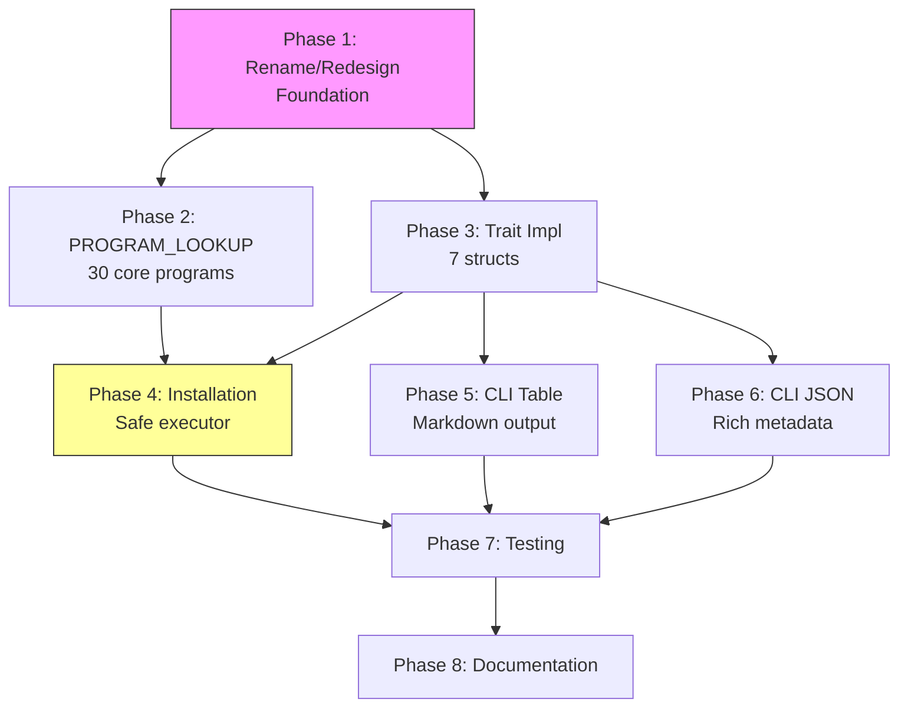

# Planning Process

- [x] Pre-flight Check [11:43am]
    - [x] Plans directory ready
    - [x] Read allow-installation.md requirements doc
    - [x] Explored codebase structure
    - [x] Budget estimated: medium (~45%)
- [x] Prep Started [11:44am]
    - [x] Identified Skills [11:44am]: rust, strum, serde, thiserror, clap
    - [x] Identified Subagents [11:44am]: rust-designer, rust-developer, feature-tester-rust
- [x] Prep complete [11:45am]
- [x] Clarify & Research [11:45am]
    - [x] User answered 3 questions [11:45am]:
        - Naming: Rename struct to `ProgramDetails` (keep trait as `ProgramMetadata`)
        - Install mode: Execute commands via std::process::Command
        - Table scope: Show ALL programs with Installed status column
    - [x] Requirements updated [11:45am]
- [x] Planning Subagent [agent: **Plan**] started [11:46am]
    - [x] subagent skills used: rust, strum, serde, thiserror, clap
    - [x] Planning completed [11:47am]
- [x] Module Assessment (monorepo): sniff/lib, sniff/cli [11:47am]
- [x] All Pre-review Steps complete [11:47am]
- [x] Reviews Started [11:48am]
   - [x] Completeness Review - 21 findings
   - [x] Concurrency Review - recommends merging Phase 2-4
   - [x] Correctness Review - 8 technical issues
   - [x] Risk Assessment - 12 risks identified
- [x] Reviews Completed [11:49am]
- [x] Plan Finalization started [11:50am]
    - [x] Incorporated review recommendations
    - [x] Dependency graph updated
- [x] Plan finalized [11:51am]
- [x] Final Steps
    - [x] Lessons learned collected: 2 items
    - [x] Risks documented: 9 items (3 HIGH, 6 MEDIUM)
- [x] Summary reported [11:51am]
    - Plan: `.ai/plans/2026-01-25.plan-for-sniff-installation-type-safety.md`
    - Phases: 8
    - High-risk: P1 (trait design), P4 (installation safety)

## Codebase Analysis Summary

### Current State

The Sniff library has:

1. **`ProgramDetector` trait** (in `types.rs`) - Already defined but NOT implemented by any struct. Contains:
   - `refresh()`, `path()`, `version()`, `website()`, `description()`, `description_for_terminal()`
   - `installed()`, `installable()`, `install()`, `install_version()`

2. **`ProgramMetadata` trait** (in `schema.rs`) - Currently implemented by enums (Editor, TtsClient, etc.):
   - Provides `binary_name()`, `display_name()`, `description()`, `website()`, `path()`, `version()`

3. **Installed* structs** (editors.rs, tts_clients.rs, etc.) - Each has:
   - Boolean fields for each program
   - `new()`, `refresh()`, `is_installed()`, `installed()`, `path()`, `version()`, `website()`, `description()` methods
   - NOT implementing `ProgramDetector` trait

4. **`Program` enum** (in `inventory.rs`) - Complete inventory of all known programs

5. **`PROGRAM_LOOKUP`** (in `inventory.rs`) - LazyLocked HashMap, but empty (TODO marker)

6. **`InstallationMethod` enum** (in `types.rs`) - Defines package managers for installation

7. **`ProgramMetadata` struct** (in `types.rs`) - Different from the trait, contains:
   - name, description, os_availability, website, repo, installation_methods

### Key Files

| File | Purpose |
|------|---------|
| `sniff/lib/src/programs/types.rs` | `ProgramDetector` trait, `InstallationMethod`, `ProgramMetadata` struct |
| `sniff/lib/src/programs/schema.rs` | `ProgramMetadata` trait, `ProgramInfo` struct, version parsing |
| `sniff/lib/src/programs/inventory.rs` | `Program` enum, `PROGRAM_LOOKUP` HashMap |
| `sniff/lib/src/programs/enums.rs` | Category enums (Editor, TtsClient, etc.) with metadata |
| `sniff/lib/src/programs/*.rs` | Installed* detection structs |
| `sniff/cli/src/output.rs` | CLI output formatting |

### Naming Conflict

There are TWO things called `ProgramMetadata`:
1. **Trait** in `schema.rs` - implemented by enums for metadata lookup
2. **Struct** in `types.rs` - contains fields for a program's metadata

This needs resolution - likely rename the struct.

## Plan

### Analysis Summary

The codebase has:
1. **`ProgramMetadata` trait** (schema.rs) - Already implemented by category enums
2. **`ProgramDetector` trait** (types.rs) - Defined but NOT implemented; uses `<T>` generics that don't fit current design
3. **`ProgramMetadata` struct** (types.rs) - To be renamed to `ProgramDetails`
4. **`InstallationMethod` enum** (types.rs) - 21 package manager variants + RemoteBash
5. **`PROGRAM_LOOKUP`** (inventory.rs) - Empty HashMap that needs populating
6. **7 Installed* structs** - All follow similar pattern but don't implement `ProgramDetector`
7. **`SniffInstallationError`** (error.rs) - Already defined

**Design Decisions:**
1. Redesign `ProgramDetector` trait to use associated types instead of generic `<T>` parameters
2. Fix `ProgramDetails` struct: use `&'static str` for URLs, `&'static [T]` for slices (not `&'static Vec<T>`)
3. Add `Copy` derive to `Program` enum in inventory.rs
4. Start with 30-50 core programs in PROGRAM_LOOKUP; add rest incrementally
5. macOS-first for installation; defer Windows support

### Critical Fixes from Reviews

| Issue | Fix |
|-------|-----|
| ProgramDetails uses `&'static Url` | Change to `&'static str` |
| ProgramDetails uses `&'static Vec<T>` | Change to `&'static [T]` (slice) |
| Program enum missing `Copy` derive | Add `Copy` to derives |
| ProgramDetector uses unbound `<T>` | Use associated type `Self::Program` |
| refresh() takes &self but returns Self | Change to `&mut self` returning nothing |

---

### Phase 1: Type Rename and Trait Redesign
**Agent:** `rust-developer` | **Skills:** rust, strum, serde | **Complexity:** Medium
**Deps:** None | **Parallel:** No (foundation for all other phases)

**Goal:** Fix compilation issues, rename struct, and redesign trait with associated types.

**Deliver:**
1. **Fix `ProgramDetails` struct** (renamed from ProgramMetadata):
   ```rust
   pub struct ProgramDetails {
       pub name: &'static str,
       pub description: &'static str,
       pub os_availability: &'static [OsType],  // NOT &'static Vec
       pub website: &'static str,               // NOT &'static Url
       pub repo: Option<&'static str>,
       pub installation_methods: &'static [InstallationMethod],
   }
   ```

2. **Add `Copy` to Program enum** in inventory.rs

3. **Redesign `ProgramDetector` trait** with associated type:
   ```rust
   pub trait ProgramDetector {
       type Program: ProgramMetadata + Copy;

       fn refresh(&mut self);  // &mut self, no return
       fn is_installed(&self, e: Self::Program) -> bool;
       fn path(&self, e: Self::Program) -> Option<PathBuf>;
       fn version(&self, e: Self::Program) -> Result<String, ProgramError>;
       fn website(&self, e: Self::Program) -> &'static str;
       fn description(&self, e: Self::Program) -> &'static str;
       fn description_for_terminal(&self, e: Self::Program) -> String;
       fn installed(&self) -> Vec<Self::Program>;
       fn installable(&self, e: Self::Program) -> bool;
       fn install(&self, e: Self::Program) -> Result<(), SniffInstallationError>;
       fn install_version(&self, e: Self::Program, version: &str) -> Result<(), SniffInstallationError>;
   }
   ```

4. **Update InstallationMethod::RemoteBash** to use `&'static str` instead of `Url`

**Pass when:**
- [ ] `cargo check -p sniff-lib` passes with no errors
- [ ] No naming conflicts between trait and struct
- [ ] All imports updated

**If failed:**
- Rollback: Revert types.rs and inventory.rs
- Retry: Simplify trait if associated type approach fails

---

### Phase 2: Populate PROGRAM_LOOKUP (Core Programs)
**Agent:** `rust-developer` | **Skills:** rust, serde, strum | **Complexity:** Medium
**Deps:** Phase 1 | **Parallel:** Yes (with Phase 3)

**Goal:** Populate `PROGRAM_LOOKUP` with `ProgramDetails` for **core 50 programs** first; remaining programs added incrementally.

**Deliver:**
- **Priority 1 (30 programs):** Most common tools that users will actually install
  - Editors: vim, neovim, helix, vscode, zed (5)
  - Utilities: ripgrep, bat, fd, fzf, eza, jq, gh, lazygit, delta, starship (10)
  - Pkg Managers: brew, cargo, npm, pnpm, pip, uv (6)
  - TTS: say, espeak-ng, piper, sherpa-onnx (4)
  - Audio: mpv, ffplay, sox (3)
  - Terminal: alacritty, kitty, wezterm (3 - detection only, no install)

- **Data extraction:** Pull from existing EDITOR_INFO, UTILITY_INFO, etc. arrays
- **Installation methods:** Focus on Brew (macOS) and Cargo (cross-platform)

**Pass when:**
- [ ] 30+ core programs have complete ProgramDetails entries
- [ ] Each entry has at least one installation method (prefer Brew/Cargo)
- [ ] `cargo test -p sniff-lib` passes

**Future work:** Add remaining ~120 programs incrementally in follow-up PRs

---

### Phase 3: Implement ProgramDetector for Installed* Structs
**Agent:** `rust-developer` | **Skills:** rust, thiserror | **Complexity:** Medium
**Deps:** Phase 1 | **Parallel:** Yes (with Phase 2)

**Goal:** Implement `ProgramDetector` trait for all 7 Installed* structs.

**Deliver:**
- InstalledEditors, InstalledUtilities, InstalledLanguagePackageManagers, InstalledOsPackageManagers, InstalledTtsClients, InstalledTerminalApps, InstalledHeadlessAudio
- Include `description_for_terminal()` with OSC8 hyperlinks

**Pass when:**
- [ ] All 7 structs implement `ProgramDetector`
- [ ] `cargo check -p sniff-lib` passes

---

### Phase 4: Installation Logic (Safe Executor)
**Agent:** `rust-developer` | **Skills:** rust, thiserror | **Complexity:** High
**Deps:** Phase 2, Phase 3 | **Parallel:** No

**Goal:** Implement safe package manager command execution with user confirmation.

**Deliver:**
- New module `installer.rs` with **safety features**:
  ```rust
  pub struct InstallOptions {
      pub dry_run: bool,        // Show command without executing
      pub skip_confirm: bool,   // Skip user confirmation
  }

  pub fn execute_install(method: &InstallationMethod, pkg: &str, opts: &InstallOptions)
      -> Result<(), SniffInstallationError>;
  ```

- **Security requirements:**
  - [ ] Input sanitization (reject pkg names with shell metacharacters)
  - [ ] Command allowlist validation
  - [ ] User confirmation prompt before execution (unless --yes flag)
  - [ ] Display exact command before running
  - [ ] Timeout handling (30s default)

- **Command templates (macOS focus):**
  | Method | Install | Versioned |
  |--------|---------|-----------|
  | Brew | `brew install {pkg}` | `brew install {pkg}@{ver}` |
  | Cargo | `cargo install {pkg}` | `cargo install {pkg} --version {ver}` |
  | Npm | `npm install -g {pkg}` | `npm install -g {pkg}@{ver}` |

- **Selection priority:** Brew > Cargo > Npm > others

**Pass when:**
- [ ] Dry-run mode shows commands without executing
- [ ] Confirmation prompt appears before real execution
- [ ] Shell metacharacters rejected in pkg names
- [ ] RemoteBash returns error for `install_version()`

**Deferred:** Linux (apt/dnf) and Windows (winget) support

---

### Phase 5: CLI Table Output
**Agent:** `rust-developer` | **Skills:** rust, clap | **Complexity:** Medium
**Deps:** Phase 3 | **Parallel:** Yes (with Phase 4)

**Goal:** Update CLI text output to markdown table showing ALL programs.

**Deliver:**
- Replace list output with markdown table in output.rs
- Use biscuit's `Markdown` struct for rendering
- Show: Program (with link), Status (✅/❌), Description

**Pass when:**
- [ ] Markdown table renders correctly
- [ ] All programs displayed (not just installed)
- [ ] OSC8 hyperlinks work

---

### Phase 6: CLI JSON Output Enhancement
**Agent:** `rust-developer` | **Skills:** rust, serde, clap | **Complexity:** Low
**Deps:** Phase 3 | **Parallel:** Yes (with Phase 4, Phase 5)

**Goal:** Enhance JSON output with full metadata; maintain backward compatibility.

**Deliver:**
- New struct `ProgramJsonEntry`:
  ```rust
  #[derive(Serialize)]
  struct ProgramJsonEntry {
      name: String,
      binary_name: String,
      installed: bool,
      path: Option<PathBuf>,
      version: Option<String>,
      description: String,
      website: String,
      installable: bool,
      installation_methods: Vec<String>,
  }
  ```

- **Backward compatibility:** Add `--json-format` flag:
  - `simple` (default): Old `HashMap<String, bool>` format
  - `full`: New rich metadata format

- Update `print_programs_json()` to use flag

**Pass when:**
- [ ] `--json` produces old format by default (backward compatible)
- [ ] `--json --json-format full` produces rich metadata
- [ ] `version` field populated when installed
- [ ] `installation_methods` shows available options

---

### Phase 7: Integration Testing
**Agent:** `feature-tester-rust` | **Skills:** rust | **Complexity:** Medium
**Deps:** Phase 4, Phase 5, Phase 6 | **Parallel:** No

**Goal:** Comprehensive integration tests.

**Deliver:**
- `ProgramDetector` trait tests
- `PROGRAM_LOOKUP` coverage tests
- `installable()` logic tests with mocked OS
- CLI output format tests

**Pass when:**
- [ ] `cargo test -p sniff-lib` passes
- [ ] `cargo test -p sniff-cli` passes

---

### Phase 8: Documentation
**Agent:** `rust-developer` | **Skills:** rust | **Complexity:** Low
**Deps:** Phase 7 | **Parallel:** No

**Goal:** Update documentation for new features.

**Deliver:**
- Update module docs in mod.rs
- Update allow-installation.md with completion notes
- Update CLI help text

**Pass when:**
- [ ] `cargo doc -p sniff-lib` generates without warnings
- [ ] CLI `--help` reflects new flags

## Dependency Graph



**Critical Path:** P1 → P2 → P4 → P7 → P8

**Parallel Opportunities:**
- P2 and P3 can run in parallel (both depend only on P1)
- P5 and P6 can run in parallel (both depend only on P3)

**High-Risk Phases:** P1 (trait design), P4 (security)

## Risks

> Implementation risks identified during planning with mitigation strategies.

| Level | Category | Description | Affected | Mitigation |
|-------|----------|-------------|----------|------------|
| HIGH | dependency | biscuit Markdown struct may not exist; sniff-lib doesn't depend on shared | Phase 5 | Verify dependency exists; use comfy-table fallback |
| HIGH | scope | ~150 programs need metadata research (20-40 hours manual work) | Phase 2 | Start with 30-50 core programs; incrementally add rest |
| HIGH | technical | ProgramDetector trait design uses unbound generics; may not compile | Phase 1,3 | Create design spike first; verify compilation |
| HIGH | technical | install() executes shell with sudo; security/UX risks | Phase 4 | Implement safe executor with confirmations; dry-run mode |
| MEDIUM | dependency | reqwest::Url import in types.rs but not in dependencies | Phase 1,3,4 | Add reqwest or use String instead of Url |
| MEDIUM | scope | Cross-platform installation logic triples complexity | Phase 4,7 | Start macOS-only; add Linux second; defer Windows |
| MEDIUM | technical | ProgramMetadata uses &'static Vec/Url (won't compile) | Phase 2,3 | Use owned types or slices; LazyLock for caching |
| MEDIUM | rollback | Struct renaming affects 7 structs in use | Phase 1,3 | Feature branch; keep old API until verified |
| MEDIUM | scope | JSON format change is breaking for consumers | Phase 6 | Add --json-format flag; default to old format |

## Lessons Learned

> Discoveries about skills or memory resources that were inaccurate, incomplete, or missing.

- [FILE: sniff/docs/allow-installation.md]: References "ProgramDetector trait" but the trait design in types.rs has compilation issues (unbound generics, invalid static references)
- [FILE: sniff/lib/src/programs/types.rs]: Uses `&'static Url` and `&'static Vec<T>` which won't compile; needs design fix

## Package Changes

> Dependencies to be added, updated, or removed during implementation.

- (none identified yet - biscuit's Markdown struct already exists in the codebase)
