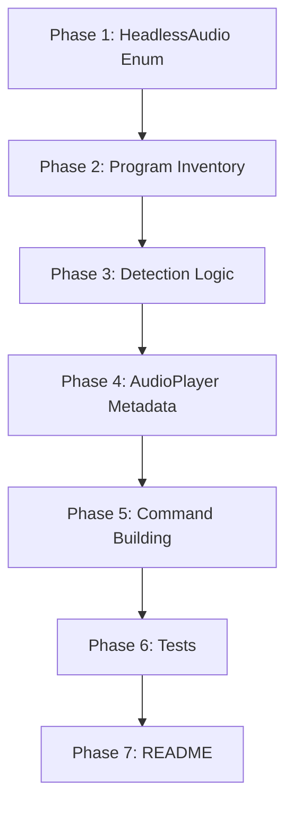

# Planning Process

- [x] Pre-flight Check [16:12]
    - [x] VLC uses `cvlc` binary (confirmed at sniff/lib/src/programs/enums.rs:1088)
    - [x] Plans directory ready
    - [x] Budget estimated: medium (~35%)
- [x] Prep Started [16:13]
    - [x] Identified Skills: rust (required), strum (suggested)
    - [x] Explored architecture: 5 file locations need changes
- [x] Prep complete [16:14]
- [x] Clarify & Research [16:15]
    - [x] afplay CLI verified: -v (volume 0-1), -r (rate 0.4-3.0)
    - [x] pacat CLI verified: playback is default mode, reads stdin
    - [x] No user questions needed
- [x] Planning Subagent [16:16]
    - [x] skills used: rust
    - [x] Planning completed
- [x] Reviews Started [16:20]
   - [x] Completeness Review - identified 6 critical gaps (all addressed)
   - [x] Correctness Review - clarified pacat vs paplay distinction
- [x] Reviews Completed [16:22]
- [x] Plan Finalized [16:25]

## Plan

### Phase 1: Sniff Layer - Add HeadlessAudio Enum Variants
**Agent:** `general-purpose` | **Skills:** rust | **Complexity:** Low
**Deps:** None | **Parallel:** No

**Goal:** Add `MacOsAfplay` and `PulseaudioPacat` variants to the HeadlessAudio enum.

**Files to modify:**
1. `sniff/lib/src/programs/enums.rs`
   - Add `MacOsAfplay` and `PulseaudioPacat` to `HeadlessAudio` enum (~line 1059)
   - Add corresponding `ProgramInfo` entries to `HEADLESS_AUDIO_INFO` array (~line 1074)
   - **CRITICAL:** Enum order MUST match array order (test-enforced)

**ProgramInfo entries:**
```rust
// MacOsAfplay (after AlsaAplay alphabetically)
ProgramInfo::standard(
    "afplay",
    "afplay",
    "macOS native audio file player",
    "https://ss64.com/osx/afplay.html",
),

// PulseaudioPacat (after PulseaudioPaplay)
ProgramInfo::standard(
    "pacat",
    "pacat",
    "PulseAudio raw audio streaming",
    "https://www.freedesktop.org/wiki/Software/PulseAudio/",
),
```

**Pass when:**
- [ ] `cargo test -p sniff-lib --lib programs::enums::tests` passes
- [ ] HeadlessAudio enum has 13 variants (was 11)

---

### Phase 2: Sniff Layer - Add Program Inventory Entries
**Agent:** `general-purpose` | **Skills:** rust | **Complexity:** Low
**Deps:** Phase 1 | **Parallel:** No

**Goal:** Add Program enum variants and installation method lookups.

**Files to modify:**
1. `sniff/lib/src/programs/inventory.rs`
   - Add `MacOsAfplay` and `PulseaudioPacat` to `Program` enum (Headless Audio section, ~line 137)
   - Add installation method arrays
   - Add entries to `PROGRAM_LOOKUP` HashMap

**Installation arrays:**
```rust
// macOS afplay is pre-installed, no installation needed
static MACOS_AFPLAY_INSTALL: &[InstallationMethod] = &[];

// pacat is part of pulseaudio-utils
static PULSEAUDIO_PACAT_INSTALL: &[InstallationMethod] = &[
    InstallationMethod::Apt("pulseaudio-utils"),
    InstallationMethod::Dnf("pulseaudio-utils"),
    InstallationMethod::Pacman("pulseaudio"),
];
```

**PROGRAM_LOOKUP entries:**
```rust
lookup.insert(
    Program::MacOsAfplay,
    ProgramDetails::full(
        "afplay",
        "macOS native audio file player",
        MACOS_ONLY,
        "https://ss64.com/osx/afplay.html",
        None,
        MACOS_AFPLAY_INSTALL,
    ),
);

lookup.insert(
    Program::PulseaudioPacat,
    ProgramDetails::full(
        "pacat",
        "PulseAudio raw audio streaming",
        LINUX_ONLY,
        "https://www.freedesktop.org/wiki/Software/PulseAudio/",
        None,
        PULSEAUDIO_PACAT_INSTALL,
    ),
);
```

**Pass when:**
- [ ] `cargo test -p sniff-lib --lib programs::inventory::tests` passes

---

### Phase 3: Sniff Layer - Add Detection Logic
**Agent:** `general-purpose` | **Skills:** rust | **Complexity:** Low
**Deps:** Phase 2 | **Parallel:** No

**Goal:** Add program detection fields and methods.

**Files to modify:**
1. `sniff/lib/src/programs/headless_audio.rs`
   - Add `macos_afplay: bool` and `pulseaudio_pacat: bool` fields to `InstalledHeadlessAudio` struct
   - Add "afplay" and "pacat" to detection program list in `new()`
   - Add mapping in `headless_audio_details()` function
   - Add match arms in `is_installed()` method

**Detection code:**
```rust
// In new() - add to programs array
"afplay",
"pacat",

// In Self initialization
macos_afplay: has("afplay"),
pulseaudio_pacat: has("pacat"),

// In headless_audio_details()
HeadlessAudio::MacOsAfplay => Program::MacOsAfplay,
HeadlessAudio::PulseaudioPacat => Program::PulseaudioPacat,

// In is_installed()
HeadlessAudio::MacOsAfplay => self.macos_afplay,
HeadlessAudio::PulseaudioPacat => self.pulseaudio_pacat,
```

**Pass when:**
- [ ] `cargo test -p sniff-lib` passes
- [ ] `cargo build -p sniff-lib` succeeds

---

### Phase 4: Playa Layer - Add AudioPlayer Enum and Metadata
**Agent:** `general-purpose` | **Skills:** rust | **Complexity:** Medium
**Deps:** Phase 3 | **Parallel:** No

**Goal:** Add AudioPlayer variants with full capability metadata.

**Files to modify:**
1. `playa/lib/src/player.rs`
   - Add `MacOsAfplay` and `PulseaudioPacat` to `AudioPlayer` enum
   - Update `as_headless_audio()` mapping
   - Define codec/format support arrays
   - Add entries to `PLAYER_LOOKUP` HashMap
   - Update `ALL_PLAYERS` array (11 → 13)

**Codec/Format arrays:**
```rust
// afplay supports many formats via Core Audio
static AFPLAY_CODECS: &[Codec] = &[
    Codec::Pcm,
    Codec::Flac,
    Codec::Alac,
    Codec::Mp3,
    Codec::Aac,
];

static AFPLAY_FORMATS: &[AudioFileFormat] = &[
    AudioFileFormat::Wav,
    AudioFileFormat::Aiff,
    AudioFileFormat::Flac,
    AudioFileFormat::Mp3,
    AudioFileFormat::M4a,
];

// pacat handles raw PCM only
static PACAT_CODECS: &[Codec] = &[Codec::Pcm];
static PACAT_FORMATS: &[AudioFileFormat] = &[AudioFileFormat::Wav];
```

**PLAYER_LOOKUP entries:**
```rust
// Tier 1: macOS native with speed + volume (but no stdin)
map.insert(
    AudioPlayer::MacOsAfplay,
    Player {
        id: AudioPlayer::MacOsAfplay,
        sniff_program: HeadlessAudio::MacOsAfplay,
        supported_codecs: AFPLAY_CODECS,
        supported_formats: AFPLAY_FORMATS,
        takes_stream_input: false,    // File-only, no stdin
        supplies_stream_output: false,
        is_open_source: false,        // Apple proprietary
        resource_usage: ResourceUsage::Low,
        supports_speed_control: true,  // -r 0.4-3.0
        supports_volume_control: true, // -v 0.0-1.0
    },
);

// Tier 4: stdin streaming, no controls
map.insert(
    AudioPlayer::PulseaudioPacat,
    Player {
        id: AudioPlayer::PulseaudioPacat,
        sniff_program: HeadlessAudio::PulseaudioPacat,
        supported_codecs: PACAT_CODECS,
        supported_formats: PACAT_FORMATS,
        takes_stream_input: true,     // Reads from stdin by default
        supplies_stream_output: false,
        is_open_source: true,
        resource_usage: ResourceUsage::Low,
        supports_speed_control: false,
        supports_volume_control: false,
    },
);
```

**Capability scores:**
- afplay: speed(4) + volume(3) = **7** (Tier 1, but no stdin)
- pacat: stream(2) = **2** (Tier 4)

**Pass when:**
- [ ] `cargo build -p playa-lib` succeeds
- [ ] `all_players()` returns 13 players

---

### Phase 5: Playa Layer - Add Command Building
**Agent:** `general-purpose` | **Skills:** rust | **Complexity:** Medium
**Deps:** Phase 4 | **Parallel:** No

**Goal:** Add CLI command construction for both players.

**Files to modify:**
1. `playa/lib/src/playback.rs`
   - Add match arms in `build_player_command()` (~line 223)
   - Add match arms in `build_player_args()` (~line 425, async variant)

**Command building - afplay:**
```rust
// Tier 1: macOS native with speed + volume
AudioPlayer::MacOsAfplay => {
    // afplay -v <volume 0.0-1.0> -r <rate 0.4-3.0> <file>
    if let Some(vol) = options.volume {
        command.arg("-v").arg(vol.to_string());
    }
    if let Some(speed) = options.speed {
        let clamped = speed.clamp(0.4, 3.0);
        command.arg("-r").arg(clamped.to_string());
    }
    source.apply(&mut command);
}
```

**Command building - pacat:**
```rust
// Tier 4: stdin streaming (playback is default mode)
AudioPlayer::PulseaudioPacat => {
    // pacat reads from file or stdin by default in playback mode
    // No volume/speed flags available
    source.apply(&mut command);
}
```

**Async variant (build_player_args):**
```rust
AudioPlayer::MacOsAfplay => {
    if let Some(vol) = options.volume {
        args.push("-v".into());
        args.push(vol.to_string().into());
    }
    if let Some(speed) = options.speed {
        let clamped = speed.clamp(0.4, 3.0);
        args.push("-r".into());
        args.push(clamped.to_string().into());
    }
    source.push_arg(&mut args);
}

AudioPlayer::PulseaudioPacat => {
    source.push_arg(&mut args);
}
```

**Pass when:**
- [ ] `cargo build -p playa-lib` succeeds
- [ ] Command building compiles without errors

---

### Phase 6: Add Tests
**Agent:** `feature-tester-rust` | **Skills:** rust | **Complexity:** Medium
**Deps:** Phase 5 | **Parallel:** No

**Goal:** Add comprehensive test coverage for new players.

**Tests to add in `playa/lib/src/player.rs`:**
```rust
#[test]
fn player_score_afplay_tier1() {
    let score = player_score(AudioPlayer::MacOsAfplay);
    assert_eq!(score.0, 7, "afplay: speed(4) + volume(3) = 7");
}

#[test]
fn player_score_pacat_tier4() {
    let score = player_score(AudioPlayer::PulseaudioPacat);
    assert_eq!(score.0, 2, "pacat: stream(2) = 2");
}

#[test]
fn match_players_wav_includes_afplay() {
    let format = AudioFormat::new(AudioFileFormat::Wav, Some(Codec::Pcm));
    let players = match_players(format);
    assert!(players.contains(&AudioPlayer::MacOsAfplay));
}
```

**Tests to add in `playa/lib/src/playback.rs`:**
```rust
#[test]
fn build_command_afplay_basic() {
    let metadata = get_metadata(AudioPlayer::MacOsAfplay);
    let source = mock_source();
    let options = PlaybackOptions::default();
    let command = build_player_command(AudioPlayer::MacOsAfplay, metadata, &source, &options).unwrap();
    let args: Vec<_> = command.get_args().collect();
    assert!(args.iter().any(|a| a.to_str().unwrap().contains("test")));
}

#[test]
fn build_command_afplay_with_volume_and_speed() {
    let metadata = get_metadata(AudioPlayer::MacOsAfplay);
    let source = mock_source();
    let options = PlaybackOptions::new().with_volume(0.5).with_speed(1.5);
    let command = build_player_command(AudioPlayer::MacOsAfplay, metadata, &source, &options).unwrap();
    let args: Vec<_> = command.get_args().collect();
    assert!(args.contains(&OsStr::new("-v")));
    assert!(args.contains(&OsStr::new("-r")));
}

#[test]
fn build_command_pacat_basic() {
    let metadata = get_metadata(AudioPlayer::PulseaudioPacat);
    let source = mock_source();
    let options = PlaybackOptions::default();
    let command = build_player_command(AudioPlayer::PulseaudioPacat, metadata, &source, &options).unwrap();
    // pacat takes file path directly, no special flags
    let args: Vec<_> = command.get_args().collect();
    assert!(!args.is_empty());
}
```

**Pass when:**
- [ ] `cargo test -p playa-lib` passes
- [ ] `cargo test -p sniff-lib` passes
- [ ] All new tests pass

---

### Phase 7: Update README Documentation
**Agent:** `general-purpose` | **Skills:** none | **Complexity:** Low
**Deps:** Phase 6 | **Parallel:** No

**Goal:** Update Playa README with new players.

**Files to modify:**
1. `playa/README.md`
   - Add afplay row to Audio Providers table
   - Add pacat row to Audio Providers table

**Table entries:**
```markdown
| [afplay](https://ss64.com/osx/afplay.html) | macOS | ✅ | ✅ | ❌ | ❌ | PCM, FLAC, ALAC, MP3, AAC | WAV, AIFF, FLAC, MP3, M4A |
| [pacat](https://www.freedesktop.org/wiki/Software/PulseAudio/) | Linux | ❌ | ❌ | ✅ | ❌ | PCM | WAV |
```

**Pass when:**
- [ ] README accurately reflects new players
- [ ] Table formatting is consistent

---

## Dependency Graph



## Risks

| Level | Category | Description | Affected | Mitigation |
|-------|----------|-------------|----------|------------|
| MEDIUM | technical | afplay speed clamping (0.4-3.0) differs from other players | Phase 5 | Document in code comments; test edge cases |
| LOW | scope | pacat stdin behavior may need format flags for raw PCM | Phase 5 | Start simple; add --format flags if needed |

## Lessons Learned

- pacat is the raw streaming tool; paplay is the file playback tool. Both are PulseAudio utilities but serve different purposes.
- afplay has broader capabilities than initially documented (speed AND volume control), making it Tier 1.

## Package Changes

> No new dependencies required. Uses existing sniff-lib and playa-lib infrastructure.
