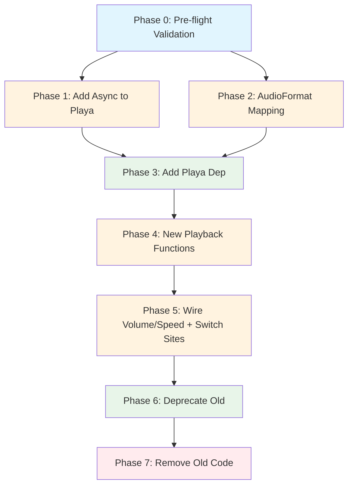

# Planning Process

- [x] Pre-flight Check [15:42]
    - [x] Catalogs validated
    - [x] Directories ready
    - [x] Budget estimated: medium (~40%)
- [x] Prep Started [15:43]
    - [x] Identified Skills [15:44] - rust, thiserror (required); rust-testing, nextest (suggested)
    - [x] Identified Subagents [15:44] - general-purpose (impl), feature-tester-rust (tests)
- [x] Prep complete [15:44]
- [x] Clarify & Research [15:45]
    - [x] User answered 1 question [15:45]
    - [x] Requirements updated: async/sync - add async variants to playa
- [x] Planning Subagent [agent: **Plan**] started [15:46]
    - [x] subagent skills used: rust, thiserror
    - [x] Planning completed [15:47] - 8 phases created
- [x] All Pre-review Steps complete [15:47]
- [x] Reviews Started [15:48]
   - [x] Completeness Review - identified 14 gaps, 5 high priority
   - [x] Concurrency Review - Phases 1,2 parallel OK, Phase 5 can be split
   - [x] Correctness Review - 9 issues, 4 high priority (Arc wrapping, tokio deps, error mapping)
   - [x] Risk Assessment - 4 high risks, 4 medium risks
- [x] Reviews Completed [15:50]
- [x] Plan Finalization [15:51]
    - [x] Review feedback incorporated
    - [x] Dependency graph generated
    - [x] Phase 0 (pre-flight) added per completeness review
    - [x] Phase 4-5 merged per correctness review (config in signature from start)
- [x] Plan finalized [15:52]
- [x] Final Steps
    - [x] Lessons learned collected (3 items)
    - [x] Package changes documented (4 items)
    - [x] Risks documented (8 items: 4 high, 4 medium)
- [x] Summary reported [15:52]
    - Plan: `.ai/plans/2026-01-26.plan-for-playa-integration-biscuit-speaks.md`
    - Phases: 8 (0-7)
    - Critical path: 7 serial phases (P1||P2 parallel)

## Plan

### Phase 0: Pre-flight Validation
**Agent:** `general-purpose` | **Skills:** rust | **Complexity:** Low
**Deps:** None | **Parallel:** No

**Goal:** Validate playa async capability and inventory all call sites before implementation.

**Deliver:**
- Run `cargo build -p playa --features async` to verify async feature exists (it may not)
- Run `grep -rn "play_audio" biscuit-speaks/src/` to inventory all call sites
- Document findings: async support status, complete call site list

**Pass when:**
- [ ] Async feature status documented (exists or needs creation)
- [ ] All playback call sites catalogued with file:line references
- [ ] Decision made: proceed with plan or create async feature first

**If failed:**
- Rollback: N/A (research phase)
- Retry: Update plan based on findings

---

### Phase 1: Add Async Support to Playa
**Agent:** `general-purpose` | **Skills:** rust, thiserror | **Complexity:** Medium
**Deps:** Phase 0 | **Parallel:** Yes (with Phase 2)

**Goal:** Add async variants to playa's playback functions with tokio.

**Deliver:**
- Update `playa/lib/Cargo.toml`:
  - Add tokio as optional dependency: `tokio = { version = "1", features = ["process", "io-util", "fs", "rt"], optional = true }`
  - Add feature: `[features] async = ["tokio"]`
- New async functions in `playa/lib/src/playback.rs`:
  - `playa_async(audio: AudioData) -> Result<(), PlaybackError>`
  - `playa_explicit_async(format, audio) -> Result<(), PlaybackError>`
  - `playa_explicit_with_options_async(format, audio, options) -> Result<(), PlaybackError>`
  - `playa_with_player_and_options_async(player, audio, options) -> Result<(), PlaybackError>`
- Async functions use `tokio::process::Command` with `.spawn()`
- Re-export async functions in lib.rs under `#[cfg(feature = "async")]`

**Pass when:**
- [ ] `cargo build -p playa --features async` compiles
- [ ] Async functions use tokio::process::Command
- [ ] All existing sync tests pass: `cargo test -p playa`
- [ ] New async tests pass: `cargo test -p playa --features async`
- [ ] Spawned processes complete without blocking

**If failed:**
- Rollback: Remove async feature flag and new functions
- Retry: Use tokio::task::spawn_blocking as fallback wrapper

---

### Phase 2: Create AudioFormat Mapping Layer
**Agent:** `general-purpose` | **Skills:** rust, thiserror | **Complexity:** Medium
**Deps:** Phase 0 | **Parallel:** Yes (with Phase 1)

**Goal:** Create conversion utilities and error mapping between biscuit-speaks and playa types.

**Deliver:**
- New module `biscuit-speaks/src/playa_bridge.rs` (internal, do NOT re-export):
  - `to_playa_format(AudioFormat) -> playa::AudioFormat`
  - `to_playa_options(VolumeLevel, SpeedLevel) -> PlaybackOptions`
  - `to_playa_audio_data(bytes: Vec<u8>) -> playa::AudioData` (wraps in Arc)
- AudioFormat mapping with explicit rules:
  - Wav → AudioFormat::new(AudioFileFormat::Wav, Some(Codec::Pcm))
  - Mp3 → AudioFormat::new(AudioFileFormat::Mp3, Some(Codec::Mp3))
  - Ogg → AudioFormat::new(AudioFileFormat::Ogg, Some(Codec::Vorbis))
  - Pcm → AudioFormat::new(AudioFileFormat::Wav, Some(Codec::Pcm))
- Add module declaration in `lib.rs`: `mod playa_bridge;`
- Update `errors.rs`: implement `From<playa::PlaybackError> for TtsError`:
  - Detection → ProviderFailed
  - NoCompatiblePlayer/NoPlayerWithCapabilities → NoAudioPlayer
  - Spawn → ProcessSpawnFailed
  - Io → IoError variant
- Unit tests for all mappings including edge cases

**Pass when:**
- [ ] All four AudioFormat variants map correctly
- [ ] Volume conversion: Loud→1.0, Soft→0.5, Normal→0.75
- [ ] Speed conversion: Fast→1.25, Slow→0.75, Normal→1.0
- [ ] Arc wrapping works: `AudioData::Bytes(Arc::new(bytes))`
- [ ] All PlaybackError variants have TtsError mapping
- [ ] `cargo test -p biscuit-speaks --lib playa_bridge` passes

**If failed:**
- Rollback: Remove playa_bridge.rs and error impl
- Retry: Review type signatures in both crates

---

### Phase 3: Add Playa Dependency
**Agent:** `general-purpose` | **Skills:** rust | **Complexity:** Low
**Deps:** Phase 1, Phase 2 | **Parallel:** No

**Goal:** Wire playa into biscuit-speaks as path dependency.

**Deliver:**
- Update `biscuit-speaks/Cargo.toml`:
  - Add `playa = { path = "../playa/lib", features = ["async"] }`
- Verify import works: `use playa::{Playa, PlaybackOptions, AudioData};`

**Pass when:**
- [ ] `cargo build -p biscuit-speaks` succeeds
- [ ] `cargo tree -p biscuit-speaks -i playa` shows playa as dependency
- [ ] No tokio version conflicts (both use tokio 1.x)
- [ ] Import statement compiles

**If failed:**
- Rollback: Remove playa dependency from Cargo.toml
- Retry: Check feature flag mismatches

---

### Phase 4: Implement New Playback Functions
**Agent:** `general-purpose` | **Skills:** rust, thiserror | **Complexity:** Medium
**Deps:** Phase 3 | **Parallel:** No

**Goal:** Create playa-based async playback functions alongside existing ones.

**Deliver:**
- New async functions in `biscuit-speaks/src/playback.rs`:
  ```rust
  pub async fn play_audio_bytes_playa(
      data: &[u8],
      format: AudioFormat,
      config: &TtsConfig,
  ) -> Result<(), TtsError>

  pub async fn play_audio_file_playa(
      path: &Path,
      format: AudioFormat,
      config: &TtsConfig,
  ) -> Result<(), TtsError>
  ```
- Implementation uses playa_bridge conversions:
  - Convert AudioFormat → playa::AudioFormat
  - Convert VolumeLevel/SpeedLevel → PlaybackOptions
  - Create AudioData::Bytes with Arc wrapping
  - Call `playa::playa_explicit_with_options_async()`
  - Map PlaybackError → TtsError via From impl
- Temp file scope management: keep file alive until playback completes

**Pass when:**
- [ ] Functions compile with correct async signatures
- [ ] Error conversion uses From impl from Phase 2
- [ ] Temp files cleaned up after playback (verify with test)
- [ ] `cargo clippy -p biscuit-speaks` shows no new warnings
- [ ] Unit tests verify basic playback flow

**If failed:**
- Rollback: Remove new functions
- Retry: Check AudioData Arc wrapping and error mapping

---

### Phase 5: Wire Volume/Speed and Update Call Sites
**Agent:** `general-purpose` | **Skills:** rust | **Complexity:** Medium
**Deps:** Phase 4 | **Parallel:** No

**Goal:** Replace all playback call sites with playa variants, passing volume/speed.

**Deliver:**
- Update all call sites found in Phase 0 inventory:
  - `speak.rs`: pass config.volume and config.speed
  - `providers/cloud/elevenlabs.rs`: pass config
  - All other providers using playback
- Verify volume/speed values reach playa correctly:
  - Test: VolumeLevel::Soft → PlaybackOptions volume = 0.5
  - Test: SpeedLevel::Fast → PlaybackOptions speed = 1.25
- Add integration test comparing old vs new playback output

**Pass when:**
- [ ] All call sites use _playa functions (grep confirms none remaining)
- [ ] Volume/speed passthrough verified with unit tests
- [ ] `cargo build -p biscuit-speaks` succeeds
- [ ] `cargo test -p biscuit-speaks` passes
- [ ] Manual smoke test: `just -f biscuit-speaks/justfile cli "test audio"`

**If failed:**
- Rollback: Revert call site changes
- Retry: Check signature mismatches or missing imports

---

### Phase 6: Deprecate Old Implementation
**Agent:** `general-purpose` | **Skills:** rust | **Complexity:** Low
**Deps:** Phase 5 | **Parallel:** No

**Goal:** Mark old playback functions as deprecated for graceful migration.

**Deliver:**
- Add `#[deprecated(since = "0.2.0", note = "Use play_audio_bytes_playa instead")]` to:
  - `play_audio_bytes()`
  - `play_audio_file()`
  - `play_audio_file_with_format()`
  - `get_audio_player()`
  - `get_audio_player_for_format()`
  - `build_player_args()`
- Add deprecation notices in doc comments
- Update module-level documentation explaining playa migration
- Keep deprecated functions working for external users

**Pass when:**
- [ ] Deprecated functions still compile and work
- [ ] No internal code uses deprecated functions
- [ ] `cargo build -p biscuit-speaks` shows deprecation warnings only for external use
- [ ] Documentation updated with migration guide

**If failed:**
- Rollback: Remove deprecation attributes
- Retry: N/A (cosmetic change)

---

### Phase 7: Remove Old Code (Future Breaking Change)
**Agent:** `general-purpose` | **Skills:** rust | **Complexity:** Low
**Deps:** Phase 6 | **Parallel:** No

**Goal:** Clean up deprecated code after grace period (schedule for next major version).

**Deliver:**
- Remove deprecated functions and constants:
  - WAV_PLAYERS, MP3_PLAYERS constants
  - `get_audio_player()`, `get_audio_player_for_format()`
  - `build_player_args()`
  - Old `play_audio_bytes()`, `play_audio_file()`, `play_audio_file_with_format()`
  - Associated tests
- Rename playa functions to canonical names:
  - `play_audio_bytes_playa` → `play_audio_bytes`
  - `play_audio_file_playa` → `play_audio_file`
- Remove `which` dependency from Cargo.toml (validate first)
- Update CHANGELOG.md documenting breaking changes

**Pass when:**
- [ ] Only playa-based functions remain
- [ ] All tests pass with new naming
- [ ] `cargo build -p biscuit-speaks` succeeds
- [ ] CHANGELOG documents migration path
- [ ] so-you-say crate (if applicable) still works

**If failed:**
- Rollback: Restore deprecated functions
- Retry: Check for undocumented external usage

## Dependency Graph



**Critical Path:** P0 → P1 → P3 → P4 → P5 → P6 → P7 (7 serial phases)
**Parallel Opportunity:** P1 and P2 can run concurrently after P0

## Risks

> Implementation risks identified during planning with mitigation strategies.

| Level | Category | Description | Affected | Mitigation |
|-------|----------|-------------|----------|------------|
| HIGH | technical | Async/sync mismatch - playa is sync, biscuit-speaks async | 1,2,3,4 | Verify playa async feature works; use spawn_blocking as fallback |
| HIGH | technical | AudioFormat enum mismatch - incompatible structures | 2,3,4,5 | Create bidirectional mapping with fallback rules; test all 16 codecs |
| HIGH | technical | Temp file cleanup during Bytes playback | 4,5 | Write to persistence scope; keep files alive until playback completes |
| HIGH | dependency | Playa tokio optional feature may be incomplete | 1 | Run `cargo build -p playa --features async` before Phase 1 |
| MEDIUM | technical | Player selection filtering incompatibility | 5 | Validate player metadata flags before calling playa |
| MEDIUM | rollback | Breaking change to playback API surface | 6,7,8 | Maintain dual code paths; feature flag to disable playa |
| MEDIUM | scope | Volume/speed clamping differences | 5 | Document player-specific limits; add validation |
| MEDIUM | technical | Which dependency removal loses fallback detection | 8 | Compare detection systems; keep which as optional if gaps |

## Lessons Learned

> Discoveries about skills or memory resources that were inaccurate, incomplete, or missing.

- [CODE: playa/lib/src/audio.rs]: AudioData::Bytes uses Arc<Vec<u8>>, not Vec<u8> - plan must account for Arc wrapping
- [CODE: playa/lib/Cargo.toml]: tokio only in dev-dependencies - async feature requires adding to main deps
- [SKILL: rust]: AudioFormat mapping requires lossy one-way conversion (biscuit-speaks → playa only)

## Package Changes

> Dependencies to be added, updated, or removed during implementation.

- [ADD]: playa in biscuit-speaks/Cargo.toml - path = "../playa/lib", features = ["async"]
- [ADD]: tokio in playa/lib/Cargo.toml - optional = true, features = ["process", "io-util", "fs", "rt"]
- [ADD]: From<playa::PlaybackError> impl in biscuit-speaks/src/errors.rs
- [REMOVE]: which in biscuit-speaks/Cargo.toml (Phase 8, after validation)
