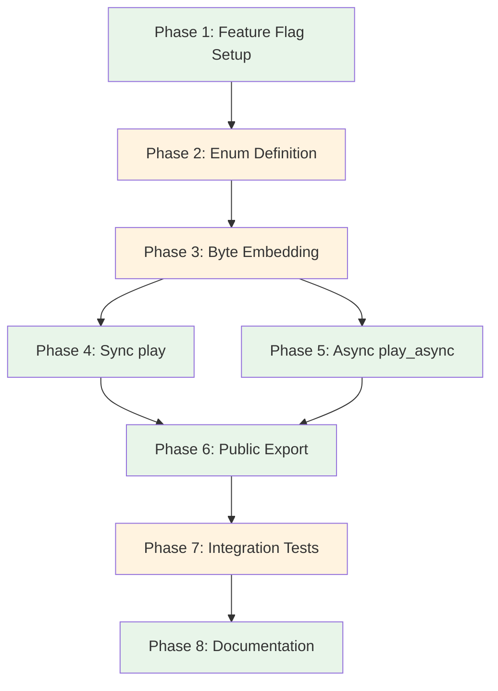

# Planning Process

- [x] Pre-flight Check [12:43pm]
    - [x] Catalogs validated
    - [x] Directories ready
    - [x] Budget estimated: simple (~25%)
- [x] Prep Started [12:44pm]
    - [x] Identified Skills [12:44pm] - rust, thiserror (required); rust-testing (suggested)
    - [x] Identified Subagents [12:44pm] - Plan, general-purpose, feature-tester-rust
- [x] Prep complete [12:44pm]
- [x] Clarify & Research [12:45pm]
    - [x] User answered 2 questions [12:45pm]
    - [x] Requirements updated: include_bytes! for embedding, handwritten enum with semantic names
- [x] Planning Subagent [agent: **Plan**] started [12:46pm]
    - [x] subagent skills used: rust, thiserror
    - [x] Planning completed [12:47pm] - 9 phases created
- [x] All Pre-review Steps complete [12:47pm]
- [x] Reviews Started [12:48pm]
   - [x] Completeness Review - identified gaps in agent/skill assignments (addressed in plan)
   - [x] Concurrency Review - Phases 4+5 can run parallel; docs can start early
   - [x] Correctness Review - AudioData::Bytes uses Vec<u8> not Arc; include_bytes path verified
   - [x] Risk Assessment - HIGH: binary size ~30MB; MEDIUM: format detection
- [x] Reviews Completed [12:49pm]
- [x] Plan Finalization started [12:50pm]
    - [x] subagent skills used: rust, thiserror
    - [x] Dependency graph generated
- [x] Plan finalized [12:51pm]
- [x] Final Steps
    - [x] Lessons learned collected (3 items)
    - [x] Package changes documented (categorical features - no new deps)
    - [x] Risks documented (5 items: 0 high, 3 medium, 2 low)
- [x] Summary reported [12:51pm]
    - Plan: `.ai/plans/2026-01-26.plan-for-playa-sound-effects-feature.md`
    - Phases: 8
    - Critical path: 7 phases (P4||P5 parallel)
    - Duration: planning complete

## Plan

### Phase 1: Categorical Feature Flags Setup
**Agent:** `general-purpose` | **Skills:** rust | **Complexity:** Low
**Deps:** None | **Parallel:** No

**Goal:** Add categorical feature flags and create the effects module structure.

**Deliver:**
- Update `playa/lib/Cargo.toml` with categorical features:
  ```toml
  [features]
  # Umbrella feature for all effects (~30MB)
  sound-effects = ["sfx-ui", "sfx-cartoon", "sfx-reactions", "sfx-scifi", "sfx-atmosphere", "sfx-motion"]

  # Individual categories (users pick what they need)
  sfx-ui = []         # doorbells, alerts, hits (~3MB, 11 files)
  sfx-cartoon = []    # cartoon accents (~8MB, 13 files)
  sfx-reactions = []  # laughs, cheers, trombone (~4MB, 6 files)
  sfx-scifi = []      # phase jumps, phasers (~3MB, 10 files)
  sfx-atmosphere = [] # music stings, transitions (~7MB, 5 files)
  sfx-motion = []     # whooshes, air sounds (~5MB, 7 files)
  ```
- Create new file `playa/lib/src/effects.rs` with module-level docs
- Update `playa/lib/src/lib.rs`: conditional module when ANY sfx feature enabled

**Pass when:**
- [ ] `cargo check -p playa` passes (no features)
- [ ] `cargo check -p playa --features sfx-ui` passes (single category)
- [ ] `cargo check -p playa --features sound-effects` passes (all categories)

**If failed:**
- Rollback: `git checkout playa/lib/Cargo.toml playa/lib/src/lib.rs`
- Retry: Verify feature syntax in Cargo.toml

---

### Phase 2: SoundEffect Enum with Conditional Variants
**Agent:** `general-purpose` | **Skills:** rust | **Complexity:** Medium
**Deps:** Phase 1 | **Parallel:** No

**Goal:** Create the `SoundEffect` enum with conditionally-compiled categorical variants.

**Deliver:**
- `SoundEffect` enum with derives: `Debug, Clone, Copy, PartialEq, Eq, Hash`
- Variants grouped by category with `#[cfg(feature = "...")]`:
  ```rust
  #[derive(Debug, Clone, Copy, PartialEq, Eq, Hash)]
  #[non_exhaustive]  // allows future additions
  pub enum SoundEffect {
      // UI sounds (sfx-ui)
      #[cfg(feature = "sfx-ui")]
      Doorbell,
      #[cfg(feature = "sfx-ui")]
      Doorbell2,
      // ... 9 more UI

      // Cartoon sounds (sfx-cartoon)
      #[cfg(feature = "sfx-cartoon")]
      CartoonAccent01,
      // ... 12 more cartoon

      // etc. for each category
  }
  ```

**Category breakdown (52 files total):**
| Category | Files | Variants |
|----------|-------|----------|
| sfx-ui | 11 | Doorbell, Doorbell2, SpaceAlarm, DitHit1, DitHit2, ElectronicHitFx01/03/06/07/14/16 |
| sfx-cartoon | 13 | CartoonAccent01/02/04/07/09/10/12/17/25/31/33/35, CartoonCry |
| sfx-reactions | 6 | CrowdLaugh, CrowdLaughApplause, SadTrombone, SmallGroupCheer, FemaleAstonishedGasp, Sneeze |
| sfx-scifi | 10 | HighDown, HighUp, TwoTone, PhaseJump1-5, PhaserDown1-3 |
| sfx-atmosphere | 5 | CreepyDarkLogo, ElementalMagicSpellImpact, EpicOrchestraTransition, MysteriousBass, RetroGame |
| sfx-motion | 7 | AirReverseBurst, AirWoosh, AirZoomVacuum, ArrowWhoosh, BicycleHorn, BottleCork, Bullet |

**Pass when:**
- [ ] `--features sfx-ui` only includes UI variants
- [ ] `--features sfx-ui,sfx-cartoon` includes both categories
- [ ] Enum is `#[non_exhaustive]` for future compatibility
- [ ] Each variant maps to correct filename

**If failed:**
- Rollback: Clear effects.rs content
- Retry: Verify cfg attribute syntax

---

### Phase 3: Conditional Byte Embedding
**Agent:** `general-purpose` | **Skills:** rust | **Complexity:** Medium
**Deps:** Phase 2 | **Parallel:** No

**Goal:** Embed audio files conditionally based on enabled features.

**Deliver:**
- Const declarations guarded by category feature:
  ```rust
  // UI sounds
  #[cfg(feature = "sfx-ui")]
  const DOORBELL_BYTES: &[u8] = include_bytes!("../../effects/doorbell.wav");

  // Cartoon sounds
  #[cfg(feature = "sfx-cartoon")]
  const CARTOON_ACCENT_01_BYTES: &[u8] = include_bytes!("../../effects/cartoon-accent-01.wav");
  ```
- Private `fn as_bytes(&self) -> &'static [u8]` with conditional match arms:
  ```rust
  fn as_bytes(&self) -> &'static [u8] {
      match self {
          #[cfg(feature = "sfx-ui")]
          Self::Doorbell => DOORBELL_BYTES,
          #[cfg(feature = "sfx-cartoon")]
          Self::CartoonAccent01 => CARTOON_ACCENT_01_BYTES,
          // ...
      }
  }
  ```
- Path: `src/effects.rs` → `../../effects/` (relative to source file)

**Pass when:**
- [ ] `cargo build -p playa --features sfx-ui` embeds only UI files (~3MB)
- [ ] `cargo build -p playa --features sound-effects` embeds all (~30MB)
- [ ] Only enabled category bytes are compiled in
- [ ] Match exhaustiveness maintained per feature combination

**If failed:**
- Rollback: Remove const declarations and as_bytes method
- Retry: Fix relative path or cfg attribute syntax

---

### Phase 4: Synchronous play() Method
**Agent:** `general-purpose` | **Skills:** rust, thiserror | **Complexity:** Low
**Deps:** Phase 3 | **Parallel:** Yes (with Phase 5)

**Goal:** Implement sync `play()` method using existing `Playa::from_bytes()`.

**Deliver:**
- Public method:
  ```rust
  pub fn play(self) -> Result<(), PlaybackError> {
      Playa::from_bytes(self.as_bytes().to_vec())?.play()
  }
  ```
- Doc comment with example
- Note: `from_bytes()` handles Arc wrapping internally

**Pass when:**
- [ ] `SoundEffect::Doorbell.play()` compiles
- [ ] Returns `Result<(), PlaybackError>`
- [ ] Doc tests compile with `no_run`

**If failed:**
- Rollback: Remove play() method
- Retry: Check Playa::from_bytes signature

---

### Phase 5: Asynchronous play_async() Method
**Agent:** `general-purpose` | **Skills:** rust | **Complexity:** Low
**Deps:** Phase 3 | **Parallel:** Yes (with Phase 4)

**Goal:** Implement async `play_async()` method using existing async playback.

**Deliver:**
- Public async method:
  ```rust
  pub async fn play_async(self) -> Result<(), PlaybackError> {
      use std::sync::Arc;
      let bytes = Arc::new(self.as_bytes().to_vec());
      crate::playback::playa(AudioData::Bytes(bytes)).await
  }
  ```
- Doc comment with async example

**Pass when:**
- [ ] Method is properly async
- [ ] Works with tokio runtime in tests
- [ ] Returns `Result<(), PlaybackError>`

**If failed:**
- Rollback: Remove play_async() method
- Retry: Verify AudioData::Bytes expects `Arc<Vec<u8>>`

---

### Phase 6: Public API Export
**Agent:** `general-purpose` | **Skills:** rust | **Complexity:** Low
**Deps:** Phase 4, Phase 5 | **Parallel:** No

**Goal:** Export `SoundEffect` when ANY sound effect feature is enabled.

**Deliver:**
- In `playa/lib/src/lib.rs`:
  ```rust
  #[cfg(any(
      feature = "sound-effects",
      feature = "sfx-ui",
      feature = "sfx-cartoon",
      feature = "sfx-reactions",
      feature = "sfx-scifi",
      feature = "sfx-atmosphere",
      feature = "sfx-motion",
  ))]
  mod effects;

  #[cfg(any(
      feature = "sound-effects",
      feature = "sfx-ui",
      // ... same list
  ))]
  pub use crate::effects::SoundEffect;
  ```

**Pass when:**
- [ ] `use playa::SoundEffect;` works with any sfx feature
- [ ] Compilation fails gracefully with no features
- [ ] Existing API unchanged

**If failed:**
- Rollback: Remove export lines
- Retry: Check cfg(any(...)) syntax

---

### Phase 7: Integration Tests
**Agent:** `feature-tester-rust` | **Skills:** rust, rust-testing | **Complexity:** Medium
**Deps:** Phase 6 | **Parallel:** No

**Goal:** Add comprehensive tests verifying all effects load correctly.

**Deliver:**
- Test file `playa/lib/tests/effects.rs`
- Test: All 52 variants create valid `Playa` instances
- Test: Format detection returns expected types (40 WAV, 10 OGG, 2 MP3)
- Test: Enum exhaustiveness via match

**Pass when:**
- [ ] `cargo test -p playa --features sound-effects` passes
- [ ] Tests skip without feature flag
- [ ] All 52 effects load without errors
- [ ] Format detection matches expected file types

**If failed:**
- Rollback: Remove test file
- Retry: Check byte embedding correctness

---

### Phase 8: Documentation
**Agent:** `general-purpose` | **Skills:** rust | **Complexity:** Low
**Deps:** Phase 7 | **Parallel:** No

**Goal:** Add comprehensive documentation for the feature.

**Deliver:**
- Module-level doc comment in `effects.rs`
- Feature flag documentation in Cargo.toml
- Binary size warning (~30MB increase)
- Usage examples (sync and async)

**Pass when:**
- [ ] `cargo doc -p playa --features sound-effects` builds
- [ ] Module docs render correctly
- [ ] Binary size warning present

**If failed:**
- Rollback: Remove documentation additions
- Retry: Check doc comment syntax

## Dependency Graph



**Critical Path:** P1 → P2 → P3 → P4/P5 → P6 → P7 → P8 (7 sequential phases)
**Parallel Opportunity:** P4 and P5 can run concurrently after P3

## Risks

> Implementation risks identified during planning with mitigation strategies.

| Level | Category | Description | Affected | Mitigation |
|-------|----------|-------------|----------|------------|
| MEDIUM | scope | Binary size with all features (~30MB) | All | Categorical features let users include only what they need (~3-8MB per category) |
| MEDIUM | technical | include_bytes! path resolution | P3 | Verify path `../../effects/` from src/effects.rs |
| MEDIUM | technical | cfg attribute complexity | P2,P3,P6 | Use consistent `#[cfg(feature = "sfx-*")]` pattern throughout |
| LOW | technical | Format detection for all 52 files | P7 | Integration tests verify each file loads |
| LOW | technical | Player availability varies | P4,P5 | Inherits existing player detection logic |

## Lessons Learned

> Discoveries about skills or memory resources that were inaccurate, incomplete, or missing.

- [CODE: playa/lib/src/audio.rs]: AudioData::Bytes uses `Arc<Vec<u8>>` not plain `Vec<u8>` - play_async must wrap bytes in Arc
- [CODE: playa/lib/src/audio.rs]: `Audio::from_bytes()` handles Arc wrapping internally - play() can pass Vec directly
- [DESIGN: categorical features]: Large embedded assets benefit from categorical sub-features to let users minimize binary size

## Package Changes

> Dependencies to be added, updated, or removed during implementation.

- [UPDATE]: playa/lib/Cargo.toml - Add `[features]` section with categorical features:
  - `sound-effects` (umbrella - enables all categories)
  - `sfx-ui`, `sfx-cartoon`, `sfx-reactions`, `sfx-scifi`, `sfx-atmosphere`, `sfx-motion`
  - No new dependencies required
