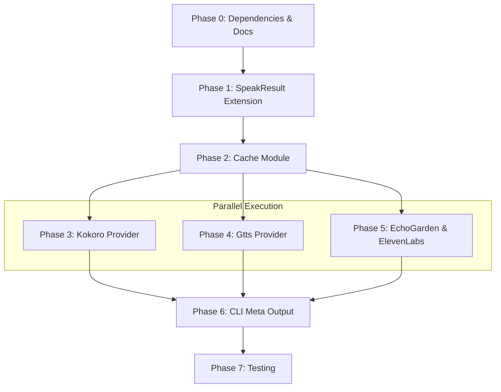

# Planning Process

- [x] Pre-flight Check [15:38]
    - [x] Catalogs validated
    - [x] Directories ready
    - [x] Budget estimated: medium (~40%)
- [x] Prep Started [15:39]
    - [x] Identified Skills [15:40] - rust, xx-hash, clap (required); thiserror, tokio (suggested)
    - [x] Identified Subagents [15:40] - general-purpose (impl), feature-tester-rust (tests)
- [x] Prep complete [15:40]
- [x] Clarify & Research [15:41]
    - [x] User answered 3 questions [15:41]
    - [x] Requirements updated: cache in temp dir, enabled by default, hash includes text
- [x] Planning Subagent [agent: **Plan**] started [15:45]
    - [x] subagent skills used: **rust, xx-hash, clap**
    - [x] Planning completed [15:47]
- [x] All Pre-review Steps complete [15:47]
- [x] Reviews Started [15:48]
   - [x] Completeness Review - 16 issues (3 high, 9 medium, 4 low)
   - [x] Concurrency Review - 6 recommendations (Phases 3-5 can run in parallel)
   - [x] Correctness Review - 11 issues (3 critical, 3 important, 5 minor)
   - [x] Risk Assessment - 10 risks (0 high, 5 medium, 5 low)
- [x] Reviews Completed [15:52]
- [x] Plan Finalization [15:55]
    - [x] Review feedback incorporated
    - [x] Dependency graph generated
- [x] Plan finalized [15:55]
- [x] Final Steps
    - [x] Lessons learned collected (0)
    - [x] Package changes documented
- [x] Summary reported [15:56]
    - Plan: `.ai/plans/2026-01-26.plan-for-tts-audio-caching-with-xxhash.md`

## Plan

### Phase 0: Add Dependencies and Provider Documentation
**Agent:** `general-purpose` | **Skills:** rust | **Complexity:** Low
**Deps:** None | **Parallel:** No

**Goal:** Add required dependencies and document provider cache strategy before implementation.

**Deliver:**
- Add `biscuit-hash = { path = "../biscuit-hash" }` to `biscuit-speaks/Cargo.toml`
- Provider matrix documenting for each provider:
  - **Kokoro**: WAV format, speed NOT in hash (playa handles), voice_id from Voice enum
  - **Gtts**: MP3 format, speed NOT in hash (playa handles), voice_id from language code
  - **EchoGarden**: WAV format, speed IN hash (bakes via --speed), voice_id from voice name
  - **ElevenLabs**: MP3 format, speed IN hash (bakes via API), voice_id + model_id combined

**Pass when:**
- [ ] `cargo check -p biscuit-speaks` succeeds with new dependency
- [ ] Provider matrix covers all 4 providers with speed/voice_id/codec documented

**If failed:**
- Rollback: Remove dependency from Cargo.toml
- Retry: After confirming biscuit-hash crate path

---

### Phase 1: Extend SpeakResult with Cache Metadata
**Agent:** `general-purpose` | **Skills:** rust, thiserror | **Complexity:** Low
**Deps:** Phase 0 | **Parallel:** No

**Goal:** Add cache-related fields to `SpeakResult` without breaking existing consumers.

**Deliver:**
- Add `use std::path::PathBuf;` to `biscuit-speaks/src/types.rs`
- Extended `SpeakResult` struct:
  ```rust
  #[serde(skip_serializing_if = "Option::is_none")]
  pub audio_file_path: Option<PathBuf>,
  #[serde(skip_serializing_if = "Option::is_none")]
  pub audio_codec: Option<String>,
  pub cache_hit: bool,  // default false
  ```
- Builder methods following existing Voice pattern:
  - `with_audio_file(path: PathBuf) -> Self`
  - `with_codec(codec: impl Into<String>) -> Self`
  - `with_cache_hit(hit: bool) -> Self`

**Pass when:**
- [ ] `cargo build -p biscuit-speaks` succeeds
- [ ] `cargo test -p biscuit-speaks types::tests` passes
- [ ] JSON serialization skips None fields (backward compatible)
- [ ] Existing provider code compiles without changes

**If failed:**
- Rollback: `git checkout biscuit-speaks/src/types.rs`
- Retry: After fixing serde attributes or Default impl

---

### Phase 2: Create Cache Module with xxHash and Error Handling
**Agent:** `general-purpose` | **Skills:** rust, xx-hash, thiserror | **Complexity:** Medium
**Deps:** Phase 1 | **Parallel:** No

**Goal:** Create cache module with deterministic xxHash keys, error handling, and atomic writes.

**Deliver:**
- New file `biscuit-speaks/src/audio_cache.rs` (NOT cache.rs - different purpose)
- Add `pub mod audio_cache;` to `biscuit-speaks/src/lib.rs`
- `CacheError` enum:
  ```rust
  #[derive(Debug, thiserror::Error)]
  pub enum CacheError {
      #[error("Cache write failed: {0}")]
      WriteError(#[from] std::io::Error),
      #[error("Invalid cache key")]
      InvalidKey,
  }
  ```
- `CacheKey` struct and methods:
  - `new(provider, voice_id, text, format) -> Self`
  - `with_speed(self, speed: f32) -> Self`
  - `generate_hash(&self) -> String` using `biscuit_hash::xx_hash()`
  - `generate_cache_path(&self) -> PathBuf` → `{temp_dir}/biscuit-speaks-{hash}.{ext}`
  - `cache_exists(&self) -> bool`
  - `write_atomic(path: &Path, data: &[u8]) -> Result<(), CacheError>` (temp + rename)
- Unit tests for determinism, uniqueness, atomic writes

**Pass when:**
- [ ] `cargo build -p biscuit-speaks` succeeds
- [ ] Same inputs produce identical hash (test 10 iterations)
- [ ] Different text/voice/provider produce different hashes
- [ ] Cache path format: `/tmp/biscuit-speaks-{16-char-hex}.{ext}`
- [ ] `write_atomic` uses temp file then rename (race-safe)
- [ ] `cargo test -p biscuit-speaks audio_cache::tests` passes

**If failed:**
- Rollback: Delete `audio_cache.rs`, remove from `lib.rs`
- Retry: After fixing hash or atomic write logic

---

### Phase 3: Integrate Caching into Kokoro Provider
**Agent:** `general-purpose` | **Skills:** rust, tokio | **Complexity:** Medium
**Deps:** Phase 2 | **Parallel:** Yes (with Phases 4, 5)

**Goal:** Add cache lookup to Kokoro provider (reference implementation).

**Deliver:**
- Modified `biscuit-speaks/src/providers/host/kokoro.rs`:
  - Import `use crate::audio_cache::CacheKey;`
  - In `speak_with_result()`:
    1. Extract voice_id from `self.voice.id()` or similar
    2. Create `CacheKey::new("kokoro", voice_id, text, "wav")`
    3. Check `cache_key.cache_exists()`
    4. If hit: use file, set `cache_hit = true`
    5. If miss: generate to cache path, set `cache_hit = false`
  - Speed NOT in hash (playa handles playback speed)
  - Return `SpeakResult` with `audio_file_path`, `audio_codec="wav"`, `cache_hit`

**Pass when:**
- [ ] `cargo build -p biscuit-speaks` succeeds
- [ ] First call creates `/tmp/biscuit-speaks-*.wav`
- [ ] Second call reuses file (no regeneration)
- [ ] `SpeakResult.cache_hit` is `false` first, `true` second
- [ ] `SpeakResult.audio_codec` is `"wav"`

**If failed:**
- Rollback: `git checkout biscuit-speaks/src/providers/host/kokoro.rs`
- Retry: After fixing voice_id extraction or cache integration

---

### Phase 4: Integrate Caching into Gtts Provider
**Agent:** `general-purpose` | **Skills:** rust, tokio | **Complexity:** Medium
**Deps:** Phase 2 | **Parallel:** Yes (with Phases 3, 5)

**Goal:** Apply caching to Gtts (MP3, no speed baking).

**Deliver:**
- Modified `biscuit-speaks/src/providers/host/gtts.rs`:
  - Voice ID: language code (e.g., "en")
  - `CacheKey::new("gtts", voice_id, text, "mp3")`
  - Speed NOT in hash
  - Return `SpeakResult` with codec `"mp3"`

**Pass when:**
- [ ] `cargo build -p biscuit-speaks` succeeds
- [ ] Generates `/tmp/biscuit-speaks-*.mp3` on cache miss
- [ ] Cache hit reuses MP3 file
- [ ] Speed changes don't affect cache key

**If failed:**
- Rollback: `git checkout biscuit-speaks/src/providers/host/gtts.rs`
- Retry: After fixing format handling

---

### Phase 5: Integrate Caching into EchoGarden and ElevenLabs
**Agent:** `general-purpose` | **Skills:** rust, tokio | **Complexity:** Medium
**Deps:** Phase 2 | **Parallel:** Yes (with Phases 3, 4)

**Goal:** Apply caching to providers that bake speed into audio.

**Deliver:**
- Modified `biscuit-speaks/src/providers/host/echogarden.rs`:
  - `CacheKey::new("echogarden", voice_id, text, "wav").with_speed(speed)`
  - Speed INCLUDED in hash (baked via --speed flag)
- Modified `biscuit-speaks/src/providers/cloud/elevenlabs.rs`:
  - Combined key: `format!("{}-{}", voice_id, model_id)`
  - `CacheKey::new("elevenlabs", combined_id, text, "mp3").with_speed(speed)`
  - Speed INCLUDED (baked via API)
  - On cache miss: call API, use `write_atomic()` to save bytes
  - On cache hit: read cached bytes, skip API call

**Pass when:**
- [ ] `cargo build -p biscuit-speaks` succeeds
- [ ] EchoGarden: different speed = different cache file
- [ ] ElevenLabs: different speed = different cache file
- [ ] ElevenLabs: different model_id = different cache file
- [ ] ElevenLabs cache hit skips API call

**If failed:**
- Rollback: `git checkout` affected provider files
- Retry: After fixing speed handling or API response storage

---

### Phase 6: Update so-you-say CLI Meta Output
**Agent:** `general-purpose` | **Skills:** rust, clap | **Complexity:** Low
**Deps:** Phases 3, 4, 5 | **Parallel:** No

**Goal:** Display cache information in `--meta` output.

**Deliver:**
- Modified `so-you-say/src/main.rs` in `print_speak_result()`:
  - Display `Audio File: {path}` if present
  - Display `Codec: {codec}` if present
  - Display `Cache: hit` or `Cache: miss`

**Expected Output:**
```
Provider: kokoro (Kokoro TTS)
Voice: af_heart
Audio File: /tmp/biscuit-speaks-a1b2c3d4e5f6g7h8.wav
Codec: wav
Cache: hit
```

**Pass when:**
- [ ] `cargo build -p so-you-say` succeeds
- [ ] `speak --meta "Hello"` shows file path, codec, cache status
- [ ] First call shows "Cache: miss", second shows "Cache: hit"

**If failed:**
- Rollback: `git checkout so-you-say/src/main.rs`
- Retry: After fixing output formatting

---

### Phase 7: Comprehensive Testing
**Agent:** `feature-tester-rust` | **Skills:** rust, tokio | **Complexity:** Medium
**Deps:** Phase 6 | **Parallel:** No

**Goal:** Write comprehensive tests for the caching system.

**Deliver:**
- Unit tests in `audio_cache.rs`:
  - `test_hash_determinism()` - same inputs = same hash
  - `test_hash_uniqueness()` - different inputs = different hashes
  - `test_speed_affects_hash()` - speed changes hash when included
  - `test_path_generation()` - correct format and extension
  - `test_atomic_write()` - temp file pattern works
- Integration tests:
  - Cache hit/miss for each provider
  - Verify speed doesn't affect Kokoro/Gtts cache
  - Verify speed DOES affect EchoGarden/ElevenLabs cache

**Pass when:**
- [ ] `cargo test -p biscuit-speaks` passes all new tests
- [ ] `cargo test -p so-you-say` passes
- [ ] No regressions in existing tests

**If failed:**
- Rollback: N/A (tests are additive)
- Retry: After fixing implementation bugs

---

## Dependency Graph



**Critical Path:** P0 → P1 → P2 → P3 → P6 → P7 (6 phases, with P3-5 in parallel)

## Risks

> Implementation risks identified during planning with mitigation strategies.

| Level | Category | Description | Affected | Mitigation |
|-------|----------|-------------|----------|------------|
| MEDIUM | technical | SpeakResult struct mutation affects all consumers | 1-6 | Use serde skip_serializing_if, test backward compat |
| MEDIUM | scope | Unclear cache strategy across 4 providers | 3-5 | Document provider matrix before Phase 3 |
| MEDIUM | technical | Async file I/O error handling | 3-5 | Use atomic write pattern (temp file + rename) |
| MEDIUM | technical | Speed handling differs between providers | 3-5 | Create test matrix for speed variants |
| MEDIUM | rollback | Cache files persist after rollback | 2-5 | Consider versioning in cache key |
| LOW | dependency | biscuit-hash xx_hash feature not explicit | 2 | Explicitly require feature in Cargo.toml |
| LOW | scope | CLI --meta output format not specified | 6 | Document exact format in Phase 6 |
| LOW | technical | File extension mapping for cache | 2,5 | Verify AudioFormat available per provider |
| LOW | scope | Temp directory portability | 2-5 | Document per-OS behavior |
| LOW | technical | Concurrent cache file access | 2-5 | Atomic ops mitigate, document expectation |

## Lessons Learned

> Discoveries about skills or memory resources that were inaccurate, incomplete, or missing.

- None identified during planning

## Package Changes

> Dependencies to be added, updated, or removed during implementation.

- **[ADD]** `biscuit-hash` to `biscuit-speaks/Cargo.toml` - Required for xxHash cache key generation (Phase 0)

