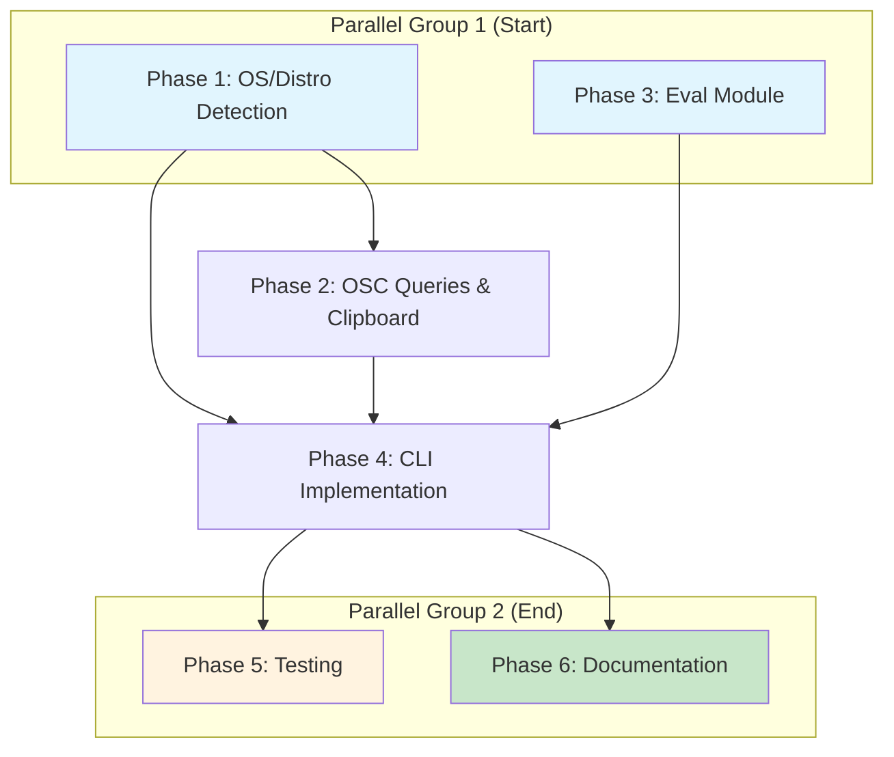

# Planning Process

- [x] Pre-flight Check [2026-01-27 09:45]
    - [x] Plans directory ready
    - [x] Codebase explored and understood
    - [x] Budget estimated: medium (~40%)
- [x] Prep Started [2026-01-27 09:46]
    - [x] Identified Skills [2026-01-27 09:46]
        - Required: rust, clap, terminal, serde, termini, isterminal, term_size
        - Suggested: termbg, color-eyre, thiserror
    - [x] Identified Subagents [2026-01-27 09:46]
        - rust-library-specialist, cli-specialist, testing-specialist, documentation-specialist
- [x] Prep complete [2026-01-27 09:47]
- [x] Clarify & Research [2026-01-27 09:48]
    - [x] Clarification agent returned [2026-01-27 09:48]
    - [x] User answered 3 questions [2026-01-27 09:49]
        - Code reuse: Self-contained (no sniff-lib)
        - Scope: All README features
        - Output: Pretty text default + --json flag
    - [x] Requirements updated [2026-01-27 09:49]
    - [x] Package research: unicode-width, termbg identified as needed
- [x] Planning Subagent [agent: **Plan**] started [2026-01-27 09:50]
    - [x] subagent skills used: rust, clap, terminal, serde, termini, isterminal, term_size, color-eyre, thiserror
    - [x] Planning completed [2026-01-27 09:52]
    - [x] 6 phases identified:
        - Phase 1: OS/Distro Detection & Config Paths (Medium)
        - Phase 2: OSC Queries & Clipboard (High)
        - Phase 3: Eval Module (Medium) - Parallel with Phase 2
        - Phase 4: CLI Implementation (Medium)
        - Phase 5: Comprehensive Testing (Medium)
        - Phase 6: Documentation & Cleanup (Low)
- [x] Module Assessment (monorepo) [2026-01-27 09:52]
    - [x] Modules impacted: biscuit-terminal/lib, biscuit-terminal/cli
    - [x] No cross-module dependencies identified
- [x] All Pre-review Steps complete [2026-01-27 09:52]
- [x] Reviews Started [2026-01-27 09:53]
   - [x] Completeness Review - 18 findings (2 high priority)
   - [x] Concurrency Review - Phase 1+3 can run parallel, docs can start after Phase 4
   - [x] Correctness Review - 9 findings (2 high: DECRQM format, Mode 2027 response)
   - [x] Risk Assessment - 10 risks (2 high: OSC timeout, raw mode state)
- [x] Reviews Completed [2026-01-27 09:55]
- [x] Plan Finalization started [2026-01-27 09:56]
    - [x] subagent skills used: rust, terminal, clap
    - [x] All high-priority recommendations incorporated
    - [x] Dependency graph generated
- [x] Plan finalized [2026-01-27 09:57]
- [x] Final Steps
    - [x] Lessons learned collected: 2 entries
    - [x] Package changes identified: unicode-width, regex, termbg
- [x] Summary reported [2026-01-27 09:58]
    - Plan: `.ai/plans/2026-01-27.plan-for-biscuit-terminal-discovery-release.md`
    - Phases: 6
    - Duration: 13 minutes
    - Risks: 2 high, 4 medium

## Plan

### Phase 1: Library Foundation - OS/Distro Detection & Config Paths
**Agent:** `general-purpose` | **Skills:** rust, serde | **Complexity:** Medium
**Deps:** None | **Parallel:** Yes (with Phase 3)

**Goal:** Establish self-contained OS/distro detection and per-terminal config file path discovery.

**Deliver:**
- Create `lib/src/discovery/os_detection.rs` module
  - `OsType` enum (Windows, Linux, macOS, FreeBSD, etc.)
  - `LinuxDistro` struct (id, name, version, codename, family)
  - `LinuxFamily` enum (Debian, RedHat, Arch, SUSE, Alpine, etc.)
  - `detect_os_type()`, `detect_linux_distro()`, `infer_linux_family()` functions
- Create `lib/src/discovery/config_paths.rs` module
  - `get_terminal_config_path(app: &TerminalApp) -> Option<PathBuf>`
  - Map 8+ terminals to config paths (WezTerm, Kitty, Ghostty, Alacritty, iTerm2, etc.)
- Update `Terminal` struct with `os`, `distro`, `config_file` fields

**Pass when:**
- [ ] `OsType` correctly identifies platforms via `std::env::consts::OS`
- [ ] `detect_linux_distro()` parses /etc/os-release, /etc/lsb-release, /etc/system-release
- [ ] `is_ci()` returns true when CI env vars detected (CI, GITHUB_ACTIONS, GITLAB_CI)
- [ ] Config paths work for 8+ terminal apps
- [ ] `cargo test -p biscuit-terminal` passes

**If failed:**
- Rollback: Remove new modules, revert terminal.rs changes
- Retry: Fix parsing logic, add debug logging

---

### Phase 2: OSC Query System & Clipboard Support
**Agent:** `general-purpose` | **Skills:** rust, terminal, termbg | **Complexity:** High
**Deps:** Phase 1 | **Parallel:** No

**Goal:** Implement OSC color queries (10/11/12) with timeout handling and OSC52 clipboard support.

**Deliver:**
- Create `lib/src/discovery/osc_queries.rs` module
  - `bg_color()`, `text_color()`, `cursor_color()` functions (OSC 11/10/12)
  - 100ms timeout with graceful fallback
  - Parse `rgb:RRRR/GGGG/BBBB` format
- Create `lib/src/discovery/clipboard.rs` module
  - `osc52_support() -> bool`
  - `get_clipboard()`, `set_clipboard()` functions
- Create `lib/src/discovery/mode_2027.rs` module
  - `supports_mode_2027() -> bool` (grapheme clustering via DECRQM)
- Enhance `color_mode()` to use luminance calculation from bg_color

**Pass when:**
- [ ] OSC queries return None when not in TTY or in CI
- [ ] OSC queries timeout after 100ms (RAII cleanup on panic)
- [ ] DECRQM query format: `\x1b[?2027$p`, response: `\x1b[?2027;VALUE$y`
- [ ] OSC color values converted from 16-bit (0000-FFFF) to 8-bit (÷257)
- [ ] OSC terminators: both BEL (`\x07`) and ST (`\x1b\\`) handled
- [ ] Tmux passthrough: queries wrapped in `\x1bPtmux;\x1b...\x1b\\` when TMUX detected
- [ ] `color_mode()` determines Light/Dark from background luminance
- [ ] OSC52 clipboard: format `\x1b]52;c;BASE64\x07` works on supported terminals

**If failed:**
- Rollback: Remove osc_queries/clipboard/mode_2027 modules
- Retry: Add verbose tracing, increase timeout

---

### Phase 3: Eval Module - Escape Code Analysis
**Agent:** `general-purpose` | **Skills:** rust, terminal | **Complexity:** Medium
**Deps:** None | **Parallel:** Yes (with Phase 1 and Phase 2)

**Goal:** Complete eval module for escape-code-aware line width calculation.

**Deliver:**
- Implement `lib/src/discovery/eval.rs`:
  - `line_widths()` - strip escape codes, calculate Unicode visual width
  - `has_escape_codes()` - detect ANSI sequences
  - `has_osc8_link()` - detect OSC8 hyperlinks

**Pass when:**
- [ ] `line_widths()` handles Unicode grapheme clusters
- [ ] `has_escape_codes()` detects CSI, OSC, control codes
- [ ] `has_osc8_link()` identifies OSC8 hyperlinks
- [ ] Comprehensive unit tests pass

**If failed:**
- Rollback: Revert eval.rs to stubs
- Retry: Simplify regex patterns

---

### Phase 4: CLI Implementation with Clap
**Agent:** `general-purpose` | **Skills:** rust, clap, serde, color-eyre | **Complexity:** Medium
**Deps:** Phase 1, 2, 3 | **Parallel:** No

**Goal:** Build the `terminal` CLI binary with metadata reporting.

**Deliver:**
- Implement `cli/src/main.rs` with clap derive API
  - `--meta` flag: Full terminal metadata report
  - `--json` flag: JSON output format
  - Default: Pretty-printed text
- Create `cli/src/display.rs` for text formatting
- Create `cli/src/json_output.rs` for JSON serialization
- Respect `NO_COLOR` env var

**Pass when:**
- [ ] `terminal --meta` displays readable text report
- [ ] `terminal --meta --json` outputs valid JSON
- [ ] CLI respects `NO_COLOR` env var
- [ ] Exit codes: 0 (success), 1 (error)

**If failed:**
- Rollback: Revert main.rs to placeholder
- Retry: Simplify output format

---

### Phase 5: Comprehensive Testing
**Agent:** `feature-tester-rust` | **Skills:** rust | **Complexity:** Medium
**Deps:** Phase 4 | **Parallel:** No

**Goal:** Ensure 80%+ code coverage with unit, integration, and cross-platform tests.

**Deliver:**
- Integration tests for OS detection, config paths, OSC queries, eval module
- CLI integration tests using `assert_cmd`
- Property-based tests with proptest for parsing
- Test documentation

**Pass when:**
- [ ] `cargo test` passes for lib and cli
- [ ] Code coverage 80%+ (cargo tarpaulin)
- [ ] No panics in error paths

**If failed:**
- Rollback: N/A (testing phase)
- Retry: Add missing test cases

---

### Phase 6: Documentation & Cleanup
**Agent:** `general-purpose` | **Skills:** rust | **Complexity:** Low
**Deps:** Phase 4 | **Parallel:** Yes (with Phase 5)

**Goal:** Polish documentation and prepare for v0.1.0 release.

**Deliver:**
- Update lib/README.md and cli/README.md
- Create CHANGELOG.md
- Add rustdoc examples to all public functions
- Create examples: terminal_info.rs, osc_queries.rs
- Create docs/architecture.md

**Pass when:**
- [ ] All public items have rustdoc with examples
- [ ] `cargo doc` generates without warnings
- [ ] Examples compile and run

## Dependency Graph

**Critical Path:** P1 → P2 → P4 → P5/P6

**Parallelization:**
- **Start:** Phase 1 (OS detection) and Phase 3 (Eval module) run in parallel
- **Middle:** Phase 2 starts after Phase 1; Phase 3 continues parallel with Phase 2
- **End:** Phase 5 (Testing) and Phase 6 (Documentation) run in parallel after Phase 4

## Risks

> Implementation risks identified during planning with mitigation strategies.

| Level | Category | Description | Affected | Mitigation |
|-------|----------|-------------|----------|------------|
| HIGH | technical | OSC Query Timeout - No prior implementation, blocking I/O with timeout, potential terminal corruption | Phase 2 | Use termbg crate patterns, test on 5+ terminals, implement RAII cleanup |
| HIGH | technical | Raw Mode State - Risk of corrupted terminal state on panic | Phase 2 | RAII pattern with Drop trait, catch_unwind wrapper |
| MEDIUM | scope | OS/Distro Code Duplication - Maintenance burden from sniff-lib copy | Phase 1 | Document source commit, TODO links, quarterly sync review |
| MEDIUM | dependency | Unverified Dependencies - termbg v0.6 compatibility unknown | Phase 2,3 | Validate before phase start, test basic functionality |
| MEDIUM | technical | Multiplexer OSC Queries - Fail or behave incorrectly in tmux/zellij | Phase 2 | Detect multiplexer first, skip OSC queries, use env var fallbacks |
| MEDIUM | technical | Unicode Width Complexity - Grapheme clusters, emoji, Mode 2027 | Phase 3 | Use unicode-width crate, property-based tests, document as best-effort |

## Lessons Learned

> Discoveries about skills or memory resources that were inaccurate, incomplete, or missing.

- [SKILL: terminal]: Missing DECRQM query sequence documentation - should add section on mode queries
- [DOCUMENTATION: implementation-plan]: Plans must check for existing implementations before proposing new modules

## Package Changes

> Dependencies to be added, updated, or removed during implementation.

- [ADD]: unicode-width v0.2 in cargo - Line width calculation with Unicode grapheme support
- [ADD]: regex v1.11 in cargo - Escape code detection patterns (already in workspace)
- [VERIFY]: termbg - Confirm API compatibility before Phase 2 (alternative: manual OSC 11 parsing)
