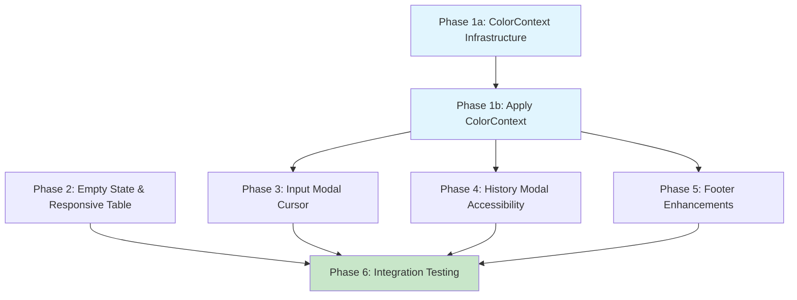

# Planning Process

- [x] Pre-flight Check [13:50:12]
    - [x] Catalogs validated
    - [x] Directories ready
    - [x] Budget estimated: medium (~40%)
- [x] Prep Started [13:50:18]
    - [x] Identified Skills: ratatui, rust, terminal
    - [x] Identified Subagents: Plan, feature-tester-rust, correctness-reviewer, completeness-reviewer
- [x] Prep complete [13:50:45]
- [x] Clarify & Research [13:51:02]
    - [x] Clarification agent returned: no ambiguities found
    - [x] User questions: none needed (requirements specific)
    - [x] Requirements confirmed as-is
- [x] Planning Subagent [agent: **Plan**] started [13:51:10]
    - [x] subagent skills used: ratatui, rust
    - [x] Planning completed [13:52:15]
- [x] All Pre-review Steps complete [13:52:15]
- [x] Reviews Started [13:52:30]
   - [x] Completeness Review: 7 high-priority gaps found
   - [x] Concurrency Review: 2 race conditions identified (P1/P4, P1/P5 file conflicts)
   - [x] Correctness Review: 7 technical issues (cursor API, width thresholds)
   - [x] Risk Assessment: 1 HIGH, 4 MEDIUM, 2 LOW risks
- [x] Reviews Completed [13:53:45]
- [x] Plan Finalization started [13:53:50]
    - [x] subagent skills used: ratatui, rust
    - [x] Dependency graph generated
    - [x] Phase 1 split into P1a/P1b to resolve file conflicts
    - [x] Cursor API corrected to tuple syntax
- [x] Plan finalized [13:55:00]
- [x] Final Steps
    - [x] Lessons learned collected: 4 items
    - [x] Package research: none needed
- [x] Summary reported [13:55:30]

## Plan

### Phase 1a: ColorContext Infrastructure
**Agent:** `general-purpose` | **Skills:** rust, ratatui | **Complexity:** Low
**Deps:** None | **Parallel:** Yes (with Phase 2)

**Goal:** Create ColorContext type and NO_COLOR detection without modifying existing render functions.

**Deliver:**
- New module `queue/cli/src/tui/color_context.rs` with:
  - `ColorContext` struct with `is_color_enabled()` method
  - NO_COLOR environment variable detection
  - Symbol helper: `status_symbol(&self, status) -> &'static str`
- Unit tests for NO_COLOR parsing
- Module exported from `queue/cli/src/tui/mod.rs`

**Pass when:**
- [ ] `ColorContext::new()` correctly detects NO_COLOR=1
- [ ] `is_color_enabled()` returns false when NO_COLOR is set
- [ ] Tests verify NO_COLOR=0/1/unset behavior
- [ ] Module compiles without touching existing render files

**If failed:**
- Rollback: Delete `color_context.rs`, remove mod declaration
- Retry: Simplify to just NO_COLOR detection first

---

### Phase 1b: Apply ColorContext to Modals
**Agent:** `general-purpose` | **Skills:** rust, ratatui | **Complexity:** Low
**Deps:** Phase 1a | **Parallel:** No (serializes file changes)

**Goal:** Thread ColorContext through Modal trait and update quit dialog, history modal.

**Deliver:**
- Update `Modal` trait in `modal.rs`:
  - Add `color_context: &ColorContext` parameter to `render()` method
- Update quit dialog: Add brackets `[Y] Yes  [N] No`
- Update `history_modal.rs`: Add ASCII fallbacks `[OK]`/`[FAIL]`
- Update all Modal implementers to accept new signature

**Pass when:**
- [ ] Modal trait compiles with new signature
- [ ] All implementers (InputModal, HistoryModal, quit dialog) updated
- [ ] NO_COLOR=1 shows `[OK]`/`[FAIL]` instead of colored symbols
- [ ] Quit dialog shows `[Y]`/`[N]` regardless of color mode

**If failed:**
- Rollback: Revert Modal trait signature, remove ColorContext usage
- Retry: Update trait first, then implementers one-by-one

---

### Phase 2: Empty State and Responsive Table Layout
**Agent:** `general-purpose` | **Skills:** rust, ratatui | **Complexity:** Medium
**Deps:** None | **Parallel:** Yes (with Phase 1a)

**Goal:** Add empty state message and make table layout responsive to terminal width.

**Deliver:**
- Empty state in `render.rs`:
  - Centered message: "No tasks scheduled. Press N to add one."
  - Shorter fallback at <40 cols: "Press N to add task"
- Responsive table columns:
  - Width >= 80: Show all columns
  - Width 60-79: Abbreviate "Where" (bg, np, win)
  - Width < 60: Hide "Status" column
- Helper function `calculate_column_widths(width: u16) -> ColumnConfig`

**Pass when:**
- [ ] Empty state appears centered when no tasks exist
- [ ] Empty state message fits in 40-col terminal
- [ ] Table shows all columns at 80+ width
- [ ] Table hides "Status" at 50 width
- [ ] Manual test at 80x24, 60x20, 40x15

**If failed:**
- Rollback: Revert render.rs to fixed column layout
- Retry: Implement empty state first, then responsive columns
- Debug: Check `area.width` calculation

---

### Phase 3: Input Modal Cursor and Placeholder
**Agent:** `general-purpose` | **Skills:** rust, ratatui | **Complexity:** Medium
**Deps:** Phase 1b | **Parallel:** No

**Goal:** Replace pipe character with real cursor and improve placeholder visibility.

**Deliver:**
- Remove `insert_cursor()` from field values in `input_modal.rs`
- Add cursor positioning helper:
  ```rust
  fn calculate_cursor_position(field_area: Rect, cursor_offset: usize) -> (u16, u16) {
      let x = field_area.x + cursor_offset as u16;
      let y = field_area.y;
      (x, y)
  }
  ```
- Use **tuple syntax**: `frame.set_cursor_position((x, y))`
- Apply to all 3 fields: Command, ScheduledValue, Target
- Placeholder: Show dim text when empty, cursor at start

**Pass when:**
- [ ] No pipe character appears in field text
- [ ] Cursor visible at correct position in all 3 fields
- [ ] Cursor moves correctly with arrow keys
- [ ] Placeholder shows in dim color when field empty
- [ ] Copy/paste doesn't include pipe character
- [ ] Manual test in Wezterm, iTerm2, Terminal.app

**If failed:**
- Rollback: Restore `insert_cursor()` behavior
- Retry: Implement cursor positioning without removing pipe first
- Debug: Print (x, y) coordinates to verify calculation

---

### Phase 4: History Modal Accessibility
**Agent:** `general-purpose` | **Skills:** rust, ratatui | **Complexity:** Medium
**Deps:** Phase 1b | **Parallel:** Yes (with Phase 5)

**Goal:** Improve history modal usability in compact mode and with filters.

**Deliver:**
- Filter visibility in `history_modal.rs`:
  - When compact hides filter section but filter active
  - Show in help: "Filter: <text> | Esc: Close"
- Count summary: Add to title "History (12 of 58)"
- Status legend (width >= 70): "✓ done  ✗ failed"
- ASCII fallback legend: "[OK] done  [FAIL] failed"

**Pass when:**
- [ ] Active filter appears in help line when compact
- [ ] Count summary shows filtered/total accurately
- [ ] Count updates when filter changes
- [ ] Legend appears at 70+ width
- [ ] Legend uses ASCII with NO_COLOR=1

**If failed:**
- Rollback: Revert history_modal.rs
- Retry: Implement features incrementally

---

### Phase 5: Footer Enhancements
**Agent:** `general-purpose` | **Skills:** rust, ratatui | **Complexity:** Low
**Deps:** Phase 1b | **Parallel:** Yes (with Phase 4)

**Goal:** Improve footer responsiveness.

**Deliver:**
- Footer in `render.rs`:
  - Compact variant at < 80 cols: "N:New Q:Quit H:History"
  - Full variant: "N: New Task  Q: Quit  H: History"
  - Wrap to 2 lines at < 60 cols if needed

**Pass when:**
- [ ] Footer shows full shortcuts at 80+ width
- [ ] Footer abbreviates at 70 width
- [ ] Footer wraps at 50 width
- [ ] Manual test at 80x24, 60x20, 40x15

**If failed:**
- Rollback: Revert render.rs footer section
- Retry: Implement width detection first

---

### Phase 6: Integration Testing
**Agent:** `feature-tester-rust` | **Skills:** rust | **Complexity:** Medium
**Deps:** Phases 1a, 1b, 2, 3, 4, 5 | **Parallel:** No

**Goal:** Verify all changes work together across terminal environments.

**Deliver:**
- Unit tests:
  - `test_empty_state_rendering()`
  - `test_responsive_table_columns()`
  - `test_cursor_positioning()`
  - `test_color_context_no_color()`
  - `test_history_filter_compact_mode()`
- Manual test checklist:
  - 3 terminals: Wezterm, Terminal.app, iTerm2
  - 3 widths: 80x24, 60x20, 40x15
  - 2 color modes: NO_COLOR=0, NO_COLOR=1

**Pass when:**
- [ ] All unit tests pass
- [ ] Manual test checklist completed
- [ ] No panics at extreme widths (20x10, 120x50)
- [ ] ColorContext works in all terminals
- [ ] Cursor visible everywhere

**If failed:**
- Rollback: Document failing scenarios, rollback specific phases
- Retry: Fix issues in original phase, re-run tests

## Dependency Graph



**Critical Path:** P1a → P1b → P3 → P6 (4 sequential phases)

**Parallelization:**
- Phase 1a and Phase 2 run simultaneously
- Phase 4 and Phase 5 run after Phase 1b completes

## Risks

| Level | Category | Description | Affected | Mitigation |
|-------|----------|-------------|----------|------------|
| HIGH | technical | Cursor positioning complexity across 3 render functions | Phase 3 | Create helper function, test in 3 terminals |
| MEDIUM | technical | Modal trait signature change for ColorContext | Phase 1b | Make change atomic, pass dummy ColorContext initially |
| MEDIUM | technical | NO_COLOR threading through render chain | Phase 1a, 1b | Create infrastructure first, thread through Modal trait |
| MEDIUM | technical | Empty state width handling at <40 cols | Phase 2 | Add explicit width check with shorter message |
| MEDIUM | technical | Race conditions on modal files | Phase 1a/1b | Split phase to serialize changes |
| LOW | technical | Extremely narrow terminals (<40 cols) overflow | Phase 2, 5 | Minimum width enforcement |
| LOW | technical | NO_COLOR checked once at startup | Phase 1a | Acceptable per no-color.org spec |

## Lessons Learned

- [ARCHITECTURE: phase-splitting]: File conflict detection revealed need to split infrastructure changes from application changes to enable safe parallelization
- [API: ratatui-cursor]: Position type doesn't exist in ratatui - cursor positioning uses tuple syntax `(x, y)` directly
- [TESTING: terminal-diversity]: Cursor rendering varies by terminal emulator - manual testing across 3+ terminals required
- [DESIGN: width-thresholds]: Different UI components need different width breakpoints - table prioritizes data (60), footer uses standard (80)

## Package Changes

None required - all features use existing ratatui 0.30 APIs.
