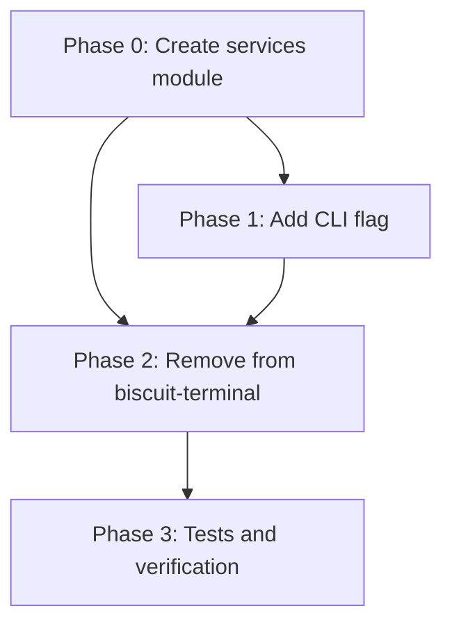

# Planning Process

- [x] Pre-flight Check
- [x] Skills Identified: rust, clap, serde
- [x] Plan Created

## Plan

### Phase 0: Create services module in sniff-lib
**Agent:** `general-purpose` | **Skills:** rust, serde | **Complexity:** Low
**Deps:** None | **Parallel:** No

**Goal:** Create the new services module in sniff/lib with the extracted code.

**Deliver:**
- `sniff/lib/src/services/mod.rs` - Main module with all types and functions
- Updated `sniff/lib/src/lib.rs` - Export services module
- Correct imports (std::process::Command, serde, etc.)

**Pass when:**
- [ ] `cargo check -p sniff-lib` passes
- [ ] Module exports: `Service`, `ServiceState`, `ServiceManager`, `InitSystem`, `HostOs`
- [ ] `detect_services()` function returns `Vec<Service>`

**If failed:**
- Rollback: Delete `sniff/lib/src/services/` directory
- Retry: Check import paths and serde derives

---

### Phase 1: Add --services flag to sniff CLI
**Agent:** `general-purpose` | **Skills:** rust, clap | **Complexity:** Low
**Deps:** Phase 0 | **Parallel:** No

**Goal:** Add `--services` filter flag to sniff CLI following existing patterns.

**Deliver:**
- Updated `sniff/cli/src/main.rs` with `--services` flag
- Updated `sniff/cli/src/output.rs` with services output formatting
- JSON and text output support

**Pass when:**
- [ ] `sniff --services` shows service list with init system
- [ ] `sniff --services --json` outputs valid JSON
- [ ] `sniff --services --state running` filters to running services
- [ ] Flag is mutually exclusive with other filter flags

**If failed:**
- Rollback: Revert main.rs and output.rs changes
- Retry: Check OutputFilter enum and flag validation logic

---

### Phase 2: Remove service_manager from biscuit-terminal
**Agent:** `general-purpose` | **Skills:** rust | **Complexity:** Low
**Deps:** Phase 0, Phase 1 | **Parallel:** No

**Goal:** Remove service_manager functionality from biscuit-terminal.

**Deliver:**
- Deleted `biscuit-terminal/lib/src/discovery/service_manager.rs`
- Updated `biscuit-terminal/lib/src/discovery/mod.rs` (remove export)
- Updated `biscuit-terminal/lib/src/terminal.rs` (remove ServiceManager field)
- Updated `biscuit-terminal/cli/src/main.rs` (remove --services flag)

**Pass when:**
- [ ] `cargo check -p biscuit-terminal` passes
- [ ] `cargo check -p biscuit-terminal-cli` passes
- [ ] No references to service_manager remain in biscuit-terminal

**If failed:**
- Rollback: Restore deleted files from git
- Retry: Check for remaining references with grep

---

### Phase 3: Add tests and verify
**Agent:** `general-purpose` | **Skills:** rust, rust-testing | **Complexity:** Low
**Deps:** Phase 2 | **Parallel:** No

**Goal:** Ensure test coverage and all packages build/test correctly.

**Deliver:**
- Tests in `sniff/lib/src/services/mod.rs` (migrated from biscuit-terminal)
- All existing tests still pass

**Pass when:**
- [ ] `cargo test -p sniff-lib --lib services` passes
- [ ] `cargo test -p biscuit-terminal` passes (no service_manager tests)
- [ ] `cargo test --workspace` passes

**If failed:**
- Rollback: N/A (tests don't affect functionality)
- Retry: Fix failing test assertions

---

## Dependency Graph

## Risks

| Level | Category | Description | Affected | Mitigation |
|-------|----------|-------------|----------|------------|
| MEDIUM | scope | Terminal struct has service_manager field - need to remove cleanly | Phase 2 | Remove field and all references; check for public API usage |
| LOW | technical | Init system detection uses platform-specific code | Phase 0 | Code already has cfg attributes; copy as-is |

## Lessons Learned

> None yet.

## Package Changes

> No new dependencies required - sniff-lib already has serde, and Command is from std.
