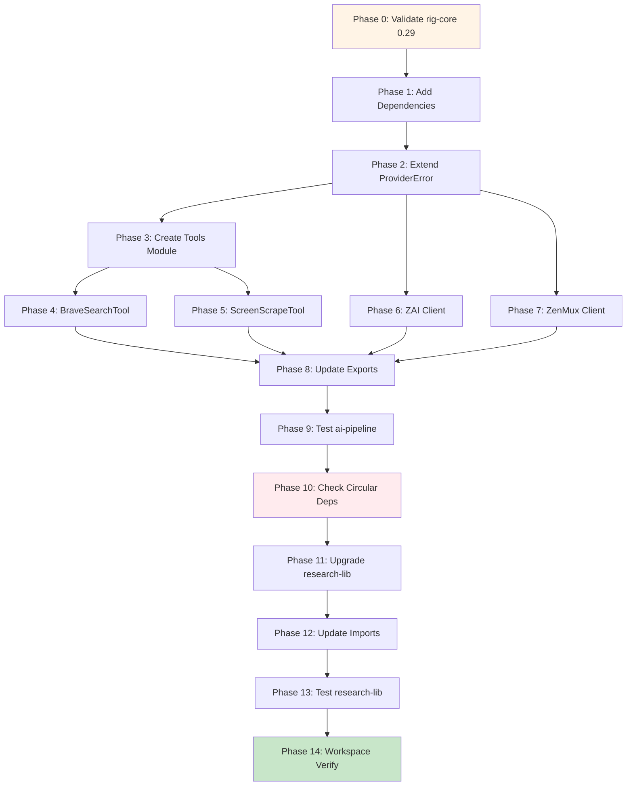

# Planning Process

- [x] Pre-flight Check [3:46pm]
    - [x] Catalogs validated
    - [x] Directories ready
    - [x] Budget estimated: medium (~40%)
- [x] Prep Started [3:46pm]
    - [x] Identified Skills [3:47pm] - rust, rig, thiserror, reqwest, scraper
    - [x] Identified Subagents [3:47pm] - Plan, correctness-reviewer, risk-assessor, feature-tester-rust
- [x] Prep complete [3:47pm]
- [x] Clarify & Research [3:48pm]
    - [x] Clarification agent returned [3:48pm]
    - [x] User answered 3 questions [3:49pm]
        - rig-core: Upgrade research-lib to 0.29.0
        - Tools path: src/rigging/tools/
        - Biscuit compat: Yes, keep re-exports
    - [x] Requirements updated [3:49pm]
    - [ ] Package research started (background) - N/A (no new packages)
- [x] Planning Subagent [agent: **Plan**] started [3:50pm]
    - [x] subagent skills used: rust, rig, thiserror, reqwest, scraper, tokio, wiremock
    - [x] Planning completed [3:51pm] - 14 phases
- [x] Module Assessment (monorepo) - covered in plan (biscuit, ai-pipeline/lib, research/lib)
- [x] All Pre-review Steps complete [3:51pm]
- [x] Reviews Started [3:51pm]
   - [x] Correctness Review - 11 issues (3 high, 5 medium, 3 low)
   - [x] Risk Assessment - 2 high, 3 medium risks identified
   - [ ] Completeness Review - skipped (scope clear)
   - [ ] Concurrency Review - skipped (limited parallelization opportunity)
- [x] Reviews Completed [3:52pm]
- [x] Plan Finalization started [3:53pm]
    - [x] subagent skills used: rust, rig, thiserror, cargo-dependencies
    - [x] Dependency graph generated
- [x] Plan finalized [3:54pm]
- [x] Final Steps
    - [x] Lessons learned collected (3 items)
    - [x] Package research status checked - no new packages needed
- [x] Summary reported [3:54pm]
    - Plan: 2026-01-28.plan-for-migrate-tools-to-ai-pipeline.md
    - Phases: 15 (including Phase 0)
    - Critical path: 12 sequential phases with parallel tool/client migration

## Plan

### Phase 0: Validate rig-core 0.29.0 Compatibility
**Agent:** `Explore` | **Skills:** rust, rig | **Complexity:** Low
**Deps:** None | **Parallel:** No

**Goal:** Verify rig-core 0.28→0.29 has no breaking changes to Tool trait before migration.

**Deliver:**
- Comparison of Tool trait between 0.28.0 and 0.29.0
- Confirmation BraveSearchTool/ScreenScrapeTool can migrate as-is

**Pass when:**
- [ ] Tool trait API comparison documented
- [ ] No blocking breaking changes OR migration strategy defined

---

### Phase 1: Add Dependencies to ai-pipeline
**Agent:** `Explore` | **Skills:** rust | **Complexity:** Low
**Deps:** Phase 0 | **Parallel:** No

**Goal:** Add scraper and dev dependencies to ai-pipeline/lib/Cargo.toml.

**Deliver:**
- `scraper = "0.25"` added
- `serial_test = "3.0"`, `wiremock = "0.6"`, `tracing-test = "0.2"` as dev-deps

**Pass when:**
- [ ] `cargo check -p ai-pipeline` succeeds

---

### Phase 2: Extend ProviderError with New Variants
**Agent:** `Explore` | **Skills:** rust, thiserror | **Complexity:** Low
**Deps:** Phase 1 | **Parallel:** No

**Goal:** Add MissingApiKey and ClientBuildFailed variants to ProviderError.

**Deliver:**
- `MissingApiKey { provider: String, env_vars: Vec<String> }` variant
- `ClientBuildFailed { provider: String, reason: String }` variant

**Pass when:**
- [ ] `cargo check -p ai-pipeline` succeeds
- [ ] New variants compile with thiserror derive

---

### Phase 3: Create Tools Module Structure
**Agent:** `Explore` | **Skills:** rust | **Complexity:** Low
**Deps:** Phase 2 | **Parallel:** No

**Goal:** Create module structure at `ai-pipeline/lib/src/rigging/tools/`.

**Deliver:**
- `tools/mod.rs` with submodule declarations and re-exports
- `tools/brave_search.rs` (stub)
- `tools/screen_scrape.rs` (stub)
- Export `pub mod tools;` from rigging/mod.rs

**Pass when:**
- [ ] Module structure compiles
- [ ] `cargo check -p ai-pipeline` succeeds

---

### Phase 4: Migrate BraveSearchTool
**Agent:** `Explore` | **Skills:** rust, rig, reqwest | **Complexity:** Medium
**Deps:** Phase 3 | **Parallel:** Yes (with Phase 5, 6, 7)

**Goal:** Migrate BraveSearchTool from biscuit (~990 lines).

**Deliver:**
- Complete brave_search.rs with BravePlan, rate limiting, Tool trait impl
- Tests migrated from biscuit

**Pass when:**
- [ ] `cargo test -p ai-pipeline brave_search` passes

---

### Phase 5: Migrate ScreenScrapeTool
**Agent:** `Explore` | **Skills:** rust, rig, scraper | **Complexity:** Medium
**Deps:** Phase 3 | **Parallel:** Yes (with Phase 4, 6, 7)

**Goal:** Migrate ScreenScrapeTool from biscuit (~1413 lines).

**Deliver:**
- Complete screen_scrape.rs with OutputFormat, HTML extraction, Tool trait impl
- Tests migrated from biscuit

**Pass when:**
- [ ] `cargo test -p ai-pipeline screen_scrape` passes

---

### Phase 6: Migrate ZAI Client
**Agent:** `Explore` | **Skills:** rust, rig | **Complexity:** Low
**Deps:** Phase 2 | **Parallel:** Yes (with Phase 4, 5, 7)

**Goal:** Populate zai.rs client adaptor (~227 lines).

**Deliver:**
- Complete zai.rs with Client, ClientBuilder, constants
- **Convert ZaiError to ProviderError** for consistency

**Pass when:**
- [ ] `cargo test -p ai-pipeline zai` passes

---

### Phase 7: Migrate ZenMux Client
**Agent:** `Explore` | **Skills:** rust, rig | **Complexity:** Low
**Deps:** Phase 2 | **Parallel:** Yes (with Phase 4, 5, 6)

**Goal:** Populate zenmux.rs client adaptor (~240 lines).

**Deliver:**
- Complete zenmux.rs with Client, ClientBuilder
- **Update import** to `crate::rigging::providers::provider_errors::ProviderError`

**Pass when:**
- [ ] `cargo test -p ai-pipeline zenmux` passes

---

### Phase 8: Update Module Exports
**Agent:** `Explore` | **Skills:** rust | **Complexity:** Low
**Deps:** Phase 4, 5, 6, 7 | **Parallel:** No

**Goal:** Ensure all migrated components are publicly exported.

**Deliver:**
- tools/mod.rs exports all tool types
- client_adaptors/mod.rs exports zai and zenmux

**Pass when:**
- [ ] Types accessible via `ai_pipeline::rigging::tools::*`
- [ ] Types accessible via `ai_pipeline::rigging::providers::client_adaptors::*`

---

### Phase 9: Run ai-pipeline Test Suite
**Agent:** `feature-tester-rust` | **Skills:** rust | **Complexity:** Medium
**Deps:** Phase 8 | **Parallel:** No

**Goal:** Verify all migrated code works correctly.

**Deliver:**
- `cargo test -p ai-pipeline` passes
- `cargo clippy -p ai-pipeline` clean

**Pass when:**
- [ ] All tests pass (0 failures)
- [ ] No clippy warnings

---

### Phase 10: Verify No Circular Dependencies
**Agent:** `Explore` | **Skills:** rust | **Complexity:** Low
**Deps:** Phase 9 | **Parallel:** No

**Goal:** Confirm ai-pipeline doesn't depend on biscuit (would block re-exports).

**Deliver:**
- Output of `cargo tree -p ai-pipeline -i shared`
- Decision: Skip biscuit re-exports, update consumers directly

**Pass when:**
- [ ] No ai-pipeline→biscuit dependency exists

---

### Phase 11: Upgrade research-lib rig-core to 0.29.0
**Agent:** `Explore` | **Skills:** rust, rig | **Complexity:** Low
**Deps:** Phase 10 | **Parallel:** No

**Goal:** Upgrade research-lib to rig-core 0.29.0 and add ai-pipeline dependency.

**Deliver:**
- `rig-core = "0.29.0"` in research/lib/Cargo.toml
- `ai-pipeline = { path = "../../ai-pipeline/lib" }` added

**Pass when:**
- [ ] `cargo check -p research-lib` succeeds

---

### Phase 12: Update research-lib Imports
**Agent:** `Explore` | **Skills:** rust | **Complexity:** Medium
**Deps:** Phase 11 | **Parallel:** No

**Goal:** Change research-lib to import from ai-pipeline.

**Deliver:**
- Replace `shared::providers::zai` → `ai_pipeline::rigging::providers::client_adaptors::zai`
- Replace `shared::tools::*` → `ai_pipeline::rigging::tools::*`

**Pass when:**
- [ ] `cargo check -p research-lib` succeeds
- [ ] No `shared::tools` or `shared::providers::zai` references remain

---

### Phase 13: Run research-lib Test Suite
**Agent:** `feature-tester-rust` | **Skills:** rust | **Complexity:** Medium
**Deps:** Phase 12 | **Parallel:** No

**Goal:** Verify research-lib works with migrated tools.

**Deliver:**
- `cargo test -p research-lib` passes
- `cargo clippy -p research-lib` clean

**Pass when:**
- [ ] All tests pass
- [ ] No clippy warnings

---

### Phase 14: Workspace Verification
**Agent:** `feature-tester-rust` | **Skills:** rust | **Complexity:** Low
**Deps:** Phase 13 | **Parallel:** No

**Goal:** Final verification of entire workspace.

**Deliver:**
- `cargo build --workspace` succeeds
- `cargo test --workspace` passes
- `cargo clippy --workspace` clean

**Pass when:**
- [ ] Workspace builds without errors
- [ ] All tests pass
- [ ] Migration complete

---

## Dependency Graph

## Risks

> Implementation risks identified during planning with mitigation strategies.

| Level | Category | Description | Affected | Mitigation |
|-------|----------|-------------|----------|------------|
| HIGH | dependency | rig-core 0.28→0.29 may have breaking Tool trait changes | Phase 4,5,11 | Phase 0 validates API before migration |
| HIGH | dependency | Circular dependency if ai-pipeline depends on biscuit | Phase 10 | Verify with cargo tree before consumer updates |
| MEDIUM | technical | ZAI uses ZaiError, ZenMux uses ProviderError - inconsistent | Phase 6 | Convert ZAI to ProviderError in Phase 6 |
| MEDIUM | scope | Test migration may miss fixtures or mock data | Phase 4,5 | Search for test-specific paths after migration |
| LOW | technical | Tracing instrumentation may differ between packages | Phase 4,5 | Verify tracing-test assertions pass |

## Lessons Learned

> Discoveries about skills or memory resources that were inaccurate, incomplete, or missing.

- [PROCESS: plan-finalization]: Circular dependency detection must happen BEFORE consumer updates, not after
- [PATTERN: error-handling]: Inconsistent error types across similar components indicate need for unified approach
- [RISK: dependency-upgrades]: Version bumps require pre-validation even if semver suggests compatibility

## Package Changes

> Dependencies to be added, updated, or removed during implementation.

- [ADD]: `scraper = "0.25"` in ai-pipeline/lib - Required for ScreenScrapeTool
- [ADD]: `serial_test = "3.0"` in ai-pipeline/lib (dev) - Test isolation
- [ADD]: `wiremock = "0.6"` in ai-pipeline/lib (dev) - HTTP mocking
- [ADD]: `tracing-test = "0.2"` in ai-pipeline/lib (dev) - Tracing tests
- [ADD]: `ai-pipeline = { path = "..." }` in research-lib - Tool consumption
- [UPDATE]: `rig-core = "0.28.0"` → `"0.29.0"` in research-lib - Version alignment
