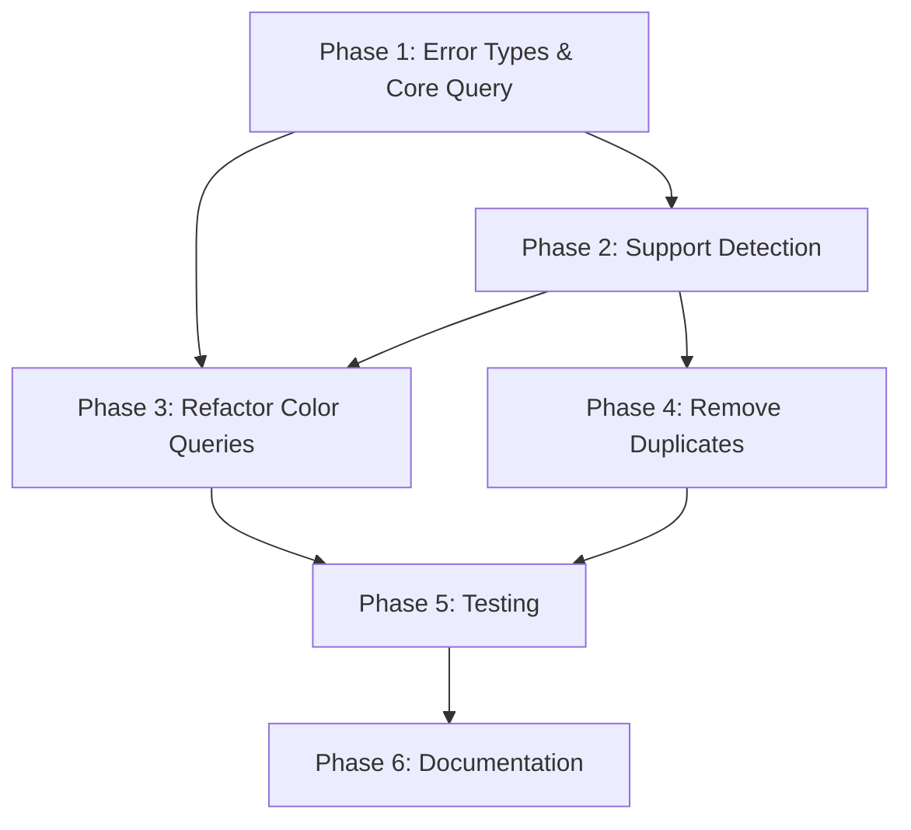

# Planning Process

- [x] Pre-flight Check [11:42am]
    - [x] Catalogs validated
    - [x] Directories ready
    - [x] Budget estimated: medium (~35%)
- [x] Prep Started [11:43am]
    - [x] Identified Skills: rust, terminal, rust-testing
    - [x] Identified Subagents: Plan
- [x] Prep complete with ~8% context used [11:43am]
- [x] Clarify & Research [11:44am]
    - [x] User answered 2 questions
        - OSC Strategy: Hybrid approach (actual query → heuristic fallback)
        - Module location: osc_queries.rs
    - [x] Requirements updated
- [x] Planning Subagent [agent: **Plan**] started [11:45am]
    - [x] subagent skills used: rust, termbg
    - [x] Planning completed - 6 phases defined
- [x] All Pre-review Steps complete [11:46am]
    - ~15% context used (budget: 35%)
- [x] Reviews Started [11:46am]
   - [x] Completeness Review - 18 gaps identified
   - [x] Concurrency Review - 8 recommendations
   - [x] Correctness Review - 9 issues found
   - [x] Risk Assessment - 8 risks identified (2 HIGH)
- [x] Reviews Completed [11:47am]
    - ~25% context used (budget: 35%)
- [x] Plan Finalization [11:48am]
    - [x] Incorporate review feedback (correctness fixes, risk upgrades)
    - [x] Dependency graph confirmed
- [x] Plan finalized [11:48am]
- [ ] Summary reported

## Analysis Summary

### Current State

**Files involved:**
- `biscuit-terminal/lib/src/discovery/osc_queries.rs` - Has OSC color functions with heuristics-only approach
- `biscuit-terminal/lib/src/discovery/detection.rs` - Has duplicate TODO stubs for osc10/11/12_support()

**Key findings:**
1. `osc10_support()`, `osc11_support()`, `osc12_support()` are duplicated as TODO stubs in BOTH files
2. `get_terminal_default_color()` is an internal helper used by `query_osc_color()` - it provides terminal-specific defaults
3. `bg_color()`, `text_color()`, `cursor_color()` are the public API
4. Current implementation NEVER actually queries the terminal - it only uses:
   - `COLORFGBG` env var parsing
   - Terminal app detection → hardcoded default colors
5. The doc comments claim "safe, environment-based detection" but the functions are named after OSC codes which implies actual queries

**Redundancy analysis:**
- `get_terminal_default_color()` is NOT redundant with `bg_color()` - it's the fallback INSIDE `bg_color()`
- The duplicate TODO stubs ARE redundant and should be consolidated to one location

### Design Questions

1. **Should we perform actual OSC queries?**
   - Risk: Can block/timeout, may corrupt terminal state in raw mode
   - Benefit: Accurate color detection regardless of terminal defaults

2. **Where should OSC support detection live?**
   - Option A: `detection.rs` (alongside other terminal capability detection)
   - Option B: `osc_queries.rs` (alongside the color query functions)

3. **What should the fallback chain be?**
   - Actual OSC query (if terminal supports it and we have raw mode access)
   - `COLORFGBG` env var
   - Terminal app defaults
   - `None` (don't guess)

## Plan

### Phase 1: Add Error Types and Core Query Infrastructure
**Agent:** `general-purpose` | **Skills:** rust | **Complexity:** Medium
**Deps:** None | **Parallel:** No

**Goal:** Create error types and the low-level OSC query function that performs actual terminal I/O with timeout and raw mode handling.

**Deliver:**
- `OscQueryError` enum (NotTty, CiEnvironment, Unsupported, Timeout, ParseError, IoError, Multiplexer)
- `query_osc_actual(code: u8, timeout: Duration) -> Result<RgbValue, OscQueryError>` - raw mode terminal query with RAII cleanup
- `parse_osc_color_response(response: &[u8], expected_code: u8) -> Option<RgbValue>` - handles both BEL and ST terminators
- 16-bit to 8-bit conversion with rounding: `(val * 255 + 32767) / 65535`
- Multiplexer detection (TMUX, ZELLIJ env vars) before attempting query

**Pass when:**
- [ ] `OscQueryError` enum compiles with Debug derive
- [ ] `query_osc_actual` compiles on Unix (with `#[cfg(unix)]` gate)
- [ ] `parse_osc_color_response` parses BEL-terminated: `\x1b]11;rgb:ffff/ffff/ffff\x07`
- [ ] `parse_osc_color_response` parses ST-terminated: `\x1b]11;rgb:ffff/ffff/ffff\x1b\\`
- [ ] 16-bit max (0xffff) converts to 255, not 254
- [ ] Multiplexer detected returns `Err(OscQueryError::Multiplexer)`
- [ ] Non-Unix stub returns `Err(OscQueryError::Unsupported)`

**If failed:**
- Rollback: Remove new functions
- Retry: Simplify to heuristic-only approach if raw mode issues persist

---

### Phase 2: Implement Terminal Support Detection Functions
**Agent:** `general-purpose` | **Skills:** rust | **Complexity:** Medium
**Deps:** Phase 1 | **Parallel:** No

**Goal:** Implement `osc10_support()`, `osc11_support()`, `osc12_support()` in `osc_queries.rs` using **heuristics only** (never attempt actual query from support functions).

**Deliver:**
- `is_osc_query_supported(code: u8) -> bool` - internal function with `OnceLock` session caching
- `osc10_support()`, `osc11_support()`, `osc12_support()` public functions
- Tracing instrumentation for detection source
- **CRITICAL**: support() functions use terminal app detection only - no actual OSC queries

**Pass when:**
- [ ] `osc10_support()` returns `true` in Kitty/WezTerm/iTerm2/Alacritty/Ghostty/Foot/Contour
- [ ] `osc10_support()` returns `false` in Apple Terminal
- [ ] `osc10_support()` returns `false` when not TTY or in CI
- [ ] `osc10_support()` returns `false` when TMUX or ZELLIJ env var is set
- [ ] All three functions compile and pass clippy
- [ ] Functions never perform actual terminal I/O

**If failed:**
- Rollback: Restore TODO stubs
- Retry: Check terminal app detection matches existing `osc8_link_support()` pattern

---

### Phase 3: Refactor Color Query Functions to Use Hybrid Approach
**Agent:** `general-purpose` | **Skills:** rust | **Complexity:** Medium
**Deps:** Phase 1, Phase 2 | **Parallel:** No

**Goal:** Modify `bg_color()`, `text_color()`, `cursor_color()` to try actual OSC query first, then fall back to heuristics.

**Deliver:**
- Refactored `query_osc_color()` with fallback chain: actual query → COLORFGBG → terminal defaults
- `bg_color_with_timeout(timeout: Duration)` variant
- Updated module documentation

**Pass when:**
- [ ] `bg_color()` returns actual color in supported terminals
- [ ] `bg_color()` returns heuristic color in unsupported terminals
- [ ] `bg_color()` returns `None` in CI environment
- [ ] Tracing shows which detection source was used
- [ ] Existing tests continue to pass

**If failed:**
- Rollback: Restore original heuristic-only implementation
- Retry: Increase timeout or simplify fallback chain

---

### Phase 4: Remove Duplicate Stubs from detection.rs
**Agent:** `general-purpose` | **Skills:** rust | **Complexity:** Low
**Deps:** Phase 2 | **Parallel:** Yes (with Phase 3)

**Goal:** Remove duplicate TODO stubs from `detection.rs` and add re-exports for API compatibility.

**Deliver:**
- Delete `osc10_support`, `osc11_support`, `osc12_support` TODO stubs from detection.rs
- Add re-exports in detection.rs pointing to osc_queries.rs

**Pass when:**
- [ ] No TODO stubs remain in `detection.rs` for OSC support
- [ ] Imports like `use biscuit_terminal::discovery::detection::osc11_support` still work
- [ ] `cargo test -p biscuit-terminal` passes
- [ ] `cargo doc -p biscuit-terminal` builds without warnings

**If failed:**
- Rollback: Restore stubs with comment pointing to `osc_queries.rs`
- Retry: Check for external dependencies on the detection.rs location

---

### Phase 5: Comprehensive Testing
**Agent:** `feature-tester-rust` | **Skills:** rust | **Complexity:** High
**Deps:** Phase 3, Phase 4 | **Parallel:** No

**Goal:** Add comprehensive unit tests and integration tests for OSC query functionality.

**Deliver:**
- Unit tests for `parse_osc_color_response` (BEL/ST terminators, wrong code, edge cases)
- Unit tests for 16-bit to 8-bit conversion
- Integration tests for support detection (marked `#[ignore]` for CI)
- CI environment detection tests

**Pass when:**
- [ ] All unit tests pass with `cargo test -p biscuit-terminal`
- [ ] Response parser handles all documented formats
- [ ] 16-bit to 8-bit conversion is accurate
- [ ] CI detection prevents actual terminal queries
- [ ] Tests do not hang (proper timeout handling)

**If failed:**
- Rollback: Mark failing tests as `#[ignore]`
- Retry: Add additional edge case handling

---

### Phase 6: Documentation and Examples
**Agent:** `general-purpose` | **Skills:** rust | **Complexity:** Low
**Deps:** Phase 5 | **Parallel:** No

**Goal:** Update documentation and add usage examples.

**Deliver:**
- Updated module doc comment explaining hybrid approach
- Doc examples for `osc10_support()`, `osc11_support()`, `osc12_support()`
- Doc examples for `bg_color()`, `text_color()`, `cursor_color()`

**Pass when:**
- [ ] `cargo doc -p biscuit-terminal` generates clean documentation
- [ ] All public functions have doc comments with examples
- [ ] Module-level documentation explains the hybrid approach
- [ ] No doc test failures

**If failed:**
- Rollback: Simplify examples to `no_run`
- Retry: Fix any doc test issues

---

## Dependency Graph

## Risks

> Implementation risks identified during planning with mitigation strategies.

| Level | Category | Description | Affected | Mitigation |
|-------|----------|-------------|----------|------------|
| HIGH | technical | Raw mode terminal I/O blocking - can hang indefinitely, corrupt terminal state | Phase 1, 2, 3 | RAII guard for state restore, 50ms max timeout, explicit opt-in for actual queries |
| HIGH | scope | Multiplexer query passthrough - tmux/screen may silently drop OSC responses | Phase 2, 3 | Detect TMUX/ZELLIJ env vars, skip actual query in multiplexers, use COLORFGBG fallback |
| MEDIUM | technical | Terminal may hang on OSC query | Phase 1, 3 | Short timeout (100ms), always restore terminal state |
| MEDIUM | technical | tmux/screen may not pass through queries | Phase 2 | Detect multiplexer via env vars, skip actual query |
| MEDIUM | scope | API confusion - support() vs actual query attempt | Phase 1, 2 | support() uses heuristics only, never attempts actual query |
| LOW | technical | Test environment not TTY | Phase 5 | Gate tests with `is_tty()`, use `#[ignore]` for real tests |
| LOW | technical | Race condition on terminal state | Phase 1 | RAII pattern for restore, never leave raw mode on panic |
| LOW | technical | 16-bit to 8-bit conversion precision loss | Phase 1 | Use rounding formula: `(r16 * 255 + 32767) / 65535` |

## Review Findings Summary

### Correctness Issues (must fix)
1. **OSC response format**: Must handle both BEL (`\x07`) AND ST (`\x1b\\`) terminators
2. **16-bit conversion**: Use rounding formula to avoid truncation at 0xffff
3. **Multiplexer detection**: Add before attempting actual OSC queries
4. **Session caching**: Specify mechanism (OnceLock recommended)

### Concurrency Optimizations (optional)
1. Phase 3 and Phase 4 CAN run in parallel (both depend on Phase 2)
2. Phase 5 testing can be split: unit tests start after Phase 3, integration after Phase 4

## Lessons Learned

> Discoveries about skills or memory resources that were inaccurate, incomplete, or missing.

- [SKILL: termbg]: Plan references termbg skill but no local skill exists - OSC response format verification needed from external sources
- [CODE: fonts.rs]: Uses CSI 14 t (window size), not OSC 10/11/12 - raw mode pattern transfers but response parsing differs

## Package Changes

> Dependencies to be added, updated, or removed during implementation.

- No new dependencies required - `libc` already available under `[target.'cfg(unix)'.dependencies]`
