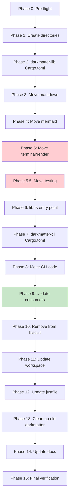

# Planning Process

- [x] Pre-flight Check [12:43pm]
    - [x] Catalogs validated
    - [x] Directories ready
    - [x] Budget estimated: medium (~40%)
- [x] Prep Started [12:44pm]
    - [x] Identified Skills: rust, clap (required); syntect, thiserror, nextest (suggested)
    - [x] Identified Subagents: Explore, Plan, 4 reviewers, plan-finalizer
- [x] Prep complete [12:45pm]
- [x] Clarify & Research [12:47pm]
    - [x] Clarification agent returned
    - [x] User answered 2 questions: migrate consumers, move highlighting with markdown
    - [x] Requirements updated with refined scope
    - [ ] Package research: N/A (no new packages needed)
- [x] Planning Subagent [agent: **Plan**] started [12:48pm]
    - [x] subagent skills used: rust, clap, syntect
    - [x] Planning completed: 15 phases identified
- [x] Module Assessment (monorepo) [12:48pm]
    - [x] subagent skills used: rust
    - [x] Impacted: darkmatter (critical), sniff-cli, so-you-say, playa-cli, research-lib
- [x] All Pre-review Steps complete [12:49pm]
- [x] Reviews Started [12:50pm]
   - [x] Completeness Review: Missing test utilities handling, documentation phase
   - [x] Concurrency Review: Plan is already optimal; sequential is correct for migration UX
   - [x] Correctness Review: render/terminal modules must also move; test utilities need handling
   - [x] Risk Assessment: 3 HIGH risks (circular deps, render module, terminal module)
- [x] Reviews Completed [12:51pm]
- [x] Plan Finalization started [12:52pm]
    - [x] subagent skills used: rust, cargo, clap, module-system
    - [x] Dependency graph generated
    - [x] Added Phase 5.5 for testing utilities
    - [x] Fixed directory structure (darkmatter-lib/cli as siblings, not subdirectories)
- [x] Plan finalized [12:53pm]
- [x] Final Steps
    - [x] Lessons learned: 3 entries from reviews
    - [x] Package research: N/A (no new external packages)
- [x] Summary reported [12:53pm]
    - Plan: .ai/plans/2026-01-28.plan-for-split-darkmatter-lib-cli.md
    - Phases: 16
    - Duration: ~10 minutes planning
    - Context: ~35% used (budget: 40%)

## Current Understanding

### Scope Analysis

**Darkmatter current state:**
- Single package with `src/lib.rs` (CLI struct only) and `src/main.rs`
- Currently re-exports CLI from lib.rs for programmatic access
- All actual functionality comes from `shared` (biscuit) crate

**Biscuit modules to extract:**
1. `biscuit/src/markdown/` - Full module with:
   - `mod.rs` - Markdown struct, ~590 lines
   - `cleanup.rs` - Markdown cleanup, ~84k characters
   - `delta/` - Document comparison
   - `dsl/` - DSL support
   - `frontmatter.rs` - Frontmatter parsing
   - `highlighting/` - Syntax highlighting
   - `inline/` - Inline markdown
   - `normalize/` - Heading normalization
   - `output/` - HTML/terminal output
   - `toc/` - Table of contents
   - `types.rs` - Error types

2. `biscuit/src/mermaid/` - Full module with:
   - `mod.rs` - Mermaid struct, ~593 lines
   - `render_html.rs` - HTML rendering
   - `render_terminal.rs` - Terminal rendering
   - `theme.rs` - Theme support

**Dependencies to consider:**
- `biscuit-hash` already exists as separate package - darkmatter-lib should depend on it
- `syntect`, `two-face` for highlighting
- `pulldown-cmark`, `markdown` for parsing
- `viuer` for terminal images

### Key Questions for Clarification
1. Should darkmatter-lib maintain API compatibility with current biscuit exports?
2. Should biscuit re-export darkmatter-lib types for backward compatibility?
3. Should the highlighting module stay with markdown or be its own concern?

## Plan

### Phase 0: Pre-flight Check
**Agent:** `Bash` | **Skills:** rust | **Complexity:** Low
**Deps:** None | **Parallel:** No

**Goal:** Verify clean starting state before structural changes.

**Pass when:**
- [ ] `git status` shows no uncommitted changes (or stashed)
- [ ] `cargo test -p shared -p darkmatter` passes
- [ ] `cargo clippy -p shared -p darkmatter` has no errors

---

### Phase 1: Create darkmatter-lib/ and darkmatter-cli/ directories
**Agent:** `Bash` | **Skills:** rust | **Complexity:** Low
**Deps:** Phase 0 | **Parallel:** No

**Goal:** Create new package directories as SIBLINGS to darkmatter/.

**Deliver:**
- `darkmatter-lib/src/` directory (sibling to darkmatter/)
- `darkmatter-cli/src/` directory (sibling to darkmatter/)

**Pass when:**
- [ ] Directory structure is `dockhand/{darkmatter, darkmatter-lib, darkmatter-cli}/`

---

### Phase 2: Create darkmatter-lib Cargo.toml
**Agent:** `Bash` | **Skills:** rust | **Complexity:** Medium
**Deps:** Phase 1 | **Parallel:** No

**Goal:** Create library package manifest with all dependencies from biscuit markdown/mermaid.

**Deliver:**
- `darkmatter-lib/Cargo.toml` with dependencies: biscuit-hash, syntect, two-face, pulldown-cmark, pulldown-cmark-to-cmark, markdown, html-escape, unicode-width, textwrap, terminal_size, viuer, comfy-table, similar, serde, serde_json, serde_yaml, thiserror, reqwest, url, tracing

**Pass when:**
- [ ] `cargo check -p darkmatter-lib` succeeds (after empty lib.rs exists)

---

### Phase 3: Move markdown module
**Agent:** `Bash` | **Skills:** rust, syntect | **Complexity:** High
**Deps:** Phase 2 | **Parallel:** No

**Goal:** Copy markdown module from biscuit to darkmatter-lib.

**Deliver:**
- `darkmatter-lib/src/markdown/` with all submodules (cleanup, delta, dsl, frontmatter, highlighting, inline, normalize, output, toc, types)

**Pass when:**
- [ ] All markdown files copied
- [ ] Internal `use crate::` references maintained

**Note:** Compilation will fail until Phase 5 (terminal/render dependencies)

---

### Phase 4: Move mermaid module
**Agent:** `Bash` | **Skills:** rust | **Complexity:** Medium
**Deps:** Phase 3 | **Parallel:** No

**Goal:** Copy mermaid module from biscuit to darkmatter-lib.

**Deliver:**
- `darkmatter-lib/src/mermaid/` with: mod.rs, render_html.rs, render_terminal.rs, theme.rs

**Pass when:**
- [ ] All mermaid files copied

---

### Phase 5: Add terminal and render modules
**Agent:** `Bash` | **Skills:** rust | **Complexity:** High
**Deps:** Phase 4 | **Parallel:** No

**Goal:** Move terminal and render modules to resolve markdown compilation.

**Deliver:**
- `darkmatter-lib/src/terminal/` (color depth, ANSI builder)
- `darkmatter-lib/src/render/` (Link, LinkType for hyperlinks)

**Pass when:**
- [ ] `cargo check -p darkmatter-lib` PASSES

**Risk Mitigation:** This phase resolves HIGH risks (render/terminal dependencies).

---

### Phase 5.5: Move testing module
**Agent:** `Bash` | **Skills:** rust | **Complexity:** Medium
**Deps:** Phase 5 | **Parallel:** No

**Goal:** Move test utilities (TestTerminal, strip_ansi_codes) for markdown tests.

**Deliver:**
- `darkmatter-lib/src/testing/` module with test utilities

**Pass when:**
- [ ] `cargo test -p darkmatter-lib --lib` compiles

---

### Phase 6: Create lib.rs entry point
**Agent:** `Bash` | **Skills:** rust | **Complexity:** Low
**Deps:** Phase 5.5 | **Parallel:** No

**Goal:** Create public API surface for darkmatter-lib.

**Deliver:**
- `darkmatter-lib/src/lib.rs` with pub mod declarations and re-exports

**Pass when:**
- [ ] `cargo doc -p darkmatter-lib` generates without errors

---

### Phase 7: Create darkmatter-cli package
**Agent:** `Bash` | **Skills:** rust, clap | **Complexity:** Low
**Deps:** Phase 6 | **Parallel:** No

**Goal:** Create CLI package depending on darkmatter-lib.

**Deliver:**
- `darkmatter-cli/Cargo.toml` with [[bin]] name = "md" and dependency on darkmatter-lib

**Pass when:**
- [ ] Package structure correct

---

### Phase 8: Move CLI code and update imports
**Agent:** `Bash` | **Skills:** rust, clap | **Complexity:** Medium
**Deps:** Phase 7 | **Parallel:** No

**Goal:** Move main.rs and lib.rs, update imports from shared:: to darkmatter_lib::

**Deliver:**
- `darkmatter-cli/src/main.rs` with updated imports
- `darkmatter-cli/src/lib.rs` (Cli struct) with updated imports

**Pass when:**
- [ ] `cargo build -p darkmatter-cli` succeeds
- [ ] `cargo run -p darkmatter-cli -- --help` works

---

### Phase 9: Update workspace consumers
**Agent:** `Bash` | **Skills:** rust | **Complexity:** Medium
**Deps:** Phase 8 | **Parallel:** Yes (9a, 9b, 9c)

**Goal:** Update sniff-cli, playa-cli, so-you-say to use darkmatter_lib.

**Deliver:**
- Updated Cargo.toml files with darkmatter-lib dependency
- Updated imports from shared::markdown to darkmatter_lib::markdown

**Pass when:**
- [ ] `cargo check -p sniff-cli -p playa-cli -p so-you-say` passes

---

### Phase 10: Remove modules from biscuit
**Agent:** `Bash` | **Skills:** rust | **Complexity:** Medium
**Deps:** Phase 9 | **Parallel:** No

**Goal:** Remove migrated modules from biscuit (clean break).

**Deliver:**
- Delete biscuit/src/{markdown, mermaid, terminal, render, testing}/
- Update biscuit/src/lib.rs
- Clean up biscuit/Cargo.toml dependencies

**Pass when:**
- [ ] `cargo check -p shared` passes
- [ ] No markdown/mermaid references in biscuit

---

### Phase 11: Update workspace Cargo.toml
**Agent:** `Bash` | **Skills:** rust | **Complexity:** Low
**Deps:** Phase 10 | **Parallel:** No

**Goal:** Register new packages, remove old darkmatter.

**Deliver:**
- Add "darkmatter-lib", "darkmatter-cli" to workspace members
- Remove "darkmatter"

**Pass when:**
- [ ] `cargo check --workspace` passes

---

### Phase 12: Update justfile
**Agent:** `Bash` | **Skills:** rust | **Complexity:** Low
**Deps:** Phase 11 | **Parallel:** No

**Goal:** Update justfile for lib/cli pattern.

**Pass when:**
- [ ] `just -f darkmatter-cli/justfile build` succeeds

---

### Phase 13: Clean up old darkmatter/
**Agent:** `Bash` | **Skills:** rust | **Complexity:** Low
**Deps:** Phase 12 | **Parallel:** No

**Goal:** Remove old darkmatter/ directory.

**Pass when:**
- [ ] darkmatter/src/ does not exist
- [ ] Workspace still builds

---

### Phase 14: Update documentation
**Agent:** `Bash` | **Skills:** rust | **Complexity:** Low
**Deps:** Phase 13 | **Parallel:** No

**Goal:** Update CLAUDE.md and skills references.

**Pass when:**
- [ ] CLAUDE.md reflects darkmatter-lib/cli split

---

### Phase 15: Final verification
**Agent:** `feature-tester-rust` | **Skills:** rust | **Complexity:** Medium
**Deps:** Phase 14 | **Parallel:** No

**Goal:** Comprehensive validation.

**Pass when:**
- [ ] `cargo test --workspace` passes
- [ ] `cargo clippy --workspace` has no errors
- [ ] `md README.md` renders correctly

## Dependency Graph

**Critical Path:** All 16 phases are sequential (except Phase 9 sub-tasks can parallelize)

**High-Risk Phases (red):** Phase 5 (terminal/render deps), Phase 5.5 (testing utilities)

## Risks

> Implementation risks identified during planning with mitigation strategies.

| Level | Category | Description | Affected | Mitigation |
|-------|----------|-------------|----------|------------|
| HIGH | dependency | Circular dependency between markdown and mermaid (highlighting) | Phase 3-4 | Move together sequentially; validate at Phase 5 |
| HIGH | dependency | Render module coupling - markdown/output imports Link type | Phase 3, 5 | Move render in Phase 5 before compilation check |
| HIGH | dependency | Terminal module coupling - markdown/output imports color constants | Phase 3, 5 | Move terminal in Phase 5 before compilation check |
| MEDIUM | scope | Consumer migration requires atomic updates (4 packages) | Phase 9 | Single commit; test each consumer individually |
| MEDIUM | technical | Testing utilities (TestTerminal, strip_ansi_codes) missing | Phase 5.5 | Added Phase 5.5 to address |
| MEDIUM | rollback | Rollback strategy across 16 phases | All | Each phase has explicit rollback commands |
| MEDIUM | scope | Module substructure complexity (8 markdown submodules) | Phase 3 | Move entire directory tree atomically |
| LOW | dependency | biscuit-hash already established | Phase 4 | Verify mermaid uses biscuit_hash (confirmed) |
| LOW | scope | Workspace exclude pattern may affect resolution | Phase 11 | Follow existing member patterns |
| LOW | technical | 16 phases for extraction task | All | Sequential nature is intentional for safety |

## Lessons Learned

> Discoveries about skills or memory resources that were inaccurate, incomplete, or missing.

- [CORRECTNESS_REVIEW]: Testing utilities (TestTerminal, strip_ansi_codes) were not in original plan - added Phase 5.5
- [CORRECTNESS_REVIEW]: Directory structure ambiguity - darkmatter-lib/cli must be SIBLINGS to darkmatter, not subdirectories
- [RISK_ASSESSMENT]: Render/terminal dependencies were HIGH risk but original plan already addressed in Phase 5

## Package Changes

> Dependencies to be added, updated, or removed during implementation.

- [ADD]: darkmatter-lib - New library package with markdown, mermaid, terminal, render, testing modules
- [ADD]: darkmatter-cli - New CLI package with binary `md`, depends on darkmatter-lib
- [REMOVE]: darkmatter (old structure) - Single package replaced by lib/cli split
- [UPDATE]: shared (biscuit) - Remove markdown, mermaid, terminal, render, testing modules and related dependencies
- [UPDATE]: sniff-cli - Add darkmatter-lib dependency, update imports
- [UPDATE]: playa-cli - Add darkmatter-lib dependency, update imports
- [UPDATE]: so-you-say - Add darkmatter-lib dependency, update imports
