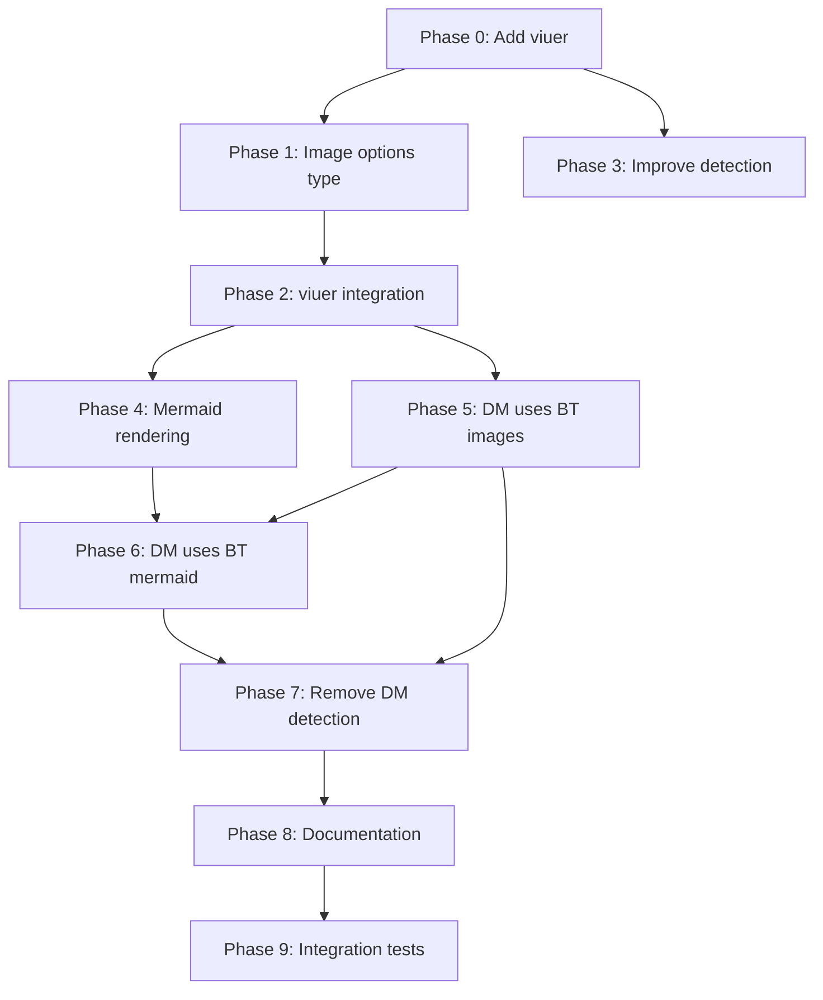

# Planning Process

- [x] Pre-flight Check [14:32]
    - [x] Directories ready
    - [x] Budget estimated: medium (~40%)
- [x] Prep Started [14:32]
    - [x] Identified Skills [14:32] - biscuit-terminal, rust
    - [x] Context gathered from review document and source files
- [x] Prep complete with ~60% context available [14:33]
- [x] Planning complete [14:45]

## Current State Analysis

### Biscuit-Terminal (biscuit-terminal/lib)
**Purpose**: Terminal capability detection and rich terminal rendering

**Current Capabilities**:
- **Detection** (comprehensive):
  - Terminal app detection (`TerminalApp` enum with 12+ variants)
  - Color depth detection (`ColorDepth` enum)
  - Color mode detection (light/dark via OSC queries, env vars, macOS defaults)
  - Image support detection (`ImageSupport::Kitty | ITerm | None`)
  - Underline support (straight, double, curly, dotted, dashed, colored)
  - Italics support
  - OSC8 hyperlink support
  - TTY detection
  - Multiplexer detection (tmux, Zellij, native)
  - Connection type (local, SSH, Mosh)
  - OS/distro detection, CI detection
  - Font detection (name, size, ligatures, Nerd Font)
  - Locale/encoding detection
  - OSC color queries (OSC10/11/12)

- **Rendering** (basic):
  - `TerminalImage` component with Kitty/iTerm2 protocols
  - Width specs (fill, percent, characters)
  - Direct protocol rendering methods
  - Base64 encoding, PNG encoding
  - Alt text fallback

**Gaps in biscuit-terminal** (from review):
- No viuer integration (hand-rolls protocols)
- No path traversal protection
- No file size caps
- No base-path scoping
- No sixel fallback
- Image detection is env-heuristic only, no viuer's runtime detection

### Darkmatter (darkmatter/lib)
**Purpose**: Markdown parsing, rendering (terminal + HTML), DSL extensions

**Current Capabilities**:
- **Markdown**: Full parsing, syntax highlighting, code blocks, tables
- **Terminal Rendering**:
  - `ImageRenderer` struct with viuer integration
  - Path traversal prevention (canonicalize against base path)
  - 10MB file size cap
  - Remote URL rejection
  - TTY detection
  - Graphics support via viuer's `get_kitty_support()` and `is_iterm_supported()`
- **Mermaid**: Terminal rendering via mmdc CLI + viuer display
- **Terminal Detection** (duplicated):
  - Own `color_depth()` function in `terminal/supports.rs`
  - Own `supports_italics()`, `supports_underline()`, etc.

**What darkmatter does well that biscuit-terminal should adopt**:
- viuer-based image rendering (more robust)
- Security guards (path traversal, size limits, remote URL blocking)
- Base-path scoping

### Key Overlaps (duplication to eliminate)

| Capability | Biscuit-Terminal | Darkmatter |
|------------|------------------|------------|
| Color depth detection | `detection::color_depth()` | `terminal::color_depth()` |
| Italics support | `detection::italics_support()` | `terminal::supports_italics()` |
| Underline support | `detection::underline_support()` | `terminal::supports_underline()` |
| Underline variants | `detection::underline_support()` | `terminal::supported_underline_variants()` |
| Image protocol detection | `detection::image_support()` | viuer's `get_kitty_support()` + `is_iterm_supported()` |
| TTY detection | `detection::is_tty()` | `std::io::stdout().is_terminal()` |

---

## Plan

### Phase 0: Add viuer to biscuit-terminal
**Agent:** `general-purpose` | **Skills:** biscuit-terminal, rust | **Complexity:** Low
**Deps:** None | **Parallel:** No

**Goal:** Add viuer as a dependency to biscuit-terminal for image rendering

**Deliver:**
- Updated `biscuit-terminal/lib/Cargo.toml` with viuer dependency
- Feature flag `viuer` (default-enabled) to allow opting out

**Pass when:**
- [ ] `cargo check -p biscuit-terminal` passes
- [ ] viuer is available in biscuit-terminal

**If failed:**
- Rollback: Revert Cargo.toml change
- Retry: Check viuer version compatibility

---

### Phase 1: Create shared image rendering options type
**Agent:** `general-purpose` | **Skills:** biscuit-terminal, rust | **Complexity:** Medium
**Deps:** Phase 0 | **Parallel:** No

**Goal:** Create a unified `TerminalImageOptions` type that both packages can use

**Deliver:**
- New `components/image_options.rs` with:
  ```rust
  pub struct TerminalImageOptions {
      /// Base path for resolving relative paths (security boundary)
      pub base_path: Option<PathBuf>,
      /// Maximum file size in bytes (default: 10MB)
      pub max_file_size: u64,
      /// Whether to allow remote URLs
      pub allow_remote: bool,
      /// Width specification
      pub width: ImageWidth,
      /// Whether to use viuer for rendering (vs raw protocols)
      pub use_viuer: bool,
  }
  ```
- Builder pattern for ergonomic construction
- Re-export from `components/mod.rs`

**Pass when:**
- [ ] Type compiles and is exported from biscuit-terminal
- [ ] Builder pattern works
- [ ] Tests pass

**If failed:**
- Rollback: Delete new file
- Retry: Review type design

---

### Phase 2: Integrate viuer into TerminalImage rendering
**Agent:** `general-purpose` | **Skills:** biscuit-terminal, rust | **Complexity:** High
**Deps:** Phase 1 | **Parallel:** No

**Goal:** Add viuer-based rendering path to TerminalImage with security guards

**Deliver:**
- Update `terminal_image.rs`:
  - Add viuer-based `render_with_viuer()` method
  - Add path traversal validation (canonicalize check)
  - Add file size validation
  - Add remote URL rejection
  - Update `render_to_terminal()` to use viuer when `use_viuer: true`
- Keep existing protocol methods for backward compatibility

**Pass when:**
- [ ] `render_with_viuer()` works with local images
- [ ] Path traversal is blocked
- [ ] Oversized files are rejected
- [ ] Remote URLs are rejected
- [ ] Existing protocol methods still work
- [ ] All existing tests pass

**If failed:**
- Rollback: Revert changes to terminal_image.rs
- Retry: Review viuer API usage

---

### Phase 3: Improve image support detection
**Agent:** `general-purpose` | **Skills:** biscuit-terminal, rust | **Complexity:** Medium
**Deps:** Phase 0 | **Parallel:** Yes (with Phase 1, 2)

**Goal:** Enhance `image_support()` to use viuer's detection as well as env heuristics

**Deliver:**
- Update `detection.rs`:
  - Add viuer's `get_kitty_support()` and `is_iterm_supported()` checks
  - Return `ImageSupport::ITerm` when appropriate (currently never returned)
  - Add reason tracking (why images are skipped) for debugging

**Pass when:**
- [ ] `image_support()` returns `ImageSupport::ITerm` for iTerm2
- [ ] viuer detection is used alongside env heuristics
- [ ] Tests cover detection scenarios

**If failed:**
- Rollback: Revert detection.rs changes
- Retry: Review viuer detection API

---

### Phase 4: Add mermaid rendering to biscuit-terminal
**Agent:** `general-purpose` | **Skills:** biscuit-terminal, rust | **Complexity:** High
**Deps:** Phase 2 | **Parallel:** No

**Goal:** Move mermaid terminal rendering from darkmatter to biscuit-terminal

**Deliver:**
- New `components/mermaid.rs` with:
  - `MermaidRenderer` struct
  - `render_for_terminal()` method (mmdc CLI execution + viuer display)
  - `fallback_code_block()` for non-graphics terminals
  - Same size limits and error handling as darkmatter
- Re-export from `components/mod.rs`

**Pass when:**
- [ ] Mermaid diagrams render in supported terminals
- [ ] Fallback works when mmdc unavailable
- [ ] Error types are comprehensive
- [ ] Tests cover key scenarios

**If failed:**
- Rollback: Delete new file
- Retry: Review mmdc CLI interface

---

### Phase 5: Update darkmatter to use biscuit-terminal for images
**Agent:** `general-purpose` | **Skills:** biscuit-terminal, rust | **Complexity:** Medium
**Deps:** Phase 2 | **Parallel:** No

**Goal:** Replace darkmatter's ImageRenderer with biscuit-terminal's TerminalImage

**Deliver:**
- Add `biscuit-terminal` as dependency in `darkmatter/lib/Cargo.toml`
- Update `markdown/output/terminal.rs`:
  - Remove `ImageRenderer` struct
  - Import and use `biscuit_terminal::components::TerminalImage`
  - Map darkmatter's options to `TerminalImageOptions`
- Keep viuer as dev-dependency only (for direct tests)

**Pass when:**
- [ ] `ImageRenderer` is removed from darkmatter
- [ ] Image rendering works through biscuit-terminal
- [ ] All darkmatter tests pass
- [ ] No functionality is lost

**If failed:**
- Rollback: Revert to darkmatter's ImageRenderer
- Retry: Check API compatibility

---

### Phase 6: Update darkmatter to use biscuit-terminal for mermaid
**Agent:** `general-purpose` | **Skills:** biscuit-terminal, rust | **Complexity:** Medium
**Deps:** Phase 4, Phase 5 | **Parallel:** No

**Goal:** Replace darkmatter's mermaid terminal rendering with biscuit-terminal's

**Deliver:**
- Update `mermaid/render_terminal.rs`:
  - Remove `render_for_terminal()` and related functions
  - Import and use `biscuit_terminal::components::MermaidRenderer`
- Update `markdown/output/terminal.rs` mermaid handling to use biscuit-terminal

**Pass when:**
- [ ] Mermaid rendering works through biscuit-terminal
- [ ] darkmatter's mermaid/render_terminal.rs is simplified
- [ ] All darkmatter tests pass

**If failed:**
- Rollback: Revert to darkmatter's mermaid rendering
- Retry: Check API compatibility

---

### Phase 7: Remove duplicated terminal detection from darkmatter
**Agent:** `general-purpose` | **Skills:** biscuit-terminal, rust | **Complexity:** Medium
**Deps:** Phase 5, Phase 6 | **Parallel:** No

**Goal:** Replace darkmatter's terminal capability detection with biscuit-terminal's

**Deliver:**
- Update `darkmatter/lib/src/terminal/supports.rs`:
  - Remove `color_depth()` (use `biscuit_terminal::discovery::detection::color_depth`)
  - Remove `supports_italics()` (use `biscuit_terminal::discovery::detection::italics_support`)
  - Remove `supports_underline()` and `supported_underline_variants()` (use biscuit-terminal's)
  - Keep only type re-exports and any darkmatter-specific wrappers
- Update imports throughout darkmatter to use biscuit-terminal

**Pass when:**
- [ ] No duplicate detection logic in darkmatter
- [ ] All darkmatter functionality preserved
- [ ] Tests pass

**If failed:**
- Rollback: Revert supports.rs changes
- Retry: Map any API differences

---

### Phase 8: Update module documentation and exports
**Agent:** `general-purpose` | **Skills:** biscuit-terminal, rust | **Complexity:** Low
**Deps:** Phase 7 | **Parallel:** No

**Goal:** Update documentation and public API to reflect new responsibilities

**Deliver:**
- Update biscuit-terminal README:
  - Document new image rendering features
  - Document mermaid support
  - Document security features (path traversal, size limits)
- Update darkmatter README:
  - Document dependency on biscuit-terminal for terminal rendering
  - Remove duplicated terminal detection docs
- Update CLAUDE.md skill sections if needed

**Pass when:**
- [ ] READMEs accurately describe current functionality
- [ ] API documentation is updated
- [ ] Skill files reflect new architecture

**If failed:**
- Rollback: Revert documentation changes
- Retry: Review actual API surface

---

### Phase 9: Integration tests
**Agent:** `feature-tester-rust` | **Skills:** biscuit-terminal, rust | **Complexity:** Medium
**Deps:** Phase 8 | **Parallel:** No

**Goal:** Ensure end-to-end functionality works across the new architecture

**Deliver:**
- Integration tests in darkmatter that:
  - Render markdown with images using biscuit-terminal
  - Render mermaid diagrams using biscuit-terminal
  - Verify security guards work end-to-end
- Integration tests in biscuit-terminal for standalone usage

**Pass when:**
- [ ] `cargo test -p darkmatter-lib` passes
- [ ] `cargo test -p biscuit-terminal` passes
- [ ] Integration scenarios work

**If failed:**
- Rollback: N/A (test-only phase)
- Retry: Fix identified issues

---

## Dependency Graph



**Critical Path:** P0 → P1 → P2 → P5 → P7 → P8 → P9

---

## Risks

| Level | Category | Description | Affected | Mitigation |
|-------|----------|-------------|----------|------------|
| MEDIUM | dependency | viuer API may differ from biscuit-terminal's current approach | Phase 2, 3 | Keep existing protocol methods as fallback, feature-gate viuer |
| MEDIUM | scope | Terminal detection unification may have subtle behavior differences | Phase 7 | Comprehensive testing, gradual rollout |
| LOW | technical | mmdc CLI path detection may need adjustment | Phase 4 | Reuse darkmatter's proven detection logic |

---

## Lessons Learned

> Discoveries about skills or memory resources that were inaccurate, incomplete, or missing.

(None yet)

---

## Package Changes

> Dependencies to be added, updated, or removed during implementation.

- [ADD]: viuer in biscuit-terminal/lib/Cargo.toml - Terminal image rendering via Kitty/iTerm2/Sixel
    - Research status: complete (already used in darkmatter)
- [ADD]: biscuit-terminal in darkmatter/lib/Cargo.toml - Terminal capability and rendering dependency
    - Research status: N/A (internal workspace dependency)
- [UPDATE]: darkmatter's viuer dependency - May become dev-dependency only
