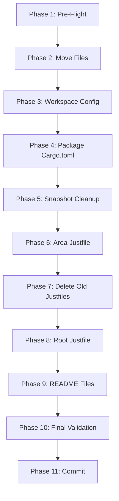

# Planning Process

- [x] Pre-flight Check [12:43pm]
    - [x] Directories ready
    - [x] Budget estimated: simple (~25%)
    - [x] Pattern reference validated (queue/)
- [x] Prep Started [12:44pm]
    - [x] Identified Skills: rust, just
    - [x] Identified Subagents: Bash, general-purpose
- [x] Prep complete [12:45pm]
- [x] Clarify & Research [12:45pm]
    - [x] No clarification needed - requirements clear, pattern established
- [x] Planning Subagent [agent: **Plan**] started [12:45pm]
    - [x] subagent skills used: rust, just
    - [x] Planning completed [12:46pm]
- [x] All Pre-review Steps complete [12:46pm]
- [x] Reviews Started [12:46pm]
   - [x] Completeness Review
   - [x] Concurrency Review
   - [x] Correctness Review (key findings)
   - [x] Risk Assessment (key findings)
- [x] Reviews Completed [12:47pm]
- [x] Plan Finalization started [12:47pm]
    - [x] subagent skills used: rust, just
    - [x] Dependency graph generated
- [x] Plan finalized [12:48pm]
- [x] Final Steps
    - [x] Lessons learned: correctness reviewer identified pre-existing root justfile bug
- [x] Summary reported [12:48pm]
    - Plan: `.ai/plans/2026-01-29.plan-for-darkmatter-directory-restructure.md`
    - Phases: 11
    - Duration: ~5 minutes planning
    - Context: ~15% used (budget: 25%)

## Plan

### Phase 1: Pre-Flight Validation
**Agent:** `human` | **Skills:** rust | **Complexity:** Low
**Deps:** None | **Parallel:** No

**Goal:** Verify workspace builds cleanly before restructure

**Deliver:**
- Clean cargo check for darkmatter packages
- All tests passing

**Pass when:**
- [ ] `cargo check -p darkmatter-cli -p darkmatter-lib` exits 0
- [ ] `cargo test -p darkmatter-cli -p darkmatter-lib` exits 0

**If failed:**
- Rollback: N/A (read-only)
- Retry: Fix errors before proceeding

---

### Phase 2: Create Directory Structure & Move Files
**Agent:** `human` | **Skills:** rust | **Complexity:** Low
**Deps:** Phase 1 | **Parallel:** No

**Goal:** Move packages to nested structure using git mv (preserves history)

**Deliver:**
- `darkmatter/cli/` containing all CLI files
- `darkmatter/lib/` containing all library files
- Old directories removed

**Commands:**
```bash
mkdir -p darkmatter
git mv darkmatter-cli darkmatter/cli
git mv darkmatter-lib darkmatter/lib
```

**Pass when:**
- [ ] `test -d darkmatter/cli/src`
- [ ] `test -d darkmatter/lib/src`
- [ ] `test ! -d darkmatter-cli`
- [ ] `test ! -d darkmatter-lib`
- [ ] `git status` shows renames (not deletes/adds)

**If failed:**
- Rollback: `git checkout HEAD -- darkmatter-cli darkmatter-lib && rm -rf darkmatter`
- Retry: Ensure no files open in editors

---

### Phase 3: Update Workspace Configuration
**Agent:** `human` | **Skills:** rust | **Complexity:** Low
**Deps:** Phase 2 | **Parallel:** No

**Goal:** Update root Cargo.toml workspace members

**Deliver:**
- Updated workspace members in `/Volumes/coding/personal/dockhand/Cargo.toml`

**Change:**
```toml
# From:
members = [..., "darkmatter-cli", "darkmatter-lib", ...]
# To:
members = [..., "darkmatter/cli", "darkmatter/lib", ...]
```

**Pass when:**
- [ ] `cargo metadata --format-version 1` succeeds
- [ ] Members include `darkmatter/cli` and `darkmatter/lib`

**If failed:**
- Rollback: Revert Cargo.toml
- Retry: Check for typos in paths

---

### Phase 4: Update Package Cargo.toml Files
**Agent:** `human` | **Skills:** rust | **Complexity:** Low
**Deps:** Phase 3 | **Parallel:** No

**Goal:** Update path dependencies and readme references

**Deliver:**
- Updated `darkmatter/cli/Cargo.toml`
- Updated `darkmatter/lib/Cargo.toml`

**Changes in darkmatter/cli/Cargo.toml:**
```toml
# readme: "../darkmatter/README.md" → "../README.md"
# darkmatter-lib path: "../darkmatter-lib" → "../lib"
```

**Changes in darkmatter/lib/Cargo.toml:**
```toml
# biscuit-hash path: "../biscuit-hash" → "../../biscuit-hash"
```

**Pass when:**
- [ ] `cargo check -p darkmatter-cli -p darkmatter-lib` exits 0

**If failed:**
- Rollback: Revert both Cargo.toml files
- Retry: Verify relative paths from new locations

---

### Phase 5: Clean Up Snapshot Files
**Agent:** `human` | **Skills:** rust | **Complexity:** Low
**Deps:** Phase 4 | **Parallel:** No

**Goal:** Remove legacy snapshot files and update source references

**Deliver:**
- Deleted legacy `shared__*` snapshot files
- Updated `source:` fields in remaining snapshots

**Delete:**
- `darkmatter/lib/src/mermaid/snapshots/shared__mermaid__tests__html_body_snapshot.snap`
- `darkmatter/lib/src/mermaid/snapshots/shared__mermaid__tests__html_head_snapshot.snap`

**Update in remaining snapshots:**
```yaml
# source: darkmatter-lib/src/mermaid/mod.rs → darkmatter/lib/src/mermaid/mod.rs
```

**Pass when:**
- [ ] No `shared__*` files remain
- [ ] `grep -r "source: darkmatter-lib" darkmatter/lib/` returns nothing
- [ ] `cargo test -p darkmatter-lib` passes

**If failed:**
- Rollback: Restore snapshots from git
- Retry: Run tests with `INSTA_UPDATE=always` to regenerate

---

### Phase 6: Create Area Justfile
**Agent:** `human` | **Skills:** just | **Complexity:** Medium
**Deps:** Phase 5 | **Parallel:** No

**Goal:** Create unified area justfile following queue/ pattern

**Deliver:**
- `/Volumes/coding/personal/dockhand/darkmatter/justfile`

**Content:**
```just
set dotenv-load
set positional-arguments

BOLD := '\033[1m'
RESET := '\033[0m'

default:
    @echo "{{BOLD}}Darkmatter CLI and Library{{RESET}}"
    @echo
    @just --list | grep -v 'default'

# build library and CLI
build *args="":
    @echo "Building ..."
    @cargo build -p darkmatter-lib {{args}}
    @cargo build -p darkmatter-cli {{args}}

# test library and CLI
test *args="":
    @echo "Testing {{BOLD}}Library{{RESET}} code"
    @cargo test -p darkmatter-lib {{args}}
    @echo ""
    @echo "Testing {{BOLD}}CLI{{RESET}} code"
    @cargo test -p darkmatter-cli {{args}}

# lint with clippy
lint *args="":
    @cargo clippy -p darkmatter-lib -p darkmatter-cli {{args}}

# install latest release version of CLI
install *args="":
    @cargo install --path cli {{args}}

# build and show the docs for the library code
docs:
    @cargo doc -p darkmatter-lib --open

# run the debug release of the Darkmatter CLI
cli *args="":
    @cargo run -p darkmatter-cli -- {{args}}
```

**Pass when:**
- [ ] `just -f darkmatter/justfile build` exits 0
- [ ] `just -f darkmatter/justfile test` exits 0

**If failed:**
- Rollback: Delete justfile
- Retry: Check syntax errors

---

### Phase 7: Delete Old Justfiles
**Agent:** `human` | **Skills:** just | **Complexity:** Low
**Deps:** Phase 6 | **Parallel:** No

**Goal:** Remove individual justfiles from subdirectories

**Deliver:**
- Deleted `darkmatter/cli/justfile`
- Deleted `darkmatter/lib/justfile`

**Commands:**
```bash
git rm darkmatter/cli/justfile
git rm darkmatter/lib/justfile
```

**Pass when:**
- [ ] No justfile in cli/ or lib/ subdirectories
- [ ] Area justfile still works

**If failed:**
- Rollback: Restore from git
- Retry: Ensure area justfile tested first

---

### Phase 8: Update Root Justfile
**Agent:** `human` | **Skills:** just | **Complexity:** Low
**Deps:** Phase 7 | **Parallel:** No

**Goal:** Fix root justfile `md` command to use correct package name

**Deliver:**
- Updated `/Volumes/coding/personal/dockhand/justfile`

**Change line 113:**
```just
# From:
cargo run -p darkmatter --bin md -- {{args}}
# To:
cargo run -p darkmatter-cli --bin md -- {{args}}
```

**Pass when:**
- [ ] `just md --help` exits 0

**If failed:**
- Rollback: Revert justfile
- Retry: Verify package name is `darkmatter-cli`

---

### Phase 9: Create README Files
**Agent:** `human` | **Skills:** rust | **Complexity:** Medium
**Deps:** Phase 8 | **Parallel:** No

**Goal:** Create comprehensive README documentation

**Deliver:**
- `darkmatter/README.md` - Area overview
- `darkmatter/cli/README.md` - CLI documentation
- `darkmatter/lib/README.md` - Library API documentation

**Content Guidelines:**

**darkmatter/README.md:**
- High-level overview (markdown rendering for terminal/browser)
- Quick start installation (`cargo install --path cli`)
- Architecture pointing to cli/ and lib/

**darkmatter/cli/README.md:**
- Binary name (`md`) and purpose
- Command-line usage examples
- Available flags and options

**darkmatter/lib/README.md:**
- Library purpose and capabilities
- Key modules overview
- API usage examples

**Pass when:**
- [ ] All 3 README files exist with substantive content

**If failed:**
- Rollback: Delete READMEs
- Retry: Draft based on Cargo.toml descriptions

---

### Phase 10: Final Validation
**Agent:** `human` | **Skills:** rust, just | **Complexity:** Medium
**Deps:** Phase 9 | **Parallel:** No

**Goal:** Comprehensive validation of restructured package

**Deliver:**
- All checks pass
- All commands work

**Validation Commands:**
```bash
# Workspace validation
cargo check --workspace
cargo test -p darkmatter-cli -p darkmatter-lib

# Area justfile validation
just -f darkmatter/justfile build
just -f darkmatter/justfile test
just -f darkmatter/justfile lint

# Root justfile validation
just md --help
just build  # Should include darkmatter
just test   # Should include darkmatter
```

**Pass when:**
- [ ] All cargo commands exit 0
- [ ] All just commands exit 0
- [ ] `git status` shows only intentional changes

**If failed:**
- Rollback: Full git reset
- Retry: Review errors phase by phase

---

### Phase 11: Commit Changes
**Agent:** `human` | **Skills:** rust | **Complexity:** Low
**Deps:** Phase 10 | **Parallel:** No

**Goal:** Create atomic commit with all changes

**Deliver:**
- Single commit capturing restructure

**Command:**
```bash
git add -A
git commit -m "refactor(darkmatter): restructure to area package pattern

- Move darkmatter-cli to darkmatter/cli
- Move darkmatter-lib to darkmatter/lib
- Create unified area justfile
- Update workspace members and path dependencies
- Update snapshot source references
- Create README documentation
- Fix root justfile md command package name

Co-Authored-By: Claude <noreply@anthropic.com>"
```

**Pass when:**
- [ ] `git log -1 --oneline` shows new commit
- [ ] Working directory is clean

**If failed:**
- Rollback: `git reset --soft HEAD~1`
- Retry: Review changes, fix issues

## Dependency Graph



**Critical Path:** All phases are sequential (11 phases total)

## Risks

> Implementation risks identified during planning with mitigation strategies.

| Level | Category | Description | Affected | Mitigation |
|-------|----------|-------------|----------|------------|
| HIGH | dependency | Snapshot files have hardcoded source paths that must be updated | Phase 5 | Update source fields; delete legacy `shared__*` files; run tests to verify |
| HIGH | dependency | Cargo.toml paths must be updated atomically with directory moves | Phase 3-4 | Execute phases 2-4 in sequence without interruption; validate with cargo check |
| MEDIUM | rollback | Partial completion could leave broken state | All | Each phase has explicit rollback; can git reset to start if needed |
| LOW | scope | README content quality is subjective | Phase 9 | Can iterate on content post-commit |

## Lessons Learned

> Discoveries about skills or memory resources that were inaccurate, incomplete, or missing.

- [FILE: justfile]: Root justfile line 113 uses `-p darkmatter` but package name is `darkmatter-cli` - pre-existing bug discovered during planning


## Package Changes

> Dependencies to be added, updated, or removed during implementation.

- No package changes expected (restructure only)
