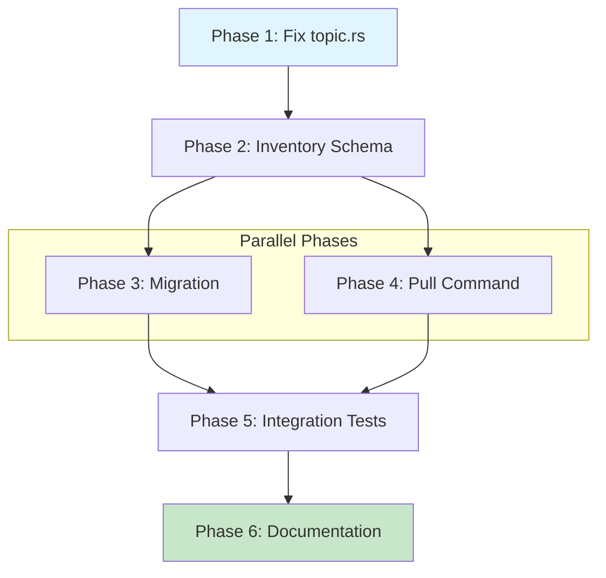

# Planning Process

- [x] Pre-flight Check [13:15:00]
    - [x] Catalogs validated
    - [x] Directories ready
    - [x] Budget estimated: medium-high (~45%)
- [x] Prep Started [13:16:00]
    - [x] Identified Skills [13:16:00]
    - [x] Identified Subagents [13:16:00]
- [x] Prep complete with ~90% context available [13:16:30]
- [x] Clarify & Research [13:20:00]
    - [x] Clarification agent returned [13:18:00]
    - [x] User answered 3 questions [13:20:00]
    - [x] Requirements updated [13:20:00]
- [x] Planning Subagent [agent: **Plan**] started [13:25:00]
    - [x] subagent skills used: **rust, clap, serde, thiserror, chrono**
    - [x] Planning completed [13:27:00]
- [x] All Pre-review Steps complete [13:27:00]
    - ~15% context used (budget: 45%)
- [x] Reviews Started [13:28:00]
   - [x] Completeness Review - 32 findings
   - [x] Concurrency Review - confirmed Phases 3&4 parallel
   - [x] Correctness Review - 11 issues found
   - [x] Risk Assessment - 2 HIGH, 3 MEDIUM, 2 LOW risks
- [x] Reviews Completed [13:32:00]
- [x] Plan Finalization started [13:35:00]
    - [x] subagent skills used: **rust, serde, thiserror, clap, chrono**
    - [x] Dependency graph generated
- [x] Plan finalized [13:38:00]
- [x] Final Steps
    - [x] Lessons learned collected (8 entries)
    - [x] Package research status: No new packages needed
- [x] Summary reported [13:40:00]

## Context Summary

### Current System (v1)
- Per-topic `metadata.json` files at `~/.research/library/<topic>/metadata.json`
- `ResearchMetadata` struct with schema_version, kind, details, additional_files, timestamps
- `ResearchDetails` enum with 15 variants (Library, Api, Person, etc.)
- Discovery via filesystem walking (`list/discovery.rs`)
- Symlink creation via `link/creation.rs` for Claude/OpenCode/Roo integration

### New System (v2) - From docs and draft code
- Centralized `research-inventory.json` at research root
- `Topic` struct with: name, kind, created, last_updated, brief, summary, when_to_use, documents, children
- `Document` struct tracking provenance: filename, content_type, prompt, flow, timestamps, model info, hashes
- `KindCategory` enum: Library, Software, Person, SolutionArea, ProgrammingLanguage
- `ContentPolicy`/`ContentExpiry` for staleness tracking
- New directory structure per tech-design.md

### Key Files to Modify
- `research/lib/src/metadata/topic.rs` - Fix draft implementation (remove non-existent preludes)
- `research/lib/src/metadata/content_policy.rs` - Already mostly complete
- `research/lib/src/metadata/mod.rs` - Export new types
- `research/lib/src/lib.rs` - Integrate new metadata system
- `research/lib/src/list/` - Update discovery for new inventory format
- `research/cli/src/main.rs` - Add `pull` command

### Pull Command Requirements (from research.md)
1. `research pull <topic>` copies skill from user scope to repo scope
2. Fails if not in a git repository
3. Copies skill to `{ROOT}/.claude/skill/{topic}`
4. Creates relative symlinks for other frameworks (OpenCode, Roo) if detected
5. `--local` flag also copies underlying research to `{ROOT}/.claude/research/{topic}`

## Plan

### Phase 1: Fix topic.rs Type Definitions
**Agent:** `general-purpose` | **Skills:** rust, serde, thiserror, chrono | **Complexity:** Low
**Deps:** None | **Parallel:** No

**Goal:** Fix the broken `topic.rs` draft to compile correctly with proper imports, types, and missing enum definitions.

**Deliver:**
- Remove `use sniff::prelude::*` and `use ai_pipeline::prelude::*`
- Add `use chrono::{DateTime, Utc}` for timestamp fields
- Add `use sniff::package::LanguagePackageManager`
- Define missing `ContentType` enum (Overview, SimilarLibraries, IntegrationPartners, UseCases, Changelog, CustomQuestion, DeepDive, Brief, Skill)
- Stub `Flow` enum if complex implementation deferred
- Change `LibraryPackageManager` to `LanguagePackageManager` (line 33)
- Fix `DateTime` to `DateTime<Utc>` on lines 76, 78, 128, 130
- Add `#[derive(Debug, Clone, Serialize, Deserialize)]` to `Library` struct
- Add `Deserialize` derive to `Topic` struct
- Fix `Document::new` signature: `pub fn new(filepath: &Path) -> Self`
- Add `#[serde(skip_serializing_if = "Option::is_none")]` to Option fields
- Export new types from `metadata/mod.rs`
- **Also fix** `content_policy.rs`: replace `use sniff::prelude::*` with `use sniff::package::LanguagePackageManager`

**Pass when:**
- [ ] `cargo check -p research-lib` passes with zero errors
- [ ] All new types exported from `research_lib::metadata`
- [ ] Both `topic.rs` and `content_policy.rs` have correct imports

**If failed:**
- Rollback: `git checkout research/lib/src/metadata/topic.rs content_policy.rs mod.rs`
- Retry: Check for typos in enum variant names or missing trait bounds

---

### Phase 2: Define Inventory Schema Types
**Agent:** `general-purpose` | **Skills:** rust, serde, thiserror | **Complexity:** Medium
**Deps:** Phase 1 | **Parallel:** No

**Goal:** Create the centralized inventory type system with load/save/update operations at `$RESEARCH_DIR/.research/research-inventory.json`.

**Deliver:**
- New file: `research/lib/src/metadata/inventory.rs`
- `ResearchInventory` struct wrapping `HashMap<String, Topic>`
- Functions:
  - `load()` - Load from inventory path, trigger lazy migration if not found
  - `save()` - Atomic write with temp file + rename
  - `get(&str) -> Option<&Topic>`
  - `insert(String, Topic)` - **Upsert behavior** (replaces existing)
  - `remove(&str) -> Option<Topic>`
  - `contains(&str) -> bool`
- Error types: `InventoryError` (IoError, ParseError, TopicNotFound)
- `Default` impl returning empty inventory

**Pass when:**
- [ ] `cargo check -p research-lib` passes
- [ ] Unit tests for load/save/get/insert/remove pass
- [ ] Roundtrip serialization test passes
- [ ] Insert replaces existing entry (upsert test)

**If failed:**
- Rollback: `git rm research/lib/src/metadata/inventory.rs`
- Retry: Verify serde attributes for HashMap serialization

---

### Phase 3: Implement v1 to v2 Migration
**Agent:** `general-purpose` | **Skills:** rust, serde, thiserror | **Complexity:** Medium
**Deps:** Phase 2 | **Parallel:** Yes (with Phase 4)

**Goal:** Create lazy migration from per-topic metadata.json to centralized inventory, populating Document entries.

**Deliver:**
- New file: `research/lib/src/metadata/migration_v2.rs`
- `build_topic_from_metadata_json(path: &Path) -> Result<Topic>`
- `scan_and_build_inventory(research_dir: &Path) -> Result<ResearchInventory>`
- **Document population**: Scan topic directory for .md files, create Document entries with:
  - `filename`: relative path from topic dir
  - `content_type`: inferred from filename (overview.md → Overview, etc.)
  - `last_updated`/`created`: from file timestamps
  - `content_hash`: computed via xxhash
- **Children handling**: Set to empty `Vec` during migration
- Preserve backward compatibility: keep metadata.json files untouched

**Pass when:**
- [ ] Can read existing metadata.json and produce valid `Topic`
- [ ] Can scan filesystem and produce valid inventory with Document entries
- [ ] Document entries have correct content_type inferred from filename
- [ ] Existing metadata.json files remain untouched

**If failed:**
- Rollback: `git rm research/lib/src/metadata/migration_v2.rs`
- Retry: Check filesystem permissions, validate xxhash dependency

---

### Phase 4: Add `research pull` CLI Command
**Agent:** `general-purpose` | **Skills:** rust, clap, thiserror | **Complexity:** Medium
**Deps:** Phase 2 | **Parallel:** Yes (with Phase 3)

**Goal:** Add CLI command to copy skills from user scope to repo scope with relative symlink support.

**Deliver:**
- New subcommand: `research pull <topic> [--local]`
- **Git repository detection**: Call `git rev-parse --show-toplevel`, fail if not in repo
- **Topic validation**: Verify topic exists in inventory before pulling
- **Skill directory copy**: Copy `~/.research/library/<topic>/skill/` to `{ROOT}/.claude/skills/<topic>/`
- **Relative symlink creation**:
  - `.roo/skills/<topic>` → `../../.claude/skills/<topic>` if `.roo/` exists
  - `.opencode/skill/<topic>` → `../../.claude/skills/<topic>` if `AGENTS.md` exists
  - **Handle existing symlinks**: Skip if same target, warn if different
- **`--local` flag**: Copy underlying research docs to `{ROOT}/.claude/research/<topic>/`

**Pass when:**
- [ ] Command fails with "Not in git repository" when outside repo
- [ ] Command fails with "Topic not found" for unknown topics
- [ ] Command copies skill directory preserving structure
- [ ] Creates **relative** symlinks for `.roo/` and `.opencode/`
- [ ] Warns on existing symlinks with different target
- [ ] `--local` flag copies research documents

**If failed:**
- Rollback: Remove copied directories and symlinks
- Retry: Verify git availability, check symlink API

---

### Phase 5: Integration and Testing
**Agent:** `feature-tester-rust` | **Skills:** rust | **Complexity:** Medium
**Deps:** Phase 3, Phase 4 | **Parallel:** No

**Goal:** Validate the complete workflow from migration to pull command.

**Deliver:**
- Integration test: Full migration workflow with mock research directory
- Integration test: `research pull` in mock git repo with `.roo/` and `AGENTS.md`
- Integration test: `research pull --local` copies research documents
- Edge case tests: Missing topic, no git repo, existing symlinks

**Pass when:**
- [ ] All integration tests pass
- [ ] `cargo test -p research-lib` passes
- [ ] `cargo test -p research-cli` passes
- [ ] Manual test: `research pull clap` works in dockhand repo
- [ ] Symlinks verified as relative via `ls -la`

**If failed:**
- Rollback: N/A (tests only)
- Retry: Check test verbosity, filesystem permissions

---

### Phase 6: Documentation Update
**Agent:** `general-purpose` | **Skills:** technical-writing | **Complexity:** Low
**Deps:** Phase 5 | **Parallel:** No

**Goal:** Update repository documentation to reflect new inventory system and pull command.

**Deliver:**
- Update `research/README.md`: Add inventory section, `research pull` command
- Update `CLAUDE.md`: Add pull to Common Commands, document inventory location
- Update `research/docs/architecture.md`: Add inventory schema section

**Pass when:**
- [ ] Documentation changes reviewed for accuracy
- [ ] Examples match actual CLI interface
- [ ] No broken internal links

**If failed:**
- Rollback: `git checkout` modified docs
- Retry: Re-read implementation for accurate details

## Dependency Graph

**Critical Path:** P1 → P2 → P3 → P5 → P6 (5 sequential phases)

## Risks

> Implementation risks identified during planning with mitigation strategies.

| Level | Category | Description | Affected | Mitigation |
|-------|----------|-------------|----------|------------|
| HIGH | technical | Non-existent imports in topic.rs (`sniff::prelude::*`, `ai_pipeline::prelude::*` don't exist) | Phase 1 | Replace with explicit imports: `sniff::package::LanguagePackageManager`, `chrono::{DateTime, Utc}` |
| HIGH | technical | Relative symlinks required but existing link/creation.rs only creates absolute symlinks | Phase 4 | Create new relative symlink utility or clarify if absolute symlinks are acceptable |
| MEDIUM | scope | Git detection approach undefined - no existing utility | Phase 4 | Use simple `.git` directory check, add git2 crate if more sophisticated detection needed |
| MEDIUM | rollback | Lazy migration creates dual state (inventory + metadata.json) | Phase 3 | Add validation to detect divergence; document when to remove old files |
| MEDIUM | scope | Document TryFrom conversions all `todo!()` with unclear purpose | Phase 1 | Stub implementations or remove if not needed for initial implementation |
| LOW | technical | Inventory location ambiguity ($RESEARCH_DIR vs $RESEARCH_DIR/.research) | Phase 2 | Use `$RESEARCH_DIR/.research/research-inventory.json` for consistency |
| LOW | dependency | May need git2 crate for robust repo detection | Phase 4 | Use std::process::Command fallback if avoiding new dependency |

## Lessons Learned

> Discoveries about skills or memory resources that were inaccurate, incomplete, or missing.

- [FILE: topic.rs draft]: Uses non-existent `sniff::prelude::*` and `ai_pipeline::prelude::*` imports
- [FILE: topic.rs draft]: Uses `DateTime` without type parameter (should be `DateTime<Utc>`)
- [FILE: topic.rs draft]: Uses `LibraryPackageManager` but sniff exports `LanguagePackageManager`
- [FILE: topic.rs draft]: Missing `Deserialize` derive on Topic struct (needed for inventory)
- [FILE: topic.rs draft]: Library struct missing all derives
- [FILE: topic.rs draft]: Missing ContentType, Flow type definitions
- [FILE: content_policy.rs]: Also has broken `sniff::prelude::*` import
- [FILE: link/creation.rs]: Only provides absolute symlinks, no relative symlink utilities

## Package Changes

> Dependencies to be added, updated, or removed during implementation.

(No changes expected - all dependencies already present in Cargo.toml)
