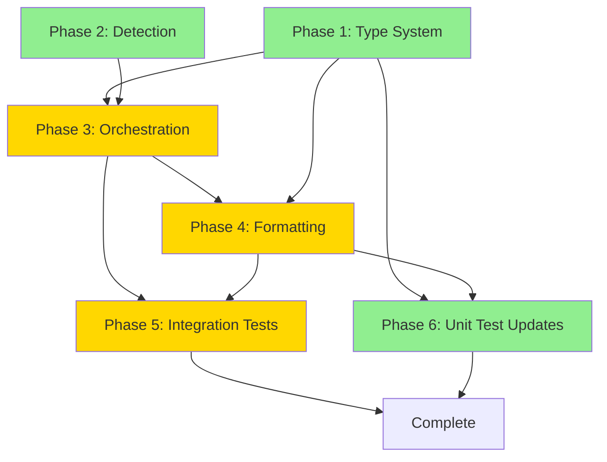

# Planning Process

- [x] Pre-flight Check [10:15:00]
    - [x] Catalogs validated (skills: 164 lines, agents: 32 lines)
    - [x] Directories ready
    - [x] Budget estimated: simple (~25%)
- [x] Codebase Exploration [10:15:30]
    - [x] Located link command entry point: research/cli/src/main.rs
    - [x] Located core implementation: research/lib/src/link/mod.rs
    - [x] Located symlink creation: research/lib/src/link/creation.rs
    - [x] Located detection/validation: research/lib/src/link/detection.rs
    - [x] Located types: research/lib/src/link/types.rs
    - [x] Located formatting: research/lib/src/link/format.rs
- [x] Prep Started [10:16:00]
    - [x] Identified Skills [10:16:15] - rust, rust-testing, thiserror
    - [x] Identified Subagents [10:16:15] - 2-agent parallel recommended
- [x] Prep complete [10:16:30]
- [x] Clarify & Research [10:17:00]
    - [x] Clarification: docs linking confirmed [10:17:30]
    - [x] User answered 1 question: Both skills AND docs for Roo Code
    - [x] Requirements updated: full parity with Claude/OpenCode
- [x] Planning Subagent [agent: **Plan**] started [10:18:00]
    - [x] subagent skills used: rust, rust-testing, thiserror
    - [x] Planning completed [10:19:00]
    - [x] 6 phases defined with dependency graph
- [x] All Pre-review Steps complete [10:19:00]
- [x] Reviews Started [10:19:30]
   - [x] Completeness Review - found issues with method naming clarity
   - [x] Concurrency Review - Phase 1 & 2 parallelizable, rest sequential
   - [x] Correctness Review - found constructor/formatting issues
   - [x] Risk Assessment - 2 high, 5 medium, 2 low risks identified
- [x] Reviews Completed [10:21:00]
- [x] Plan Finalization started [10:22:00]
    - [x] Incorporated review feedback
    - [x] Updated method names (both_* → all_*)
    - [x] Added formatting strategy guidance
    - [x] Added risk mitigation table
- [x] Plan finalized [10:23:00]
- [x] Final Steps
    - [x] Lessons learned collected (none - plan follows existing patterns)
    - [x] No package changes needed
- [x] Summary reported [10:23:30]

## Codebase Analysis

### Current Implementation Structure

The research link command currently supports two targets:
- **Claude Code**: `~/.claude/skills/{name}/` and `~/.claude/docs/{name}.md`
- **OpenCode**: `~/.config/opencode/skill/{name}/` and `~/.config/opencode/docs/{name}.md`

### Key Files to Modify

1. **research/lib/src/link/detection.rs** - Add `get_roo_skills_dir()` and `get_roo_docs_dir()` functions
2. **research/lib/src/link/types.rs** - Add `roo_skill: SkillAction` and `roo_doc: Option<SkillAction>` to `SkillLink` struct
3. **research/lib/src/link/creation.rs** - No changes needed (generic symlink creation functions)
4. **research/lib/src/link/mod.rs** - Add Roo Code linking logic parallel to Claude/OpenCode
5. **research/lib/src/link/format.rs** - Add formatting for Roo Code results
6. **research/lib/tests/link_integration_test.rs** - Add tests for Roo Code linking

### Roo Code Directory Structure

Target structure:
```
~/.roo/
├── skills/{topic-name}/      (symlink → skill/ directory)
│   └── SKILL.md
└── docs/{topic-name}.md      (symlink → deep_dive.md) [if docs are supported]
```

## Plan

### Phase 1: Type System Extension
**Agent:** `general-purpose` | **Skills:** rust, thiserror | **Complexity:** Low
**Deps:** None | **Parallel:** Yes (with Phase 2)

**Goal:** Extend the `SkillLink` struct to include Roo Code action fields.

**Deliver:**
- Add `roo_action: SkillAction` field to `SkillLink` struct
- Add `roo_doc_action: Option<SkillAction>` field to `SkillLink` struct
- Update `SkillLink::new()` and `SkillLink::new_with_docs()` constructors
- **Rename** methods: `both_succeeded()` → `all_succeeded()`, `both_skipped()` → `all_skipped()`
- Update renamed methods + `has_failure()` to check all 3 services
- Update `LinkResult::total_created()` to count Roo Code creations

**File:** `research/lib/src/link/types.rs`

**Pass when:**
- [ ] `cargo test -p research-lib --lib link::types` passes
- [ ] `SkillLink` serializes to JSON with roo_action field

**If failed:**
- Rollback: Revert types.rs to previous state
- Retry: Check for serde attribute errors

---

### Phase 2: Detection Functions
**Agent:** `general-purpose` | **Skills:** rust, thiserror | **Complexity:** Low
**Deps:** None | **Parallel:** Yes (with Phase 1)

**Goal:** Add directory resolution functions for Roo Code locations.

**Deliver:**
- Add `get_roo_skills_dir()` returning `~/.roo/skills/`
- Add `get_roo_docs_dir()` returning `~/.roo/docs/`
- Update `validate_within_allowed_dirs()` to include Roo Code paths

**File:** `research/lib/src/link/detection.rs`

**Pass when:**
- [ ] `cargo test -p research-lib --lib link::detection` passes
- [ ] `get_roo_skills_dir()` returns path containing `.roo/skills`

**If failed:**
- Rollback: Revert detection.rs to previous state

---

### Phase 3: Main Orchestration Logic
**Agent:** `general-purpose` | **Skills:** rust | **Complexity:** Medium
**Deps:** Phase 1, Phase 2 | **Parallel:** No

**Goal:** Integrate Roo Code linking into the main link function.

**Deliver:**
- Get Roo Code directories alongside Claude/OpenCode
- Add Roo Code directories to stale symlink scanning
- Add Roo Code skill and doc linking logic
- Update `SkillLink` construction to include all actions

**File:** `research/lib/src/link/mod.rs`

**Pass when:**
- [ ] `cargo build -p research-lib` compiles without errors
- [ ] Running link command creates symlinks in `~/.roo/skills/` and `~/.roo/docs/`
- [ ] Broken symlinks in Roo directories are cleaned up

**If failed:**
- Rollback: Revert mod.rs changes, keep types.rs and detection.rs

---

### Phase 4: Output Formatting
**Agent:** `general-purpose` | **Skills:** rust | **Complexity:** Medium
**Deps:** Phase 1, Phase 3 | **Parallel:** No

**Goal:** Extend terminal and JSON output formatting for Roo Code results.

**Deliver:**
- Update `format_skill_actions()` to handle 3-service output
- Update `format_doc_actions()` to handle 3-service output
- Add "Roo Code" service name to formatting
- **Strategy for 3-service combinations:**
  - All same state → single message ("skills linked to all", "all already linked")
  - Any failure → show failure message with service context
  - Mixed states → per-service breakdown (e.g., "Claude: created, OpenCode: created, Roo: skipped")

**File:** `research/lib/src/link/format.rs`

**Pass when:**
- [ ] Terminal output shows "skills linked to all" when all three succeed
- [ ] JSON output includes `roo_action` and `roo_doc_action` fields

**If failed:**
- Rollback: Revert format.rs changes

---

### Phase 5: Integration Tests
**Agent:** `feature-tester-rust` | **Skills:** rust-testing | **Complexity:** Medium
**Deps:** Phase 3, Phase 4 | **Parallel:** No

**Goal:** Add comprehensive test coverage for Roo Code linking.

**Deliver:**
- Update helper functions to create Roo directories
- Add tests for Roo Code skill and doc symlink creation
- Add tests for stale symlink cleanup in Roo directories
- Add tests for asymmetric failures

**File:** `research/lib/tests/link_integration_test.rs`

**Pass when:**
- [ ] `cargo test -p research-lib --test link_integration_test` passes
- [ ] All existing tests pass with updated helpers

**If failed:**
- Rollback: Revert test file changes

---

### Phase 6: Unit Test Updates
**Agent:** `feature-tester-rust` | **Skills:** rust-testing | **Complexity:** Low
**Deps:** Phase 1, Phase 4 | **Parallel:** No

**Goal:** Update existing unit tests to include Roo Code.

**Deliver:**
- Update types.rs tests for Roo fields
- Update format.rs tests for three-service output

**Files:** `research/lib/src/link/types.rs`, `research/lib/src/link/format.rs`

**Pass when:**
- [ ] `cargo test -p research-lib --lib link::types::tests` passes
- [ ] `cargo test -p research-lib --lib link::format::tests` passes

**If failed:**
- Rollback: Revert test changes

---

## Dependency Graph



**Parallelization:** Phase 1 and Phase 2 can run in parallel.

## Risks

> Implementation risks identified during planning with mitigation strategies.

| Level | Category | Description | Affected | Mitigation |
|-------|----------|-------------|----------|------------|
| HIGH | scope | Roo Code directory structure assumed but not verified | P1-P3 | User confirmed ~/.roo/skills/{name}/ format in requirements |
| HIGH | technical | validate_within_allowed_dirs() needs Roo paths | P2 | Add Roo paths alongside existing Claude/OpenCode paths |
| MEDIUM | technical | Breaking API change - SkillLink::new() signature changes | P1, P3 | Update all call sites in mod.rs when extending constructors |
| MEDIUM | scope | 3-service formatting complexity (27 combinations) | P4 | Use simplified strategy: all-same shortcuts, per-service breakdown for mixed |
| MEDIUM | technical | Stale symlink scanning must include 6 directories | P3 | Extend loop from 4 to 6 entries explicitly |
| MEDIUM | technical | Constructor parameter order could cause bugs | P1 | Follow existing order: claude, opencode, roo (alphabetical by service) |
| MEDIUM | technical | Roo docs follow optional deep_dive.md pattern | P3 | Same logic as Claude/OpenCode - only link if exists |
| LOW | scope | Method naming clarity (both_* suggests 2 services) | P1 | Rename to all_* for semantic accuracy |
| LOW | rollback | Parallel P1/P2 could cause merge issues | P1-P2 | Each phase modifies distinct files - no overlap

## Lessons Learned

> Discoveries about skills or memory resources that were inaccurate, incomplete, or missing.

## Package Changes

> Dependencies to be added, updated, or removed during implementation.
