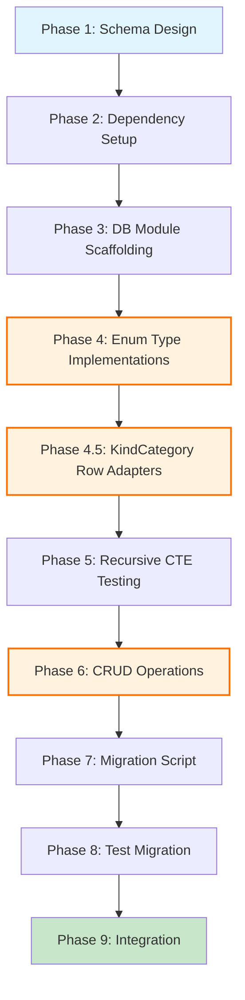

# Planning Process

- [x] Pre-flight Check [12:43pm]
    - [x] Catalogs validated
    - [x] Directories ready
    - [x] Budget estimated: medium (~40%)
- [x] Prep Started [12:44pm]
    - [x] Identified Skills [12:45pm]: sqlx, database, rust, serde
    - [x] Identified Subagents [12:45pm]: Plan, feature-tester-rust, Explore
- [x] Prep complete [12:45pm]
- [x] Clarify & Research [12:46pm]
    - [x] Clarification agent returned [12:46pm]
    - [x] User answered 4 questions [12:47pm]: TEXT enums, parent_id FK, replace JSON, separate library_details
    - [x] Requirements updated [12:47pm]
    - [x] Package research (sqlx) - skills available
- [x] Planning Subagent [agent: **Plan**] started [12:48pm]
    - [x] subagent skills used: sqlx, database, rust, serde, thiserror, tokio
    - [x] Planning completed [12:50pm]
- [x] Module Assessment (monorepo) [12:48pm]
    - [x] subagent skills used: rust
    - [x] Impacted: research/lib (primary), research/cli (caller), examples/migrate_inventory.rs
    - [x] Non-impacted: biscuit, ai-pipeline, queue, sniff, darkmatter, so-you-say, tree-hugger, schematic
- [x] All Pre-review Steps complete [12:50pm]
- [x] Reviews Started [12:51pm]
   - [x] Completeness Review - 8 gaps identified (2 high, 4 medium, 2 low)
   - [x] Concurrency Review - 7 recommendations (Phase 3 split opportunity, test isolation)
   - [x] Correctness Review - 12 issues (4 high, 5 medium, 3 low)
   - [x] Risk Assessment - 9 risks (3 high, 4 medium, 2 low)
- [x] Reviews Completed [12:53pm]
- [x] Plan Finalization started [12:54pm]
    - [x] subagent skills used: sqlx, database, rust, serde, thiserror
    - [x] Dependency graph generated
- [x] Plan finalized [12:55pm]
- [x] Final Steps
    - [x] Lessons learned collected: 0 issues found
    - [x] Package research status: sqlx skill available
- [x] Summary reported [12:56pm]
    - Plan: `.ai/plans/2026-01-29.plan-for-sqlite-inventory-migration.md`
    - Phases: 10 (with review-driven additions)
    - Duration: 13 minutes
    - Context: ~38% used (budget: 40%)

## Current Understanding

### Data Model (from research-inventory.json)

The inventory contains:
- **77 topics** with nested structure
- **schema_version**: 2
- Each topic has:
  - `name`: String (PRIMARY KEY - unique, used as HashMap key)
  - `kind`: KindCategory enum (Library, Software, Person, SolutionArea, ProgrammingLanguage)
  - `created`: DateTime<Utc>
  - `last_updated`: DateTime<Utc>
  - `brief`: String
  - `summary`: String
  - `when_to_use`: String
  - `documents`: Vec<Document> (nested 1:N relationship)
  - `children`: Vec<Topic> (recursive, self-referential)

### Document structure:
- `filename`: String
- `content_type`: ContentType enum (Static, Template, Prompt, KindDerived, Skill, DeepDive)
- `prompt`: Option<String>
- `flow`: Option<Flow> enum (Research, Synthesis, Manual)
- `last_updated`: DateTime<Utc>
- `created`: DateTime<Utc>
- `model`: Option<String>
- `model_capability`: Option<ModelCapability>
- `content_hash`: u64
- `interpolated_hash`: u64

### KindCategory variants:
- Library(Library) - has package_manager, package_name, features, language, url, repo, docs, licenses
- Software(Software) - has name, company
- Person
- SolutionArea
- ProgrammingLanguage

### Files to modify:
- `research/lib/Cargo.toml` - add sqlx dependency
- `research/lib/src/metadata/inventory.rs` - add database abstractions
- `research/lib/src/metadata/topic.rs` - add FromRow derives and DB methods
- `research/lib/src/metadata/db.rs` - NEW: database module
- New: `research/lib/migrations/*.sql` - schema files

### Existing tests:
- `research/lib/src/metadata/inventory.rs` - 11 tests using tempfile
- `research/lib/src/metadata/migration_v2.rs` - 10 tests

---

## Finalized Plan

> Incorporates feedback from 4 parallel reviews: completeness, concurrency, correctness, risk assessment.

### Phase 1: Schema Design
**Agent:** `Plan` | **Skills:** sqlx, database, rust | **Complexity:** Medium
**Deps:** None | **Parallel:** No

**Goal:** Create normalized SQLite schema with TEXT enum storage, adjacency list for recursion, and explicit indexes.

**Deliver:**
- `research/lib/migrations/20260129000001_create_inventory_schema.sql` with:
  - `topics` table (name TEXT PK, kind TEXT CHECK, parent_topic_name nullable FK)
  - `documents` table (composite PK: topic_name + filename, FK to topics)
  - `library_details` table (1:0-1 with topics where kind='Library')
  - `software_details` table (1:0-1 with topics where kind='Software')
  - **ADDED**: Explicit `CREATE INDEX idx_topics_parent ON topics(parent_topic_name)`
  - **ADDED**: Explicit `CREATE INDEX idx_documents_topic ON documents(topic_name)`
  - **ADDED**: content_hash/interpolated_hash as INTEGER (i64 storage for u64 values)

**Pass when:**
- [ ] All enum values have CHECK constraints matching Rust enum variants
- [ ] Foreign keys have ON DELETE CASCADE
- [ ] Timestamps use ISO8601 TEXT format (chrono compatible)
- [ ] `parent_topic_name` FK allows NULL for root topics
- [ ] **NEW**: Explicit indexes created for FK columns

**If failed:**
- Rollback: Delete migration file
- Retry: Review sqlx schema patterns

---

### Phase 2: Dependency Setup
**Agent:** `Plan` | **Skills:** rust, sqlx | **Complexity:** Low
**Deps:** Phase 1 | **Parallel:** No

**Goal:** Add sqlx to `research/lib/Cargo.toml` with necessary feature flags.

**Deliver:**
- Updated `research/lib/Cargo.toml`:
  ```toml
  sqlx = { version = "0.8", features = ["runtime-tokio", "sqlite", "chrono", "migrate", "macros"] }
  ```
  **CHANGED**: Added `macros` feature for FromRow/Type derives

**Pass when:**
- [ ] `cargo check -p research-lib` succeeds
- [ ] Feature flags include: runtime-tokio, sqlite, chrono, migrate, **macros**

**If failed:**
- Rollback: `git restore research/lib/Cargo.toml`
- Retry: Check tokio version compatibility

---

### Phase 3: Database Module Scaffolding
**Agent:** `Plan` | **Skills:** sqlx, rust, thiserror | **Complexity:** Medium
**Deps:** Phase 2 | **Parallel:** No

**Goal:** Create `db.rs` module with connection pooling, migration runner, and error types.

**Deliver:**
- `research/lib/src/metadata/db.rs` with:
  - `DbPool` type alias for `SqlitePool`
  - `async fn init_pool(path: &Path) -> Result<DbPool>` with:
    - **ADDED**: `busy_timeout=5000ms` PRAGMA
    - **ADDED**: `foreign_keys=ON` PRAGMA
    - **ADDED**: `journal_mode=WAL` PRAGMA
  - `async fn run_migrations(pool: &DbPool) -> Result<()>` using `sqlx::migrate!()`
  - `DbError` enum wrapping `sqlx::Error` with variants:
    - `ConnectionFailed`
    - `MigrationFailed`
    - `QueryFailed`
    - **ADDED**: `BusyTimeout` for SQLITE_BUSY handling
- Updated `mod.rs` to export `db` module

**Pass when:**
- [ ] `init_pool()` works with `:memory:` database
- [ ] `run_migrations()` applies schema successfully
- [ ] `cargo build -p research-lib` succeeds
- [ ] **NEW**: busy_timeout configured for concurrent access

**If failed:**
- Rollback: Delete db.rs, restore mod.rs
- Retry: Review sqlx pooling patterns

---

### Phase 4: Enum Type Implementations
**Agent:** `Plan` | **Skills:** sqlx, serde, rust | **Complexity:** High
**Deps:** Phase 3 | **Parallel:** No

**Goal:** Implement sqlx::Type for all enums with TEXT storage, handle u64→i64 hash conversion.

**Deliver:**
- Custom `sqlx::Type` implementations for:
  - `KindCategory` discriminator (TEXT: 'Library', 'Software', 'Person', etc.)
  - `ContentType` (TEXT matching CHECK constraint)
  - `Flow` (TEXT: 'Research', 'Synthesis', 'Manual')
  - `License` (TEXT with JSON array for `Vec<License>`, handles `Other(String)`)
  - `LanguagePackageManager` (TEXT using Display format: 'Cargo', 'Npm', etc.)
- **ADDED**: Helper functions for hash conversion:
  ```rust
  fn u64_to_i64(hash: u64) -> i64 { hash as i64 }  // reinterpret bits
  fn i64_to_u64(val: i64) -> u64 { val as u64 }
  ```
- **ADDED**: `ModelCapabilityWrapper(String)` for external enum TEXT storage

**Pass when:**
- [ ] `cargo build -p research-lib` succeeds
- [ ] All enum TEXT representations match SQL CHECK constraints
- [ ] **NEW**: Unit tests verify round-trip for every enum variant
- [ ] **NEW**: Hash conversion handles full u64 range (including values > i64::MAX)

**If failed:**
- Rollback: `git restore topic.rs`
- Retry: Separate row types from domain types if needed

---

### Phase 4.5: Row Adapters for KindCategory (NEW)
**Agent:** `Plan` | **Skills:** sqlx, serde, rust | **Complexity:** High
**Deps:** Phase 4 | **Parallel:** No

**Goal:** Implement row adapter pattern for KindCategory enum with struct variants using discriminator + LEFT JOIN.

**Deliver:**
- Separate row types in `db.rs`:
  ```rust
  #[derive(sqlx::FromRow)]
  struct TopicRow {
      name: String,
      kind: String,  // discriminator: 'Library', 'Software', etc.
      parent_topic_name: Option<String>,
      // ... timestamps, text fields
  }

  impl TopicRow {
      fn into_topic(self, library: Option<LibraryRow>, software: Option<SoftwareRow>) -> Topic
  }
  ```
- Query pattern using LEFT JOIN:
  ```sql
  SELECT t.*, l.*, s.*
  FROM topics t
  LEFT JOIN library_details l ON t.name = l.topic_name AND t.kind = 'Library'
  LEFT JOIN software_details s ON t.name = s.topic_name AND t.kind = 'Software'
  WHERE t.name = ?
  ```

**Pass when:**
- [ ] TopicRow FromRow compiles without errors
- [ ] `into_topic()` correctly reconstructs all KindCategory variants
- [ ] Unit tests cover Library, Software, Person, SolutionArea, ProgrammingLanguage
- [ ] JSON serialization for nested struct data (if any) round-trips correctly

**If failed:**
- Rollback: Remove row adapter, use simplified enum storage
- Retry: Test JSON serde with sample data

---

### Phase 5: Recursive CTE Testing (NEW)
**Agent:** `Plan` | **Skills:** sqlx, database, rust | **Complexity:** Medium
**Deps:** Phase 4.5 | **Parallel:** No

**Goal:** Write and test recursive CTEs in isolation before integrating into CRUD operations.

**Deliver:**
- `research/lib/src/metadata/db/queries.rs` with:
  ```rust
  pub async fn get_topic_with_children(pool: &DbPool, name: &str) -> Result<Topic>
  pub async fn get_all_descendant_names(pool: &DbPool, parent: &str) -> Result<Vec<String>>
  ```
- Recursive CTE query:
  ```sql
  WITH RECURSIVE topic_tree AS (
      SELECT name, parent_topic_name, 0 as depth FROM topics WHERE name = ?
      UNION ALL
      SELECT t.name, t.parent_topic_name, tt.depth + 1
      FROM topics t
      JOIN topic_tree tt ON t.parent_topic_name = tt.name
      WHERE tt.depth < 10  -- recursion limit
  ) SELECT * FROM topic_tree;
  ```
- Integration tests with 3-level hierarchy

**Pass when:**
- [ ] Recursive CTE correctly traverses topic hierarchy
- [ ] Recursion depth limit prevents infinite loops
- [ ] EXPLAIN shows idx_topics_parent index is used
- [ ] Edge cases tested: circular refs (prevented by FK), missing parent, empty children

**If failed:**
- Rollback: Remove queries.rs
- Retry: Use SQLite CLI to debug query with EXPLAIN

---

### Phase 6: CRUD Operations Implementation
**Agent:** `Plan` | **Skills:** sqlx, rust, tokio | **Complexity:** High
**Deps:** Phase 5 | **Parallel:** No

**Goal:** Implement async database operations as pure DB facade (no in-memory HashMap).

**Deliver:**
- New `ResearchInventoryDb` struct (replaces HashMap-based approach):
  ```rust
  pub struct ResearchInventoryDb {
      pool: SqlitePool,
  }

  impl ResearchInventoryDb {
      pub async fn connect(db_path: &str) -> Result<Self>
      pub async fn get(&self, name: &str) -> Result<Option<Topic>>
      pub async fn insert(&self, topic: &Topic) -> Result<()>
      pub async fn update(&self, topic: &Topic) -> Result<()>
      pub async fn remove(&self, name: &str) -> Result<Option<Topic>>
      pub async fn list_all(&self) -> Result<Vec<Topic>>
      pub async fn count(&self) -> Result<usize>
  }
  ```
- **CLARIFIED**: Pure DB facade pattern (no HashMap cache)
- Transaction wrappers for multi-table inserts (topic + library_details + documents)
- Uses recursive CTE queries from Phase 5

**Pass when:**
- [ ] All async methods compile with sqlx query macros
- [ ] Transactions ensure atomicity for inserts
- [ ] Recursive children loaded via Phase 5 CTEs
- [ ] Delete cascades to library_details, software_details, documents

**If failed:**
- Rollback: `git restore inventory.rs`
- Retry: Break into smaller queries

---

### Phase 7: Data Migration Script
**Agent:** `Plan` | **Skills:** sqlx, rust, serde | **Complexity:** Medium
**Deps:** Phase 6 | **Parallel:** No

**Goal:** Create one-time migration script from JSON to SQLite with validation and rollback support.

**Deliver:**
- `research/lib/src/bin/migrate_json_to_sqlite.rs` with:
  - Load existing `research-inventory.json`
  - Initialize SQLite database at `research-inventory.db`
  - Flatten `Topic.children` to adjacency list (set `parent_topic_name`)
  - Insert all topics/documents using Phase 6 CRUD
  - Validate row counts match JSON entries
  - CLI flags:
    - `--dry-run` - Validate without writing
    - `--verify` - Compare JSON vs DB after migration
    - **ADDED**: `--export <path>` - Export DB back to JSON (rollback support)
  - Backup JSON as `.bak` only after successful migration

**Pass when:**
- [ ] Migration preserves all 77 topics
- [ ] Document counts match (~13 per topic)
- [ ] Parent-child relationships correctly flattened to adjacency list
- [ ] Dry-run prevents writes
- [ ] **NEW**: `--export` produces valid JSON for rollback

**If failed:**
- Rollback: Restore `.bak`, delete `.db`, use `--export` if needed
- Retry: Add verbose logging

---

### Phase 8: Test Migration
**Agent:** `feature-tester-rust` | **Skills:** sqlx, rust, tokio | **Complexity:** High
**Deps:** Phase 7 | **Parallel:** No

**Goal:** Migrate all 11 existing tests from JSON to SQLite using per-test `:memory:` databases.

**Deliver:**
- Updated tests in `inventory.rs`:
  - Replace `TempDir` JSON with `:memory:` SQLite pools
  - Add `#[tokio::test]` attributes
  - Convert sync → async
  - **ADDED**: Test helper `async fn test_db() -> ResearchInventoryDb`
- New tests:
  - `test_concurrent_inserts` - Multiple tokio tasks inserting
  - `test_recursive_children_load` - Verify 3-level nesting
  - `test_enum_storage` - All enum variants round-trip
  - **ADDED**: `test_hash_overflow` - u64 values > i64::MAX
- **CLARIFIED**: No `serial_test` needed - per-test `:memory:` provides isolation

**Pass when:**
- [ ] All 11 original tests pass
- [ ] 4 new tests added and passing
- [ ] No test creates files on disk
- [ ] Tests run in parallel with `--test-threads=4`
- [ ] Test duration <5 seconds

**If failed:**
- Rollback: Restore test section
- Retry: Debug with `RUST_LOG=sqlx=trace`

---

### Phase 9: Integration and Validation
**Agent:** `Plan` | **Skills:** rust, tokio, sqlx | **Complexity:** Medium
**Deps:** Phase 8 | **Parallel:** No

**Goal:** Update CLI entry points and validate end-to-end workflow.

**Deliver:**
- Updated `research/cli/src/main.rs`:
  - Initialize `ResearchInventoryDb::connect()` instead of JSON load
  - Pass db reference to research operations
  - Add `--db-path <PATH>` flag (default: `~/.research/research-inventory.db`)
- Updated `research/lib/src/lib.rs`:
  - Re-export `ResearchInventoryDb`, `DbPool`, `init_pool`
  - Update module docs with async examples
- Integration test in `research/lib/tests/inventory_e2e.rs`:
  - Full workflow: connect → insert → query → update → delete → verify

**Pass when:**
- [ ] `cargo build -p research-cli` succeeds
- [ ] `cargo test -p research-lib --test '*'` passes
- [ ] `research pull clap` works end-to-end with DB backend
- [ ] No `unwrap()` in production code

**If failed:**
- Rollback: Restore all modified files
- Retry: Add tracing instrumentation

---

## Dependency Graph



**Critical Path:** P1 → P2 → P3 → P4 → P4.5 → P5 → P6 → P7 → P8 → P9 (10 phases)

**Bottlenecks:**
- Phase 4/4.5 (Enum Types + Row Adapters) - HIGH complexity, blocks CRUD
- Phase 6 (CRUD Operations) - HIGH complexity, integrates all prior work

---

## Risks

> Implementation risks identified during planning with mitigation strategies.

| Level | Category | Description | Affected | Mitigation |
|-------|----------|-------------|----------|------------|
| HIGH | technical | KindCategory enum has struct variants incompatible with simple sqlx::Type | Phase 4, 4.5, 6 | Use row adapter pattern with discriminator column + LEFT JOIN |
| HIGH | technical | Recursive CTE complexity - no concrete examples in original plan | Phase 5, 6 | Added Phase 5 for isolated CTE testing before CRUD integration |
| HIGH | rollback | Immediate JSON replacement without rollback strategy | Phase 7 | Added `--export` flag to migration script for DB→JSON export |
| MEDIUM | technical | u64 hash fields vs SQLite i64 INTEGER overflow risk | Phase 1, 4 | Use bit reinterpretation (as i64/as u64), document behavior |
| MEDIUM | dependency | Missing 'macros' feature for sqlx derives | Phase 2 | Added 'macros' to feature list |
| MEDIUM | scope | Test migration scope larger than estimated (21 tests total) | Phase 8 | Added test helper functions, per-test :memory: isolation |
| MEDIUM | technical | Transaction isolation not specified | Phase 3, 6 | Added busy_timeout=5000ms, DbError::BusyTimeout variant |
| LOW | technical | DateTime format assumptions | Phase 1, 4 | Chrono RFC3339 matches SQLite TEXT, added round-trip test |
| LOW | performance | Missing FK indexes in SQLite | Phase 1 | Added explicit CREATE INDEX statements |

---

## Lessons Learned

> Discoveries about skills or memory resources that were inaccurate, incomplete, or missing.

*None identified during planning.*

---

## Package Changes

> Dependencies to be added, updated, or removed during implementation.

- **[ADD]**: `sqlx = { version = "0.8", features = ["runtime-tokio", "sqlite", "chrono", "migrate", "macros"] }`
  - Research status: **complete** (sqlx skill available)
  - Async SQLite with compile-time checked queries
  - Required features: runtime-tokio (tokio integration), sqlite (database driver), chrono (DateTime support), migrate (embedded migrations), macros (derive macros)

- **[REMOVE]**: Potentially `serial_test` dependency from tests
  - Per-test `:memory:` databases provide isolation without serialization
