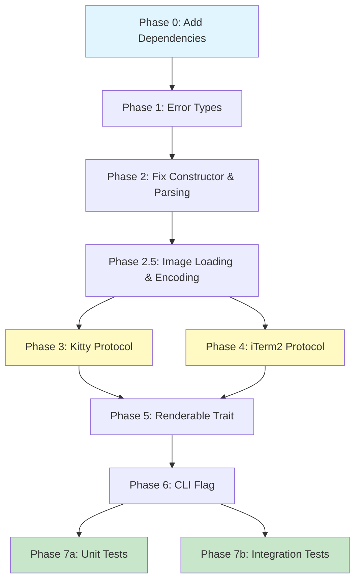

# Planning Process

- [x] Pre-flight Check [10:42]
    - [x] Plans directory ready
    - [x] Budget estimated: medium (~40%)
    - [x] Referenced files verified (terminal_image.rs exists)
- [x] Prep Started [10:43]
    - [x] Identified Skills [10:43]: clap, rust, thiserror + viuer, rust-image
    - [x] Identified Subagents [10:43]
- [x] Prep complete [10:44]
- [x] Clarify & Research [10:44]
    - [x] Clarification agent returned [10:44]
    - [x] User answered 3 questions [10:45]
    - [x] Requirements updated [10:45]
- [x] Planning Subagent [agent: **Plan**] started [10:46]
    - [x] subagent skills used: clap, rust, thiserror
    - [x] Planning completed [10:47]
- [x] All Pre-review Steps complete [10:47]
- [x] Reviews Started [10:48]
   - [x] Completeness Review
   - [x] Concurrency Review
   - [x] Correctness Review
   - [x] Risk Assessment
- [x] Reviews Completed [10:50]
- [x] Plan Finalization started [10:50]
    - [x] subagent skills used: rust, clap, thiserror
    - [x] Dependency graph generated
- [x] Plan finalized [10:52]
- [x] Final Steps
    - [x] Lessons learned collected
    - [x] Package research status checked
- [x] Summary reported [10:52]
    - Plan: 2026-01-29.plan-for-terminal-image-component.md
    - Phases: 9 (with 2 parallel pairs)
    - Duration: 10 minutes
    - Context: ~35% used (budget: 40%)

---

## Plan

### Phase 0: Add Dependencies
**Agent:** `general-purpose` | **Skills:** rust | **Complexity:** Low
**Deps:** None | **Parallel:** No

**Goal:** Add the `image` crate dependency for loading and manipulating images.

**Deliver:**
- Add `image = "0.25"` to `biscuit-terminal/lib/Cargo.toml` [dependencies] section
- Note: `base64` already exists in Cargo.toml (v0.22) - no need to add

**Pass when:**
- [ ] `image` crate appears in Cargo.toml
- [ ] `cargo check -p biscuit-terminal` succeeds

**If failed:**
- Rollback: Remove the line from Cargo.toml
- Retry: Check for version conflicts with `cargo tree -p biscuit-terminal`

---

### Phase 1: Create Error Types
**Agent:** `general-purpose` | **Skills:** rust, thiserror | **Complexity:** Low
**Deps:** Phase 0 | **Parallel:** No

**Goal:** Create comprehensive error types for terminal image operations.

**Deliver:**
- Create `TerminalImageError` enum in `terminal_image.rs` using `thiserror`
- Error variants:
  - `FileNotFound { path: String }` - File doesn't exist
  - `InvalidPath { path: String, reason: String }` - Path parsing failed
  - `InvalidWidthSpec { spec: String }` - Width specification parsing failed
  - `ImageLoadError { source: image::ImageError }` - Image crate errors (with #[from])
  - `EncodingError { message: String }` - Base64/PNG encoding failures
  - `UnsupportedTerminal` - Terminal doesn't support images

**Pass when:**
- [ ] All 6 error variants compile
- [ ] `#[derive(Debug, thiserror::Error)]` applied to enum
- [ ] Each variant has descriptive error message
- [ ] `cargo clippy -p biscuit-terminal` passes

**If failed:**
- Rollback: Remove error enum
- Retry: Check thiserror documentation for correct attribute syntax

---

### Phase 2: Fix Constructor and Add Width Parsing
**Agent:** `general-purpose` | **Skills:** rust | **Complexity:** Medium
**Deps:** Phase 1 | **Parallel:** No

**Goal:** Fix broken constructor and implement width specification parsing.

**Deliver:**
- Fix `TerminalImage::new()` constructor:
  - Change `filepath: Path` to `filepath: &Path`
  - Replace `absolute(filepath)` with `std::fs::canonicalize(filepath)?`
  - Remove non-existent `relative()` call - use `filepath.to_string_lossy().to_string()`
  - Change `..default()` to `..Default::default()`
  - Add `alignment: Alignment::Left` to struct initialization
  - Return `Result<Self, TerminalImageError>`
- Add `parse_width_spec(spec: &str) -> Result<ImageWidth, TerminalImageError>` standalone function:
  - Parse empty/whitespace -> `ImageWidth::Percent(0.5)` (default)
  - Parse "fill" -> `ImageWidth::Fill`
  - Parse number with "%" -> `ImageWidth::Percent(f32)`
  - Parse bare number -> `ImageWidth::Characters(u32)`
  - Return `InvalidWidthSpec` error for invalid input
- Add `parse_filepath_and_width(input: &str) -> Result<(String, Option<String>), TerminalImageError>` standalone function:
  - Split on `|` delimiter
  - Trim whitespace from both parts
  - Return filepath and optional width spec

**Pass when:**
- [ ] `TerminalImage::new(&Path::new("test.png"))` compiles
- [ ] Constructor returns `Result<Self, TerminalImageError>`
- [ ] `parse_width_spec("50%")` returns `Ok(ImageWidth::Percent(0.5))`
- [ ] `parse_width_spec("fill")` returns `Ok(ImageWidth::Fill)`
- [ ] `parse_width_spec("80")` returns `Ok(ImageWidth::Characters(80))`
- [ ] `parse_filepath_and_width("test.png|50%")` returns correct tuple
- [ ] `cargo check -p biscuit-terminal` succeeds

**If failed:**
- Rollback: Revert to original constructor signature
- Retry: Add unit tests for each parsing case before implementation

---

### Phase 2.5: Image Loading and Encoding
**Agent:** `general-purpose` | **Skills:** rust | **Complexity:** Medium
**Deps:** Phase 2 | **Parallel:** No

**Goal:** Load images from disk and encode them for terminal protocols.

**Deliver:**
- Add `load_image(&self) -> Result<DynamicImage, TerminalImageError>` method
- Add `encode_as_png(&self, img: &DynamicImage) -> Result<Vec<u8>, TerminalImageError>` method
- Add `encode_as_base64(&self, png_bytes: &[u8]) -> String` method
- Add `generate_alt_text(&self) -> String` method

**Pass when:**
- [ ] `load_image()` successfully loads PNG/JPG/GIF files
- [ ] `encode_as_png()` produces valid PNG bytes
- [ ] `encode_as_base64()` produces valid base64 string
- [ ] `generate_alt_text()` returns formatted string like `[Image: filename]`
- [ ] Error handling converts `image::ImageError` correctly

**If failed:**
- Rollback: Remove new methods
- Retry: Test with minimal example image first (1x1 pixel PNG)

---

### Phase 3: Implement Kitty Graphics Protocol
**Agent:** `general-purpose` | **Skills:** rust | **Complexity:** High
**Deps:** Phase 2.5 | **Parallel:** Yes (with Phase 4)

**Goal:** Implement image rendering using Kitty Graphics Protocol.

**Deliver:**
- Add `render_kitty(&self, png_data: &[u8], width: u32, height: u32) -> Result<String, TerminalImageError>` method:
  - Encode PNG data to base64
  - Calculate transmission chunks (max 4096 bytes per chunk)
  - Build escape sequence: `\x1b_Gf=100,a=T,t=d,m={0|1};{base64_chunk}\x1b\\`
- Add `calculate_display_dimensions(img_width: u32, img_height: u32, target_width: &ImageWidth, term_width: u32) -> (u32, u32)` helper

**Pass when:**
- [ ] Escape sequence follows Kitty Graphics Protocol spec
- [ ] Chunking handles data > 4096 bytes correctly
- [ ] Aspect ratio preserved in dimension calculations
- [ ] `cargo check -p biscuit-terminal` succeeds

**If failed:**
- Rollback: Remove method implementation
- Retry: Test with minimal 1x1 PNG first, then increase complexity

---

### Phase 4: Implement iTerm2 Protocol Fallback
**Agent:** `general-purpose` | **Skills:** rust | **Complexity:** Medium
**Deps:** Phase 2.5 | **Parallel:** Yes (with Phase 3)

**Goal:** Implement iTerm2 inline images as fallback protocol.

**Deliver:**
- Add `render_iterm2(&self, png_data: &[u8], width: u32, filename: &str) -> Result<String, TerminalImageError>` method:
  - Build escape sequence: `\x1b]1337;File=name={base64_filename};inline=1;width={width}px:{base64_data}\x07`
  - Encode filename as base64
  - Set width parameter

**Pass when:**
- [ ] Escape sequence follows iTerm2 inline image spec
- [ ] Filename base64 encoded correctly
- [ ] Width parameter calculated from character width
- [ ] `cargo check -p biscuit-terminal` succeeds

**If failed:**
- Rollback: Remove method implementation
- Retry: Test with minimal 1x1 PNG and verify escape sequence format

---

### Phase 5: Implement Renderable Trait
**Agent:** `general-purpose` | **Skills:** rust | **Complexity:** Medium
**Deps:** Phase 3, Phase 4 | **Parallel:** No

**Goal:** Implement the `Renderable` trait for `TerminalImage` with protocol detection.

**Deliver:**
- **CRITICAL**: Renderable trait uses **associated functions** (no `&self`), not instance methods
- Implement `render() -> String` - optimistic, assume Kitty support
- Implement `fallback_render(term: &Terminal) -> String` - check `term.image_support` field:
  - `ImageSupport::Kitty` -> call `render_kitty()`
  - `ImageSupport::ITerm` -> call `render_iterm2()`
  - `ImageSupport::None` -> return alt text

**Pass when:**
- [ ] `render()` compiles as associated function (no `&self`)
- [ ] `fallback_render(term: &Terminal)` compiles as associated function
- [ ] Protocol detection based on Terminal parameter
- [ ] Text fallback used when no image support
- [ ] `cargo check -p biscuit-terminal` succeeds

**If failed:**
- Rollback: Remove Renderable implementation
- Retry: Add unit test for trait signature before implementation

---

### Phase 6: Add CLI --image Flag
**Agent:** `general-purpose` | **Skills:** clap, rust | **Complexity:** Low
**Deps:** Phase 5 | **Parallel:** No

**Goal:** Add `--image <filepath>` argument to the `bt` CLI.

**Deliver:**
- Add `--image <filepath>` argument to CLI args struct:
  ```rust
  /// Display an image in the terminal
  #[arg(long, value_name = "FILEPATH")]
  image: Option<String>,
  ```
- Parse filepath using `parse_filepath_and_width()` from Phase 2
- Create `TerminalImage` instance and call `fallback_render()`
- Print resulting string to stdout

**Pass when:**
- [ ] `bt --image test.png` displays image in Kitty terminal
- [ ] `bt --image "test.png|80"` respects width specification
- [ ] `bt --image test.png` shows text fallback in unsupported terminal
- [ ] Error messages are user-friendly
- [ ] `bt --help` shows the `--image` option

**If failed:**
- Rollback: Remove CLI argument
- Retry: Test with hardcoded filepath first before adding argument parsing

---

### Phase 7a: Add Unit Tests
**Agent:** `feature-tester-rust` | **Skills:** rust | **Complexity:** Medium
**Deps:** Phase 6 | **Parallel:** Yes (with Phase 7b)

**Goal:** Add comprehensive unit test coverage.

**Deliver:**
- Test `parse_width_spec()` - all valid and invalid cases
- Test `parse_filepath_and_width()` - delimiter handling
- Test `generate_alt_text()` - filename formatting
- Test error type conversions

**Pass when:**
- [ ] All parsing functions have full branch coverage
- [ ] Error conversions tested
- [ ] `cargo test -p biscuit-terminal --lib terminal_image` passes

---

### Phase 7b: Add Integration Tests
**Agent:** `feature-tester-rust` | **Skills:** rust | **Complexity:** Medium
**Deps:** Phase 6 | **Parallel:** Yes (with Phase 7a)

**Goal:** Add integration tests for end-to-end image rendering.

**Deliver:**
- Create test fixture images (1x1 PNG, small JPG)
- Test Kitty and iTerm2 protocol escape sequences
- Test CLI integration with `assert_cmd`

**Pass when:**
- [ ] End-to-end rendering tested for both protocols
- [ ] CLI integration tests pass
- [ ] `cargo test -p biscuit-terminal` passes all tests

---

## Dependency Graph



**Critical Path:** P0 -> P1 -> P2 -> P2.5 -> P3 -> P5 -> P6 -> P7a (8 sequential phases)

---

## Risks

| Level | Category | Description | Affected | Mitigation |
|-------|----------|-------------|----------|------------|
| HIGH | technical | Renderable trait uses associated functions (no `&self`), incompatible with instance data access | Phase 5 | Verify trait definition before implementation; may need to refactor trait or use wrapper pattern |
| HIGH | technical | Terminal detection must be coordinated between Kitty and iTerm2 implementations | Phase 3, 4, 5 | Use existing `ImageSupport` enum from `Terminal.image_support` field |
| MEDIUM | technical | Constructor has multiple compilation errors (Path type, relative(), default()) | Phase 2 | Use `cargo check` frequently during implementation |
| MEDIUM | technical | Width parsing validation not fully specified | Phase 2 | Add comprehensive error handling for edge cases |
| MEDIUM | dependency | Image crate feature flags not specified (binary size impact) | Phase 0 | Start with default features, optimize later if needed |
| MEDIUM | technical | Base64 chunking for Kitty protocol requires 4096-byte boundaries | Phase 3 | Reference Kitty protocol docs, test with large images |

---

## Lessons Learned

- [SKILL: rust/Renderable]: Trait design uses static associated functions, not instance methods - impacts component implementation patterns
- [CODEBASE: biscuit-terminal]: Multiple Renderable implementers (Prose, TextBlock, BlockQuote) all have `todo!()` - suggests trait design still in progress

---

## Package Changes

- [ADD]: `image = "0.25"` in biscuit-terminal/lib - Image loading, format detection, and PNG encoding
- [NOTE]: `base64 = "0.22"` already exists - No need to add for base64 encoding
