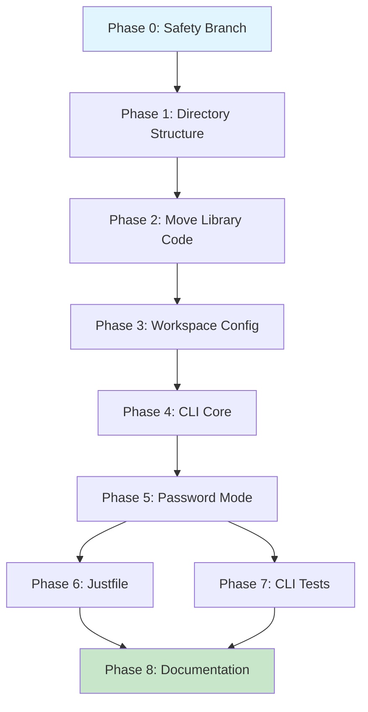

# Planning Process

- [x] Pre-flight Check [10:42am]
    - [x] Catalogs validated
    - [x] Directories ready
    - [x] Budget estimated: medium (~40%)
    - [x] Existing package verified (biscuit-hash with xx.rs, blake.rs, argon.rs)
- [x] Prep Started [10:43am]
    - [x] Identified Skills: clap, rust (required); color-eyre, thiserror, isterminal (suggested)
    - [x] Identified Subagents: general-purpose (restructure, impl), Plan (design), feature-tester-rust (tests)
- [x] Prep complete [10:44am]
- [x] Clarify & Research [10:45am]
    - [x] Clarification agent returned
    - [x] User answered 3 questions
    - [x] Requirements updated (mutually exclusive modes, binary name, stdin support)
    - [x] Package research: clap/clap_complete patterns already in codebase (sniff)
- [x] Planning Subagent [agent: **Plan**] started [10:47am]
    - [x] subagent skills used: clap, rust, color-eyre
    - [x] Planning completed (8 phases)
- [x] Module Assessment (monorepo) - included in Plan
    - [x] Modules: biscuit-hash → biscuit-hash/lib, biscuit-hash/cli
- [x] All Pre-review Steps complete [10:48am]
- [x] Reviews Started [10:49am]
   - [x] Completeness Review (9 findings: 3 high, 3 medium, 3 low)
   - [x] Concurrency Review (parallelism appropriate, Phases 6+7 safe)
   - [x] Correctness Review (5 findings: 3 high, 2 medium)
   - [x] Risk Assessment (6 risks: 1 high, 2 medium, 3 low)
- [x] Reviews Completed [10:50am]
- [x] Plan Finalization started [10:52am]
    - [x] subagent skills used: clap, rust
    - [x] Dependency graph generated
- [x] Plan finalized [10:53am]
- [x] Final Steps
    - [x] Lessons learned: none (skills accurate)
    - [x] Package research: clap_complete pattern from sniff/cli
- [x] Summary reported [10:53am]
    - Plan: `.ai/plans/2026-01-30.plan-for-biscuit-hash-cli.md`
    - Phases: 9 (0-8), 7 sequential, 2 parallel
    - Duration: ~11 minutes

## Plan

### Phase 0: Create Safety Branch
**Agent:** `general-purpose` | **Skills:** git | **Complexity:** Low
**Deps:** None | **Parallel:** No

**Goal:** Create git branch for safe rollback of directory restructure

**Deliver:**
- Git branch `feat/biscuit-hash-cli` created from current HEAD

**Pass when:**
- [ ] `git branch --show-current` outputs `feat/biscuit-hash-cli`

**If failed:**
- Rollback: `git checkout main && git branch -D feat/biscuit-hash-cli`

---

### Phase 1: Create Directory Structure
**Agent:** `general-purpose` | **Skills:** rust | **Complexity:** Low
**Deps:** Phase 0 | **Parallel:** No

**Goal:** Create lib/ and cli/ subdirectory structure with skeleton Cargo.toml files

**Deliver:**
- `biscuit-hash/lib/Cargo.toml` with package name `biscuit-hash-lib`
- `biscuit-hash/cli/Cargo.toml` with package name `biscuit-hash-cli`, binary `hash`

**Pass when:**
- [ ] `test -d biscuit-hash/lib && test -d biscuit-hash/cli`
- [ ] Both Cargo.toml files exist with valid TOML

**If failed:**
- Rollback: `rm -rf biscuit-hash/lib biscuit-hash/cli`

---

### Phase 2: Move Library Code
**Agent:** `general-purpose` | **Skills:** rust | **Complexity:** Low
**Deps:** Phase 1 | **Parallel:** No

**Goal:** Move src/ to lib/src/ preserving all feature flags

**Deliver:**
- `biscuit-hash/lib/src/lib.rs`, `xx.rs`, `blake.rs`, `argon.rs`
- All features (xx_hash, blake3, argon2id) in lib/Cargo.toml
- Original `biscuit-hash/src/` removed

**Pass when:**
- [ ] `cargo build -p biscuit-hash-lib --all-features` succeeds
- [ ] `cargo test -p biscuit-hash-lib --all-features` passes

**If failed:**
- Rollback: `git restore biscuit-hash/`

---

### Phase 3: Update Workspace Configuration
**Agent:** `general-purpose` | **Skills:** rust | **Complexity:** Low
**Deps:** Phase 2 | **Parallel:** No

**Goal:** Update root Cargo.toml workspace members

**Deliver:**
- Root `Cargo.toml`: replace `"biscuit-hash"` with `"biscuit-hash/lib"`, `"biscuit-hash/cli"`
- Remove old `biscuit-hash/Cargo.toml`

**Pass when:**
- [ ] `cargo check --workspace` succeeds
- [ ] `cargo metadata` shows both packages

**If failed:**
- Rollback: `git restore Cargo.toml`

---

### Phase 4: Implement CLI Core
**Agent:** `general-purpose` | **Skills:** clap, rust | **Complexity:** Medium
**Deps:** Phase 3 | **Parallel:** No

**Goal:** Implement CLI with clap supporting all modes, mutual exclusion, and dynamic completions

**Deliver:**
- `biscuit-hash/cli/src/main.rs` with:
  - Positional `CONTENT` argument
  - `--file <PATH>` flag (conflicts_with content)
  - `--crypto` flag for BLAKE3 (conflicts_with password)
  - `--password` flag for Argon2id (conflicts_with crypto)
  - Dynamic shell completions via `COMPLETE` env var (check at startup, output completions and exit)
- Dependencies: `clap = { version = "4.5", features = ["derive", "wrap_help"] }`, `clap_complete = "4.5"`, `biscuit-hash-lib = { path = "../lib", features = ["xx_hash", "blake3", "argon2id"] }`

**Dynamic Completions Pattern:**
```rust
fn main() {
    // Check for completion generation before parsing args
    if let Ok(shell) = std::env::var("COMPLETE") {
        generate_completions(&shell);
        return;
    }
    // Normal CLI parsing...
}

fn generate_completions(shell: &str) {
    let shell = match shell.to_lowercase().as_str() {
        "bash" => Shell::Bash,
        "zsh" => Shell::Zsh,
        "fish" => Shell::Fish,
        "powershell" => Shell::PowerShell,
        "elvish" => Shell::Elvish,
        _ => {
            eprintln!("Unknown shell: {}. Supported: bash, zsh, fish, powershell, elvish", shell);
            std::process::exit(1);
        }
    };
    clap_complete::generate(shell, &mut Cli::command(), "hash", &mut std::io::stdout());
}
```

**User Setup (document in --help and README):**
```bash
# Bash (~/.bashrc)
source <(COMPLETE=bash hash)

# Zsh (~/.zshrc)
source <(COMPLETE=zsh hash)

# Fish (~/.config/fish/config.fish)
COMPLETE=fish hash | source
```

**Pass when:**
- [ ] `hash "test"` outputs xxHash u64
- [ ] `hash --crypto "test"` outputs BLAKE3 hex
- [ ] `hash --file Cargo.toml` hashes file content
- [ ] `hash --crypto --password "x"` fails with error
- [ ] `COMPLETE=bash hash` outputs bash completion script
- [ ] `COMPLETE=zsh hash` outputs zsh completion script
- [ ] `source <(COMPLETE=bash hash)` enables completions in bash

**If failed:**
- Rollback: Revert `cli/src/main.rs`

---

### Phase 5: Implement Password Mode with Stdin
**Agent:** `general-purpose` | **Skills:** clap, rust | **Complexity:** Medium
**Deps:** Phase 4 | **Parallel:** No

**Goal:** Add password hashing with stdin support (use `-` for stdin)

**Deliver:**
- `--password` mode outputs Argon2id PHC format
- Stdin reading with `.trim_end()` (not `.trim_end_matches('\n')`)
- Handle: empty input → error, Ctrl+D → graceful error

**Pass when:**
- [ ] `hash --password "secret"` outputs `$argon2id$...`
- [ ] `echo "secret" | hash --password -` outputs PHC hash
- [ ] `echo -n "" | hash --password -` returns error

**If failed:**
- Rollback: `git restore cli/src/main.rs`

---

### Phase 6: Update justfile
**Agent:** `general-purpose` | **Skills:** None | **Complexity:** Low
**Deps:** Phase 5 | **Parallel:** Yes (with Phase 7)

**Goal:** Update justfile for lib + CLI packages

**Deliver:**
- `build`: builds both lib and CLI
- `test`: tests both packages
- `lint`: clippy for both packages
- `install`: `cargo install --path cli {{args}}` (no `--` separator)
- `cli`: run CLI in dev mode

**Pass when:**
- [ ] `just -f biscuit-hash/justfile build` succeeds
- [ ] `just -f biscuit-hash/justfile test` passes
- [ ] `just -f biscuit-hash/justfile install` installs `hash` binary

---

### Phase 7: Add CLI Tests
**Agent:** `feature-tester-rust` | **Skills:** rust | **Complexity:** Medium
**Deps:** Phase 5 | **Parallel:** Yes (with Phase 6)

**Goal:** Integration tests using assert_cmd

**Deliver:**
- `cli/tests/cli_tests.rs` with tests for:
  - xxHash output format
  - BLAKE3 output format (use `"^[a-f0-9]{64}\n$"` not raw string)
  - Password mode (PHC format)
  - Mutual exclusivity errors
  - Dynamic completions via `COMPLETE` env var
- Dev dependencies: `assert_cmd = "2"`, `predicates = "3"`, `tempfile = "3"`

**Completions Test Pattern:**
```rust
#[test]
fn completions_bash() {
    Command::cargo_bin("hash")
        .unwrap()
        .env("COMPLETE", "bash")
        .assert()
        .success()
        .stdout(predicate::str::contains("complete -F"));
}

#[test]
fn completions_invalid_shell() {
    Command::cargo_bin("hash")
        .unwrap()
        .env("COMPLETE", "invalid")
        .assert()
        .failure()
        .stderr(predicate::str::contains("Unknown shell"));
}
```

**Pass when:**
- [ ] `cargo test -p biscuit-hash-cli` passes all tests

---

### Phase 8: Update Documentation
**Agent:** `general-purpose` | **Skills:** None | **Complexity:** Low
**Deps:** Phase 6, Phase 7 | **Parallel:** No

**Goal:** Update README with CLI usage and dynamic shell completion setup

**Deliver:**
- Updated `biscuit-hash/README.md` with:
  - CLI installation instructions
  - Usage examples for all modes
  - Dynamic shell completion setup instructions:

```markdown
## Shell Completions

Enable tab completions by adding one line to your shell config:

### Bash (~/.bashrc)
source <(COMPLETE=bash hash)

### Zsh (~/.zshrc)
source <(COMPLETE=zsh hash)

### Fish (~/.config/fish/config.fish)
COMPLETE=fish hash | source
```

**Pass when:**
- [ ] README documents all CLI flags
- [ ] Dynamic completion setup instructions with examples for bash, zsh, fish

## Dependency Graph



**Critical Path:** P0 → P1 → P2 → P3 → P4 → P5 → P6 → P8 (8 phases, 7 sequential)

## Risks

> Implementation risks identified during planning with mitigation strategies.

| Level | Category | Description | Affected | Mitigation |
|-------|----------|-------------|----------|------------|
| HIGH | rollback | Directory restructure without migration path | Phase 1-2 | Create git branch (Phase 0), verify build after move |
| MEDIUM | scope | Workspace deps may need updates in other packages | Phase 3 | Run `cargo tree -p biscuit-hash-lib -i` to check reverse deps |
| MEDIUM | technical | Password stdin edge cases (empty, Ctrl+D, non-UTF8) | Phase 5 | Explicit error handling, comprehensive test coverage |
| LOW | dependency | clap version inconsistency in monorepo | Phase 4 | Use version 4.5 matching existing CLIs |
| LOW | scope | Missing CLI-specific error types | Phase 4-5 | Use anyhow or simple error handling in CLI layer |
| LOW | technical | Shell completion pattern choice | Phase 4 | Use basic clap_complete matching sniff pattern |

## Lessons Learned

> Discoveries about skills or memory resources that were inaccurate, incomplete, or missing.

(none yet)

## Package Changes

> Dependencies to be added, updated, or removed during implementation.

- [ADD]: clap in cargo - CLI argument parsing with derive API
    - Research status: complete (existing skill available)
- [ADD]: clap_complete in cargo - Shell completion generation
    - Research status: complete (used in sniff/cli)
