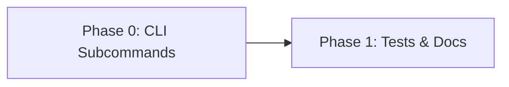

# Planning Process

- [x] Pre-flight Check [10:43am]
    - [x] Plans directory ready
    - [x] Skill activated: biscuit-terminal
    - [x] Budget estimated: low (~25%)
- [x] Requirements analyzed [10:43am]
- [x] Planning complete [10:44am]

## Plan

### Phase 0: Restructure CLI with Subcommands
**Agent:** `general-purpose` | **Skills:** clap, rust | **Complexity:** Low
**Deps:** None | **Parallel:** No

**Goal:** Refactor the `bt` CLI from flag-based image rendering to subcommand-based architecture

**Deliver:**
- Updated `Args` struct with clap subcommands enum
- `image` subcommand with filepath argument and optional width spec
- `flowchart` subcommand with `--vertical` flag and content args
- Default behavior (no subcommand) retains current terminal metadata display

**Implementation Details:**

```rust
#[derive(Parser, Debug)]
#[command(name = "bt")]
#[command(author, version, about = "Display terminal metadata and capabilities")]
struct Args {
    /// Output in JSON format
    #[arg(long, global = true)]
    json: bool,

    /// Verbose output (show more details)
    #[arg(short, long, global = true)]
    verbose: bool,

    /// Generate shell completions and exit
    #[arg(long, value_name = "SHELL", global = true)]
    completions: Option<String>,

    #[command(subcommand)]
    command: Option<Command>,
}

#[derive(Subcommand, Debug)]
enum Command {
    /// Display an image in the terminal
    ///
    /// Supports width specification: "file.jpg|50%" or "file.jpg|80".
    /// Supports PNG, JPG, JPEG, and GIF formats.
    Image {
        /// Image file path with optional width spec (e.g., "photo.jpg|75%")
        #[arg(value_name = "FILEPATH", add = ArgValueCompleter::new(image_completer()))]
        filepath: String,
    },

    /// Render a flowchart from node definitions
    ///
    /// Creates a Mermaid flowchart and renders it to the terminal.
    /// Default direction is left-to-right (LR).
    Flowchart {
        /// Render top-down instead of left-right
        #[arg(long, short)]
        vertical: bool,

        /// Flowchart node and edge definitions (e.g., "A --> B --> C")
        #[arg(value_name = "CONTENT", required = true)]
        content: Vec<String>,
    },
}
```

**Main function changes:**

```rust
fn main() -> color_eyre::Result<()> {
    // ... existing setup ...

    let args = Args::parse();

    // Handle --completions flag (global)
    if let Some(ref shell_arg) = args.completions {
        return handle_completions(shell_arg);
    }

    // Handle subcommands
    match args.command {
        Some(Command::Image { filepath }) => render_image(&filepath),
        Some(Command::Flowchart { vertical, content }) => {
            render_flowchart(vertical, &content, args.json)
        }
        None => {
            // Default: show terminal metadata (existing behavior)
            // ... existing content analysis or metadata display ...
        }
    }
}
```

**New flowchart function:**

```rust
/// Render a flowchart to the terminal.
///
/// Creates a Mermaid flowchart with the given content and renders it
/// using the MermaidRenderer.
fn render_flowchart(vertical: bool, content: &[String], json: bool) -> color_eyre::Result<()> {
    use biscuit_terminal::components::mermaid::MermaidRenderer;

    let direction = if vertical { "TD" } else { "LR" };
    let body = content.join(" ");
    let instructions = format!("flowchart {}\n    {}", direction, body);

    let renderer = MermaidRenderer::new(&instructions);

    if json {
        // Output flowchart instructions as JSON
        let output = serde_json::json!({
            "type": "flowchart",
            "direction": direction,
            "instructions": instructions,
        });
        println!("{}", serde_json::to_string_pretty(&output)?);
        return Ok(());
    }

    match renderer.render_for_terminal() {
        Ok(()) => Ok(()),
        Err(e) => {
            eprintln!("Failed to render flowchart: {}", e);
            renderer.print_fallback();
            Ok(())
        }
    }
}
```

**Pass when:**
- [x] `bt image photo.jpg` renders an image (replaces `bt --image photo.jpg`)
- [x] `bt image photo.jpg|75%` renders with width spec
- [x] `bt flowchart "A --> B --> C"` renders left-right flowchart
- [x] `bt flowchart --vertical "A --> B"` renders top-down flowchart
- [x] `bt` (no args) still shows terminal metadata
- [x] `bt --json` still works for metadata output
- [x] Shell completions still work
- [x] Existing tests pass (update as needed)

**If failed:**
- Rollback: `git checkout biscuit-terminal/cli/src/main.rs`
- Retry: Fix clap derive issues, check for missing imports

### Phase 1: Update Tests and Documentation
**Agent:** `general-purpose` | **Skills:** rust | **Complexity:** Low
**Deps:** Phase 0 | **Parallel:** No

**Goal:** Update CLI tests and README to reflect new subcommand structure

**Deliver:**
- Updated CLI integration tests
- Updated README with new usage examples
- Updated shell completion docs

**Pass when:**
- [ ] `cargo test -p biscuit-terminal-cli` passes
- [ ] README shows correct usage for `image` and `flowchart` subcommands

**If failed:**
- Rollback: Revert test changes
- Retry: Align tests with actual CLI behavior

## Dependency Graph



## Risks

| Level | Category | Description | Affected | Mitigation |
|-------|----------|-------------|----------|------------|
| LOW | technical | Shell completion behavior may change with subcommands | Phase 0 | Test completions manually after change |

## Lessons Learned

> None yet

## Package Changes

> None required - all dependencies already available
