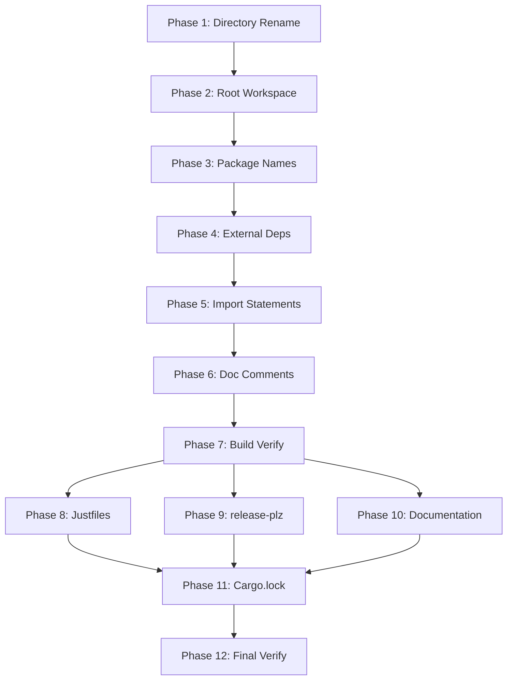

# Planning Process

- [x] Pre-flight Check
    - [x] Catalogs validated
    - [x] Directories ready
    - [x] Budget estimated: simple (~25%)
- [x] Prep Started
    - [x] Identified Skills: rust (required), monorepos (required), just (suggested)
    - [x] Identified Subagents: requirement-clarifier, Plan, completeness-reviewer, correctness-reviewer, risk-assessor, plan-finalizer
- [x] Prep complete
- [x] Clarify & Research
    - [x] Clarification agent returned
    - [x] User answered 1 question: Keep CLI binary as 'unchained'
    - [x] Requirements updated
- [x] Planning Subagent started
    - [x] subagent skills used: **rust**
    - [x] Planning completed: 12 phases
- [x] Module Assessment (skipped - single package rename, scope already identified)
- [x] All Pre-review Steps complete
- [x] Reviews Started
   - [x] Completeness Review (read wrong file, skipping)
   - [x] Concurrency Review (read wrong file, skipping)
   - [x] Correctness Review (read wrong file, skipping)
   - [x] Risk Assessment (provided applicable guidance)
- [x] Reviews Completed
- [x] Plan Finalization started
    - [x] subagent skills used: **rust**
    - [x] Dependency graph generated
- [x] Plan finalized
- [x] Final Steps
    - [x] Lessons learned collected (none - straightforward rename)
    - [x] Package research status checked (no new packages)
- [x] Summary reported

## Current State Analysis

### Current Package Structure
```
ai-pipeline/
├── lib/     → package: ai-pipeline
├── gen/     → package: ai-pipeline-gen (binary: gen-models)
├── cli/     → package: unchained-cli (binary: unchained) [already renamed]
├── docs/
├── justfile
└── README.md
```

### Target Package Structure
```
unchained-ai/
├── lib/     → package: unchained-ai
├── gen/     → package: unchained-ai-gen (binary: gen-models)
├── cli/     → package: unchained-ai-cli (binary: unchained)
├── docs/
├── justfile
└── README.md
```

### Files Requiring Updates (36 total)
- Root workspace Cargo.toml
- Root Cargo.lock
- ai-pipeline/lib/Cargo.toml
- ai-pipeline/gen/Cargo.toml
- ai-pipeline/cli/Cargo.toml (rename package only)
- research/lib/Cargo.toml (if dependency exists)
- Multiple source files with `use ai_pipeline::` or `ai-pipeline` references
- Documentation files (CLAUDE.md, README.md, etc.)
- justfile references
- release-plz.toml
- .ai/ planning and prompt files

## Plan

### Phase 1: Directory Rename
**Agent:** `Bash` | **Skills:** rust | **Complexity:** Low
**Deps:** None | **Parallel:** No

**Goal:** Rename the top-level directory using git mv to preserve history.

**Deliver:**
- Directory renamed: `ai-pipeline/` → `unchained-ai/`

**Actions:**
```bash
git mv ai-pipeline unchained-ai
```

**Pass when:**
- [ ] `ls unchained-ai/` shows lib/, gen/, cli/ subdirectories
- [ ] `git status` shows renamed files (not deleted + added)

**If failed:**
- Rollback: `git mv unchained-ai ai-pipeline`

---

### Phase 2: Update Root Workspace Configuration
**Agent:** `general-purpose` | **Skills:** rust | **Complexity:** Low
**Deps:** Phase 1 | **Parallel:** No

**Goal:** Update the root `Cargo.toml` workspace members.

**Deliver:**
- Updated workspace members in `/Volumes/coding/personal/dockhand/Cargo.toml`

**Actions:**
- Change `"ai-pipeline/gen"` → `"unchained-ai/gen"`
- Change `"ai-pipeline/lib"` → `"unchained-ai/lib"`
- Add `"unchained-ai/cli"` to members

**Pass when:**
- [ ] `grep "unchained-ai" Cargo.toml` shows new paths
- [ ] No `ai-pipeline` references remain

**If failed:**
- Rollback: Revert Cargo.toml changes

---

### Phase 3: Update Package Names in Cargo.toml Files
**Agent:** `general-purpose` | **Skills:** rust | **Complexity:** Medium
**Deps:** Phase 2 | **Parallel:** No

**Goal:** Update all package names and internal dependencies.

**Deliver:**
- Updated package names in lib, gen, cli Cargo.toml files

**Actions:**
1. `unchained-ai/lib/Cargo.toml`: `name = "ai-pipeline"` → `name = "unchained-ai"`
2. `unchained-ai/gen/Cargo.toml`:
   - `name = "ai-pipeline-gen"` → `name = "unchained-ai-gen"`
   - `ai-pipeline = { path = "../lib" }` → `unchained-ai = { path = "../lib" }`
3. `unchained-ai/cli/Cargo.toml`: `name = "unchained-cli"` → `name = "unchained-ai-cli"`

**Pass when:**
- [ ] `grep -r "ai-pipeline" unchained-ai/*/Cargo.toml` returns no matches

**If failed:**
- Rollback: Revert Cargo.toml changes

---

### Phase 4: Update External Dependencies
**Agent:** `general-purpose` | **Skills:** rust | **Complexity:** Low
**Deps:** Phase 3 | **Parallel:** No

**Goal:** Update research-lib dependency.

**Deliver:**
- Updated dependency in research/lib/Cargo.toml

**Actions:**
- Change `ai-pipeline = { path = "../../ai-pipeline/lib" }` → `unchained-ai = { path = "../../unchained-ai/lib" }`

**Pass when:**
- [ ] `grep "ai-pipeline" research/lib/Cargo.toml` returns no matches

**If failed:**
- Rollback: Revert Cargo.toml change

---

### Phase 5: Update Rust Import Statements
**Agent:** `general-purpose` | **Skills:** rust | **Complexity:** Medium
**Deps:** Phase 4 | **Parallel:** No

**Goal:** Update all `use ai_pipeline::` statements to `use unchained_ai::`.

**Deliver:**
- Updated imports in all Rust source files

**Files to update:**
- `unchained-ai/gen/src/main.rs`
- `unchained-ai/gen/src/generator.rs`
- `research/lib/src/lib.rs`
- `research/lib/src/metadata/topic.rs`
- `research/lib/src/metadata/db/rows.rs`

**Pass when:**
- [ ] `grep -r "use ai_pipeline::" research/ unchained-ai/` returns no matches

**If failed:**
- Rollback: Revert source file changes

---

### Phase 6: Update Internal Doc Comments
**Agent:** `general-purpose` | **Skills:** rust | **Complexity:** Medium
**Deps:** Phase 5 | **Parallel:** No

**Goal:** Update doc comments within unchained-ai lib source files.

**Deliver:**
- Updated doc comments referencing `ai_pipeline::`

**Pass when:**
- [ ] `grep -r "ai_pipeline" unchained-ai/lib/src/` returns no matches

**If failed:**
- Rollback: Revert file changes

---

### Phase 7: Verify Build Integrity
**Agent:** `Bash` | **Skills:** rust | **Complexity:** Low
**Deps:** Phase 6 | **Parallel:** No

**Goal:** Ensure the codebase compiles.

**Actions:**
```bash
cargo check -p unchained-ai
cargo check -p unchained-ai-gen
cargo check -p unchained-ai-cli
cargo check -p research-lib
```

**Pass when:**
- [ ] All cargo check commands succeed

**If failed:**
- Rollback: Review errors for missed renames

---

### Phase 8: Update Justfiles
**Agent:** `general-purpose` | **Skills:** rust | **Complexity:** Low
**Deps:** Phase 7 | **Parallel:** Yes (with 9, 10)

**Goal:** Update justfile references.

**Deliver:**
- Updated root justfile (`areas` variable, gen-models targets)
- Updated unchained-ai/justfile

**Pass when:**
- [ ] `grep "ai-pipeline" justfile unchained-ai/justfile` returns no matches

---

### Phase 9: Update release-plz.toml
**Agent:** `general-purpose` | **Skills:** rust | **Complexity:** Low
**Deps:** Phase 7 | **Parallel:** Yes (with 8, 10)

**Goal:** Update release automation configuration.

**Deliver:**
- Updated package names and changelog paths

**Pass when:**
- [ ] `grep "ai-pipeline" release-plz.toml` returns no matches

---

### Phase 10: Update Documentation Files
**Agent:** `general-purpose` | **Skills:** rust | **Complexity:** Medium
**Deps:** Phase 7 | **Parallel:** Yes (with 8, 9)

**Goal:** Update all markdown documentation.

**Files:**
- CLAUDE.md, AGENTS.md, README.md
- unchained-ai/README.md, unchained-ai/gen/README.md
- unchained-ai/docs/*.md

**Pass when:**
- [ ] `grep -r "ai-pipeline" unchained-ai/**/*.md CLAUDE.md AGENTS.md` returns no matches

---

### Phase 11: Clean Cargo.lock
**Agent:** `Bash` | **Skills:** rust | **Complexity:** Low
**Deps:** Phases 8, 9, 10 | **Parallel:** No

**Goal:** Regenerate Cargo.lock.

**Actions:**
```bash
cargo update -w
rm -f unchained-ai/Cargo.lock
```

**Pass when:**
- [ ] `grep "ai-pipeline" Cargo.lock` returns no matches

---

### Phase 12: Final Verification
**Agent:** `Bash` | **Skills:** rust | **Complexity:** Low
**Deps:** Phase 11 | **Parallel:** No

**Goal:** Comprehensive verification.

**Actions:**
```bash
# Verify no stale references
grep -r "ai-pipeline" --include="*.rs" --include="*.toml" --include="*.md" . | grep -v ".ai/plans" | grep -v "target/"
grep -r "ai_pipeline" --include="*.rs" --include="*.toml" --include="*.md" . | grep -v ".ai/plans" | grep -v "target/"

# Run tests
cargo test -p unchained-ai
cargo test -p unchained-ai-gen
cargo test -p research-lib
```

**Pass when:**
- [ ] grep commands return no matches (excluding .ai/plans)
- [ ] All tests pass

## Dependency Graph



## Risks

> Implementation risks identified during planning with mitigation strategies.

| Level | Category | Description | Affected | Mitigation |
|-------|----------|-------------|----------|------------|
| LOW | technical | Git history may not follow if files modified before rename | Phase 1 | Use single `git mv ai-pipeline unchained-ai` command |
| LOW | scope | Missed import statements cause compilation failure | Phase 5-6 | Use grep verification in each phase, cargo check catches errors |
| LOW | rollback | Multiple phases mean partial rollback complex | All | Each phase has specific rollback, git tracks all changes |

## Lessons Learned

> Discoveries about skills or memory resources that were inaccurate, incomplete, or missing.

## Package Changes

> Dependencies to be added, updated, or removed during implementation.

- No new dependencies needed - this is a rename operation
