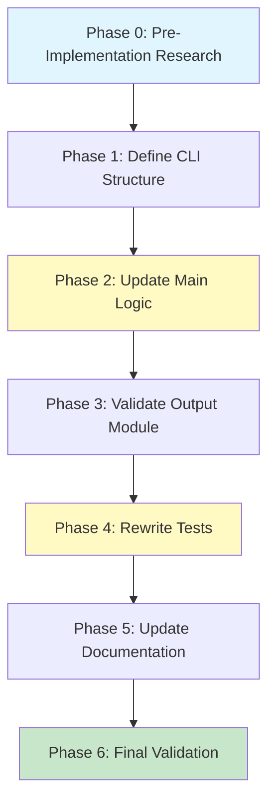

# Planning Process

- [x] Pre-flight Check [12:43pm]
    - [x] Catalogs validated
    - [x] Directories ready
    - [x] Budget estimated: medium (~40%)
- [x] Prep Started [12:44pm]
    - [x] Identified Skills: sniff, clap, rust (required); serde, rust-testing, color-eyre (suggested)
    - [x] Identified Subagents: core-refactoring, output-layer, test-validation, documentation
- [x] Prep complete [12:45pm]
- [x] Clarify & Research [12:45pm]
    - [x] Clarification agent returned
    - [x] User answered 3 questions [12:46pm]
    - [x] Requirements updated
    - [ ] Package research started (background) - N/A (no new packages)
- [x] Planning Subagent [agent: **Plan**] started [12:47pm]
    - [x] subagent skills used: sniff, clap, rust
    - [x] Planning completed [12:48pm]
- [ ] Module Assessment (if monorepo)
    - [ ] subagent skills used: LIST
- [x] All Pre-review Steps complete [12:48pm]
- [x] Reviews Started [12:48pm]
   - [x] Completeness Review - 15 findings (4 high, 6 medium, 5 low)
   - [x] Concurrency Review - optimal structure confirmed
   - [x] Correctness Review - 10 issues (4 high, 4 medium, 2 low)
   - [x] Risk Assessment - 7 risks (2 high, 3 medium, 2 low)
- [x] Reviews Completed [12:49pm]
- [x] Plan Finalization started [12:50pm]
    - [x] subagent skills used: rust, clap
    - [x] Dependency graph generated
- [x] Plan finalized [12:51pm]
- [x] Final Steps
    - [x] Lessons learned collected (4 findings)
    - [x] Package research status checked - N/A (no new packages)
- [x] Summary reported [12:51pm]
    - Plan: .ai/plans/2026-01-30.plan-for-sniff-cli-subcommands.md
    - Phases: 7 (0-6)
    - Duration: ~8 minutes
    - Context: ~35% used (budget: 40%)

## Current CLI Structure Analysis

### Flags to Convert to Subcommands (Filter Flags)

| Current Flag | New Subcommand | Category |
|--------------|----------------|----------|
| `--os` | `os` | Top-level section |
| `--hardware` | `hardware` | Top-level section |
| `--network` | `network` | Top-level section |
| `--filesystem` | `filesystem` | Top-level section |
| `--cpu` | `cpu` | Hardware detail |
| `--gpu` | `gpu` | Hardware detail |
| `--memory` | `memory` | Hardware detail |
| `--storage` | `storage` | Hardware detail |
| `--git` | `git` | Filesystem detail |
| `--repo` | `repo` | Filesystem detail |
| `--language` | `language` | Filesystem detail |
| `--programs` | `programs` | Programs |
| `--editors` | `editors` | Programs detail |
| `--utilities` | `utilities` | Programs detail |
| `--language-package-managers` | `language-package-managers` | Programs detail |
| `--os-package-managers` | `os-package-managers` | Programs detail |
| `--tts-clients` | `tts-clients` | Programs detail |
| `--terminal-apps` | `terminal-apps` | Programs detail |
| `--audio` | `audio` | Programs detail |
| `--services` | `services` | Services |

### Flags to Keep as Global Options

| Flag | Purpose |
|------|---------|
| `--json` | Output format (removed when no subcommand = always JSON) |
| `--deep` | Enable deep git inspection |
| `--help` / `-h` | Help |
| `--version` / `-V` | Version |
| `--verbose` / `-v` | Verbosity |
| `--base` / `-b` | Base directory |
| `--markdown` | Markdown table output (programs) |
| `--json-format` | JSON format style (programs) |
| `--state` | Service state filter |
| `--completions` | Shell completions |
| `--skip-hardware` | Skip hardware detection |
| `--skip-network` | Skip network detection |
| `--skip-filesystem` | Skip filesystem detection |

### Key Behavioral Changes

1. **No subcommand** → Output ALL data as JSON (no text output option)
2. **With subcommand** → Output filtered data, default text (--json for JSON)
3. **Subcommands are mutually exclusive** (same as current filter flags)
4. **Skip flags become irrelevant** when subcommands are used (subcommand selects what to show)

## Plan

### Phase 0: Pre-Implementation Research
**Agent:** `general-purpose` | **Skills:** rust | **Complexity:** Low
**Deps:** None | **Parallel:** No

**Goal:** Identify all `sniff` CLI usages in the monorepo to assess breaking change impact.

**Deliver:**
- Grep results for all `sniff` command invocations (justfiles, scripts, docs)
- List of files requiring updates
- Impact assessment

**Pass when:**
- [ ] All usage locations identified
- [ ] Impact severity assessed (scripts vs docs vs examples)

**If failed:**
- Rollback: None needed (read-only phase)
- Retry: Expand search patterns

---

### Phase 1: Define New CLI Structure
**Agent:** `general-purpose` | **Skills:** clap, rust | **Complexity:** Medium
**Deps:** Phase 0 | **Parallel:** No

**Goal:** Replace filter flags with Commands enum and define global flags.

**Deliver:**
- `Commands` enum with 20 variants (note: `HeadlessAudio` not `Audio`)
- Updated `Cli` struct with `Option<Commands>` and global flags
- Remove old filter flags (20), skip flags (3), validation methods
- `Commands::to_output_filter()` method implementation
- Runtime validation for `--markdown`/`--json` conflicts
- Global flag position support (both `sniff --json cpu` and `sniff cpu --json`)

**Pass when:**
- [ ] `cargo build -p sniff-cli` compiles
- [ ] `Commands::HeadlessAudio` exists (matches OutputFilter naming)
- [ ] `to_output_filter()` returns correct OutputFilter variant
- [ ] Both flag positions work: `sniff --json cpu` and `sniff cpu --json`
- [ ] `ServiceStateArg` has `default_value = "running"`

**If failed:**
- Rollback: `git checkout sniff/cli/src/main.rs`
- Retry: After fixing clap derive errors

---

### Phase 2: Update Main Function Logic
**Agent:** `general-purpose` | **Skills:** clap, rust | **Complexity:** Medium
**Deps:** Phase 1 | **Parallel:** No

**Goal:** Refactor routing logic to handle subcommands; extract complex logic to testable functions.

**Deliver:**
- Match on `cli.command` for routing
- Extract routing logic to testable functions:
  - `build_config_for_filter(filter: OutputFilter) -> SniffConfig`
- None case: ALL sections, always JSON output (breaking change)
- Subcommand case: Text default, JSON if `--json`
- Simplified config building (no skip flags)

**Pass when:**
- [ ] `sniff` outputs JSON with all sections (no subcommand = ALL JSON)
- [ ] `sniff os` outputs text by default
- [ ] `sniff os --json` outputs flattened JSON
- [ ] `sniff programs --markdown` outputs markdown table
- [ ] `sniff services --state stopped` filters correctly
- [ ] Routing functions have unit tests

**If failed:**
- Rollback: `git checkout sniff/cli/src/main.rs`
- Retry: Extract helpers incrementally

---

### Phase 3: Validate Output Module
**Agent:** `general-purpose` | **Skills:** rust, serde | **Complexity:** Medium (2x budget)
**Deps:** Phase 2 | **Parallel:** No

**Goal:** Ensure output.rs handles all subcommand cases; apply minimal fixes if needed.

**Deliver:**
- Verify OutputFilter enum matches Commands (21 variants including All)
- Verify print functions handle all variants
- Changes ONLY if necessary
- Document any output format changes

**Pass when:**
- [ ] All print_* functions compile with new main.rs
- [ ] `OutputFilter::HeadlessAudio` handled correctly
- [ ] JSON/text output formats unchanged
- [ ] Unit tests updated if changes made

**If failed:**
- Rollback: `git checkout sniff/cli/src/output.rs`
- Retry: Identify minimal change set

---

### Phase 4: Rewrite CLI Tests
**Agent:** `feature-tester-rust` | **Skills:** rust | **Complexity:** High
**Deps:** Phase 3 | **Parallel:** No

**Goal:** Replace filter flag tests with subcommand tests; add global flag position tests.

**Deliver:**
- Convert all `--flag` tests to subcommand syntax
- Remove skip flag tests and mutual exclusivity tests
- Add tests for:
  - Each subcommand (20 total)
  - Global flag positions (`sniff --json cpu`, `sniff cpu --json`)
  - `--markdown`/`--json` conflict validation
  - No-subcommand mode (JSON output)
  - Subcommand mode (text default)

**Pass when:**
- [ ] `cargo test -p sniff-cli` passes
- [ ] All 20 subcommands tested
- [ ] Global flag position tests pass
- [ ] Coverage >= 80% for subcommand logic

**If failed:**
- Rollback: Keep new tests, fix implementation
- Retry: Debug failing tests individually

---

### Phase 5: Update Help Text and Documentation
**Agent:** `general-purpose` | **Skills:** rust | **Complexity:** Medium
**Deps:** Phase 4 | **Parallel:** No

**Goal:** Rewrite AFTER_HELP for subcommand CLI; document migration.

**Deliver:**
- Rewritten `AFTER_HELP` with subcommand examples
- Migration guide documenting breaking changes:
  - `sniff` → JSON output (was text)
  - `sniff --cpu` → `sniff cpu`
- Update examples from Phase 0 analysis

**Pass when:**
- [ ] `sniff --help` shows subcommand structure
- [ ] `sniff programs --help` shows subcommand options
- [ ] Migration guide complete
- [ ] All docs/justfiles updated per Phase 0

**If failed:**
- Rollback: Restore old AFTER_HELP
- Retry: Write help incrementally

---

### Phase 6: Final Validation
**Agent:** `general-purpose` | **Skills:** rust | **Complexity:** Low
**Deps:** Phase 5 | **Parallel:** No

**Goal:** End-to-end validation of refactored CLI.

**Deliver:**
- Manual testing of all subcommands
- Validation checklist:
  - [ ] `sniff` → JSON all sections
  - [ ] `sniff os` → text OS section
  - [ ] `sniff --json cpu` → JSON CPU
  - [ ] `sniff programs --markdown` → markdown table
  - [ ] `sniff --json --markdown programs` → conflict error
  - [ ] Shell completions show subcommands
- Performance check (no regression)

**Pass when:**
- [ ] All manual tests pass
- [ ] `cargo clippy -p sniff-cli` clean
- [ ] `cargo test --workspace` passes
- [ ] Ready for merge

**If failed:**
- Rollback: Full rollback to Phase 0 starting point
- Retry: Debug specific failure

## Dependency Graph

**Critical Path:** P0 → P1 → P2 → P3 → P4 → P5 → P6 (7 sequential phases)

**Bottlenecks:**
- Phase 2: Complex routing logic extraction (100+ lines)
- Phase 3: Output.rs validation (2x time budget)
- Phase 4: Comprehensive test rewrite (56+ tests)

## Risks

> Implementation risks identified during planning with mitigation strategies.

| Level | Category | Description | Affected | Mitigation |
|-------|----------|-------------|----------|------------|
| HIGH | technical | Complex routing logic replacement - 100+ lines of interdependent filtering with subtle include-only mode behavior | Phase 2 | Extract routing to testable functions first; add integration tests capturing current behavior |
| HIGH | scope | Underestimated output.rs changes - OutputFilter enum tightly coupled across 300+ lines | Phase 3 | Run exhaustiveness tests; budget 2x time; keep OutputFilter temporarily if needed |
| MEDIUM | technical | Global flag ordering unclear - `sniff cpu --json` vs `sniff --json cpu` | Phase 1,2 | Document intended syntax; test flag orderings explicitly |
| MEDIUM | rollback | Breaking change with no migration path - could break justfiles, scripts, CI | Phase 5 | Grep monorepo for sniff invocations; consider --legacy-flags mode |
| MEDIUM | scope | Shell completion regeneration - completions could silently break | Phase 5 | Add completion tests; test COMPLETE=bash output |
| LOW | technical | Test count mismatch - 56 tests need systematic rewriting | Phase 4 | Create old->new mapping table; use golden file testing |
| LOW | scope | Documentation surface area - AFTER_HELP (398 lines), README need rewriting | Phase 5 | Audit with grep; prioritize --help output |

## Lessons Learned

> Discoveries about skills or memory resources that were inaccurate, incomplete, or missing.

- [SKILL: clap]: Missing guidance on global flag conflicts across subcommand boundaries - clap's `conflicts_with` may not work when one flag is global and another is subcommand-specific
- [FILE: sniff SKILL.md]: CLI usage examples use flag syntax (`sniff --hardware`) which will become outdated
- [PLANNING]: Breaking CLI changes need explicit migration documentation phase
- [PLANNING]: Filter-to-subcommand refactoring requires careful handling of "no argument" default behavior

## Package Changes

> Dependencies to be added, updated, or removed during implementation.

- No new packages expected (clap already supports subcommands)
