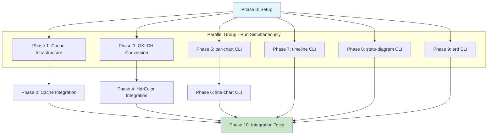

# Planning Process

- [x] Pre-flight Check [12:47pm]
    - [x] Catalogs validated
    - [x] Directories ready
    - [x] Budget estimated: medium (~40%)
- [x] Prep Started [12:47pm]
    - [x] Identified Skills [12:48pm]: biscuit-terminal, biscuit-hash, clap, color-eyre
    - [x] Identified Subagents [12:48pm]: Plan, general-purpose, feature-tester-rust, Bash
- [x] Prep complete [12:48pm]
- [x] Clarify & Research [12:50pm]
    - [x] Clarification agent returned [12:50pm]
    - [x] User answered 3 questions [12:51pm]
        - Cache: OS auto-cleanup only
        - OKLCH: Hardcode in build.rs
        - HdrColor: Add OKLCH tuple fields
    - [x] Requirements updated [12:51pm]
    - [ ] Package research started (background)
- [x] Planning Subagent [agent: **Plan**] started [12:51pm]
    - [x] subagent skills used: biscuit-terminal, biscuit-hash, clap, color-eyre
    - [x] Planning completed [12:52pm] - 10 phases
- [x] Module Assessment (monorepo)
    - Modules: biscuit-terminal/lib, biscuit-terminal/cli
- [x] All Pre-review Steps complete [12:52pm]
- [x] Reviews Started [12:52pm]
   - [x] Completeness Review - 15 issues identified
   - [x] Concurrency Review - 6 parallelization recommendations
   - [x] Correctness Review - 10 technical issues
   - [x] Risk Assessment - 8 risks identified
- [x] Reviews Completed [12:54pm]
- [x] Plan Finalization started [12:54pm]
    - [x] subagent skills used: biscuit-terminal, clap, rust, biscuit-hash
    - [x] Dependency graph generated
- [x] Plan finalized [12:56pm]
- [x] Final Steps
    - [x] Lessons learned collected: 3 items
    - [x] Package research: biscuit-hash already in workspace
- [x] Summary reported [12:56pm]
    - Plan: `.ai/plans/2026-01-31.plan-for-terminal-rendering-improvements.md`
    - Phases: 11 (0-10)
    - Critical path: 6 phases with parallelization
    - High-priority risks: 1 (OKLCH accuracy)

## Plan

### Phase 0: Setup and Planning
**Agent:** `general-purpose` | **Skills:** rust, biscuit-terminal | **Complexity:** Low
**Deps:** None | **Parallel:** No

**Goal:** Prepare development environment and validate mmdc installation

**Deliver:**
- Feature branch `feat/terminal-rendering-improvements`
- mmdc version detection utility
- Minimum version constant (10.6.0)

**Pass when:**
- [ ] Feature branch created
- [ ] `cargo check -p biscuit-terminal-lib` passes

---

### Phase 1: Cache Infrastructure
**Agent:** `general-purpose` | **Skills:** rust, biscuit-hash, biscuit-terminal | **Complexity:** Medium
**Deps:** Phase 0 | **Parallel:** Yes (with 3, 5, 7, 8, 9)

**Goal:** Implement mermaid render caching with collision-resistant hashing

**Deliver:**
- `biscuit-terminal/lib/src/components/mermaid_cache.rs`
- `CacheKey` hashing ALL fields: instructions, theme, scale, config, transparent_background, title, mmdc_version
- Unit tests verifying collision resistance

**Pass when:**
- [ ] Cache key includes all 7 fields plus mmdc version
- [ ] Different inputs produce different cache keys
- [ ] Same inputs produce identical cache keys

---

### Phase 2: Cache Integration into MermaidRenderer
**Agent:** `general-purpose` | **Skills:** rust, biscuit-terminal | **Complexity:** Medium
**Deps:** Phase 1 | **Parallel:** No

**Goal:** Wire cache into existing mermaid rendering pipeline

**Deliver:**
- Modified `mermaid.rs` to check cache before calling mmdc
- Warning if mmdc < 10.6.0

**Pass when:**
- [ ] Cache hit avoids mmdc invocation
- [ ] Warning emitted for mmdc < 10.6.0

---

### Phase 3: build.rs for Tailwind OKLCH-to-RGB
**Agent:** `general-purpose` | **Skills:** rust, biscuit-terminal | **Complexity:** High
**Deps:** Phase 0 | **Parallel:** Yes (with 1, 5, 7, 8, 9)

**Goal:** Generate Tailwind v4 color definitions with accurate OKLCH→RGB conversion

**Deliver:**
- `biscuit-terminal/lib/build.rs` with OKLab matrix coefficients
- Validation tests against colorjs.io (ΔE < 1.0)
- All 22 Tailwind color families (50-950)

**Pass when:**
- [ ] Generated colors match colorjs.io within ΔE < 1.0
- [ ] All 227 Tailwind variants present

**If failed:**
- Escalate: Use pre-computed lookup table if accuracy cannot be achieved

---

### Phase 4: HdrColor and Tailwind Integration
**Agent:** `general-purpose` | **Skills:** rust, biscuit-terminal | **Complexity:** Medium
**Deps:** Phase 3 | **Parallel:** No

**Goal:** Integrate generated Tailwind colors with HDR support

**Deliver:**
- HdrColor with f32 OKLCH tuple fields (no String)
- CHANGELOG entry documenting breaking change
- Version bump to 0.(x+1).0

**Pass when:**
- [ ] No String fields in HdrColor struct
- [ ] `Color::Tailwind(Tailwind::Indigo500)` returns correct color

---

### Phase 5: bar-chart CLI
**Agent:** `general-purpose` | **Skills:** rust, clap, biscuit-terminal | **Complexity:** High
**Deps:** Phase 0 | **Parallel:** Yes (with 1, 3, 7, 8, 9)

**Goal:** Implement XY chart bar rendering

**Deliver:**
- `--title`, `--x-axis`, `--y-axis`, `--width`, `--horizontal`, `--show-data-label`, `--aspect-ratio`, `--color`, `--line`, `--bar`, `--example`
- Input: `[1,8,7,5]`, `"1,8,7,5"`, or `1 8 7 5`
- Mermaid config using `%%{init: {...}}%%` directive
- Aspect ratio: `height = width / aspect_ratio`
- Color themes: default, blue-purple, rag

**Pass when:**
- [ ] All 3 input formats work
- [ ] Config uses `%%{init:...}%%` syntax

---

### Phase 6: line-chart CLI
**Agent:** `general-purpose` | **Skills:** rust, clap | **Complexity:** Low
**Deps:** Phase 5 | **Parallel:** No

**Goal:** Duplicate bar-chart with line default

**Deliver:**
- Identical to bar-chart, defaults to line series
- Shared code in `xy_chart_common.rs`

**Pass when:**
- [ ] Default series renders as line

---

### Phase 7: timeline CLI
**Agent:** `general-purpose` | **Skills:** rust, clap | **Complexity:** Medium
**Deps:** Phase 0 | **Parallel:** Yes (with 1, 3, 5, 8, 9)

**Goal:** Implement mermaid timeline chart

**Deliver:**
- `--title`, `--width`, `--section`, `--example`
- Input: `"2002: LinkedIn"` format (positional)
- Clear error if format doesn't match `YYYY: <text>`

**Pass when:**
- [ ] Positional entries parse correctly
- [ ] Section grouping works

---

### Phase 8: state-diagram CLI
**Agent:** `general-purpose` | **Skills:** rust, clap | **Complexity:** Low
**Deps:** Phase 0 | **Parallel:** Yes (with 1, 3, 5, 7, 9)

**Goal:** Clone flowchart CLI for stateDiagram-v2

**Deliver:**
- Same CLI as flowchart
- Outputs `stateDiagram-v2` syntax

**Pass when:**
- [ ] All flowchart features work

---

### Phase 9: erd CLI
**Agent:** `general-purpose` | **Skills:** rust, clap | **Complexity:** Medium
**Deps:** Phase 0 | **Parallel:** Yes (with 1, 3, 5, 7, 8)

**Goal:** Implement mermaid ERD

**Deliver:**
- `--title`, `--width`, `--entity`, `--relationship`, `--example`
- Relationship types: one-to-one, one-to-many, many-to-many

**Pass when:**
- [ ] Entities render with attributes
- [ ] Relationships render with correct cardinality

---

### Phase 10: Integration Tests
**Agent:** `feature-tester-rust` | **Skills:** rust, biscuit-terminal | **Complexity:** Medium
**Deps:** Phases 2, 6, 7, 8, 9 | **Parallel:** No

**Goal:** End-to-end validation

**Deliver:**
- Cache hit/miss tests
- All 5 new chart types
- Performance benchmark

**Pass when:**
- [x] `cargo test -p biscuit-terminal-cli` passes
- [x] Cache tests exist (15 unit tests in mermaid_cache.rs)

**Completed:**
- Added 34 new CLI integration tests for chart commands
- Total: 66 integration tests + 418 library unit tests + 28 doc tests + 86 doctests = 598 total tests
- All tests pass

---

## Dependency Graph

## Risks

| Level | Category | Description | Affected | Mitigation |
|-------|----------|-------------|----------|------------|
| HIGH | technical | OKLCH→sRGB conversion accuracy | Phase 3 | Validation tests against colorjs.io (ΔE < 1.0) |
| MEDIUM | technical | Cache key collisions | Phase 1-2 | Include mmdc version in hash |
| MEDIUM | rollback | HdrColor breaking change | Phase 4 | CHANGELOG documentation, minor version bump |
| LOW | scope | XY chart input complexity | Phase 5 | Break into sub-phases if needed |
| LOW | dependency | mmdc version compatibility | Phase 2 | Warning for versions < 10.6.0 |

## Lessons Learned

- [DOCUMENTATION: Tailwind v4 OKLCH]: Need OKLab matrix coefficients for accurate conversion
- [API: mermaid]: Config uses `%%{init: {...}}%%` directive, not YAML frontmatter
- [CONST: Rust]: Const structs cannot contain String fields, only primitives

## Package Changes

- [ALREADY_PRESENT]: biscuit-hash - Used for xxHash-based cache keys
- [VERSION_BUMP]: biscuit-terminal-lib 0.x.y → 0.(x+1).0 - HdrColor breaking change
