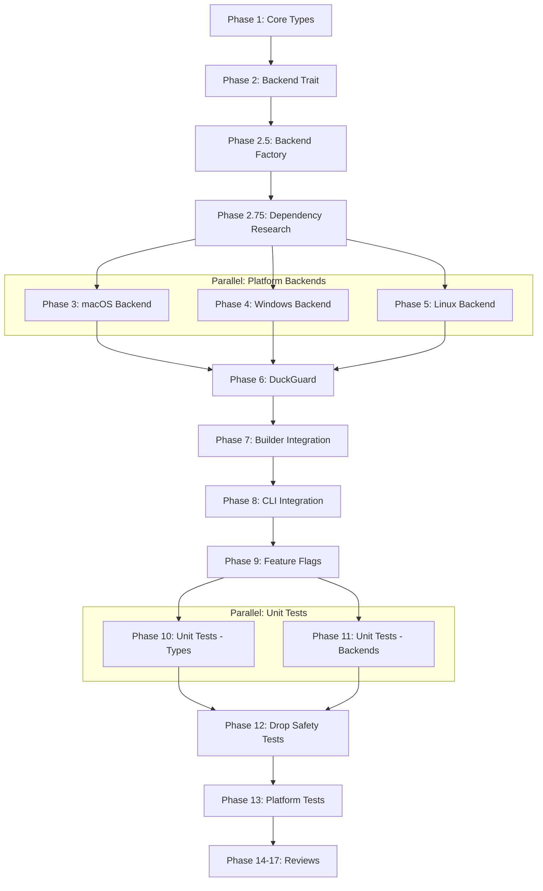

# Planning Process

- [x] Pre-flight Check [11:39]
    - [x] Directories ready
    - [x] Budget estimated: complex (~55%)
- [x] Prep Started [11:39]
    - [x] Identified Skills [11:40]
        - Required: rust, tokio, thiserror, clap, playa
        - Suggested: rust-testing, audio, color-eyre, monorepos
    - [x] Identified Subagents [11:40]
        - Planning: Explore, Plan, general-purpose, risk-assessor
        - Implementation: general-purpose, concurrency-reviewer
        - Testing: feature-tester-rust
        - Review: correctness-reviewer, concurrency-reviewer, completeness-reviewer
- [x] Prep complete [11:40]
- [x] Clarify & Research [11:41]
    - [x] Clarification agent returned [11:41]
    - [x] User answered 3 questions [11:42]
        - Integration: Sync wrapper Playa.with_ducking(cfg).play()
        - Failure mode: Proceed with warning to stderr
        - Windows scope: Per-session via ISimpleAudioVolume with fallback
    - [x] Requirements updated [11:42]
- [x] Planning Subagent [agent: **Plan**] started [11:42]
    - [x] subagent skills used: rust, tokio, thiserror, clap, playa
    - [x] Planning completed [11:44] - 17 phases
- [x] Module Assessment (monorepo) [11:44]
    - [x] subagent skills used: rust, playa
    - [x] Modules: playa/lib, playa/cli (direct); biscuit-speaks, so-you-say (indirect)
- [x] All Pre-review Steps complete [11:44]
- [x] Reviews Started [11:44]
   - [x] Completeness Review [11:46] - 15 recommendations (3 high)
   - [x] Concurrency Review [11:46] - 10 recommendations (5 high)
   - [x] Correctness Review [11:46] - 10 issues (5 high)
   - [x] Risk Assessment [11:46] - 11 risks (3 high)
- [x] Reviews Completed [11:46]
- [x] Plan Finalization started [11:46]
    - [x] subagent skills used: rust, tokio, playa
    - [x] Dependency graph generated
    - [x] All recommendations incorporated
- [x] Plan finalized [11:48]
    - 19 phases (original 17 + Phase 2.5 Backend Factory + Phase 2.75 Dependency Research)
- [x] Final Steps [11:49]
    - [x] Lessons learned collected: 5 items
    - [x] Package changes documented: 4 dependencies to add
- [x] Summary reported [11:49]
    - Plan: `.ai/plans/2026-02-02.plan-for-audio-ducking-feature.md`
    - Phases: 19
    - Duration: 10 min
    - Parallel paths: Phases 3/4/5 (backends), Phases 10/11 (tests)

## Plan

### Phase 1: Core Types and Envelope Math
**Agent:** `general-purpose` | **Skills:** rust, thiserror | **Complexity:** Low
**Deps:** None | **Parallel:** No

**Goal:** Define foundational types for ducking configuration and fade calculations.

**Deliver:**
- `DuckConfig` struct with validation (`ramp_ms > 0`, `floor_scalar` in 0.0-1.0)
- Envelope math: `compute_fade_steps()`, `interpolate_volume()`
- `DuckingError` enum via thiserror
- `VolumeSnapshot`, `SessionVolume`, `SessionId` types

**Pass when:**
- [ ] `cargo check -p playa` passes with `audio-ducking` feature
- [ ] Unit tests verify envelope calculations
- [ ] DuckConfig::new() rejects invalid values

---

### Phase 2: Backend Trait and No-op
**Agent:** `general-purpose` | **Skills:** rust | **Complexity:** Low
**Deps:** Phase 1 | **Parallel:** No

**Goal:** Define async backend trait with Send-safe futures.

**Deliver:**
- `DuckingBackend` trait with `snapshot()`, `fade_to_floor()`, `fade_restore()` methods
- All async methods return `impl Future + Send`
- `NoopBackend` for unsupported platforms

**Pass when:**
- [ ] Trait compiles with Send/Sync bounds
- [ ] NoopBackend implements trait successfully

---

### Phase 2.5: Backend Factory
**Agent:** `general-purpose` | **Skills:** rust | **Complexity:** Low
**Deps:** Phase 2 | **Parallel:** No

**Goal:** Implement platform selection logic.

**Deliver:**
- `create_backend() -> Box<dyn DuckingBackend>` with `#[cfg(target_os)]` dispatch
- Returns appropriate backend per platform, NoopBackend as fallback

**Pass when:**
- [ ] Factory compiles on all platforms
- [ ] Returns correct backend type per OS

---

### Phase 2.75: Dependency Research & POC
**Agent:** `general-purpose` | **Skills:** rust | **Complexity:** High
**Deps:** Phase 2.5 | **Parallel:** No

**Goal:** Validate platform dependencies before implementation.

**Deliver:**
- Research on coreaudio-sys, wasapi, libpulse-binding, pulsectl
- POC for each platform: get/set system volume, enumerate sessions
- Test PipeWire compatibility on Linux

**Pass when:**
- [ ] POC compiles and runs on each platform
- [ ] PipeWire tested alongside PulseAudio
- [ ] Crate versions recommended

---

### Phase 3: macOS CoreAudio Backend
**Agent:** `general-purpose` | **Skills:** rust | **Complexity:** High
**Deps:** Phase 2.75 | **Parallel:** Yes (with Phase 4, 5)

**Goal:** Implement endpoint-wide ducking via CoreAudio virtual master.

**Deliver:**
- `MacOsBackend` using `kAudioHardwareServiceDeviceProperty_VirtualMasterVolume`
- Snapshot/fade/restore cycle with proper error handling

**Pass when:**
- [ ] `cargo check --features audio-ducking-macos` passes on macOS
- [ ] Manual test confirms audible volume ducking

---

### Phase 4: Windows WASAPI Backend
**Agent:** `general-purpose` | **Skills:** rust | **Complexity:** High
**Deps:** Phase 2.75 | **Parallel:** Yes (with Phase 3, 5)

**Goal:** Implement per-session ducking with PID-based self-exclusion.

**Deliver:**
- `WindowsBackend` using `ISimpleAudioVolume` per session
- Cache PID at startup, exclude Playa sessions
- Fallback to `IAudioEndpointVolume` if session access fails

**Pass when:**
- [ ] Session enumeration works
- [ ] Playa's own session excluded by PID match
- [ ] Endpoint fallback triggers correctly

---

### Phase 5: Linux PulseAudio/PipeWire Backend
**Agent:** `general-purpose` | **Skills:** rust | **Complexity:** High
**Deps:** Phase 2.75 | **Parallel:** Yes (with Phase 3, 4)

**Goal:** Implement per-sink-input ducking with app name + PID self-exclusion.

**Deliver:**
- `LinuxBackend` using pulsectl for sink input enumeration
- Match on both `application.name` AND PID for exclusion
- ALSA master mixer fallback for non-PA systems

**Pass when:**
- [ ] Works on both PulseAudio and PipeWire
- [ ] Playa excluded by PID+name match
- [ ] ALSA fallback logs warning when used

---

### Phase 6: DuckGuard and Drop Restoration
**Agent:** `general-purpose` | **Skills:** rust, tokio | **Complexity:** High
**Deps:** Phase 3, 4, 5 | **Parallel:** No

**Goal:** RAII guard with async-safe Drop via channel-based restoration.

**Deliver:**
- `DuckGuard` with `AtomicBool` (using `compare_exchange` with SeqCst)
- Channel-based restoration: send to background task, fire-and-forget
- Watchdog cleanup on normal drop
- Fade cancellation via `tokio::select!` with cancellation token
- SIGTERM/SIGINT handlers for graceful shutdown
- Tracing: `#[instrument]` on new/drop, emit `ducking.*` events

**Pass when:**
- [ ] Volumes restored exactly once on drop
- [ ] No deadlocks or panics in Drop
- [ ] Fade cancellation works correctly
- [ ] Signal handlers tested

---

### Phase 7: Playa Builder Integration
**Agent:** `general-purpose` | **Skills:** rust, playa | **Complexity:** Medium
**Deps:** Phase 6 | **Parallel:** No

**Goal:** Add `with_ducked_audio()` method to Playa builder.

**Deliver:**
- `Playa::with_ducked_audio(config: DuckConfig) -> Self`
- Returns `Result<Option<DuckGuard>>` - None on failure, playback continues
- Guard held during playback, dropped after

**Pass when:**
- [ ] Builder method compiles and accepts DuckConfig
- [ ] Duck failure logs warning, doesn't abort playback

---

### Phase 8: CLI Integration
**Agent:** `general-purpose` | **Skills:** rust, clap | **Complexity:** Low
**Deps:** Phase 7 | **Parallel:** No

**Goal:** Add CLI flags for ducking control.

**Deliver:**
- `--no-duck`, `--duck-ramp-ms`, `--duck-floor` flags
- Use `#[cfg(feature = "audio-ducking")]` (not clap requires)
- Validate floor value in 0.0-1.0 range

**Pass when:**
- [ ] Flags hidden when feature not enabled
- [ ] Invalid values show clear error

---

### Phase 9: Feature Flag Wiring
**Agent:** `general-purpose` | **Skills:** rust | **Complexity:** Low
**Deps:** Phase 8 | **Parallel:** No

**Goal:** Wire Cargo feature flags with conditional dependencies.

**Deliver:**
- `audio-ducking` feature with platform-specific deps
- Conditional compilation for all ducking code

**Pass when:**
- [ ] Builds without feature (no ducking deps)
- [ ] Builds with feature on all platforms

---

### Phase 10: Unit Tests - Envelope Math
**Agent:** `feature-tester-rust` | **Skills:** rust-testing | **Complexity:** Low
**Deps:** Phase 9 | **Parallel:** Yes (with Phase 11)

**Goal:** Test envelope calculations and type validation.

**Pass when:**
- [ ] All envelope math tests pass
- [ ] DuckConfig validation covered

---

### Phase 11: Unit Tests - Backend Behavior
**Agent:** `feature-tester-rust` | **Skills:** rust-testing | **Complexity:** Low
**Deps:** Phase 9 | **Parallel:** Yes (with Phase 10)

**Goal:** Test backend trait with mocks.

**Pass when:**
- [ ] NoopBackend tests pass
- [ ] Mock backend verifies call ordering

---

### Phase 12: Integration Tests - Drop Safety
**Agent:** `feature-tester-rust` | **Skills:** rust-testing, tokio | **Complexity:** Medium
**Deps:** Phase 10, 11 | **Parallel:** No

**Goal:** Verify DuckGuard drop behavior.

**Pass when:**
- [ ] Normal drop restores audio once
- [ ] Early drop cancels and restores
- [ ] Panic unwind still calls Drop

---

### Phase 13: Platform Integration Tests (Gated)
**Agent:** `feature-tester-rust` | **Skills:** rust-testing | **Complexity:** Medium
**Deps:** Phase 12 | **Parallel:** No

**Goal:** End-to-end tests on real backends (manual, `#[ignore]`).

**Pass when:**
- [ ] macOS backend ducks audibly
- [ ] Windows excludes Playa sessions
- [ ] Linux works on PA and PipeWire

---

### Phases 14-17: Reviews and Final Assessment
**Deps:** Phase 13 | **Parallel:** No

- **Phase 14:** Concurrency Review - async safety, race conditions
- **Phase 15:** Correctness Review - API correctness, design alignment
- **Phase 16:** Completeness Review - requirement coverage
- **Phase 17:** Final Risk Assessment - all risks mitigated or documented

## Dependency Graph

**Critical Path:** P1 → P2 → P2.5 → P2.75 → P3/4/5 → P6 → P7 → P8 → P9 → P10/11 → P12 → P13 → P14-17

## Risks

> Implementation risks identified during planning with mitigation strategies.

| Level | Category | Description | Affected | Mitigation |
|-------|----------|-------------|----------|------------|
| HIGH | technical | Async operations in Drop (can't await) | Phase 6 | Channel-based restoration to background task |
| HIGH | dependency | Platform crates unvetted (coreaudio, wasapi, pulsectl) | Phase 3-5 | Phase 2.75 research with POC before implementation |
| HIGH | technical | Process identification fragile (PID/name matching) | Phase 4-5 | Cache PID at startup, match on PID+name |
| MEDIUM | scope | PipeWire compatibility assumed | Phase 5 | Early testing in Phase 2.75 on both PA and PipeWire |
| MEDIUM | technical | SIGKILL leaves audio ducked | Phase 6 | SIGTERM/SIGINT handlers; document SIGKILL as limitation |
| MEDIUM | technical | Race condition in Drop | Phase 6 | AtomicBool with compare_exchange and SeqCst |
| MEDIUM | technical | Fade cancellation safety | Phase 6 | tokio::select! monitoring cancellation token |
| LOW | scope | ALSA fallback best-effort | Phase 5 | Try standard control names, log warning if none found |

## Lessons Learned

> Discoveries about skills or memory resources that were inaccurate, incomplete, or missing.

- [SKILL: async-rust]: Async-in-Drop requires channel-based patterns or spawn_blocking fallbacks
- [PLANNING: phase-structure]: Backend factory phase missing - plan jumped from defining backends to using them
- [PLANNING: process-exclusion]: Process identification strategies differ per platform (PID vs app name)
- [PLANNING: error-handling]: Error propagation strategy needed explicit design (Result<Option<Guard>>)
- [SKILL: tracing]: Tracing integration should be planned upfront for observability

## Package Changes

> Dependencies to be added, updated, or removed during implementation.

| Action | Package | Manager | Reason |
|--------|---------|---------|--------|
| ADD | coreaudio-sys | cargo | macOS CoreAudio backend |
| ADD | wasapi | cargo | Windows WASAPI backend |
| ADD | pulsectl or libpulse-binding | cargo | Linux PulseAudio/PipeWire backend |
| ADD | alsa | cargo | Linux ALSA fallback |

All dependencies are optional, gated behind `audio-ducking` feature flag.
