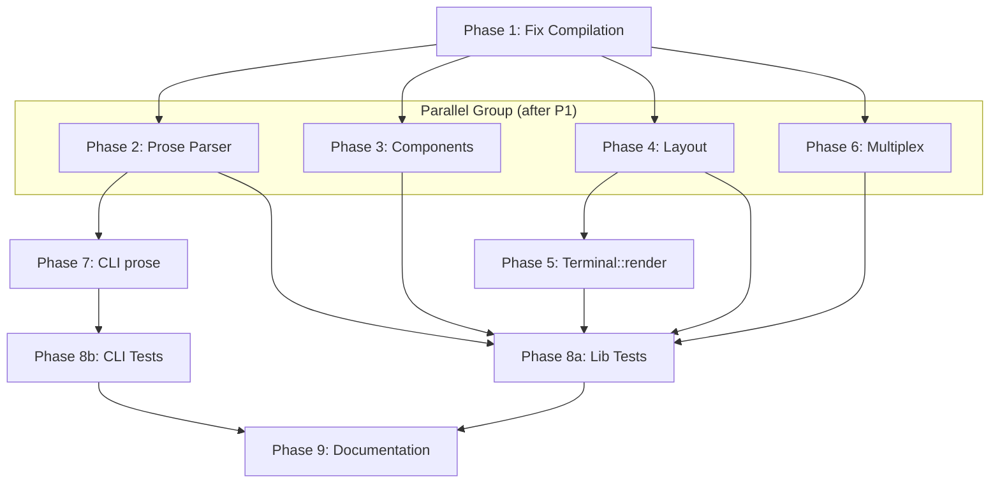

# Planning Process

- [x] Pre-flight Check [10:15]
    - [x] Directories ready
    - [x] Budget estimated: complex (~55%)
- [x] Prep Started [10:15]
    - [x] Identified Skills [10:17]
        - Required: biscuit-terminal, rust, clap
        - Suggested: color-eyre, thiserror
    - [x] Identified Subagents [10:17]
        - general-purpose: Primary agent for all phases
        - feature-tester-rust: Paired with test phase
- [x] Prep complete with ~45% context available [10:17]
- [x] Clarify & Research [10:18]
    - [x] Clarification completed
    - [x] User answered 1 question [10:18]
        - Multiplex: Full implementation (WezTerm CLI, tmux support)
    - [x] Requirements updated
- [x] Planning Subagent [agent: **Plan**] started [10:20]
    - [x] subagent skills used: **biscuit-terminal, rust, clap**
    - [x] Planning completed [10:22]
    - [x] 9 phases identified
- [x] All Pre-review Steps complete [10:22]
    - ~40% context used (budget: 55%)
- [x] Reviews Started [10:22]
   - [x] Completeness Review - 20 findings
   - [x] Concurrency Review - 6 recommendations
   - [x] Correctness Review - 12 issues identified
   - [x] Risk Assessment - 8 risks (2 HIGH, 3 MEDIUM, 3 LOW)
- [x] Reviews Completed [10:25]
    - ~35% context used (budget: 55%)
- [x] Plan Finalization started [10:26]
    - [x] subagent skills used: **rust, biscuit-terminal, clap**
    - [x] Dependency graph generated
- [x] Plan finalized [10:28]
- [x] Final Steps
    - [x] Lessons learned collected (3 items)
    - [x] Package research status checked (none needed)
- [x] Summary reported [10:30]
    - Plan: `.ai/plans/2026-02-02.plan-for-biscuit-terminal-compilation-fix.md`
    - Phases: 9 (with 8a/8b split for tests)
    - Duration: 15 minutes
    - Context: ~40% used (budget: 55%)

---

## Plan

### Phase 1: Fix Compilation Errors (BLOCKING)
**Agent:** `general-purpose` | **Skills:** rust, biscuit-terminal | **Complexity:** Low
**Deps:** None | **Parallel:** No

**Goal:** Resolve all 10 compilation errors to establish a working baseline.

**Deliver:**
1. Make functions public in `block_constraint.rs`:
   - `pub fn visible_width(content: &str) -> u32`
   - `pub fn split_at_visible_width(content: &str, width: u32) -> (String, String)`
   - `pub fn wrap_lines(lines: Vec<String>, strategy: &WordWrap, width: u32) -> Vec<String>`
2. Import `truncate` in `block_constraint.rs` from `word_wrap` module
3. Fix `Color::Basic(basic)` → `Color::BasicColor(basic)` at line 164
4. Fix `Table::render` and `Table::fallback_render` signatures to include `&self` and `layout: Option<&Layout>`
5. Complete `From<&Terminal>` impl with all 13 missing fields
6. Fix `section.rs`:
   - Change `impl Renderable for Prose` to `impl Renderable for Section`
   - Add imports: `Renderable`, `Terminal`, `Layout`
   - Change `Vec<Renderable>` to `Vec<RenderableContent>`

**Pass when:**
- [ ] `cargo check -p biscuit-terminal` succeeds with 0 errors
- [ ] All warnings reviewed (unused imports cleaned if trivial)

**If failed:**
- Rollback: `git checkout -- biscuit-terminal/lib/src/`
- Retry: Address each error individually, commit after each fix

---

### Phase 2: Implement Prose Token Parser
**Agent:** `general-purpose` | **Skills:** rust, biscuit-terminal | **Complexity:** High
**Deps:** Phase 1 | **Parallel:** Yes (with Phases 3, 4, 6)

**Goal:** Implement atomic and block token parsing for Prose component.

**Deliver:**
1. Token parsing infrastructure:
   - Atomic tokens: `{{bold}}`, `{{italic}}`, `{{red}}`, `{{bg-blue}}`, `{{reset}}`, etc.
   - Block tokens: `<b>`, `<i>`, `<u>`, `<uu>`, `<~>`, `<a href="">`, `<rgb R,G,B>`, `<clipboard>`
2. Implement `Prose::render(&self, layout: Option<&Layout>) -> String`
3. Implement `Prose::fallback_render(&self, term: &Terminal, layout: Option<&Layout>) -> String`
4. Ensure trailing `\x1b[0m` reset when styles used

**Pass when:**
- [ ] `Prose::render()` returns correctly formatted strings with escape codes
- [ ] Atomic tokens `{{bold}}`, `{{red}}` produce correct ANSI sequences
- [ ] Block tokens `<b>text</b>` produce paired escape codes
- [ ] Unit tests for token parsing pass

**If failed:**
- Rollback: Revert `prose.rs` changes
- Retry: Implement atomic tokens first, then block tokens separately

---

### Phase 3: Implement Remaining Components
**Agent:** `general-purpose` | **Skills:** rust, biscuit-terminal | **Complexity:** Medium
**Deps:** Phase 1 | **Parallel:** Yes (with Phases 2, 4, 6)

**Goal:** Replace todo!() in BlockQuote, List, Table, Section components.

**Deliver:**
1. **BlockQuote** (2 todos):
   - `render()` - left border with `│ ` prefix, apply colors, add attribution
   - `fallback_render()` - respect terminal capabilities
2. **OrderedList** (2 todos):
   - `render()` - prefix items with `1.`, `2.`, etc.
   - `fallback_render()`
3. **UnorderedList** (2 todos):
   - `render()` - prefix items with `•` or `-`
   - `fallback_render()`
4. **Table** (2 todos):
   - `render()` - calculate column widths, render headers/data with separators
   - `fallback_render()`
5. **Section** (1 todo after fixing types):
   - `render()` - render heading with level-based styling, then content

**Pass when:**
- [ ] `grep -r "todo!()" biscuit-terminal/lib/src/components/` returns only prose.rs (if Phase 2 incomplete)
- [ ] Each component can be instantiated and rendered without panic
- [ ] `cargo check -p biscuit-terminal` succeeds

**If failed:**
- Rollback: `git stash` partial changes
- Retry: Complete one component at a time

---

### Phase 4: Implement Layout RenderableWrapper
**Agent:** `general-purpose` | **Skills:** rust, biscuit-terminal | **Complexity:** Medium
**Deps:** Phase 1 | **Parallel:** Yes (with Phases 2, 3, 6)

**Goal:** Implement Layout's RenderableWrapper trait methods.

**Deliver:**
1. `Layout::render<T: Into<String>>(&self, content: T) -> String`:
   - Apply word wrapping using `wrap_lines()` from block_constraint
   - Apply left/right margins
   - Apply alignment (Left, Center, Right)
   - Handle row_fill_strategy
   - Apply page_bg_color if set
2. `Layout::fallback_render<T: Into<String>>(&self, content: T, term: &Terminal) -> String`:
   - Same as render but check terminal capabilities
   - Use terminal width for percentage-based margins

**Pass when:**
- [ ] `Layout::render()` correctly wraps content
- [ ] Margins (Chars, Percent) are applied correctly
- [ ] WordWrap strategies (WrapProse, Truncate, None) work
- [ ] `cargo check -p biscuit-terminal` succeeds

**If failed:**
- Rollback: Revert `layout.rs` changes
- Retry: Implement margins first, then word wrap, then alignment

---

### Phase 5: Implement Terminal::render()
**Agent:** `general-purpose` | **Skills:** rust, biscuit-terminal | **Complexity:** Low
**Deps:** Phase 4 | **Parallel:** No

**Goal:** Implement Terminal::render as convenience method.

**Deliver:**
```rust
pub fn render<T: Into<String>>(content: T) {
    let term = Terminal::new();
    let layout = Layout::default();
    let output = layout.fallback_render(content, &term);
    print!("{}", output);
}
```

**Pass when:**
- [ ] `Terminal::render("Hello world")` prints output
- [ ] Method respects terminal capabilities

**If failed:**
- Rollback: Keep `todo!()` in place
- Retry: Simplify to just `print!("{}", content.into())`

---

### Phase 6: Implement Multiplex Functions
**Agent:** `general-purpose` | **Skills:** rust, biscuit-terminal | **Complexity:** High
**Deps:** Phase 1 | **Parallel:** Yes (with Phases 2, 3, 4)

**Goal:** Implement all 7 multiplex functions with WezTerm and tmux support.

**Deliver:**
1. `split_vertical(term: Terminal)` - WezTerm: `wezterm cli split-pane --right`, tmux: `tmux split-window -h`
2. `split_horizontal(term: Terminal)` - WezTerm: `wezterm cli split-pane --bottom`, tmux: `tmux split-window -v`
3. `name_window(term: Terminal)` - WezTerm: `wezterm cli rename-workspace`, tmux: `tmux rename-window`
4. `switch_focus_right(term: Terminal)` - `wezterm cli activate-pane-direction right` / `tmux select-pane -R`
5. `switch_focus_left(term: Terminal)` - direction left / `-L`
6. `switch_focus_up(term: Terminal)` - direction up / `-U`
7. `switch_focus_down(term: Terminal)` - direction down / `-D`

**Pass when:**
- [ ] All 7 functions compile without `todo!()`
- [ ] Functions detect terminal type from `Terminal::app`
- [ ] Functions handle unsupported terminals gracefully (no panic)
- [ ] WezTerm commands work when running in WezTerm

**If failed:**
- Rollback: Revert `multiplex.rs`
- Retry: Implement one function at a time, test in actual terminal

---

### Phase 7: Create CLI `prose` Subcommand
**Agent:** `general-purpose` | **Skills:** clap, rust, biscuit-terminal | **Complexity:** Medium
**Deps:** Phase 2 | **Parallel:** No

**Goal:** Add `prose` subcommand to `bt` CLI.

**Deliver:**
1. Add to Command enum in `cli/src/main.rs`:
   ```rust
   /// Render prose text with inline styling tokens
   #[command(display_order = 20)]
   Prose {
       /// Content with {{tokens}} and <block>tags</block>
       #[arg(value_name = "CONTENT")]
       content: Vec<String>,

       /// Disable word wrapping
       #[arg(long)]
       no_wrap: bool,

       /// Left margin in characters
       #[arg(long, short = 'l')]
       left_margin: Option<u32>,

       /// Right margin in characters
       #[arg(long, short = 'r')]
       right_margin: Option<u32>,
   },
   ```
2. Handle the command - create Prose, configure layout, render with fallback

**Pass when:**
- [ ] `bt prose "Hello {{bold}}world{{reset}}"` outputs bold text
- [ ] `bt prose "<a href='https://example.com'>link</a>"` creates OSC8 link
- [ ] `bt --help` shows prose subcommand
- [ ] `bt prose --help` shows all options

**If failed:**
- Rollback: Remove prose subcommand from CLI
- Retry: Start with basic text only, add options incrementally

---

### Phase 8: Write Tests
**Agent:** `feature-tester-rust` | **Skills:** rust, biscuit-terminal | **Complexity:** Medium
**Deps:** Phases 2, 3, 4, 5, 6, 7 | **Parallel:** Split into 8a (lib) and 8b (CLI)

**Goal:** Comprehensive test coverage for all new implementations.

**Deliver:**
1. **Prose tests**: Token parsing (atomic + block), nested styles, edge cases
2. **Component tests**: BlockQuote, List, Table rendering
3. **Layout tests**: Margins, word wrap strategies, alignment
4. **Multiplex tests**: Command generation, unsupported terminal handling
5. **CLI tests**: `bt prose` command with various flags

**Pass when:**
- [ ] `cargo test -p biscuit-terminal` passes all tests
- [ ] `cargo test -p biscuit-terminal-cli` passes all tests
- [ ] No regressions in existing tests

**If failed:**
- Rollback: Mark failing tests with `#[ignore]`
- Retry: Fix implementation bugs revealed by tests

---

### Phase 9: Update Documentation
**Agent:** `general-purpose` | **Skills:** biscuit-terminal | **Complexity:** Low
**Deps:** All previous phases | **Parallel:** No

**Goal:** Update README files and skill documentation.

**Deliver:**
1. Update `biscuit-terminal/README.md` - Add Prose overview
2. Update `biscuit-terminal/lib/README.md` - Document Prose API, token syntax
3. Update `biscuit-terminal/cli/README.md` - Document `prose` command
4. Update `.claude/skills/biscuit-terminal/SKILL.md` - Add Prose to topics
5. Update `.claude/skills/biscuit-terminal/styling.md` - Document Prose tokens
6. Update `.claude/skills/biscuit-terminal/cli.md` - Add prose command docs

**Pass when:**
- [ ] All README files reflect current functionality
- [ ] Skill files document Prose component
- [ ] Examples in docs actually work
- [ ] `cargo doc -p biscuit-terminal --no-deps` succeeds

**If failed:**
- Rollback: `git checkout -- *.md`
- Retry: Update one file at a time

---

## Dependency Graph



**Critical Path:** P1 → P2 → P7 → P8b → P9

---

## Risks

| Level | Category | Description | Affected | Mitigation |
|-------|----------|-------------|----------|------------|
| HIGH | technical | From<&Terminal> missing 13 fields causes immediate compilation failure | Phase 1 | Reference Terminal struct definition, clone all fields |
| HIGH | technical | Prose::render() missing return statement - type mismatch | Phase 1 | Add return statement or todo!() temporarily |
| MEDIUM | scope | Prose token parser complexity underestimated | Phase 2 | Split into atomic (2a) then block (2b) tokens |
| MEDIUM | dependency | Multiplex functions depend on external wezterm/tmux CLIs | Phase 6 | Add runtime detection, graceful fallback |
| MEDIUM | technical | Layout RenderableWrapper requires complex algorithms | Phase 4 | Implement margins first, then wrap, then alignment |
| LOW | technical | Color enum variant confirmed as BasicColor | Phase 1 | Simple find/replace |
| LOW | scope | Test edge cases for malformed prose input | Phase 8 | Property-based testing with quickcheck |
| LOW | rollback | Terminal Clone impl may be affected | Phase 1 | Review all usages before modifying |

---

## Lessons Learned

- [SKILL: biscuit-terminal]: Color enum uses `BasicColor(BasicColor)` variant, not `Basic` - skill docs could clarify enum variant naming
- [FILE: section.rs]: Contains wrong impl block (`Renderable for Prose` instead of `Section`) - appears to be copy-paste error
- [PROCESS: acceptance-criteria]: All phases initially lacked testable criteria - enforcing compact format with Pass when: section is critical

---

## Package Changes

> No new dependencies needed - all required crates already present.

