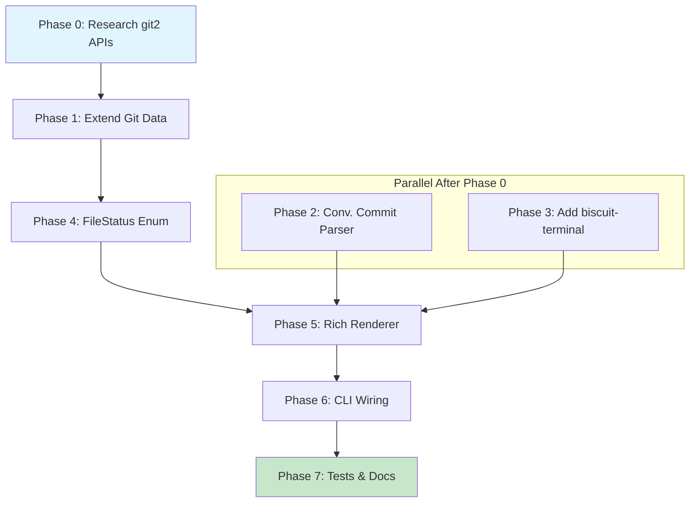

# Planning Process

- [x] Pre-flight Check [10:43am]
    - [x] Catalogs validated
    - [x] Directories ready
    - [x] Budget estimated: medium (~35%)
- [x] Prep Started [10:44am]
    - [x] Identified Skills: sniff, biscuit-terminal, terminal-design, rust
    - [x] Identified Subagents: Plan, Explore, completeness-reviewer, correctness-reviewer, risk-assessor, plan-finalizer
- [x] Prep complete [10:45am]
- [x] Clarify & Research [10:45am]
    - [x] Clarification agent returned [10:45am]
    - [x] User answered 3 questions [10:46am]
    - [x] Requirements updated (see refined requirements below)
    - [ ] Package research started (background) - N/A, no new packages
- [x] Planning Subagent [agent: **Plan**] started [10:47am]
    - [x] subagent skills used: sniff, biscuit-terminal, rust
    - [x] Planning completed [10:48am]
- [x] Module Assessment (monorepo) - Covered in Plan phase
    - [x] Impacted: sniff/lib (data structures), sniff/cli (rendering)
- [x] All Pre-review Steps complete [10:48am]
- [x] Reviews Started [10:49am]
   - [x] Completeness Review - Found 20+ issues (missing acceptance criteria across all phases, missing data population phase)
   - [x] Correctness Review - Found issues with lime color token, confirmed APIs correct
   - [x] Risk Assessment - 2 HIGH risks (GitConfig API, biscuit-terminal stability)
- [x] Reviews Completed [10:50am]
- [x] Plan Finalization started [10:51am]
    - [x] subagent skills used: sniff, biscuit-terminal, rust
    - [x] Dependency graph generated
- [x] Plan finalized [10:52am]
- [x] Final Steps
    - [x] Lessons learned collected (3 items)
    - [x] Package research status checked - biscuit-terminal already in workspace
- [x] Summary reported [10:52am]
    - Plan: 2026-02-02.plan-for-sniff-git-terminal-output.md
    - Phases: 8 (P0-P7)
    - Duration: ~9 minutes
    - Context: ~25% used (budget: 35%)

## Plan

### Phase 0: Research git2 APIs
**Agent:** `coder` | **Skills:** rust, sniff | **Complexity:** Low
**Deps:** None | **Parallel:** No

**Goal:** Verify git2 APIs for config values, ahead/behind tracking, and file status mapping.

**Deliver:**
- Research confirming `repo.config()?.get_string("user.name")?` works
- Verify `repo.graph_ahead_behind()` for tracking status
- Document `git2::Status` flag mapping to staged/modified/untracked
- Document edge cases (empty repo, detached HEAD, no remote)

**Pass when:**
- [ ] All four API patterns verified with working examples
- [ ] Edge cases documented

**If failed:**
- Rollback: N/A (research phase)
- Retry: Consult git2-rs documentation

---

### Phase 1: Extend Git Data Structures
**Agent:** `coder` | **Skills:** rust, sniff | **Complexity:** Medium
**Deps:** Phase 0 | **Parallel:** No

**Goal:** Add git config, remote tracking, and branch data to sniff-lib.

**Deliver:**
- `GitConfig` struct: user_name, user_email (Option<String>)
- `RemoteTrackingStatus` struct: ahead, behind (usize)
- `GitCommit` struct: hash, message, author
- Add to `GitInfo`: config, remote_tracking, branches, recent_commits
- Populate fields in `detect_git()` using git2 APIs

**Pass when:**
- [ ] `cargo check -p sniff-lib` succeeds
- [ ] All new fields have Serialize/Deserialize
- [ ] Empty repo case returns `None` for remote_tracking

**If failed:**
- Rollback: `git checkout -- sniff/lib/src/filesystem/git.rs`
- Retry: Add structs first, then populate incrementally

---

### Phase 2: Add Conventional Commit Parser
**Agent:** `coder` | **Skills:** rust | **Complexity:** Low
**Deps:** None | **Parallel:** Yes (with Phase 1)

**Goal:** Parse conventional commit messages into operation/scope/description.

**Deliver:**
- `ConventionalCommit` struct: operation, scope (Option), description
- `parse_conventional_commit()` function (only parses first line)
- Return `None` for operation/scope if not conventional format

**Pass when:**
- [ ] `parse("feat(cli): add flag")` returns correct struct
- [ ] `parse("regular commit")` returns None for operation
- [ ] No panics on malformed input

**If failed:**
- Rollback: Remove parser function
- Retry: Simplify to extract first line as description only

---

### Phase 3: Add biscuit-terminal Dependency
**Agent:** `coder` | **Skills:** rust | **Complexity:** Low
**Deps:** None | **Parallel:** Yes (with Phases 1-2)

**Goal:** Add biscuit-terminal-lib as dependency to sniff-cli.

**Deliver:**
- Add path dependency to `sniff/cli/Cargo.toml`
- Verify library compiles

**Pass when:**
- [ ] `cargo check -p sniff-cli` succeeds
- [ ] No version conflicts

**If failed:**
- Rollback: Remove dependency from Cargo.toml
- Retry: Check biscuit-terminal compiles first

---

### Phase 4: Differentiate Staged vs Modified Files
**Agent:** `coder` | **Skills:** rust, sniff | **Complexity:** Medium
**Deps:** Phase 1 | **Parallel:** No

**Goal:** Distinguish staged, modified, and both using git2::Status.

**Deliver:**
- `FileStatus` enum: Staged, Modified, Both, Untracked
- `FileChange` struct: path, status
- Update `GitInfo.file_changes: Vec<FileChange>`
- Map git2::Status flags correctly

**Pass when:**
- [ ] Staged file shows `FileStatus::Staged`
- [ ] Modified unstaged shows `FileStatus::Modified`
- [ ] File staged then modified shows `FileStatus::Both`

**If failed:**
- Rollback: Keep Vec<String> for changed_files
- Retry: Add enum first, populate separately

---

### Phase 5: Implement Rich Git Output Renderer
**Agent:** `coder` | **Skills:** rust, biscuit-terminal, sniff | **Complexity:** High
**Deps:** Phase 1, 2, 3, 4 | **Parallel:** No

**Goal:** Create `print_git_rich()` with two-section format.

**Deliver:**
- **Status Section** (as UnorderedList):
  - Recent commits with conventional parsing: `<b><yellow>{op}</yellow></b>(<dim>{scope}</dim>) <i>on</i> <blue><b>{date}</b></blue>` + BlockQuote(message)
  - Staged: `<lime>staged: path/<b>filename</b></lime>`
  - Modified: `<red>modified: path/<b>filename</b></red>`
  - Untracked: `<yellow>untracked: path/<b>filename</b></yellow>`
- **Meta Section**:
  - Remote tracking: `{remote}: {ahead} ahead, {behind} behind`
  - Branch: `<b>{current}</b> <dim>({other}, {branches})</dim>`
  - Config: user.name, user.email
- Section titles: `<b><u>Status</u></b>` and `<b><u>Meta</u></b>`

**Pass when:**
- [ ] Output shows two distinct sections
- [ ] Section titles are bold AND underlined
- [ ] Staged files show lime color
- [ ] Modified files show red color
- [ ] Commits show BlockQuote for messages

**If failed:**
- Rollback: Revert renderer file
- Retry: Implement Section 1 first, test, then Section 2

---

### Phase 6: Update CLI Entry Point
**Agent:** `coder` | **Skills:** rust, clap | **Complexity:** Low
**Deps:** Phase 5 | **Parallel:** No

**Goal:** Wire rich renderer as default for `sniff git` text output.

**Deliver:**
- Replace `print_git_section()` call with `print_git_rich()`
- Keep JSON output unchanged for `--json` flag

**Pass when:**
- [ ] `sniff git` outputs rich format
- [ ] `sniff git --json` outputs JSON (unchanged)

**If failed:**
- Rollback: Restore `print_git_section()` call
- Retry: Add feature flag for toggle

---

### Phase 7: Testing and Documentation
**Agent:** `feature-tester-rust` | **Skills:** rust | **Complexity:** Low
**Deps:** Phase 6 | **Parallel:** No

**Goal:** Add tests and update documentation.

**Deliver:**
- Tests for conventional commit parser
- Tests for FileStatus mapping
- Update CLI README with example output

**Pass when:**
- [ ] `cargo test -p sniff-lib` passes
- [ ] `cargo test -p sniff-cli` passes
- [ ] README examples are accurate

**If failed:**
- Rollback: Mark failing tests with `#[ignore]`
- Retry: Fix bugs revealed by tests

## Dependency Graph

**Critical Path:** P0 → P1 → P4 → P5 → P6 → P7

## Risks

> Implementation risks identified during planning with mitigation strategies.

| Level | Category | Description | Affected | Mitigation |
|-------|----------|-------------|----------|------------|
| HIGH | scope | Missing GitConfig field specs - no detail on git2 config API | Phase 1, 4 | Research git2::Config API before implementing |
| HIGH | dependency | biscuit-terminal path dep may have instabilities | Phase 3, 4, 6 | Verify cargo check -p biscuit-terminal-lib first |
| MEDIUM | technical | Conventional commit parser edge cases | Phase 2, 4 | Define clear parser behavior, use Option return |
| MEDIUM | scope | FileStatus differentiation underspecified | Phase 5 | Clarify enum on DirtyFile, map git2::Status flags |
| MEDIUM | technical | Prose color tokens (lime vs green) | Phase 4 | Verify actual tokens in prose.rs |
| LOW | rollback | print_git_section replacement | Phase 6 | Create feature branch, rename old function |

## Lessons Learned

> Discoveries about skills or memory resources that were inaccurate, incomplete, or missing.

- [SKILL: biscuit-terminal]: Confirmed `<lime>` exists as web color in Prose (line 795) - skill documentation could highlight all available web colors
- [API: git2]: Research phase critical for verifying unfamiliar APIs - prevents rework later
- [PROCESS: phase-dependency]: FileStatus (P4) must complete before renderer (P5) - data structure changes affect rendering

## Package Changes

> Dependencies to be added, updated, or removed during implementation.

- [ADD]: biscuit-terminal-lib in sniff/cli/Cargo.toml - for rich terminal rendering with Prose, BlockQuote, UnorderedList components
  - Research status: N/A (workspace dependency, already available)
