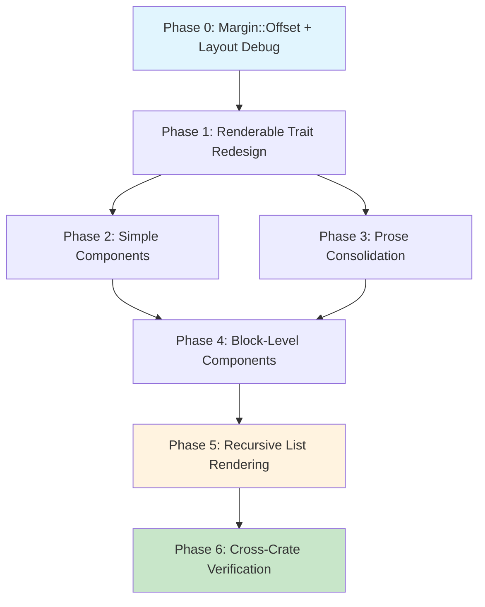

# Planning Process

- [x] Pre-flight Check [13:05]
    - [x] Directories ready
    - [x] Budget estimated: medium-high (~45%)
- [x] Prep Started [13:05]
    - [x] Identified Skills: biscuit-terminal, rust
    - [x] Explored codebase: Layout, Margin, Renderable, all 9 components
    - [x] Explored darkmatter: does NOT use Renderable trait (only TerminalImage, Mermaid directly)
- [x] Prep complete
- [x] Clarify & Research [13:06]
    - [x] Clarification agent returned [13:06]
    - [x] User answered 3 questions [13:07]
    - [x] Requirements updated [13:07]
- [x] Planning Subagent [agent: **Plan**] started [13:08]
    - [x] subagent skills used: **biscuit-terminal, rust**
    - [x] Planning completed [13:09]
- [x] Reviews Started [13:09]
   - [x] Completeness Review
   - [x] Correctness Review
   - [x] Risk Assessment
- [x] Reviews Completed [13:10]
- [x] Plan Finalization started [13:10]
    - [x] subagent skills used: **rust, biscuit-terminal**
    - [x] Dependency graph generated
- [x] Plan finalized [13:12]

## Plan

### Phase 0: Foundation - Margin::Offset and Layout Debug
**Agent:** `general-purpose` | **Skills:** rust, biscuit-terminal | **Complexity:** Low
**Deps:** None | **Parallel:** No

**Goal:** Add Margin::Offset variant and Layout utilities for lazy margin composition.

**Deliver:**
- `Margin::Offset(Box<Margin>, u32)` variant added to enum in `layout.rs`
- `Margin::add_chars(self, u32) -> Margin` method with optimization (None→Chars, Chars→Chars addition, other→Offset)
- `resolve_margin` updated to handle Offset variant recursively, made **public**
- `Layout::available_width(&self, terminal_width: u32) -> u32` method added (public)
- `Layout::apply_layout()` made **public** (for Terminal::render() and components to call directly)
- `#[derive(Debug, Clone)]` added to Layout struct (currently only `#[derive(Clone)]`)
- Unit tests: margin composition (None, Chars, Percent, nested Offset), available_width

**Pass when:**
- [ ] `Margin::Chars(2).add_chars(4)` → `Margin::Chars(6)`
- [ ] `Margin::None.add_chars(4)` → `Margin::Chars(4)`
- [ ] `Margin::Percent(10.0).add_chars(4)` resolves to 14 at width 100
- [ ] `Layout::available_width(80)` with Chars(10) left/right → 60
- [ ] `cargo test -p biscuit-terminal-lib -- layout` passes
- [ ] Layout implements Debug

**If failed:**
- Rollback: Revert layout.rs changes only
- Retry: Check if Color type needs Debug added first

---

### Phase 1: Renderable Trait Redesign
**Agent:** `general-purpose` | **Skills:** rust, biscuit-terminal | **Complexity:** High
**Deps:** Phase 0 | **Parallel:** No

**Goal:** Redesign the Renderable trait signatures and handle RenderableWrapper migration.

**Deliver:**
- In `renderable.rs`:
  - `render(&self, layout: Option<&Layout>)` → `render(&self, term_width: Option<u32>)`
  - `fallback_render(&self, term: &Terminal, layout: Option<&Layout>)` → `fallback_render(&self, term: &Terminal)`
  - Add required: `fn layout(&self) -> &Layout` and `fn layout_mut(&mut self) -> &mut Layout`
  - Add default-impl builders (7): `left_margin`, `right_margin`, `top_margin`, `bottom_margin`, `alignment`, `row_fill_strategy`, `word_wrap` — all `Self: Sized`
  - Add `fn is_block_level(&self) -> bool` (default `false`)
  - Add `fn as_child_of(mut self, parent: &Layout, left_offset: u32, right_offset: u32) -> Self where Self: Sized` — uses `parent.left_margin.clone().add_chars(left_offset)` (clone required since parent is &Layout)
  - Remove `RenderableWrapper` trait definition and re-export from `renderable.rs`
- Update `RenderableContent::as_text()`: `c.fallback_render(&term, None)` → `c.fallback_render(&term)`
- RenderableWrapper migration:
  - Keep trait definition in `layout.rs` for color wrappers to continue implementing
  - Remove `impl RenderableWrapper for Layout` — Layout now exposes `apply_layout()` directly
- Update `Terminal::render()` in `terminal.rs`: call `layout.apply_layout(content, term.width())` instead of `layout.fallback_render(content, &term)`

**Pass when:**
- [ ] Renderable trait compiles with new signatures
- [ ] Builder methods have `Self: Sized` (excluded from dyn dispatch)
- [ ] `layout()` and `layout_mut()` are object-safe
- [ ] RenderableWrapper removed from `renderable.rs` public API
- [ ] RenderableWrapper trait still exists in `layout.rs` for color wrappers
- [ ] Terminal::render() compiles without RenderableWrapper
- [ ] `cargo check -p biscuit-terminal-lib` compiles (component errors expected, trait is correct)

**If failed:**
- Rollback: Revert renderable.rs, layout.rs, terminal.rs
- Retry: If color wrappers break, keep RenderableWrapper temporarily

---

### Phase 2: Update Simple Components (TextBlock, Todo, TerminalImage)
**Agent:** `general-purpose` | **Skills:** rust, biscuit-terminal | **Complexity:** Medium
**Deps:** Phase 1 | **Parallel:** Yes (with Phase 3)

**Goal:** Add layout field to 3 simple inline components, update render signatures.

**Deliver:**
- For **TextBlock**, **Todo**, **TerminalImage**:
  - Add `layout: Layout` field
  - Initialize in Default, new(), From impls
  - Implement `layout()` → `&self.layout`, `layout_mut()` → `&mut self.layout`
  - Update `render(term_width: Option<u32>)` — use `term_width.unwrap_or(80)`, apply `self.layout`
  - Update `fallback_render(term: &Terminal)` — use `term.width()`
  - TextBlock/Todo: replace `layout.render(content)` (RenderableWrapper) with `self.layout.apply_layout(content, width)`
- Update all existing tests for new call signatures

**Pass when:**
- [ ] `cargo test -p biscuit-terminal-lib -- text_block` passes
- [ ] `cargo test -p biscuit-terminal-lib -- todo` passes
- [ ] `cargo test -p biscuit-terminal-lib -- terminal_image` passes
- [ ] No RenderableWrapper imports in these files

**If failed:**
- Rollback: Revert 3 component files
- Retry: Fix one component at a time

---

### Phase 3: Update Prose Component (Layout Field Consolidation)
**Agent:** `general-purpose` | **Skills:** rust, biscuit-terminal | **Complexity:** Medium
**Deps:** Phase 1 | **Parallel:** Yes (with Phase 2)

**Goal:** Consolidate Prose's individual layout fields into self.layout, migrate builder methods.

**Deliver:**
- Remove individual fields from Prose struct: `word_wrap: Option<WordWrap>`, `left_margin: Option<Margin>`, `right_margin: Option<Margin>`
- Add `layout: Layout` field
- Migrate builder methods to set self.layout fields:
  - `with_word_wrap(wrap)` → `self.layout.word_wrap = wrap`
  - `with_left_margin(m)` → `self.layout.left_margin = m`
  - `with_right_margin(m)` → `self.layout.right_margin = m`
- Implement `layout()` and `layout_mut()` accessors
- Update `render(term_width: Option<u32>)` — read from `self.layout` instead of merging two layouts
- Update `fallback_render(term: &Terminal)` — same
- Update all existing Prose tests

**Pass when:**
- [ ] Prose has single `layout: Layout` field (no individual word_wrap/margin fields)
- [ ] `Prose::new("text").with_left_margin(Margin::Chars(4))` sets `self.layout.left_margin`
- [ ] `cargo test -p biscuit-terminal-lib -- prose` passes
- [ ] Builder pattern still works identically

**If failed:**
- Rollback: Restore individual fields
- Retry: Keep individual fields as Option overlays temporarily

---

### Phase 4: Update Block-Level Components
**Agent:** `general-purpose` | **Skills:** rust, biscuit-terminal | **Complexity:** High
**Deps:** Phase 2, Phase 3 | **Parallel:** No

**Goal:** Add layout field to all 5 block-level components, update signatures, add indent_children.

**Deliver:**
- For **OrderedList**, **UnorderedList**, **BlockQuote**, **Section**, **Table**:
  - Add `layout: Layout` field, initialize in all constructors
  - Implement `layout()`, `layout_mut()`, override `is_block_level()` → `true`
  - Change `render_content(&self, term: Option<&Terminal>, layout: Option<&Layout>)` → `render_content(&self, term_width: u32)`
  - Update child rendering: `component.render(Some(width))` / `component.fallback_render(term)`
- **OrderedList**: add `indent_children: u32` (default 4), builder `with_indent_children(u32)`
- **UnorderedList**: add `indent_children: Option<u32>` (default None = bullet width), builder
- **BlockQuote**: reduce child width by 2 (border "│ " width) when rendering children
- **Section**: pass `self.layout.available_width(term_width)` to children
- **Table**: update cell rendering to use term_width
- Update all existing tests

**Pass when:**
- [ ] All 5 components compile with `layout` field and `is_block_level() = true`
- [ ] `render_content()` uses `term_width: u32` (no layout param)
- [ ] `cargo test -p biscuit-terminal-lib -- list` passes
- [ ] `cargo test -p biscuit-terminal-lib -- block_quote` passes
- [ ] `cargo test -p biscuit-terminal-lib -- section` passes
- [ ] `cargo test -p biscuit-terminal-lib -- table` passes
- [ ] `cargo check -p biscuit-terminal-lib` — zero errors

**If failed:**
- Rollback: Revert 5 component files
- Retry: One component at a time, verifying compilation between each

---

### Phase 5: Recursive List Rendering
**Agent:** `general-purpose` | **Skills:** rust, biscuit-terminal | **Complexity:** High
**Deps:** Phase 4 | **Parallel:** No

**Goal:** Implement recursive rendering — block-level children get no bullets and indented output.

**Deliver:**
- **OrderedList** render logic:
  - `RenderableContent::String(s)` → prepend `"{n}. "` prefix
  - `RenderableContent::Component(c)` where `c.is_block_level() == true` → NO prefix, render with `child_width = term_width - indent_children`, indent each output line by `indent_children` spaces
  - `RenderableContent::Component(c)` where `c.is_block_level() == false` → prepend `"{n}. "` prefix, render inline
- **UnorderedList** render logic: same pattern with bullet, `indent_children` defaults to `visible_width(&self.bullet)`
- Tests:
  - Nested OrderedList: `"1. First\n    1. Nested A\n    2. Nested B"`
  - 3-level nesting: width compounds (80 → 76 → 72)
  - Mixed inline + block children in same list
  - Width constraint: no output line exceeds term_width
  - Empty nested list
  - Mixed OrderedList containing UnorderedList child

**Pass when:**
- [ ] Nested OrderedList renders without double bullets
- [ ] 3-level nesting indents correctly (0, 4, 8 spaces)
- [ ] No output line exceeds term_width
- [ ] Mixed inline/block children render correctly
- [ ] `cargo test -p biscuit-terminal-lib -- list` passes all new + existing tests

**If failed:**
- Rollback: Revert to Phase 4 list rendering (flat, no recursion)
- Retry: Implement OrderedList first, then replicate for UnorderedList

---

### Phase 6: Cross-Crate Verification
**Agent:** `general-purpose` | **Skills:** rust, biscuit-terminal | **Complexity:** Low
**Deps:** Phase 5 | **Parallel:** No

**Goal:** Verify entire workspace builds, tests pass, and darkmatter integrates correctly.

**Deliver:**
- `cargo build --workspace` — no compilation errors
- `cargo test --workspace` — all tests pass
- `cargo test -p darkmatter-lib` — darkmatter still works
- `cargo clippy -p biscuit-terminal-lib` — no new warnings
- Verify color wrappers still function (RenderableWrapper in layout.rs)

**Pass when:**
- [ ] `cargo build --workspace` succeeds
- [ ] `cargo test --workspace` passes
- [ ] `cargo test -p darkmatter-lib` passes
- [ ] `cargo clippy -p biscuit-terminal-lib` clean

**If failed:**
- Rollback: Identify broken crate, fix API usage
- Retry: Check darkmatter's TerminalImage/Mermaid usage specifically

## Dependency Graph

**Critical Path:** P0 → P1 → P4 → P5 → P6

**Parallel opportunity:** Phase 2 and Phase 3 can run concurrently after Phase 1.

## Risks

> Implementation risks identified during planning with mitigation strategies.

| Level | Category | Description | Affected | Mitigation |
|-------|----------|-------------|----------|------------|
| HIGH | technical | Prose has individual layout fields (word_wrap, left_margin, right_margin) that must be consolidated into self.layout — complex merge logic | Phase 3 | Keep with_* methods as builders that set self.layout fields; test before/after behavior matches |
| HIGH | technical | RenderableWrapper used by Layout AND 4 color wrappers AND Terminal::render() | Phase 1 | Keep trait in layout.rs for color wrappers; remove only Layout's impl and renderable.rs re-export |
| HIGH | scope | Terminal::render() calls layout.fallback_render() via RenderableWrapper — will break | Phase 1 | Explicit deliverable: update to call layout.apply_layout() directly |
| HIGH | technical | Breaking Renderable trait change affects all 9 implementors | Phase 1-5 | darkmatter verified safe; strict phase ordering; rollback guidance per phase |
| MEDIUM | technical | render_content() internal signatures need updating across 5 block-level components | Phase 4 | Change to render_content(&self, term_width: u32) — remove layout param |

## Lessons Learned

> Discoveries about skills or memory resources that were inaccurate, incomplete, or missing.

- [SKILL: biscuit-terminal]: Skill does not mention that Layout only derives Clone (no Debug) — important for component struct derives
- [SKILL: biscuit-terminal]: Skill does not document RenderableWrapper usage by color wrappers in color.rs — only mentions it on Layout
- [FINDING: darkmatter]: darkmatter-lib does NOT use Renderable trait at all — CLAUDE.md implies it does ("external consumers of the trait")

## Package Changes

> Dependencies to be added, updated, or removed during implementation.

- No new packages — this is internal refactoring within biscuit-terminal-lib
