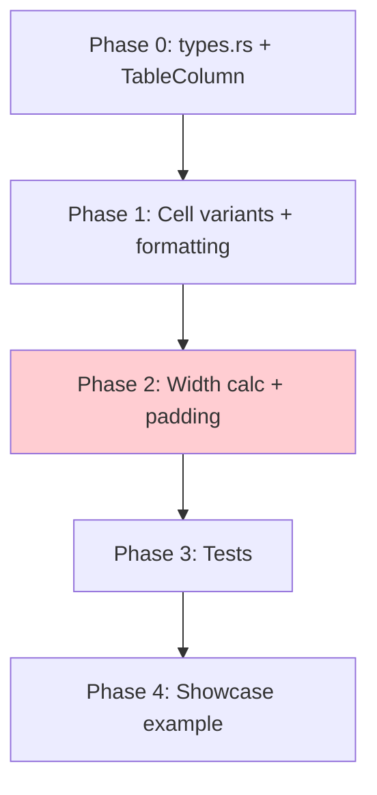

# Planning Process

- [x] Pre-flight Check
    - [x] Directories ready
    - [x] Budget estimated: medium (~45%)
- [x] Prep Started
    - [x] Identified Skills: biscuit-terminal
    - [x] Identified Subagents: Plan, feature-tester-rust
- [x] Prep complete
- [x] Clarify & Research
    - [x] Clarification agent returned (4 questions)
    - [x] User answered 4 questions
    - [x] Requirements updated (see frontmatter)
- [x] Planning Subagent [agent: **Plan**] started
    - [x] subagent skills used: biscuit-terminal
    - [x] Planning completed
- [x] Reviews Started
   - [x] Completeness Review
   - [x] Concurrency Review
   - [x] Correctness Review
   - [x] Risk Assessment
- [x] Reviews Completed
- [x] Plan Finalization started
    - [x] subagent skills used: biscuit-terminal
    - [x] Dependency graph generated
- [x] Plan finalized
- [x] Summary reported

## Plan

### Phase 0: Rewrite types.rs with ColumnType and Currency

**Agent:** `feature-tester-rust` | **Skills:** biscuit-terminal | **Complexity:** Medium
**Deps:** None | **Parallel:** No

**Goal:** Establish the type system foundation. Move `Currency` enum to `types.rs`, create `ColumnType` enum, and extend `TableColumn` with type and alignment fields. Reuse `Alignment` from `crate::utils::layout`.

**Deliver:**

- Rewrite `biscuit-terminal/lib/src/components/table/types.rs`:
  - `ColumnType` enum: `String`, `Integer`, `Float`, `Currency(Currency)`
  - `ColumnType::default_alignment() -> Alignment` method (String=Left, others=Right)
  - `impl Default for ColumnType` returning `String`
  - `Currency` enum (moved from table.rs) with `symbol() -> &'static str` ("$", "\u{00a3}", "\u{20ac}")
- Update `biscuit-terminal/lib/src/components/table/mod.rs`:
  - Add `pub mod types;`
- Update `TableColumn` in `table.rs`:
  - Add `column_type: ColumnType` field (default `ColumnType::String`)
  - Add `alignment: Option<Alignment>` field (default `None`)
  - Add `with_type(ColumnType) -> Self` builder
  - Add `with_alignment(Alignment) -> Self` builder
  - Add `effective_alignment() -> Alignment` (returns explicit or type default)
- Remove `Currency` enum from `table.rs` (replaced by types.rs version)
- Grep for external `Currency` usage before removing; add re-export if needed

**Pass when:**
- [ ] `cargo check -p biscuit-terminal` succeeds
- [ ] `ColumnType::String.default_alignment()` returns `Alignment::Left`
- [ ] `ColumnType::Integer.default_alignment()` returns `Alignment::Right`
- [ ] `ColumnType::Float.default_alignment()` returns `Alignment::Right`
- [ ] `ColumnType::Currency(Currency::USD).default_alignment()` returns `Alignment::Right`
- [ ] `Currency::USD.symbol()` returns `"$"`, GBP returns `"\u{00a3}"`, EUR returns `"\u{20ac}"`
- [ ] `TableColumn::new("X").with_type(ColumnType::Integer).effective_alignment()` returns `Right`
- [ ] `TableColumn::new("X").with_type(ColumnType::Integer).with_alignment(Alignment::Center).effective_alignment()` returns `Center`
- [ ] Existing 3 tests still pass

**If failed:**
- Rollback: `git checkout biscuit-terminal/lib/src/components/table/`
- Retry: Fix import paths; if Currency move breaks externals, add `pub use types::Currency;` in table.rs

---

### Phase 1: Revive TableCellContent variants with safe formatting

**Agent:** `feature-tester-rust` | **Skills:** biscuit-terminal | **Complexity:** Medium
**Deps:** Phase 0 | **Parallel:** No

**Goal:** Uncomment typed cell variants and implement formatting functions using safe algorithms. US locale (comma separator) hardcoded for MVP.

**Deliver:**

- Uncomment `TableCellContent` variants:
  ```rust
  pub enum TableCellContent {
      Text(String),
      Integer(i64),
      Float(f64),
      Currency(Currency, f64),
  }
  ```
- Formatting functions (private to table.rs):
  - `format_integer(i64) -> String` — thousands separators via `insert_thousands_separators()`
  - `format_float(f64) -> String` — use `format!("{:.2}", value.abs())` then split at `.` to insert thousands separators on integer part only; handle NaN -> "NaN", Infinity -> "\u{221e}", -Infinity -> "-\u{221e}"
  - `format_currency(&Currency, f64) -> String` — `format!("{}{}", currency.symbol(), format_float(value))` with negative sign before symbol for negative amounts
  - `insert_thousands_separators(&str) -> String` — iterate chars, insert comma when `(len - i) % 3 == 0 && i > 0`
- `Display` impl for `TableCellContent` delegating to format functions
- `From<i64>` impl -> `TableCellContent::Integer(value)`
- `From<f64>` impl -> `TableCellContent::Float(value)`
  (No conflict: `i64`/`f64` do NOT implement `Into<String>` in Rust stdlib)
- Update `calculate_column_widths`: `let cell_width = visible_width(&cell.to_string()) as usize;`
- Update `render_content`: `let content = cell.to_string();`

**Pass when:**
- [ ] `format_integer(1_234_567)` returns `"1,234,567"`
- [ ] `format_integer(-42)` returns `"-42"`
- [ ] `format_integer(0)` returns `"0"`
- [ ] `format_float(1234.5)` returns `"1,234.50"`
- [ ] `format_float(0.0)` returns `"0.00"`
- [ ] `format_float(f64::NAN)` returns `"NaN"`
- [ ] `format_float(f64::INFINITY)` returns `"\u{221e}"`
- [ ] `format_currency(&Currency::USD, 1234.56)` returns `"$1,234.56"`
- [ ] `format_currency(&Currency::GBP, 99.0)` returns `"\u{00a3}99.00"`
- [ ] `TableCellContent::from(42i64)` creates `Integer(42)`
- [ ] `TableCellContent::from(3.14f64)` creates `Float(3.14)`
- [ ] `cargo check -p biscuit-terminal` succeeds

**If failed:**
- Rollback: Re-comment variants, restore match arms
- Retry: Verify format!("{:.2}") produces expected output; test formatting functions in isolation

---

### Phase 2: Fix width calculation and cell padding

**Agent:** `feature-tester-rust` | **Skills:** biscuit-terminal | **Complexity:** High
**Deps:** Phase 1 | **Parallel:** No

**Goal:** Replace all naive byte-length calculations with `visible_width()` and implement alignment-aware padding that preserves escape codes. This is the critical correctness fix that prevents misalignment with ANSI colors and OSC8 links.

**Deliver:**

- Import `use crate::utils::block_constraint::visible_width;` and `use crate::utils::layout::Alignment;`
- New private function `pad_cell(content: &str, width: usize, alignment: Alignment) -> String`:
  ```rust
  fn pad_cell(content: &str, width: usize, alignment: Alignment) -> String {
      let visible = visible_width(content) as usize;
      let padding = width.saturating_sub(visible);
      match alignment {
          Alignment::Left => format!("{}{}", content, " ".repeat(padding)),
          Alignment::Right => format!("{}{}", " ".repeat(padding), content),
          Alignment::Center => {
              let left = padding / 2;
              let right = padding - left;
              format!("{}{}{}", " ".repeat(left), content, " ".repeat(right))
          }
      }
  }
  ```
- Fix `calculate_column_widths()`:
  - Header: `col.header.len()` -> `visible_width(&col.header) as usize`
  - Cell: already `visible_width(&cell.to_string()) as usize` from Phase 1
- Fix `render_content()` header padding:
  - `format!("{:width$}", col.header)` -> `pad_cell(&col.header, width, Alignment::Left)`
  - Headers always left-aligned (convention)
- Fix `render_content()` data cell padding:
  - `format!("{:width$}", content)` -> `pad_cell(&content, width, col.effective_alignment())`
  - Look up column via `self.columns.get(i)` for alignment; default to `Alignment::Left` for extra columns

**Pass when:**
- [ ] `pad_cell("hello", 10, Alignment::Left)` returns `"hello     "`
- [ ] `pad_cell("hello", 10, Alignment::Right)` returns `"     hello"`
- [ ] `pad_cell("hi", 10, Alignment::Center)` returns `"    hi    "`
- [ ] `pad_cell("\x1b[31mred\x1b[0m", 10, Alignment::Left)` has `visible_width` of 10 (7 spaces added for 3-char "red")
- [ ] `pad_cell("\x1b]8;;https://example.com\x07click\x1b]8;;\x07", 10, Alignment::Right)` has `visible_width` of 10
- [ ] Table with colored cells: all data rows have same visible width as header
- [ ] Table with OSC8 links: all data rows have same visible width as header
- [ ] Integer columns right-align by default
- [ ] String columns left-align by default
- [ ] `cargo test -p biscuit-terminal` passes

**If failed:**
- Rollback: Revert pad_cell usage, restore format! calls
- Retry: Verify `visible_width` import path; check edge cases (empty string, zero width, content wider than width)

---

### Phase 3: Comprehensive tests

**Agent:** `feature-tester-rust` | **Skills:** biscuit-terminal | **Complexity:** Medium
**Deps:** Phase 2 | **Parallel:** No

**Goal:** Add thorough inline tests covering escape codes, OSC8 hyperlinks, numeric formatting, alignment, and edge cases. Tests must verify visible alignment is maintained when cells contain escape codes.

**Deliver:**

Add to `#[cfg(test)] mod tests` in table.rs:

**pad_cell tests:**
- `test_pad_cell_left_alignment` — plain text left-padded
- `test_pad_cell_right_alignment` — plain text right-padded
- `test_pad_cell_center_alignment` — plain text centered
- `test_pad_cell_with_ansi_colors` — `"\x1b[31mred\x1b[0m"` padded to 10, visible_width == 10
- `test_pad_cell_with_osc8_link` — `"\x1b]8;;https://example.com\x07click\x1b]8;;\x07"` padded, visible_width == target
- `test_pad_cell_with_mixed_escape_and_osc8` — cell with both ANSI color AND OSC8 link

**Table rendering tests:**
- `test_table_with_colored_cells_alignment` — all rows same visible width
- `test_table_with_osc8_links` — hyperlinked cells maintain alignment with plain cells
- `test_table_with_empty_cells` — empty cells in typed columns render correctly

**Formatting tests:**
- `test_format_integer_positive`, `test_format_integer_negative`, `test_format_integer_zero`, `test_format_integer_large`
- `test_format_float_normal`, `test_format_float_zero`, `test_format_float_nan`, `test_format_float_infinity`
- `test_format_currency_usd`, `test_format_currency_gbp`, `test_format_currency_eur`
- `test_format_currency_negative` — negative amounts
- `test_format_currency_zero`

**Alignment tests:**
- `test_numeric_column_right_alignment` — Integer column auto-right-aligns
- `test_explicit_alignment_override` — override Integer to Center
- `test_default_string_left_alignment`

**Pass when:**
- [ ] `cargo test -p biscuit-terminal -- table` passes all tests
- [ ] Tests with ANSI escape codes verify visible width, not byte length
- [ ] Tests with OSC8 links verify alignment is maintained
- [ ] Mixed escape code test (ANSI + OSC8 in same cell) passes
- [ ] Negative currency formatting is tested
- [ ] Empty cells render without panic

**If failed:**
- Rollback: Remove new test functions
- Retry: Fix test expectations to match actual formatting; common issue will be off-by-one in padding

---

### Phase 4: Feature showcase example

**Agent:** `feature-tester-rust` | **Skills:** biscuit-terminal | **Complexity:** Low
**Deps:** Phase 3 | **Parallel:** No

**Goal:** Create a comprehensive example binary that demonstrates all Table capabilities and serves as visual regression documentation.

**Deliver:**

New file: `biscuit-terminal/lib/examples/table_showcase.rs`

Sections:
1. **Product Catalog** — String, Integer, Float, Currency(USD) columns with 3+ rows
2. **Service Status** — Colored cell content (`\x1b[32m\u{25cf} Online\x1b[0m`, `\x1b[31m\u{25cf} Offline\x1b[0m`)
3. **Programming Languages** — OSC8 hyperlinked names, Integer year column
4. **Exchange Rates** — Multi-currency (USD, GBP, EUR) in same table
5. **Grade Distribution** — Center-aligned override on both columns

Each section prints a labeled header and renders the table with `table.render(Some(80))`.

**Pass when:**
- [ ] `cargo run -p biscuit-terminal --example table_showcase` runs without errors
- [ ] All 5 sections render with correct alignment
- [ ] Colored cells in section 2 show correct alignment (no extra spaces)
- [ ] OSC8 links in section 3 are clickable in supported terminals
- [ ] Multi-currency symbols ($, \u{00a3}, \u{20ac}) display correctly
- [ ] Center-aligned section shows centered content

**If failed:**
- Rollback: `rm biscuit-terminal/lib/examples/table_showcase.rs`
- Retry: Fix import paths; verify module re-exports

## Dependency Graph



**Critical path:** P0 -> P1 -> P2 -> P3 -> P4 (all sequential, real dependencies)

**Bottleneck:** Phase 2 is the highest-complexity phase (escape-aware padding).

## Files Changed

| File | Action | Phase |
|------|--------|-------|
| `biscuit-terminal/lib/src/components/table/types.rs` | Rewrite | 0 |
| `biscuit-terminal/lib/src/components/table/mod.rs` | Add export | 0 |
| `biscuit-terminal/lib/src/components/table/table.rs` | Heavy modify | 0-3 |
| `biscuit-terminal/lib/examples/table_showcase.rs` | Create | 4 |

## Risks

> Implementation risks identified during planning with mitigation strategies.

| Level | Category | Description | Affected | Mitigation |
|-------|----------|-------------|----------|------------|
| HIGH | technical | Floating-point precision in format_float using trunc/fract | Phase 1 | Use `format!("{:.2}", value)` then split at decimal; don't use manual arithmetic |
| MEDIUM | rollback | Currency enum relocation may break external imports | Phase 0 | Grep for usage before moving; add re-export fallback |
| MEDIUM | technical | format_float edge cases (NaN, Infinity, -0.0) | Phase 1 | Explicit match arms for NaN/Infinity before numeric formatting |
| MEDIUM | scope | Locale-specific number formatting (commas vs dots) | Phase 1 | Hardcode US convention (comma separator) for MVP; document as future enhancement |
| LOW | technical | visible_width import path may need verification | Phase 2 | block_constraint.rs confirmed as pub mod; import path validated |

## Lessons Learned

> Discoveries about skills or memory resources that were inaccurate, incomplete, or missing.

- [SKILL: biscuit-terminal]: README.md for table component documents `types.rs` as "Future type definitions" but the file contains broken stubs referencing undefined types (CurrencyOptions, MetricOptions, ColumnAlignment). The skill/docs should note these are non-compiling placeholders.

## Package Changes

> Dependencies to be added, updated, or removed during implementation.

None required. All needed crates are already present:
- `unicode-width` 0.2 (for visible_width)
- `regex` 1.11 (for escape code stripping)

## Rejected Recommendations

| Source | Recommendation | Reason |
|--------|---------------|--------|
| concurrency-reviewer | Split Phase 2 into parallel sub-phases | Dependencies are real; splitting adds coordination overhead for marginal benefit |
| concurrency-reviewer | Add rayon for parallel row iteration in width calc | Tables are small; rayon would be over-engineering |
| risk-assessor | Blanket From<T> conflicts with From<i64>/From<f64> | Incorrect: i64/f64 do NOT implement Into<String> in Rust. No conflict exists. |
| completeness-reviewer | Add ColumnAlignment separate from layout::Alignment | Unnecessary duplication; layout::Alignment already has Left/Center/Right |
