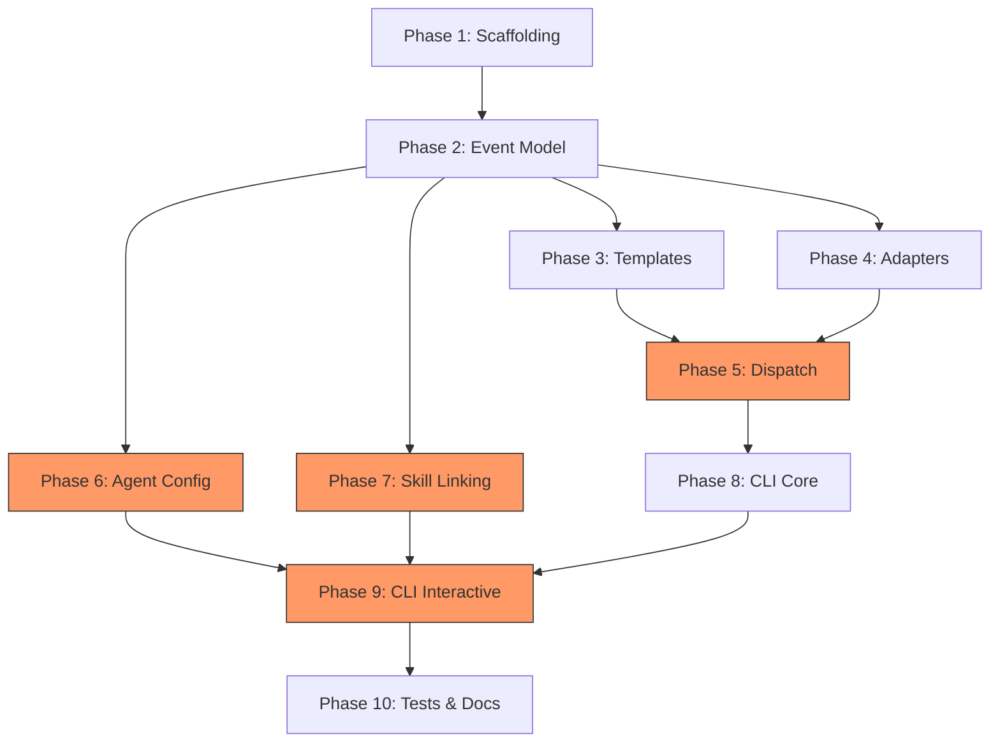

# Planning Process

- [x] Pre-flight Check
    - [x] Plans directory exists
    - [x] All 5 design docs verified
    - [x] No existing code (greenfield)
    - [x] Internal deps verified
    - [x] Workspace patterns explored
    - [x] Budget estimated: complex (~55%)
- [x] Prep Started
    - [x] Identified Skills: clap, serde, thiserror, color-eyre, inquire, chrono, xx-hash, playa, sniff
- [x] Clarify & Research
    - [x] User confirmed: full implementation, defer wrapper, generate bridge at runtime
- [x] Planning Subagent completed
- [x] Reviews Completed
    - [x] Completeness Review
    - [x] Concurrency Review
    - [x] Correctness Review
    - [x] Risk Assessment
- [x] Plan Finalization completed
- [x] Summary reported

---

## Plan

### Phase 1: Project Scaffolding
**Agent:** `general-purpose` | **Skills:** clap, serde, thiserror | **Complexity:** Low
**Deps:** None | **Parallel:** No

**Goal:** Create file structure, Cargo.toml files, workspace registration, justfile, and error types so `cargo check` succeeds.

**Deliver:**
- `claudine/lib/Cargo.toml` — package `claudine-lib`, edition 2024, all dependencies (see Package Changes)
- `claudine/lib/src/lib.rs` — module declarations for `events`, `adapters`, `config`, `linking`, `dispatch`, `error`
- `claudine/lib/src/error.rs` — `ClaudineError` enum with thiserror (IO, JsonParse, TomlParse, ConfigNotFound, ProviderNotAvailable, TemplateError, LinkingError, HttpError, LockError, YamlParse)
- `claudine/cli/Cargo.toml` — package `claudine-cli`, binary `claudine`, deps on claudine-lib + clap + tokio
- `claudine/cli/src/main.rs` — minimal `#[derive(Parser)]` with empty `Commands` enum
- `claudine/justfile` — build, test, lint, install targets
- Root `Cargo.toml` — add `"claudine/lib"`, `"claudine/cli"` to members

**Module layout for `claudine/lib/src/`:**
```
lib.rs, error.rs
events/ { mod.rs, agentric_event.rs, event_action.rs, event_meta.rs, environment.rs, config.rs, provider.rs }
adapters/ { mod.rs, claude.rs, gemini.rs, codex.rs, opencode.rs, roo.rs }
config/ { mod.rs, trait_def.rs, claude.rs, gemini.rs, codex.rs, opencode.rs, roo.rs, backup.rs, atomic.rs }
linking/ { mod.rs, discovery.rs, hashing.rs, conflict.rs, symlink.rs, paths.rs, report.rs }
dispatch/ { mod.rs, loader.rs, matcher.rs, resolver.rs, runner.rs, template.rs }
```

**Pass when:**
- [ ] `cargo check -p claudine-lib -p claudine-cli` succeeds
- [ ] `cargo clippy -p claudine-lib -p claudine-cli` has no errors
- [ ] Workspace Cargo.toml includes both new members
- [ ] `just -f claudine/justfile build` succeeds
- [ ] `ClaudineError` has at least 10 variants using `#[derive(Debug, thiserror::Error)]`

**If failed:**
- Rollback: Remove `claudine/` directory, revert workspace Cargo.toml
- Retry: Fix Cargo.toml syntax or dependency version pins

---

### Phase 2: Shared Event Model
**Agent:** `general-purpose` | **Skills:** serde, chrono, sniff | **Complexity:** Medium
**Deps:** Phase 1 | **Parallel:** No

**Goal:** Implement complete shared event model types with full serde serialization matching design doc specs.

**Deliver:**
- `events/agentric_event.rs` — `AgenticEvent` enum (15 variants) with `#[derive(Debug, Clone, PartialEq, Eq, Hash, Serialize, Deserialize)]` and `#[serde(rename_all = "snake_case")]`. Display impl.
- `events/provider.rs` — `Provider` enum (Claude, Codex, Gemini, OpenCode, RooCode) with Copy, serde rename_all.
- `events/event_action.rs` — `EventAction` enum (Speak, Log, Report, SoundEffect) with `#[serde(tag = "type", rename_all = "snake_case")]`. LogTarget, ReportHandler, ReportFormat. Default volume/speed functions.
- `events/event_meta.rs` — `EventMeta` struct with all 14 fields including `extra: HashMap<String, Value>` and `env: EnvironmentContext`.
- `events/environment.rs` — `EnvironmentContext`, `OsContext`, `HardwareContext`, `GitContext`, `RepoContext`. `impl From<sniff_lib::SniffResult>` conversion. `detect_environment(cwd: &Path) -> EnvironmentContext` using `SniffConfig::new().base_dir(cwd.to_path_buf()).deep(false).commit_count(1).skip_network()`. Caching: detect once per session, store in lazy static or pass through.
- `events/config.rs` — `HookerConfig`, `GlobalSettings`, `TtsSettings`, `EventBinding`, `ProviderOverride`. `default_true()` helper.
- Unit tests for every type: round-trip JSON serialization, snake_case verification, example config deserialization.

**Pass when:**
- [ ] Unit tests verify round-trip JSON serialization for every type
- [ ] `AgenticEvent::BeforeTool` serializes to `"before_tool"`
- [ ] `EventAction::SoundEffect` with defaults produces `"type": "sound_effect"`
- [ ] `HookerConfig` deserializes from the example JSON in design doc
- [ ] `Provider::Claude` serializes to `"claude"`
- [ ] `EnvironmentContext` populates from sniff_lib detection
- [ ] Each source file under 500 lines

**If failed:**
- Rollback: Revert `events/` module
- Retry: Fix serde attribute combinations or HashMap key serialization

---

### Phase 3: Template Interpolation Engine
**Agent:** `general-purpose` | **Skills:** serde | **Complexity:** Medium
**Deps:** Phase 2 | **Parallel:** Yes (with Phase 4)

**Goal:** Implement `{placeholder}` template interpolation from EventMeta fields.

**Deliver:**
- `dispatch/template.rs` — `interpolate(template: &str, meta: &EventMeta) -> String`
- All documented placeholders: `{provider}`, `{event}`, `{session_id}`, `{tool_name}`, `{error}`, `{prompt}`, `{agent_type}`, `{notification_type}`, `{cwd}`, `{timestamp}`
- All `{env.*}` placeholders: `{env.os}`, `{env.os_type}`, `{env.hostname}`, `{env.arch}`, `{env.cpu}`, `{env.cores}`, `{env.branch}`, `{env.is_dirty}`, `{env.head_sha}`, `{env.head_message}`, `{env.remote}`, `{env.hosting}`, `{env.is_monorepo}`, `{env.monorepo_tool}`, `{env.language}`
- Unknown placeholders left as-is (not an error)
- Regex `\{([a-z_.]+)\}` for pattern matching
- `Option<T>` fields render as empty string for `None`

**Pass when:**
- [ ] `interpolate("Hello {provider}", meta)` → `"Hello claude"`
- [ ] `interpolate("{tool_name} on {env.branch}", meta)` → `"Bash on main"`
- [ ] `interpolate("{unknown_field}", meta)` → `"{unknown_field}"` unchanged
- [ ] `None` optional fields render as empty string
- [ ] Template with no placeholders returns original string
- [ ] `cargo test -p claudine-lib -- dispatch::template` passes

**If failed:**
- Rollback: Remove `dispatch/template.rs`
- Retry: Fix regex pattern or field mapping

---

### Phase 4: Provider Adapters
**Agent:** `general-purpose` | **Skills:** serde | **Complexity:** High
**Deps:** Phase 2 | **Parallel:** Yes (with Phase 3)

**Goal:** Implement ProviderAdapter trait and all 5 provider adapters.

**Deliver:**
- `adapters/mod.rs` — `ProviderAdapter` trait: `fn provider(&self) -> Provider` + `fn parse_event(&self, raw: &Value, env: &EnvironmentContext) -> Option<(AgenticEvent, EventMeta)>`. Factory function `adapter_for(provider: Provider)`.
- `adapters/claude.rs` — Maps 12 events: SessionStart, SessionEnd, UserPromptSubmit→BeforePrompt, PreToolUse→BeforeTool, PostToolUse→AfterTool, PostToolUseFailure→ToolError, PermissionRequest, Stop→TurnComplete, SubagentStart, SubagentStop, PreCompact→BeforeCompact, Notification. Reads `hook_event_name`.
- `adapters/gemini.rs` — Maps 10 events: SessionStart, SessionEnd, BeforeAgent→BeforePrompt, BeforeTool, AfterTool, AfterAgent→TurnComplete, BeforeModel, AfterModel, PreCompress→BeforeCompact, Notification.
- `adapters/codex.rs` — Maps 5 events from JSONL `type` field: thread.started→SessionStart, turn.completed→TurnComplete, turn.failed→TurnError, item.completed→AfterTool, error→TurnError. Also handles notify argv format.
- `adapters/opencode.rs` — Maps 10 events from `event_type` field.
- `adapters/roo.rs` — Maps 6 events from NDJSON stream.
- **Error handling:** All adapters return `None` for unknown events (never panic). Malformed JSON logged to tracing::warn and returns None. Exit code 0 on parse failure.

**Pass when:**
- [ ] Each adapter: correct event maps to correct AgenticEvent with populated metadata
- [ ] Unknown event name returns `None` for each adapter
- [ ] Malformed JSON returns `None` (does not panic)
- [ ] Codex argv-format JSON correctly parsed
- [ ] All adapters implement ProviderAdapter trait
- [ ] Each adapter file under 300 lines
- [ ] `cargo test -p claudine-lib -- adapters` passes

**If failed:**
- Rollback: Revert `adapters/` module
- Retry: Fix JSON field extraction for failing provider

---

### Phase 5: Event Dispatch Engine
**Agent:** `general-purpose` | **Skills:** serde, chrono, playa, biscuit-speaks | **Complexity:** High
**Deps:** Phase 3, Phase 4 | **Parallel:** No

**Goal:** Implement full event dispatch: config loading, matching, override resolution, and all 4 action runners.

**Deliver:**
- `dispatch/loader.rs` — `load_config(user: Option<&Path>, repo_root: Option<&Path>) -> Result<HookerConfig>`. Resolves `~/.hooker` then `~/.hook-config`. Merge: repo replaces user per-event, settings merge field-by-field. Config validation: compile regex matchers at load time, validate log paths writable.
- `dispatch/matcher.rs` — `matches(binding: &EventBinding, meta: &EventMeta) -> bool`. Regex against tool_name (tool events), notification_type (notifications). No matcher = always true.
- `dispatch/resolver.rs` — `resolve_actions(binding: &EventBinding, provider: Provider) -> (bool, Vec<&EventAction>, Option<&str>)`. Check overrides[provider] first, fall back to binding actions.
- `dispatch/runner.rs` — `async fn execute_actions(actions: &[EventAction], meta: &EventMeta, settings: &GlobalSettings) -> Result<()>`:
  - **Speak** → `biscuit_speaks::Speak::new(interpolated_message).play().await` (ASYNC API — must .await)
  - **Log/LocalFile** → append JSONL line, create parent dirs
  - **Log/Server** → `reqwest::Client::new().post(url).json(&meta).send().await` (timeout 10s, errors logged not fatal)
  - **Report** → write to stdout, format per ReportHandler
  - **SoundEffect** → `playa::playa_async(&effect_path).await` (use `async` feature — playa has feature-gated async API via `playa_async`, `playa_explicit_async`, etc. Enable `features = ["async"]` which pulls in tokio)
- `dispatch/mod.rs` — `pub async fn dispatch(raw: &Value, provider: Provider, env: &EnvironmentContext) -> Result<()>`

**Pass when:**
- [ ] `load_config` merges repo on top of user (repo event replaces user event)
- [ ] Matcher regex `"Bash|Edit"` returns true for "Bash", false for "Read"
- [ ] Override resolver uses provider-specific actions when present
- [ ] Report action with compact template produces expected output
- [ ] Log action writes valid JSONL to temp file
- [ ] Integration test: full dispatch with mock event + config
- [ ] `cargo test -p claudine-lib -- dispatch` passes

**If failed:**
- Rollback: Revert `dispatch/` module
- Retry: Fix action runner integration or config merge logic

---

### Phase 6: Agent Configuration Management
**Agent:** `general-purpose` | **Skills:** serde, thiserror | **Complexity:** High
**Deps:** Phase 2 | **Parallel:** Yes (with Phase 5, Phase 7)

**Goal:** Implement non-destructive hook registration for all 5 providers.

**Deliver:**
- `config/trait_def.rs` — `AgentConfigurator` trait, `RegistrationResult`, `SkipReason` per design doc.
- `config/backup.rs` — `create_backup(path: &Path, provider: Provider) -> Result<PathBuf>`. Writes to `~/.claudine/backups/<provider>/<timestamp>.bak`.
- `config/atomic.rs` — `atomic_write(path: &Path, content: &[u8]) -> Result<()>`. Temp file + rename. File locking via `fs2::FileExt::lock_exclusive()` with 5s timeout.
- `config/claude.rs` — Read/modify/write `settings.json` as `serde_json::Value`. Map event names (BeforeTool→"PreToolUse", TurnComplete→"Stop", etc.). Append matcher group with `command: "claudine handle <event>"`, `timeout: 30`. Identify by command prefix. Preserve non-Claudine hooks.
- `config/gemini.rs` — Same JSON approach. Differences: `name: "claudine-<event>"`, `timeout: 30000` (ms), `description` field. Maps BeforePrompt→"BeforeAgent", TurnComplete→"AfterAgent", BeforeCompact→"PreCompress".
- `config/codex.rs` — Read/modify `config.toml` via `toml_edit`. Set `notify = ["claudine", "handle"]`. If existing notify: generate wrapper at `~/.claudine/codex-notify-wrapper.sh` that calls both. Only TurnComplete via hooks.
- `config/opencode.rs` — Generate TypeScript bridge plugin at `~/.config/opencode/plugin/claudine-bridge.ts` (template embedded as const string, populated at runtime). Register `"claudine-bridge"` in `opencode.json` plugin array. Add experimental hooks for file_edited/session_completed.
- `config/roo.rs` — No-op (wrapper-only, deferred). Returns SkipReason with wrapper guidance.
- `config/mod.rs` — `detect_agents() -> Vec<(Provider, Box<dyn AgentConfigurator>)>` factory.

**Pass when:**
- [ ] Claude register adds hooks, deregister removes only Claudine hooks
- [ ] Gemini uses ms timeouts and includes name field
- [ ] Codex sets notify in TOML, preserves comments (toml_edit roundtrip test)
- [ ] Codex wrapper script generated when existing notify found
- [ ] OpenCode generates valid TypeScript bridge plugin
- [ ] Roo returns no-op with wrapper warning
- [ ] Backup created before every config write
- [ ] Atomic write + file locking works
- [ ] `cargo test -p claudine-lib -- config` passes

**If failed:**
- Rollback: Revert config module. Restore from backups.
- Retry: Fix JSON/TOML manipulation

---

### Phase 7: Skill Linking Engine
**Agent:** `general-purpose` | **Skills:** xx-hash, serde | **Complexity:** High
**Deps:** Phase 2 | **Parallel:** Yes (with Phase 5, Phase 6)

**Goal:** Implement 4-phase skill linking + command linking.

**Deliver:**
- `linking/paths.rs` — `ProviderSkillPaths` with all 5 providers. `also_reads_from` for OpenCode. User/repo skill paths + command paths (user_commands/repo_commands for Claude, Roo, OpenCode only — Gemini uses TOML format, Codex has no commands).
- `linking/discovery.rs` — `discover_skills(paths: &ProviderSkillPaths, scope: LinkScope) -> Result<Vec<DiscoveredSkill>>`. Parse YAML frontmatter from SKILL.md via serde_yaml. Skip hidden dirs (.system/, .git/). Track symlink status.
- `linking/hashing.rs` — `hash_skill_dir(skill_dir: &Path) -> Result<u64>`. Uses `biscuit_hash::xx_hash_bytes`. Walk files recursively (walkdir), sort by relative path, concatenate with null separators, hash. Resolve symlinks before hashing.
- `linking/conflict.rs` — `analyze_skills(skills: Vec<DiscoveredSkill>) -> Vec<SkillSyncStatus>`. Group by name. Returns LinkCandidate/InSync/Conflict/AlreadyLinked. Skips OpenCode when source is Claude (also_reads_from prevention).
- `linking/symlink.rs` — `create_skill_link(source: &Path, dest_dir: &Path, scope: LinkScope) -> Result<LinkResult>`. User scope = absolute symlinks. Repo scope = relative symlinks via `relative_path()` helper. Never overwrite real directories.
- `linking/report.rs` — `LinkReport` struct and `format_report()`. Human-readable with symbols.
- `linking/mod.rs` — `pub fn link_skills(scope, filter, dry_run) -> Result<LinkReport>`. Orchestrates all 4 phases. **Also handles command linking** — same algorithm applied to commands/ directories, restricted to Markdown-format providers (Claude, Roo, OpenCode).

**Pass when:**
- [ ] discover_skills finds skills in temp dir with valid SKILL.md
- [ ] hash produces same result for identical content, different for different
- [ ] Symlink and real dir with same content produce same hash
- [ ] analyze_skills: one provider → LinkCandidate, same hash → InSync, diff hash → Conflict
- [ ] OpenCode target skipped when source is Claude (also_reads_from)
- [ ] User scope creates absolute symlink, repo scope creates relative
- [ ] relative_path computes `../../.claude/skills/foo` correctly
- [ ] Never overwrites real directory
- [ ] Command linking works for Claude→Roo, Claude→OpenCode
- [ ] Gemini and Codex excluded from command linking
- [ ] `cargo test -p claudine-lib -- linking` passes

**If failed:**
- Rollback: Remove created symlinks (tracked in LinkReport)
- Retry: Fix symlink creation or path computation

---

### Phase 8: CLI Core Commands
**Agent:** `general-purpose` | **Skills:** clap, color-eyre | **Complexity:** Medium
**Deps:** Phase 5 | **Parallel:** No

**Goal:** Implement CLI binary with core subcommands and logging utility.

**Deliver:**
- `cli/src/main.rs` — `#[derive(Parser)]` with global `-v`/`--verbose`, `--version`. `#[tokio::main]`. Tracing init: default WARN, `-v` → INFO, `-vv` → DEBUG, `DEBUG` env var override.
- `cli/src/commands/mod.rs` — `Commands` enum (Handle, DryRun, Completions, About, Init, Link, Sync, Status, Uninstall)
- `cli/src/commands/handle.rs` — Read JSON from stdin (or last argv for Codex). Detect provider from payload. Call `claudine_lib::dispatch::dispatch()`. Exit 0 on success.
- `cli/src/commands/dry_run.rs` — Same as handle, prints what would happen, no side effects.
- `cli/src/commands/completions.rs` — Shell completions via `clap_complete::generate` for bash/zsh/fish.
- `cli/src/commands/about.rs` — Render embedded markdown via darkmatter_lib.
- `cli/src/log.rs` — `message()` (stderr always), `info()` (stderr verbose), `data()` (stdout), `warn()` (stderr yellow), `error()` (stderr red).

**Pass when:**
- [ ] `cargo build -p claudine-cli` succeeds
- [ ] `claudine --help` shows all subcommands
- [ ] `claudine --version` prints version
- [ ] `echo '<json>' | claudine handle session_start` exits 0
- [ ] `claudine completions bash` outputs valid completion script
- [ ] `claudine about` renders markdown
- [ ] Logging routes correctly to stderr/stdout
- [ ] Each command file under 300 lines

**If failed:**
- Rollback: Revert CLI command files
- Retry: Fix clap derive or stdin reading

---

### Phase 9: CLI Interactive Commands
**Agent:** `general-purpose` | **Skills:** clap, inquire | **Complexity:** High
**Deps:** Phase 6, Phase 7, Phase 8 | **Parallel:** No

**Goal:** Implement interactive init wizard, sync, status, uninstall, and link CLI commands.

**Deliver:**
- `cli/src/commands/init.rs` — 5-phase wizard (inquire): agent discovery, event selection, per-event action config, global settings, write + register. `--quick` for defaults (TurnComplete→SFX success, ToolError→SFX error, PermissionRequest→SFX notification, SessionStart→SFX power-up). `--repo` for project scope.
- `cli/src/commands/sync.rs` — Re-read config, call register() on each. `--dry-run`, `--provider` flags.
- `cli/src/commands/status.rs` — Show registered events per detected agent. Formatted table.
- `cli/src/commands/uninstall.rs` — Deregister all agents. Remove OpenCode bridge, Codex wrapper, backups. `--keep-config` flag.
- `cli/src/commands/link.rs` — Thin wrapper around linking engine. Pass `--dry-run`, `--provider`, `--verbose`, `--replace-duplicates`.
- `claudine/cli/README.md` — Full CLI docs with examples.

**Pass when:**
- [ ] `claudine init --quick` creates valid `~/.hooker` JSON (test with temp HOME)
- [ ] `claudine init --quick` registers hooks with available agents
- [ ] `claudine sync --dry-run` shows changes without writing
- [ ] `claudine status` displays agent registration table
- [ ] `claudine uninstall --keep-config` removes hooks but preserves config
- [ ] `claudine link --dry-run` shows skill linking preview
- [ ] CLI README documents all commands
- [ ] Each command file under 400 lines

**If failed:**
- Rollback: Revert interactive command files
- Retry: Fix inquire prompts or config write logic

---

### Phase 10: Integration Tests and Documentation
**Agent:** `feature-tester-rust` | **Skills:** serde, clap | **Complexity:** Medium
**Deps:** Phase 9 | **Parallel:** No

**Goal:** Comprehensive integration tests and documentation.

**Deliver:**
- `claudine/lib/tests/` — integration tests:
  - Full event round-trip: JSON → adapter → dispatch → action (mock filesystem)
  - Config merge: user + repo semantics
  - Provider registration: Claude, Gemini, Codex with mock config files
  - Skill linking: temp directories, multiple providers, conflict detection
  - Template interpolation: edge cases
- `claudine/cli/tests/` — CLI integration tests with `assert_cmd`
- Updated `claudine/README.md` with build/test/install instructions
- Updated root `CLAUDE.md` with Claudine in architecture table

**Pass when:**
- [ ] `cargo test -p claudine-lib` passes all tests
- [ ] `cargo test -p claudine-cli` passes all tests
- [ ] `cargo clippy -p claudine-lib -p claudine-cli` has no warnings
- [ ] All source files under 500 lines
- [ ] README documents all subcommands with examples
- [ ] Integration tests use `tempfile` for filesystem isolation

**If failed:**
- Rollback: Tests are additive — fix failing tests
- Retry: Fix underlying code that tests expose

---

## Dependency Graph



**Critical path:** 1 → 2 → 3/4 → 5 → 8 → 9 → 10

**Parallelism windows:**
- After Phase 2: Phases 3+4 run in parallel
- After Phase 2: Phases 6+7 run in parallel with each other AND with 3/4/5

---

## Risks

| Level | Category | Description | Affected | Mitigation |
|-------|----------|-------------|----------|------------|
| HIGH | technical | Provider JSON schema drift — undocumented APIs could change | Phase 4, 5 | Lenient Option parsing, log unparseable events, never panic |
| HIGH | technical | TOML formatting corruption in Codex config | Phase 6 | Integration tests with real TOML files, comment preservation tests |
| HIGH | dependency | sniff-lib API stability — 30+ field mappings | Phase 2 | Integration tests, defensive field access, version-lock |
| HIGH | rollback | Config corruption on interrupted write | Phase 6 | Backup before write, atomic writes, fs2 file locking |
| HIGH | scope | CLI surface area — 9 subcommands with flags | Phase 8, 9 | Defer sync/status/uninstall if needed |
| HIGH | technical | Cross-filesystem symlink issues | Phase 7 | Detect and warn, consider --copy fallback |
| MEDIUM | technical | TTS/audio blocking event handling | Phase 5 | Use playa async API + biscuit-speaks async; fire-and-forget via tokio::spawn |
| MEDIUM | dependency | OpenCode plugin SDK type drift | Phase 6 | Minimal type deps, vanilla child_process |
| MEDIUM | technical | Regex matcher performance (catastrophic backtracking) | Phase 5 | Compile at config load, 100ms timeout |
| MEDIUM | technical | Event mapping errors (60+ mappings) | Phase 4 | Const arrays, exhaustiveness checks |
| MEDIUM | scope | Codex symlink discovery bugs (#8943, #9365) | Phase 7 | Warn in report, suggest verification |

---

## Lessons Learned

- [API: biscuit-speaks]: API is async — Speak action must use `.await` in async context
- [API: playa]: Core API is sync but async variants exist behind `features = ["async"]` (playa_async, playa_explicit_async, Playa::play_async). Use the async API directly instead of spawn_blocking.
- [API: sniff-lib]: SniffConfig::new().base_dir() requires PathBuf argument
- [CRATE: serde_yaml]: 0.9 deprecated but functional — acceptable for workspace consistency
- [CRATE: fs2]: Already used in queue-lib for file locking — correct pattern
- [CRATE: toml_edit]: Already in Cargo.lock (0.22.27) — use DocumentMut for parsing

---

## Package Changes

### New Packages
- `claudine-lib` (path: `claudine/lib/`) — Core library
- `claudine-cli` (path: `claudine/cli/`) — CLI binary

### Workspace Cargo.toml
Add `"claudine/lib"` and `"claudine/cli"` to `workspace.members`

### claudine-lib Dependencies

**Internal:**
| Crate | Path | Features | Purpose |
|-------|------|----------|---------|
| `sniff-lib` | `../../sniff/lib` | — | EnvironmentContext detection |
| `biscuit-hash` | `../../biscuit-hash/lib` | `xx_hash` | Skill content hashing |
| `playa` | `../../playa/lib` | `sound-effects`, `async` | Sound effect playback |
| `biscuit-speaks` | `../../biscuit-speaks` | `playa` | TTS for Speak action |

**External:**
| Crate | Version | Purpose |
|-------|---------|---------|
| `serde` | 1.0, features=["derive"] | Serialization |
| `serde_json` | 1.0 | JSON config/events |
| `serde_yaml` | 0.9 | SKILL.md frontmatter |
| `chrono` | 0.4, features=["serde"] | Timestamps |
| `thiserror` | 2.0 | Error types |
| `tokio` | 1.48.0, features=["rt-multi-thread","macros"] | Async runtime |
| `regex` | 1.11 | Matcher engine |
| `dirs` | 6 | Home directory |
| `url` | 2.5 | LogTarget::Server URL |
| `reqwest` | 0.12, features=["rustls-tls","json"] | HTTP POST logging |
| `toml_edit` | 0.22 | Codex TOML config |
| `tracing` | 0.1 | Structured logging |
| `fs2` | 0.4 | File locking |
| `walkdir` | 2.5 | Directory traversal |

### claudine-cli Dependencies

| Crate | Version | Purpose |
|-------|---------|---------|
| `claudine-lib` | path="../lib" | Core library |
| `clap` | 4.5.53, features=["derive","unstable-ext"] | CLI parsing |
| `clap_complete` | 4.5 | Shell completions |
| `tokio` | 1.48.0, features=["rt-multi-thread","macros"] | Async runtime |
| `tracing` | 0.1 | Logging |
| `tracing-subscriber` | 0.3, features=["env-filter"] | Log config |
| `inquire` | 0.9 | Interactive init wizard |
| `darkmatter-lib` | path="../../darkmatter/lib" | Markdown for about |
| `color-eyre` | 0.6 | Rich error display |
