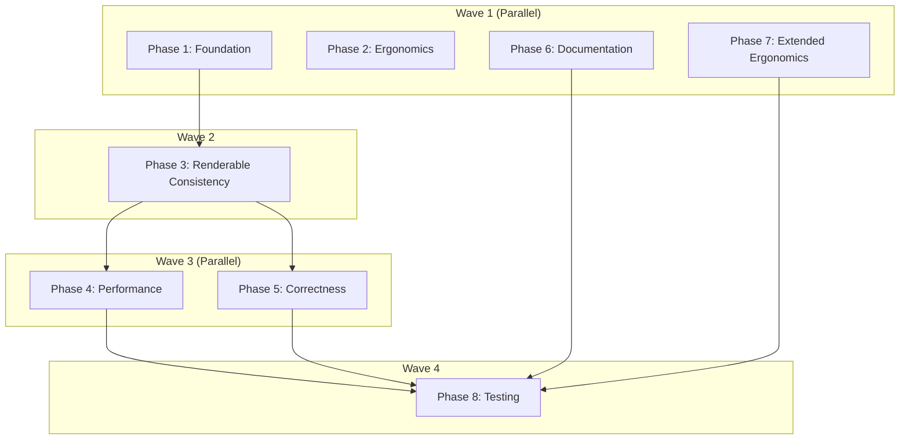

# Planning Process

- [x] Pre-flight Check [10:45]
    - [x] Catalogs validated
    - [x] Directories ready
    - [x] Budget estimated: complex (~55%)
- [x] Prep Started [10:46]
    - [x] Identified Skills: biscuit-terminal, rust, thiserror
    - [x] Identified Subagents: Plan, completeness-reviewer, concurrency-reviewer, correctness-reviewer, risk-assessor
- [x] Prep complete [10:47]
- [x] Clarify & Research [10:47]
    - [x] Clarification agent returned
    - [x] User answered 3 questions
    - [x] Requirements updated:
        - TerminalImage: Kitty only with alt-text fallback
        - BlockQuote no-color: Strip colors, keep ASCII border
        - BlockQuote margins: Left margin only
- [x] Planning Subagent [agent: **Plan**] started [10:50]
    - [x] subagent skills used: biscuit-terminal, rust
    - [x] Planning completed [10:52]
- [x] All Pre-review Steps complete [10:52]
- [x] Reviews Started [10:53]
   - [x] Completeness Review - found assignment gaps, needs acceptance criteria
   - [x] Concurrency Review - Phase 4 must depend on Phase 3 (terminal_image.rs conflict)
   - [x] Correctness Review - xxHash API usage incorrect, need biscuit-hash workaround
   - [x] Risk Assessment - HIGH: Prose O(n^2) refactor, TerminalImage composition
- [x] Reviews Completed [10:55]
- [x] Plan Finalization started [10:56]
    - [x] subagent skills used: biscuit-terminal, rust
    - [x] Dependency graph generated
- [x] Plan finalized [10:57]
- [x] Final Steps
    - [x] Lessons learned collected: 1 skill issue (biscuit-hash)
    - [x] Package research status: None needed
- [x] Summary reported [10:58]
    - Plan: `.ai/plans/2026-02-05.plan-for-biscuit-terminal-review-fixes.md`
    - Phases: 8
    - Waves: 4 (parallel execution strategy)
    - Duration: 13 minutes

## Review Findings Summary

### Ergonomics (4 items)
1. **Compose**: Not Renderable, `add_*` methods return `&Self` not `&mut Self`
2. **TextBlock**: Builder methods return `&Self` instead of `&mut Self`
3. **BlockQuote**: Color setters exist but colors never applied
4. **Section/List**: Require manual `RenderableContent` wrapping

### Renderable Consistency (4 items)
1. **Terminal::new_optimistic(width)**: Create method with fixed capabilities for render()
2. **render() standardization**: All render methods should use new_optimistic
3. **TerminalImage render()**: Return escape sequence, not print directly
4. **List width constraints**: Use fixed_width terminal + Layout margins consistently

### Performance (4 items)
1. **Prose tag parsing**: O(n^2) from repeated ends_with checks
2. **Prose token matching**: Use eq_ignore_ascii_case instead of to_lowercase
3. **Mermaid cache key**: Use incremental hashing instead of format string
4. **TerminalImage**: Deduplicate width/margin calculations

### Comments/Docs (4 items)
1. **ColumnType docs**: Integer alignment says Right but impl is Center
2. **TerminalImage render_to_terminal**: Doc says returns fallback, returns empty
3. **render_kitty_cells**: Comments say pixels but params are cells
4. **TextBlock/Todo**: Missing pub docs, truncated to_terminal comment

### Correctness (4 items)
1. **Prose rgb tag**: `<rgb 125,67,45>` documented but parser doesn't handle it
2. **BlockQuote child_width**: Calculated but never used
3. **Todo color fallback**: No check for non-color terminals
4. **Mermaid unwrap**: `to_str().unwrap()` on temp paths can panic

### Cleanup (1 item)
1. **metrics.rs**: Empty, unreferenced - remove

## Plan

### Phase 1: Foundation
**Agent:** `general-purpose` | **Skills:** biscuit-terminal, rust | **Complexity:** Low
**Deps:** None | **Parallel:** Yes (with Phases 2, 6, 7)

**Goal:** Add `Terminal::new_optimistic()` constructor and remove dead code.

**Deliver:**
- `terminal.rs`: Add `new_optimistic(width: u32)` method with Kitty image, TrueColor, italics, underline
- `components/metrics.rs`: Delete file
- `components/mod.rs`: Remove metrics export if present

**Pass when:**
- [ ] `Terminal::new_optimistic(80)` returns Terminal with all capabilities enabled
- [ ] `term.width()` returns the fixed width value
- [ ] No references to `metrics` module remain

---

### Phase 2: Ergonomics
**Agent:** `general-purpose` | **Skills:** biscuit-terminal, rust | **Complexity:** Medium
**Deps:** None | **Parallel:** Yes (with Phases 1, 6, 7)

**Goal:** Implement `Renderable` for `Compose` and fix `TextBlock` builder pattern.

**Deliver:**
- `compose.rs`: Implement all 5 Renderable methods, add `layout: Layout` field
- `compose.rs`: Change `add_*` methods to return `&mut Self`
- `text_block.rs`: Change builder methods to return `&mut Self`

**Pass when:**
- [ ] `Compose` implements `Renderable` trait (all 5 methods)
- [ ] `TextBlock::new("x").using_italics().using_bold_text()` chains work
- [ ] `compose.add_text("foo").add_prose(p)` chains work

**Risk (MEDIUM):** TextBlock signature change may break consumers.

---

### Phase 3: Renderable Consistency
**Agent:** `general-purpose` | **Skills:** biscuit-terminal, rust | **Complexity:** Medium
**Deps:** Phase 1 | **Parallel:** No

**Goal:** Standardize render() methods and fix TerminalImage escape sequence return.

**Deliver:**
- `text_block.rs`, `todo.rs`, `block_quote.rs`: Use `Terminal::new_optimistic(width)` in render()
- `terminal_image.rs`: render() returns Kitty escape sequence with alt-text fallback
- `list.rs`: Consistent width constraints in render() and fallback_render()

**Pass when:**
- [ ] `TerminalImage::render()` returns Kitty escape sequence string (not empty)
- [ ] render() methods no longer call `Terminal::new()` or `Terminal::new_tty()`
- [ ] List nested components respect parent margins

**Risk (HIGH):** TerminalImage escape sequence change may affect composition.

---

### Phase 4: Performance
**Agent:** `general-purpose` | **Skills:** biscuit-terminal, rust | **Complexity:** High
**Deps:** Phase 3 | **Parallel:** Yes (with Phase 5)

**Goal:** Fix O(n^2) parsing and optimize token matching.

**Deliver:**
- `prose.rs`: Index-based tag parsing (no repeated `ends_with`)
- `prose.rs`: Use `eq_ignore_ascii_case` instead of `to_lowercase()`
- `mermaid_cache.rs`: Build string once, call `biscuit_hash::xx_hash()` (not incremental)
- `terminal_image.rs`: Extract `resolve_dimensions()` helper for width/margin calculations

**Pass when:**
- [ ] Parsing 10KB document with nested tags completes in <10ms
- [ ] No `to_lowercase()` for comparison patterns
- [ ] Single source of truth for dimension calculations in TerminalImage

**Risk (HIGH):** Prose O(n^2) refactor may introduce subtle bugs.

---

### Phase 5: Correctness
**Agent:** `general-purpose` | **Skills:** biscuit-terminal, rust | **Complexity:** Medium
**Deps:** Phase 3 | **Parallel:** Yes (with Phase 4)

**Goal:** Fix parser bugs, color fallbacks, and error handling.

**Deliver:**
- `prose.rs`: Make `<rgb 125,67,45>...</rgb>` parse and emit correct escape codes
- `block_quote.rs`: Use left margin adjustment, implement color application
- `todo.rs`: Check `term.color_depth` before using colors
- `mermaid.rs`: Replace `.unwrap()` on path conversions with proper error handling

**Pass when:**
- [ ] `<rgb 255,0,0>text</rgb>` produces `\x1b[38;2;255;0;0m`
- [ ] BlockQuote uses left margin only (not unused `_child_width`)
- [ ] Todo on `ColorDepth::None` emits no ANSI codes
- [ ] No `.unwrap()` on path conversions in mermaid.rs

---

### Phase 6: Documentation
**Agent:** `general-purpose` | **Skills:** biscuit-terminal, rust | **Complexity:** Low
**Deps:** None | **Parallel:** Yes (with Phases 1, 2, 7)

**Goal:** Fix doc comments and alignment behavior.

**Deliver:**
- `table/types.rs`: Switch `ColumnType::Integer` alignment to Right (matches docs)
- `terminal_image.rs`: Fix render_to_terminal doc, render_kitty_cells comments (cells not pixels)
- `text_block.rs`, `todo.rs`: Add missing pub docs, complete truncated comments

**Pass when:**
- [ ] `ColumnType::Integer.default_alignment()` returns `Alignment::Right`
- [ ] render_kitty_cells doc says "cells" not "pixels"
- [ ] All public items have doc comments

---

### Phase 7: Extended Ergonomics
**Agent:** `general-purpose` | **Skills:** biscuit-terminal, rust | **Complexity:** Low
**Deps:** None | **Parallel:** Yes (with Phases 1, 2, 6)

**Goal:** Add convenience methods and no-color fallback.

**Deliver:**
- `block_quote.rs`: Implement color handling with no-color fallback (ASCII border)
- `section.rs`: Add `push<T: Into<RenderableContent>>()` convenience method
- `list.rs`: Add `add<T: Into<RenderableContent>>()` convenience methods

**Pass when:**
- [ ] BlockQuote on `ColorDepth::None` uses ASCII `|` border, no ANSI codes
- [ ] `section.push("string")` and `section.push(prose)` both work
- [ ] `list.add("item").add("item2")` chains work

---

### Phase 8: Testing
**Agent:** `general-purpose` | **Skills:** biscuit-terminal, rust | **Complexity:** Medium
**Deps:** Phases 4, 5, 6, 7 | **Parallel:** No

**Goal:** Add regression tests for all changes.

**Deliver:**
- Tests for `Terminal::new_optimistic()` capabilities
- Tests for `Compose` Renderable implementation
- Tests for Prose O(n) parsing performance
- Tests for TerminalImage escape sequence return
- Tests for BlockQuote no-color mode

**Pass when:**
- [ ] `cargo test -p biscuit-terminal-lib` passes (0 failures)
- [ ] `cargo clippy -p biscuit-terminal-lib` produces no warnings
- [ ] All new functionality has at least one test

---

## Dependency Graph

## Risks

| Level | Category | Description | Affected | Mitigation |
|-------|----------|-------------|----------|------------|
| HIGH | technical | Prose O(n^2) refactor may introduce tag matching bugs | Phase 4 | Add comprehensive tests before refactoring |
| HIGH | technical | TerminalImage escape sequence return may break composition | Phase 3 | Add integration test for images in lists/sections |
| MEDIUM | scope | RGB tag parsing needs parser+handler coordination | Phase 5 | Test parser independently first |
| MEDIUM | dependency | TextBlock signature change breaks consumers | Phase 2 | Search for usages before modifying |
| MEDIUM | scope | Terminal::new_optimistic scope unclear | Phase 1 | Use Terminal::builder() pattern as reference |
| LOW | behavioral | ColumnType alignment is visible change | Phase 6 | Document as intentional fix |
| LOW | technical | BlockQuote color fields unused | Phase 7 | Ship as additive feature |
| LOW | technical | Mermaid unwrap on temp paths | Phase 5 | Simple pattern replacement |

## Lessons Learned

- [SKILL: biscuit-hash]: The incremental hashing API (`Xxh3::new()`) mentioned in the review doesn't exist. biscuit-hash only exposes `xx_hash(data: &str) -> u64` which requires full content. Solution: build string once and hash, or use xxhash-rust directly.

## Package Changes

> No dependencies to add, update, or remove.
