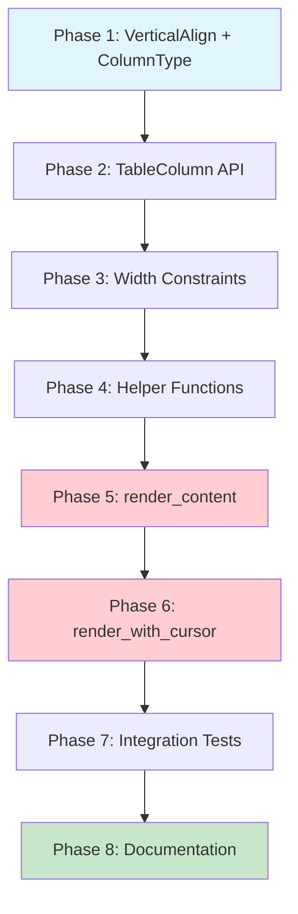

# Planning Process

- [x] Pre-flight Check [12:15 PM]
    - [x] Catalogs validated
    - [x] Directories ready
    - [x] Budget estimated: medium (~40%)
- [x] Prep Started [12:17 PM]
    - [x] Identified Skills: rust, biscuit-terminal [12:17 PM]
    - [x] Identified Subagents: Plan, completeness-reviewer, concurrency-reviewer, correctness-reviewer, risk-assessor [12:17 PM]
- [x] Prep complete [12:17 PM]
- [x] Clarify & Research [12:18 PM]
    - [x] Clarification agent returned [12:18 PM]
    - [x] User answered 4 questions [12:19 PM]
        - Vertical align: Top-align (content at top, padding below)
        - Numeric wrap: Force WordWrap::None (no override)
        - Width calc: Width-first (let wrapping happen naturally)
        - Align scope: Per-column (consistent within column)
    - [x] Requirements updated [12:19 PM]
    - [x] No package research needed (uses existing WordWrap infrastructure)
- [x] Planning Subagent [agent: **Plan**] started [12:20 PM]
    - [x] subagent skills used: rust, biscuit-terminal
    - [x] Planning completed [12:21 PM]
- [x] Module Assessment: Not needed (single module: biscuit-terminal)
- [x] All Pre-review Steps complete [12:21 PM]
- [x] Reviews Started [12:22 PM]
   - [x] Completeness Review - Found 12 gaps (3 high, 6 medium, 3 low)
   - [x] Concurrency Review - Minimal parallelism (Phases 7b/8a only)
   - [x] Correctness Review - Found 14 issues (3 high, 8 medium, 3 low)
   - [x] Risk Assessment - Identified 8 risks (1 high, 5 medium, 2 low)
- [x] Reviews Completed [12:23 PM]
- [x] Plan Finalization started [12:24 PM]
    - [x] subagent skills used: rust, biscuit-terminal
    - [x] Dependency graph generated
- [x] Plan finalized [12:25 PM]
- [x] Final Steps
    - [x] Lessons learned collected (0 issues)
    - [x] Package research status: None needed
- [x] Summary reported [12:25 PM]
    - Plan: `.ai/plans/2026-02-05.plan-for-table-word-wrap-and-vertical-align.md`
    - Phases: 8
    - Duration: 10 minutes
    - Critical path: P1→P2→P3→P4→P5→P6→P7→P8

## Pre-flight Analysis

### Existing Infrastructure

**Key Files Identified:**
- `biscuit-terminal/lib/src/components/table/table.rs` - Main Table and TableColumn structs
- `biscuit-terminal/lib/src/components/table/types.rs` - ColumnType, Currency enums
- `biscuit-terminal/lib/src/utils/layout.rs` - WordWrap, Alignment, Layout structs
- `biscuit-terminal/lib/src/utils/block_constraint.rs` - split_lines, wrap_lines, visible_width utilities

**Existing Types to Leverage:**
- `WordWrap` enum (WrapProse, BespokeProse, Truncate, None)
- `Alignment` enum (Left, Center, Right)
- `wrap_lines()` function for applying word wrap strategies
- `visible_width()` for calculating display width with escape codes

**Pattern to Follow:**
- `ColumnType::default_alignment()` method returns alignment based on type
- Need similar `ColumnType::default_word_wrap()` method
- Builder pattern used for TableColumn (with_fixed_width, with_alignment, etc.)

## Plan

### Phase 1: Add VerticalAlign Enum and Extend ColumnType
**Agent:** `general-purpose` | **Skills:** rust, biscuit-terminal | **Complexity:** Low
**Deps:** None | **Parallel:** No

**Goal:** Define the VerticalAlign enum and add default_word_wrap() method to ColumnType.

**Deliver:**
- `VerticalAlign` enum in `types.rs` with variants `Top`, `Middle`, `Bottom`
- `ColumnType::default_word_wrap()` method returning `WordWrap` based on column type
- `ColumnType::allows_word_wrap_override()` method
- Unit tests for the new enum and methods

**Pass when:**
- [ ] `VerticalAlign` enum compiles with `Debug`, `Clone`, `Copy`, `PartialEq`, `Eq`, `Default` derives
- [ ] `VerticalAlign::default()` returns `Top`
- [ ] `ColumnType::String.default_word_wrap()` returns `WordWrap::WrapProse(None, None)`
- [ ] `ColumnType::Integer.default_word_wrap()` returns `WordWrap::None`
- [ ] `cargo test -p biscuit-terminal-lib` passes

**If failed:**
- Rollback: Revert changes to `types.rs`
- Retry: Verify imports from `layout.rs` are correct

---

### Phase 2: Extend TableColumn with Word Wrap and Vertical Alignment
**Agent:** `general-purpose` | **Skills:** rust, biscuit-terminal | **Complexity:** Low
**Deps:** Phase 1 | **Parallel:** No

**Goal:** Add word_wrap and vertical_align fields to TableColumn with builder methods that enforce constraints.

**Deliver:**
- `word_wrap: Option<WordWrap>` field on TableColumn
- `vertical_align: VerticalAlign` field on TableColumn
- `with_word_wrap()` builder method (ignored for numeric columns)
- `with_vertical_align()` builder method
- `effective_word_wrap()` method returning resolved wrap strategy
- Unit tests

**Pass when:**
- [ ] TableColumn compiles with new fields
- [ ] `TableColumn::new("Test").effective_word_wrap()` returns `WrapProse(None, None)`
- [ ] Numeric column ignores word wrap override attempts
- [ ] Existing tests pass without modification
- [ ] `cargo test -p biscuit-terminal-lib` passes

**If failed:**
- Rollback: Revert TableColumn changes
- Retry: Ensure `WordWrap` import is correct

---

### Phase 3: Add Available Width Constraint to Table
**Agent:** `general-purpose` | **Skills:** rust, biscuit-terminal | **Complexity:** Low
**Deps:** Phase 2 | **Parallel:** No

**Goal:** Modify column width calculation to respect terminal width constraints.

**Deliver:**
- Modify `calculate_column_widths()` to accept `available_width` parameter
- Ensure total table width does not exceed available space
- Proportional width reduction when content exceeds available space
- Unit tests for width constraint behavior

**Pass when:**
- [ ] Table respects available_width parameter
- [ ] Border overhead calculation is correct
- [ ] Width reduction distributes among text columns
- [ ] Fixed-width columns are not reduced
- [ ] `cargo test -p biscuit-terminal-lib` passes

**If failed:**
- Rollback: Revert `calculate_column_widths` changes
- Retry: Double-check border character accounting

---

### Phase 4: Implement Multi-Line Cell Wrapping Logic
**Agent:** `general-purpose` | **Skills:** rust, biscuit-terminal | **Complexity:** Medium
**Deps:** Phase 3 | **Parallel:** No

**Goal:** Create helper functions to wrap cell content and calculate row heights.

**Deliver:**
- `wrap_cell_content()` function
- `calculate_row_heights()` function
- `apply_vertical_padding()` function
- Unit tests for wrapping behavior

**Pass when:**
- [ ] `wrap_cell_content` correctly wraps long text
- [ ] `calculate_row_heights` returns max line count across cells
- [ ] `apply_vertical_padding` works for Top/Middle/Bottom
- [ ] `cargo test -p biscuit-terminal-lib` passes

**If failed:**
- Rollback: Remove helper functions
- Retry: Check `wrap_lines` import and behavior

---

### Phase 5: Refactor render_content for Multi-Line Rows
**Agent:** `general-purpose` | **Skills:** rust, biscuit-terminal | **Complexity:** High
**Deps:** Phase 4 | **Parallel:** No

**Goal:** Modify space-based render method to support multi-line cells.

**Deliver:**
- Refactored `render_content()` for multi-line rows
- Proper vertical alignment handling
- Border rendering for multi-line rows
- Comprehensive tests

**Pass when:**
- [ ] Single-line rows render identically to before
- [ ] Multi-line text wraps correctly within cells
- [ ] Vertical alignment works for all variants
- [ ] Row borders are correct for all lines
- [ ] `cargo test -p biscuit-terminal-lib` passes

**If failed:**
- Rollback: Revert `render_content` to original
- Retry: Step through with debugger

---

### Phase 6: Refactor render_with_cursor_positioning for Multi-Line Rows
**Agent:** `general-purpose` | **Skills:** rust, biscuit-terminal | **Complexity:** High
**Deps:** Phase 5 | **Parallel:** No

**Goal:** Modify cursor-positioning render method to support multi-line cells.

**Deliver:**
- Refactored `render_with_cursor_positioning()` for multi-line support
- Proper cursor movement between lines
- Vertical alignment with cursor positioning
- Tests verifying ANSI escape sequences

**Pass when:**
- [ ] Cursor positioning works for multi-line rows
- [ ] Vertical alignment is respected
- [ ] Table borders align across all lines
- [ ] `cargo test -p biscuit-terminal-lib` passes

**If failed:**
- Rollback: Revert `render_with_cursor_positioning` to original
- Retry: Test incrementally with single-line rows first

---

### Phase 7: Integration Tests and Edge Cases
**Agent:** `general-purpose` | **Skills:** rust, biscuit-terminal | **Complexity:** Medium
**Deps:** Phase 6 | **Parallel:** No

**Goal:** Add comprehensive integration tests covering edge cases.

**Deliver:**
- Tests for empty cells with word wrap
- Tests for cells with ANSI escape codes
- Tests for mixed column types
- Tests for extremely narrow terminal widths
- Performance regression tests

**Pass when:**
- [ ] All edge case tests pass
- [ ] ANSI codes preserved across wrapped lines
- [ ] Numeric columns never wrap
- [ ] Table never exceeds terminal width
- [ ] `cargo test -p biscuit-terminal-lib` passes

**If failed:**
- Rollback: N/A (tests only)
- Retry: Identify failing test and trace through implementation

---

### Phase 8: Documentation and API Polish
**Agent:** `general-purpose` | **Skills:** rust, biscuit-terminal | **Complexity:** Low
**Deps:** Phase 7 | **Parallel:** No

**Goal:** Add comprehensive documentation and ensure API consistency.

**Deliver:**
- Rustdoc for all new public types and methods
- Update module-level documentation with examples
- Doc tests for key functionality

**Pass when:**
- [ ] All public items have rustdoc comments
- [ ] Doc tests compile and pass
- [ ] `cargo doc -p biscuit-terminal-lib` generates without warnings

**If failed:**
- Rollback: N/A (documentation only)
- Retry: Fix doc syntax errors

## Dependency Graph

**Critical Path:** P1 → P2 → P3 → P4 → P5 → P6 → P7 → P8 (all sequential)

**High Complexity Phases:** P5 and P6 (render refactoring) - marked in red

## Risks

> Implementation risks identified during planning with mitigation strategies.

| Level | Category | Description | Affected | Mitigation |
|-------|----------|-------------|----------|------------|
| HIGH | technical | Multi-line rendering complexity in two render paths | Phase 5-6 | Extract shared multi-line logic into helper functions; add visual regression tests |
| MEDIUM | technical | Width calculation circular dependency | Phase 3-5 | Width-first: compute widths from unwrapped content, then wrap to fit |
| MEDIUM | technical | ANSI escape code preservation across wrapped lines | Phase 4,7 | Verify wrap_lines handles escape codes; add specific tests |
| MEDIUM | scope | Proportional width reduction algorithm unspecified | Phase 3 | Define algorithm explicitly before implementation |
| MEDIUM | technical | Cursor positioning row fill for multi-line rows | Phase 6 | Refactor render_row_with_cursor_positioning to handle row_height parameter |

## Lessons Learned

> Discoveries about skills or memory resources that were inaccurate, incomplete, or missing.

## Package Changes

> Dependencies to be added, updated, or removed during implementation.

- No new packages needed - uses existing WordWrap infrastructure
