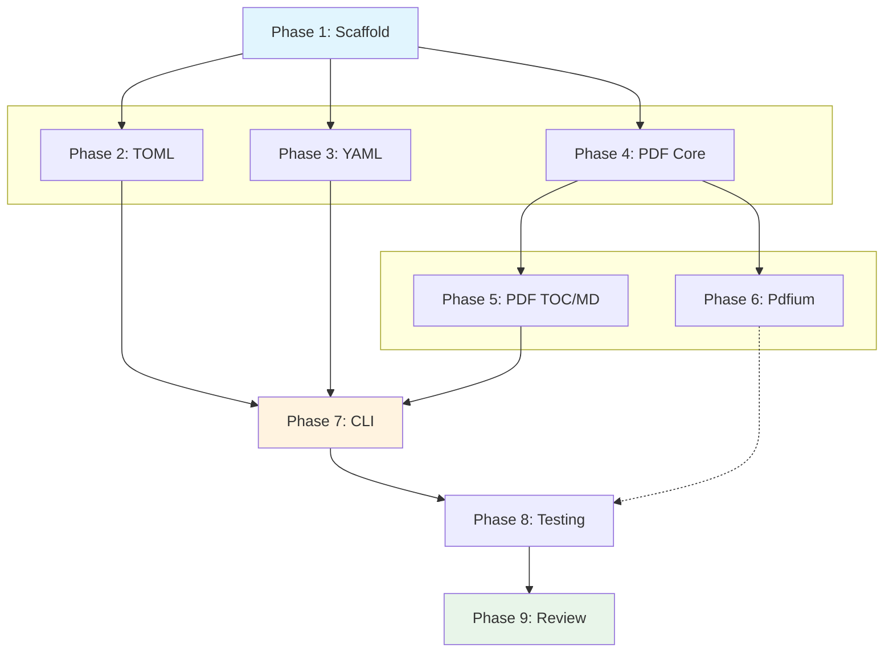

# Planning Process

- [x] Pre-flight Check [13:42]
    - [x] Design docs validated (3 design docs found)
    - [x] Plans directory created
    - [x] Budget estimated: medium (~45%)
- [x] Prep Started [13:42]
    - [x] Identified Skills: rust, thiserror, clap, serde
    - [x] Identified Subagents: rust-architect, completeness-reviewer, risk-assessor, feature-tester-rust
- [x] Prep complete [13:43]
- [x] Clarify & Research [13:44]
    - [x] Clarification questions generated (3 must-answer)
    - [x] User answered questions:
        - CLI: Hybrid auto-detect with --format override
        - PDF: extract + lopdf as defaults
        - Schema: Include as optional feature in v1
    - [x] Requirements updated
- [x] Planning Subagent [agent: **Plan**] started [13:45]
    - [x] subagent skills used: rust, thiserror, clap, serde
    - [x] Planning completed (9 phases)
- [x] All Pre-review Steps complete [13:46]
- [x] Reviews Started [13:47]
   - [x] Completeness Review - 13 findings
   - [x] Concurrency Review - 7 findings
   - [x] Correctness Review - 15 findings
   - [x] Risk Assessment - 12 risks identified
- [x] Reviews Completed [13:48]
- [x] Plan Finalization started [13:49]
    - [x] Dependency graph generated
    - [x] Review feedback incorporated
- [x] Plan finalized [13:50]
- [x] Summary reported [13:51]

## Plan

### Phase 1: Project Scaffold and Core Types
**Agent:** `rust-architect` | **Skills:** rust, thiserror, serde | **Complexity:** Low
**Deps:** None | **Parallel:** No

**Goal:** Establish lib/cli structure with Cargo.toml configurations and core error types.

**Deliver:**
- `lib/Cargo.toml` with feature flags
- `lib/src/lib.rs` with module declarations
- `lib/src/error.rs` with `BiscuitFileError` enum
- `lib/src/detect.rs` with file type detection
- Update workspace `Cargo.toml` to include both packages

**Pass when:**
- [ ] `cargo check -p biscuit-file` succeeds
- [ ] `cargo check -p biscuit-file-cli` succeeds
- [ ] Feature flags compile correctly (`--features full`)

---

### Phase 2: TOML Module Implementation
**Agent:** `schema-architect` | **Skills:** rust, serde, thiserror | **Complexity:** Medium
**Deps:** Phase 1 | **Parallel:** Yes (with Phases 3, 4)

**Goal:** Implement `Toml` struct with parsing, conversion, and validation.

**Deliver:**
- `lib/src/toml/mod.rs` - Public API (Toml struct)
- `lib/src/toml/parse.rs` - I/O and construction
- `lib/src/toml/convert.rs` - JSON/YAML conversion
- `lib/src/toml/validate.rs` - Validation logic
- `lib/src/toml/types.rs` - TomlSource, TomlError, ValidationReport

**Pass when:**
- [ ] Unit tests pass for parsing valid/invalid TOML
- [ ] Conversion tests produce expected JSON/YAML output
- [ ] TryFrom<&str/String/PathBuf/&Path/OsStr/OsString> implementations work
- [ ] DateTime values serialize as RFC 3339 strings

**If failed:**
- Rollback: Revert toml module files
- Retry: Check serde integration and value traversal

---

### Phase 3: YAML Module Implementation
**Agent:** `schema-architect` | **Skills:** rust, serde, thiserror | **Complexity:** Medium
**Deps:** Phase 1 | **Parallel:** Yes (with Phases 2, 4)

**Goal:** Implement `Yaml` struct with lossy conversion policies and schema validation.

**Deliver:**
- `lib/src/yaml/mod.rs` - Public API (Yaml struct)
- `lib/src/yaml/convert.rs` - Conversion with policies
- `lib/src/yaml/schema.rs` - Schema validation (feature-gated)
- `lib/src/yaml/types.rs` - YamlSource, YamlError, ConversionOutput, policies

**Pass when:**
- [ ] Parsing tests pass for valid/invalid YAML
- [ ] Conversion policies produce expected warnings
- [ ] Cycle detection prevents stack overflow (max_depth + visited set)
- [ ] TryFrom<&str/String/PathBuf/&Path/Vec<u8>> implementations work
- [ ] All policy enums implemented (NonStringKeyPolicy, NonFiniteFloatPolicy, etc.)

**If failed:**
- Rollback: Revert yaml module files
- Retry: Check serde_yaml_ng compatibility and policy logic

---

### Phase 4: PDF Module Core (Text Extraction)
**Agent:** `rust-architect` | **Skills:** rust, thiserror | **Complexity:** High
**Deps:** Phase 1 | **Parallel:** Yes (with Phases 2, 3)

**Goal:** Implement `Pdf` struct with text extraction via pdf-extract backend.

**Deliver:**
- `lib/src/pdf/mod.rs` - Public API (Pdf struct)
- `lib/src/pdf/config.rs` - PdfConfig, MarkdownOptions, TextOptions
- `lib/src/pdf/types.rs` - PdfToc, PdfTocItem, PdfMarkdown
- `lib/src/pdf/backends/mod.rs` - Backend traits
- `lib/src/pdf/backends/extract.rs` - pdf-extract implementation
- `lib/src/pdf/text.rs` - Text conversion

**Pass when:**
- [ ] Text extraction works for simple PDFs
- [ ] `as_text()` returns readable content
- [ ] Page range limiting works
- [ ] TryFrom<&str/String/PathBuf> implementations work
- [ ] PdfConfig defaults match design (normalize_text: true, remove_headers_footers: true)

**If failed:**
- Rollback: Revert pdf module files
- Retry: Check pdf-extract API compatibility

---

### Phase 5: PDF TOC and Markdown Conversion
**Agent:** `rust-architect` | **Skills:** rust | **Complexity:** High
**Deps:** Phase 4 | **Parallel:** No

**Goal:** Implement TOC extraction via lopdf and markdown conversion.

**Deliver:**
- `lib/src/pdf/backends/lopdf.rs` - lopdf TOC implementation
- `lib/src/pdf/markdown.rs` - Markdown generation with heuristics
- `PdfMarkdown` struct with content, assets Vec, warnings Vec

**Pass when:**
- [ ] TOC extraction returns correct hierarchy for PDFs with bookmarks
- [ ] TOC returns empty for PDFs without bookmarks (no error)
- [ ] Markdown output contains proper headings (font-size histogram)
- [ ] Page breaks emit as `\n\n---\n\n`
- [ ] PdfMarkdown includes warnings for layout ambiguity

**If failed:**
- Rollback: Revert lopdf and markdown files
- Retry: If lopdf TOC fails, fall back to synthetic TOC from headings

---

### Phase 6: PDF Pdfium Backend (Optional Feature)
**Agent:** `rust-architect` | **Skills:** rust | **Complexity:** High
**Deps:** Phase 4 | **Parallel:** Yes (with Phase 5)

**Goal:** Implement high-fidelity extraction via pdfium-render (feature-gated).

**Deliver:**
- `lib/src/pdf/backends/pdfium.rs` - pdfium implementation (behind `pdfium` feature)

**Pass when:**
- [ ] Feature flag compiles without pdfium (graceful degradation)
- [ ] Layout extraction returns text positions
- [ ] Image extraction produces valid images
- [ ] Runtime init failure falls back to extract backend with warning

**If failed:**
- Rollback: Revert pdfium.rs
- Retry: If Pdfium binaries unavailable, feature remains opt-in for v2

---

### Phase 7: CLI Implementation
**Agent:** `rust-architect` | **Skills:** clap, rust | **Complexity:** Medium
**Deps:** Phases 1-5 | **Parallel:** No

**Goal:** Implement `bf` CLI with auto-detection and format conversion.

**Deliver:**
- `cli/Cargo.toml` - Updated dependencies
- `cli/src/main.rs` - CLI with clap derive
- `cli/src/output.rs` - Output formatting helpers

**Pass when:**
- [ ] `bf config.toml --json` produces valid JSON
- [ ] `bf config.yaml --toml` produces valid TOML
- [ ] `bf document.pdf --markdown` produces markdown
- [ ] `bf document.pdf --text` produces plain text
- [ ] Auto-detection works (.toml, .yaml, .yml, .pdf via extension + magic bytes)
- [ ] --format override works for ambiguous files
- [ ] Error messages are readable (using color-eyre)

**If failed:**
- Rollback: Revert CLI changes
- Retry: Check clap argument conflicts

---

### Phase 8: Testing and Documentation
**Agent:** `feature-tester-rust` | **Skills:** rust | **Complexity:** Medium
**Deps:** Phases 1-7 | **Parallel:** No

**Goal:** Create comprehensive test suite and documentation.

**Deliver:**
- `lib/tests/` - Integration tests with fixtures
- `cli/tests/` - CLI tests with assert_cmd
- Rustdoc comments on all public items

**Pass when:**
- [ ] `cargo test -p biscuit-file` passes
- [ ] `cargo test -p biscuit-file-cli` passes
- [ ] `cargo doc -p biscuit-file` generates without warnings
- [ ] Integration test for each CLI subcommand
- [ ] Integration test for each conversion path
- [ ] Integration test for PDF text/markdown extraction
- [ ] All public items have rustdoc comments

**If failed:**
- Rollback: Fix failing tests
- Retry: Add missing test cases

---

### Phase 9: Final Review and Integration
**Agent:** `completeness-reviewer` | **Skills:** rust | **Complexity:** Low
**Deps:** Phase 8 | **Parallel:** No

**Goal:** Verify all requirements met and integration works.

**Pass when:**
- [ ] All API methods from design docs implemented
- [ ] No `unwrap()`/`expect()` in production code
- [ ] Clippy passes with `-D warnings`
- [ ] `just -f biscuit-file/justfile build` succeeds

## Dependency Graph

**Critical Path:** P1 → P4 → P5 → P7 → P8 → P9 (5 sequential phases)

**Parallelization:**
- Phases 2, 3, 4 run in parallel after Phase 1
- Phases 5, 6 run in parallel after Phase 4
- Phase 6 (pdfium) is off critical path

## Risks

> Implementation risks identified during planning with mitigation strategies.

| Level | Category | Description | Affected | Mitigation |
|-------|----------|-------------|----------|------------|
| HIGH | dependency | pdfium-render requires external Pdfium binaries | P6, P7, P8 | Feature-gate, document installation, verify graceful fallback |
| HIGH | technical | YAML circular references can cause stack overflow | P3, P7, P8 | Implement visited-set cycle detection + max_depth limit |
| HIGH | scope | PDF markdown heuristics (5+ algorithms) underestimated | P5 | Consider splitting Phase 5; start with headings only |
| MEDIUM | dependency | serde_yaml_ng fork sustainability unknown | P3, P7, P8 | Check GitHub activity; fallback to serde-saphyr |
| MEDIUM | technical | TOML datetime conversion format unspecified | P2, P8 | Standardize on RFC 3339; add conversion tests |
| MEDIUM | technical | PDF backend composite engine adds complexity | P4, P6 | Simplify to single-backend per instance for v1 |
| MEDIUM | scope | CLI error handling phase not explicit | P7 | Add error formatting to Phase 7 deliverables |
| MEDIUM | dependency | jsonschema performance for large files | P3, P8 | Add max file size limit; benchmark with 1MB+ YAML |
| MEDIUM | technical | File type detection edge cases unspecified | P1, P7 | Use infer + extension; require --format for ambiguous |
| LOW | scope | TryFrom path interpretation inconsistency | P2, P3, P4 | Document as "file path only" in rustdoc |
| LOW | rollback | Feature flag combinations may conflict | P1, P6 | CI matrix testing all combinations |
| LOW | technical | Heterogeneous array stringification loses types | P3 | Default to Error policy; clear warning message |

## Lessons Learned

> Discoveries about skills or memory resources that were inaccurate, incomplete, or missing.

## Package Changes

> Dependencies to be added, updated, or removed during implementation.

- [ADD]: toml = "0.9" - TOML parsing (match existing workspace version in sniff/lib)
- [ADD]: serde_yaml_ng = "0.10" - YAML parsing (maintained fork of serde_yaml)
- [ADD]: serde_json = "1.0" - JSON serialization/deserialization
- [ADD]: serde = { version = "1.0", features = ["derive"] } - Serialization framework
- [ADD]: thiserror = "2.0" - Error derive macros
- [ADD]: infer = "0.19" - File type detection from magic bytes
- [ADD]: pdf-extract = "0.10" (feature: extract, default) - PDF text extraction
- [ADD]: lopdf = "0.38" (feature: lopdf, default) - PDF TOC/metadata
- [ADD]: pdfium-render = "0.8" (feature: pdfium, optional) - Full PDF rendering
- [ADD]: jsonschema = "0.28" (feature: schema, optional) - JSON Schema validation
- [ADD]: color-eyre = "0.6" (cli only) - User-friendly error reporting
- [ADD]: clap_complete = "4.5" (cli only) - Shell completions
