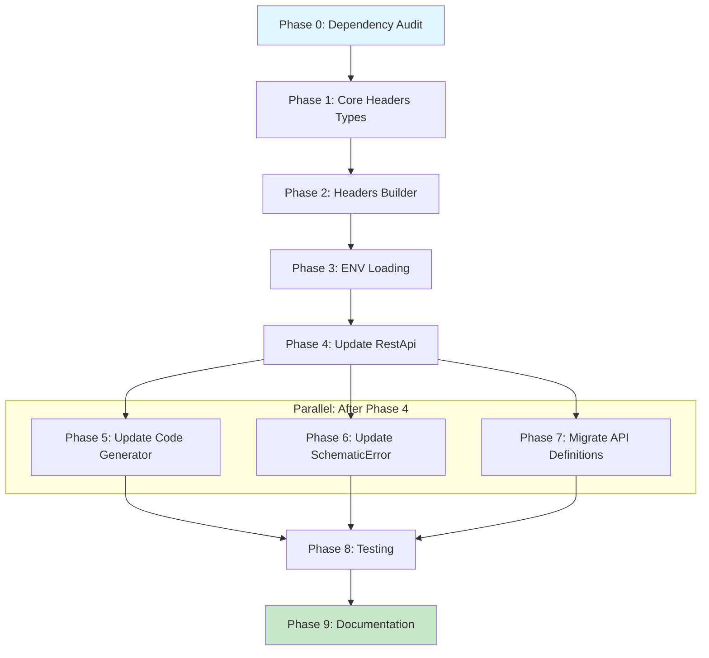

# Planning Process

- [x] Pre-flight Check [12:45]
    - [x] Catalogs validated
    - [x] Directories ready
    - [x] Budget estimated: medium (~45%)
- [x] Prep Started [12:46]
    - [x] Identified Skills: rust, thiserror, serde, reqwest
    - [x] Identified Subagents: Plan, general-purpose, feature-tester-rust, correctness-reviewer
- [x] Prep complete [12:47]
- [x] Clarify & Research [12:48]
    - [x] Clarification agent returned
    - [x] User answered 3 questions
    - [x] Requirements updated with refined architecture
    - [x] No new packages needed (uses existing deps)
- [x] Planning Subagent [agent: **Plan**] started [12:52]
    - [x] subagent skills used: rust, thiserror, serde, reqwest
    - [x] Planning completed [12:54]
- [x] Module Assessment [12:50] - monorepo modules identified
    - [x] subagent skills used: rust
- [x] All Pre-review Steps complete [12:54]
- [x] Reviews Started [12:55]
   - [x] Completeness Review - structure validated
   - [x] Concurrency Review - Phases 6/7 parallel confirmed
   - [x] Correctness Review - found lifetime issues with EnvList
   - [x] Risk Assessment - 3 HIGH, 4 MEDIUM, 2 LOW risks identified
- [x] Reviews Completed [12:57]
- [x] Plan Finalization started [12:58]
    - [x] subagent skills used: rust, thiserror, schematic
    - [x] Dependency graph generated
- [x] Plan finalized [12:59]
- [x] Final Steps
    - [x] Lessons learned collected (3 entries)
    - [x] Package research: base64 = "0.22" needed
- [x] Summary reported [12:59]

## Plan

### Phase 0: Dependency Audit
**Agent:** `general-purpose` | **Skills:** rust | **Complexity:** Low
**Deps:** None | **Parallel:** No

**Goal:** Add base64 dependency to schematic-define for Basic auth encoding.

**Deliver:**
- Add `base64 = "0.22"` to `schematic/define/Cargo.toml`

**Pass when:**
- [ ] `cargo check -p schematic-define` succeeds

---

### Phase 1: Core Headers Types
**Agent:** `general-purpose` | **Skills:** rust, thiserror | **Complexity:** Medium
**Deps:** Phase 0 | **Parallel:** No

**Goal:** Create Headers, SensitiveString, EnvMapping, HeaderError in schematic-define.

**Deliver:**
- New file `schematic/define/src/headers.rs` with:
  - `SensitiveString` wrapper (NO PartialEq/Eq - timing attack prevention)
  - `EnvList { names: Vec<String> }` (Vec<String>, NOT &'static str)
  - `ApiKeyEnv { names: Vec<String>, header: String }`
  - `EnvMapping` with bearer_token, basic_user, basic_pass, api_key fields
  - `HeaderError` enum with InvalidHeaderName, InvalidHeaderValue, MissingEnv, MissingCredential
- Re-export from `schematic/define/src/lib.rs`

**Pass when:**
- [ ] `cargo check -p schematic-define` succeeds
- [ ] SensitiveString Debug output shows `***` not actual value
- [ ] EnvList uses `Vec<String>` (not `Vec<&'static str>`)

**If failed:**
- Rollback: Delete headers.rs, remove lib.rs export
- Retry: Fix lifetime issues by ensuring all fields are owned

---

### Phase 2: Headers Builder
**Agent:** `general-purpose` | **Skills:** rust, reqwest | **Complexity:** High
**Deps:** Phase 1 | **Parallel:** No

**Goal:** Implement Headers struct with builder methods for all auth strategies.

**Deliver:**
- `Headers` struct with authorization, content_type, accept, user_agent, custom fields
- Builder methods: `use_bearer_token`, `use_basic_auth`, `use_api_key`, `user_agent`, `content_type`, `accept`, `header`, `remove`
- Convenience: `accept_json()`, `content_type_json()`
- `build() -> Result<Vec<(String, String)>, HeaderError>`

**Pass when:**
- [ ] All builder methods chainable (return Self)
- [ ] use_basic_auth produces valid Base64 encoding
- [ ] build() validates header names are ASCII

**If failed:**
- Rollback: Revert to Phase 1 types only
- Retry: Fix builder method signatures

---

### Phase 3: ENV Loading
**Agent:** `general-purpose` | **Skills:** rust | **Complexity:** Medium
**Deps:** Phase 2 | **Parallel:** No

**Goal:** Implement from_env, from_env_with, try_from_env methods.

**Deliver:**
- `from_env(self) -> Self` - permissive, ignores missing vars
- `from_env_with(self, mapping: EnvMapping) -> Self` - custom mapping
- `try_from_env(self) -> Result<Self, HeaderError>` - strict, errors on missing
- First env var in chain wins (not last)
- Pre-set values NOT overwritten by ENV loading

**Pass when:**
- [ ] from_env() doesn't panic when vars unset
- [ ] try_from_env() returns MissingEnv when required vars missing
- [ ] Fallback chain: first non-empty value wins

**If failed:**
- Rollback: Remove ENV methods, keep builder
- Retry: Fix ENV resolution logic

---

### Phase 4: Update RestApi Struct
**Agent:** `general-purpose` | **Skills:** rust | **Complexity:** Low
**Deps:** Phase 3 | **Parallel:** No

**Goal:** Add env_mapping field to RestApi for API definitions to configure defaults.

**Deliver:**
- Add `pub env_mapping: Option<EnvMapping>` to RestApi struct
- Add `RestApi::default_env_mapping(&self) -> EnvMapping` helper method
- Backward compatible: None falls back to existing env_auth/env_username

**Pass when:**
- [ ] `cargo check -p schematic-define` succeeds
- [ ] Existing API definitions compile without changes (Option allows None)

**If failed:**
- Rollback: Remove env_mapping field
- Retry: Make field optional with default

---

### Phase 5: Update Code Generator
**Agent:** `general-purpose` | **Skills:** rust | **Complexity:** High
**Deps:** Phase 4 | **Parallel:** Yes (with Phase 6, Phase 7)

**Goal:** Generate Headers-aware clients with new variant_with_headers() method.

**Deliver:**
- Generated struct stores `headers: schematic_define::Headers`
- Constructor initializes Headers from definition's env_mapping
- **NEW** `variant_with_headers(Headers)` method (does NOT change variant_with())
- `build_and_send_request()` calls `self.headers.build()?`
- No more `std::env::var()` calls in generated request methods

**Pass when:**
- [ ] `cargo check -p schematic-gen` succeeds
- [ ] `just -f schematic/justfile generate` produces valid code
- [ ] `cargo check -p schematic-schema` succeeds
- [ ] variant_with() signature UNCHANGED (backward compat)
- [ ] variant_with_headers() method EXISTS

**If failed:**
- Rollback: Revert codegen, regenerate with old templates
- Retry: Fix quote! macro issues

---

### Phase 6: Update SchematicError
**Agent:** `general-purpose` | **Skills:** rust, thiserror | **Complexity:** Low
**Deps:** Phase 4 | **Parallel:** Yes (with Phase 5, Phase 7)

**Goal:** Add HeaderError variant to SchematicError.

**Deliver:**
- Add `Header(#[from] schematic_define::HeaderError)` to SchematicError
- Update error handling in generated request methods

**Pass when:**
- [ ] SchematicError::Header variant exists
- [ ] HeaderError can convert to SchematicError via `?`

**If failed:**
- Rollback: Remove Header variant
- Retry: Check thiserror derive syntax

---

### Phase 7: Migrate All 7 API Definitions
**Agent:** `general-purpose` | **Skills:** rust | **Complexity:** Medium
**Deps:** Phase 4 | **Parallel:** Yes (with Phase 5, Phase 6)

**Goal:** Update all API definitions to use explicit EnvMapping.

**Deliver:**
- OpenAI: `bearer_token: EnvList::new(vec!["OPENAI_API_KEY"])`
- Anthropic: `api_key: Some(ApiKeyEnv { names: vec!["ANTHROPIC_API_KEY"], header: "X-Api-Key" })`
- HuggingFace: `bearer_token: EnvList::new(vec!["HF_TOKEN", "HUGGING_FACE_API_KEY", "HF_API_KEY"])`
- ElevenLabs: `api_key: Some(ApiKeyEnv { names: vec!["ELEVEN_LABS_API_KEY", "ELEVENLABS_API_KEY"], header: "xi-api-key" })`
- EmqxBasic: `basic_user: EnvList::single("EMQX_API_KEY"), basic_pass: EnvList::single("EMQX_API_SECRET")`
- EmqxBearer: `bearer_token: EnvList::single("EMQX_TOKEN")`
- OllamaNative/OllamaOpenAI: `EnvMapping::default()` (no auth)

**Pass when:**
- [ ] All 7 APIs compile with env_mapping field
- [ ] `cargo test -p schematic-definitions` passes
- [ ] Each API's EnvMapping matches its current env_auth configuration

**If failed:**
- Rollback: Remove env_mapping from definitions
- Retry: Fix EnvList/ApiKeyEnv construction

---

### Phase 8: Comprehensive Testing
**Agent:** `feature-tester-rust` | **Skills:** rust | **Complexity:** High
**Deps:** Phase 5, Phase 6, Phase 7 | **Parallel:** No

**Goal:** Full test coverage for Headers system.

**Deliver:**
- Unit tests in schematic-define:
  - SensitiveString redaction
  - Builder chaining
  - ENV fallback priority
  - All auth strategies
- Integration tests with wiremock:
  - Bearer auth with ENV fallback
  - ApiKey auth with direct injection
  - Basic auth with username/password
  - Override scenarios (direct > ENV)
- Performance benchmark (criterion):
  - Compare Headers.build() vs current env::var approach
  - Target: <10% overhead

**Pass when:**
- [ ] `cargo test --workspace` passes
- [ ] All 3 auth strategies tested with wiremock
- [ ] Coverage includes: ENV fallback, direct injection, override
- [ ] Benchmark shows acceptable performance

**If failed:**
- Rollback: N/A (tests don't change production)
- Retry: Fix failing tests

---

### Phase 9: Documentation
**Agent:** `general-purpose` | **Skills:** rust | **Complexity:** Low
**Deps:** Phase 8 | **Parallel:** No

**Goal:** Document Headers API and migration path.

**Deliver:**
- Rustdoc on all public types in headers.rs
- Usage examples in doc comments
- Migration guide in schematic/docs/headers/

**Pass when:**
- [ ] `cargo doc -p schematic-define` generates clean docs
- [ ] Examples compile
- [ ] Migration path documented

## Dependency Graph

**Critical Path:** P0 → P1 → P2 → P3 → P4 → P5 → P8 → P9 (7 effective phases with parallelism)

## Risks

> Implementation risks identified during planning with mitigation strategies.

| Level | Category | Description | Affected | Mitigation |
|-------|----------|-------------|----------|------------|
| HIGH | technical | Generated code verification gap - tests only verify syntax, not runtime | Phase 5,7,8 | Add wiremock integration tests for all 3 auth strategies |
| HIGH | scope | Lifetime mismatch - EnvList uses &'static str but RestApi has Vec<String> | Phase 1,2,6 | Use Vec<String> instead of Vec<&'static str> throughout |
| HIGH | technical | Basic auth username/password split - risk of credential misalignment | Phase 1,3,7 | Add explicit BasicAuth { username_env, password_env } variant |
| MEDIUM | rollback | Breaking change for variant() callers in downstream crates | Phase 6,7 | Keep variant_with() unchanged, add variant_with_headers() |
| MEDIUM | dependency | base64 crate version conflict potential | Phase 1 | Check cargo tree, use workspace.dependencies |
| MEDIUM | technical | Headers.build() performance overhead on every request | Phase 3,8 | Cache resolved credentials after first build |
| MEDIUM | technical | SensitiveString debug output could leak via parent Debug derives | Phase 1,4 | Add test: format!("{:?}", headers) doesn't contain credential |

## Lessons Learned

> Discoveries about skills or memory resources that were inaccurate, incomplete, or missing.

- [PATTERN: Headers API]: Initial design used `Vec<&'static str>` for EnvList but RestApi.env_auth is `Vec<String>` - lifetime mismatch. Changed to `Vec<String>` throughout.
- [SECURITY: SensitiveString]: Deriving PartialEq/Eq creates timing attack vulnerability for credential comparison. Must be removed.
- [SKILL: schematic]: Testing gap not emphasized - schematic tests verify syntax only (syn::parse2), not runtime behavior. Added wiremock integration tests requirement.

## Package Changes

> Dependencies to be added, updated, or removed during implementation.

- [ADD]: `base64 = "0.22"` in schematic-define - Basic auth credential encoding
- [VERIFY]: Check `cargo tree -p schematic-define | grep base64` for version conflicts
