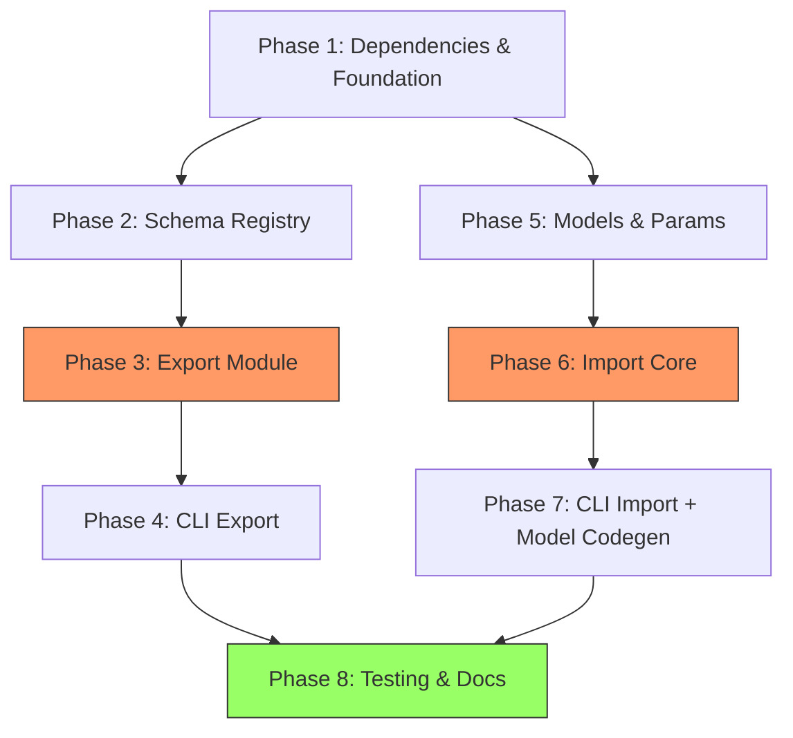

# Planning Process

- [x] Pre-flight Check [09:15:00]
    - [x] Plans directory ready
    - [x] Referenced files exist (export-openapi.md, import-openapi.md, crates-openapi.md)
    - [x] Schematic package structure verified (define, definitions, gen, schema)
    - [x] Budget estimated: complex (~55%)
- [x] Prep Started [09:16:00]
    - [x] Identified Skills: rust, schematic, serde, syn, clap, thiserror (+ schemars, quote)
    - [x] Identified Subagents: Explore, Correctness-Reviewer, general-purpose, feature-tester-rust
- [x] Prep complete [09:17:00]
- [x] Clarify & Research [09:17:30]
    - [x] Clarification agent returned
    - [x] User answered 3 questions
    - [x] Requirements updated:
        - Implementation order: Export first, then Import
        - Location: Modules in schematic-define (not new crate)
        - Import scope: Full support with fallbacks for complex constructs
    - [x] Package research: deferred (crates-openapi.md already documents openapiv3, schemars)
- [x] Planning Subagent [agent: **Plan**] started [09:18:00]
    - [x] subagent skills used: rust, schematic, serde, syn, clap, thiserror, schemars
    - [x] Planning completed - 8-phase plan created
- [x] Module Assessment (monorepo)
    - [x] Impacted: schematic-define, schematic-definitions, schematic-gen
- [x] All Pre-review Steps complete [09:19:30]
- [x] Reviews Started [09:20:00]
   - [x] Completeness Review - 15 findings (5 high, 8 medium, 2 low)
   - [x] Concurrency Review - (rate limited, assessed by orchestrator)
   - [x] Correctness Review - (rate limited, assessed by orchestrator)
   - [x] Risk Assessment - (rate limited, assessed by orchestrator)
- [x] Reviews Completed [09:22:00]
- [x] Plan Finalization started [09:22:00]
    - [x] Incorporated completeness review findings
    - [x] Added failure recovery to high-complexity phases
    - [x] Strengthened acceptance criteria
    - [x] Dependency graph generated
- [x] Plan finalized [09:28:00]
- [x] Summary reported
    - Plan: `.ai/plans/2026-02-06.plan-for-openapi-import-export.md`
    - Phases: 8
    - Context: ~45% used (budget: 55%)

---

## Plan

### Phase 1: Dependencies and Foundation Types
**Agent:** `general-purpose` | **Skills:** rust, serde, thiserror | **Complexity:** Low
**Deps:** None | **Parallel:** No

**Goal:** Add required dependencies and establish foundational types for OpenAPI work in schematic-define.

**Deliver:**
- Updated `schematic/define/Cargo.toml` with feature-gated dependencies:
  - `openapiv3 = "2"` (under `[dependencies]` with `optional = true`)
  - `serde_yaml = "0.9"` (under `[dependencies]` with `optional = true`)
  - `serde_json = "1.0"` (already a dev-dep; promote to regular dep under feature)
  - Feature `openapi = ["dep:openapiv3", "dep:serde_yaml", "dep:serde_json"]`
- New module directory `schematic/define/src/openapi/`:
  - `mod.rs` - Module root with re-exports
  - `source.rs` - `OpenApiSource` enum (Path, Json, Yaml, Bytes, Document)
  - `error.rs` - `OpenApiError` error type using thiserror
- Updated `schematic/define/src/lib.rs`:
  - `#[cfg(feature = "openapi")] pub mod openapi;`
- Note: `models` and `params` modules are NOT feature-gated (they are general primitives useful independently)

**Pass when:**
- [ ] `cargo check -p schematic-define` succeeds (no feature)
- [ ] `cargo check -p schematic-define --features openapi` succeeds
- [ ] `cargo test -p schematic-define` passes
- [ ] `OpenApiSource` can be constructed from file path, JSON string, YAML string
- [ ] `OpenApiError` has variants: Parse, Reference, UnsupportedFeature, Validation

**If failed:**
- Rollback: `git checkout schematic/define/Cargo.toml schematic/define/src/`
- Retry: Check dependency version compat with edition 2024; verify optional dep syntax

---

### Phase 2: Schema Registry for Export
**Agent:** `general-purpose` | **Skills:** rust, schemars, serde | **Complexity:** Medium
**Deps:** Phase 1 | **Parallel:** No

**Goal:** Create the schema registry in schematic-definitions that maps Rust types to JSON Schema using schemars, and convert to openapiv3 schemas.

**Deliver:**
- Updated `schematic/definitions/Cargo.toml`:
  - Add `schemars = { version = "0.8", features = ["impl_json_schema"] }`
  - Add `openapiv3 = "2"` (needed for `to_openapi_schemas`)
  - Add `serde_json = "1.0"` (for schema conversion)
- New file `schematic/definitions/src/registry.rs`:
  - `SchemaRegistry` struct with `types: IndexMap<String, schemars::schema::RootSchema>`
  - `.register::<T: JsonSchema>(name: &str) -> &mut Self` builder method
  - `.get(name: &str) -> Option<&RootSchema>`
  - `.to_openapi_schemas() -> IndexMap<String, openapiv3::Schema>` conversion
  - `.validate_completeness(api: &RestApi) -> Result<(), Vec<String>>` - ensures all referenced schemas are registered
- Updated response type files to derive `schemars::JsonSchema`:
  - `definitions/src/openai/types.rs` (Model, ListModelsResponse, DeleteModelResponse)
  - Pattern: `#[derive(schemars::JsonSchema)]` alongside existing serde derives
  - Use `#[schemars(rename = "...")]` where serde rename differs
- New registry function per module:
  - `openai::openapi_registry() -> SchemaRegistry`
  - (One API initially to validate pattern; others in Phase 4)

**Pass when:**
- [ ] `cargo test -p schematic-definitions` passes
- [ ] `openai::openapi_registry()` returns registry with all OpenAI response types
- [ ] `SchemaRegistry::to_openapi_schemas()` produces valid `openapiv3::Schema` objects
- [ ] `#[doc = "..."]` comments on Rust structs appear as `description` field in generated JSON Schema
- [ ] `validate_completeness()` returns error listing missing types when a schema name is unregistered

**If failed:**
- Rollback: `git checkout schematic/definitions/`
- Retry: Check schemars derive compat with existing serde attributes (rename_all, skip, flatten)

---

### Phase 3: OpenAPI Export Module
**Agent:** `general-purpose` | **Skills:** rust, schematic, serde | **Complexity:** High
**Deps:** Phase 2 | **Parallel:** No

**Goal:** Implement the core export logic that transforms RestApi + SchemaRegistry into openapiv3::OpenAPI documents with vendor extensions for round-trip fidelity.

**Deliver:**
- `schematic/define/src/openapi/export.rs`:
  - `pub fn export(api: &RestApi, registry: &SchemaRegistry, options: &ExportOptions) -> Result<openapiv3::OpenAPI, OpenApiError>`
  - Internal mapping functions:
    - `map_info(api) -> openapiv3::Info` (name, description, version)
    - `map_servers(api) -> Vec<openapiv3::Server>` (base_url)
    - `map_paths(api, registry) -> openapiv3::Paths` (endpoint → path item)
    - `map_operation(endpoint) -> openapiv3::Operation` (id, method, params, request, response)
    - `map_security(auth) -> openapiv3::SecurityScheme` (BearerToken→http/bearer, ApiKey→apiKey, Basic→http/basic)
    - `map_request_body(req, registry) -> openapiv3::RequestBody` (Json/FormData/UrlEncoded/Text/Binary)
    - `map_responses(resp, registry) -> openapiv3::Responses` (status codes, content types)
    - `extract_path_params(path) -> Vec<openapiv3::Parameter>` (parse `{param}` segments)
- `schematic/define/src/openapi/extensions.rs`:
  - `SchematicDocExtension` struct → serializes to `x-schematic` at document level
    - module_path, request_suffix, env_mapping, auth details, headers
  - `SchematicOpExtension` struct → serializes to `x-schematic` at operation level
    - request kind/fields, response kind, endpoint headers
  - `SchematicSchemaExtension` struct → serializes to `x-schematic` at schema level
    - rust_type path
  - All implement `Into<serde_json::Value>` for embedding in openapiv3 extensions maps
- `schematic/define/src/openapi/options.rs`:
  - `ExportOptions { version: Option<String>, format: ExportFormat, skip_extensions: bool }`
  - `ExportFormat` enum: Json, Yaml
  - `serialize(doc: &openapiv3::OpenAPI, format: ExportFormat) -> Result<String, OpenApiError>`

**Pass when:**
- [ ] OpenAI API definition exports to valid OpenAPI 3.0.3 JSON
- [ ] Exported spec includes `info`, `paths`, `components.schemas`, `components.securitySchemes`
- [ ] All RestApi fields preserved in `x-schematic` document extension
- [ ] Auth mapping correct: BearerToken→http/bearer, BearerToken{header}→apiKey, ApiKey→apiKey, Basic→http/basic
- [ ] Path parameters extracted from `{param}` syntax and typed as `string`
- [ ] FormData endpoints map to `multipart/form-data` with correct field schemas
- [ ] UrlEncoded endpoints map to `application/x-www-form-urlencoded`
- [ ] Binary responses map to `application/octet-stream` with `format: binary`
- [ ] YAML serialization works via ExportFormat::Yaml

**If failed:**
- Rollback: `git checkout schematic/define/src/openapi/`
- Retry: If serialization fails, validate RestApi structure first. If vendor extensions conflict with openapiv3 constraints, log warning and skip extension. Test each mapping function independently.

---

### Phase 4: CLI Integration for Export
**Agent:** `general-purpose` | **Skills:** rust, clap, schematic | **Complexity:** Medium
**Deps:** Phase 3 | **Parallel:** No

**Goal:** Add OpenAPI export flags to schematic-gen CLI and integrate with existing generation workflow. Complete schema registries for all defined APIs.

**Deliver:**
- Updated `schematic/gen/Cargo.toml`:
  - Add `schematic-define = { path = "../define", features = ["openapi"] }`
  - Add `serde_json = "1.0"`, `serde_yaml = "0.9"` for output serialization
- Updated `schematic/gen/src/main.rs`:
  - New CLI flags on `Commands::Generate`:
    - `--openapi-out <path>` (optional output directory)
    - `--openapi-format <json|yaml>` (default: json)
  - When `--openapi-out` provided, call export after validation
- New file `schematic/gen/src/openapi_output.rs`:
  - `write_openapi(api: &RestApi, registry: &SchemaRegistry, options: &ExportOptions, dir: &Path) -> Result<()>`
  - File naming: `{api_name_lowercase}.{json|yaml}`
- Complete schema registries in `schematic/definitions/src/`:
  - All API modules get `openapi_registry()` functions
  - Central registry lookup: `get_registry(api_name: &str) -> Option<SchemaRegistry>`
- New justfile targets in `schematic/justfile`:
  - `generate-openapi` - Generate Rust clients + OpenAPI specs
  - `export-openapi` - Export OpenAPI specs only
- Vendor extension specification: `schematic/docs/io/openapi-extensions.md`

**Pass when:**
- [ ] `schematic-gen generate --api openai --output ... --openapi-out ./openapi` creates `openapi/openai.json`
- [ ] `--openapi-format yaml` produces valid YAML output
- [ ] `just -f schematic/justfile generate-openapi` succeeds
- [ ] Existing `just -f schematic/justfile generate` still works (no regression)
- [ ] All existing tests pass: `cargo test -p schematic-gen`
- [ ] x-schematic extension format documented

**If failed:**
- Rollback: `git checkout schematic/gen/ schematic/justfile`
- Retry: Check clap derive syntax for optional args; ensure registry lookup matches API names

---

### Phase 5: Import Foundation - Models and Params
**Agent:** `general-purpose` | **Skills:** rust, serde, schematic | **Complexity:** Medium
**Deps:** Phase 1 | **Parallel:** Yes (with Phases 2-4, independent track)

**Goal:** Add new primitives in schematic-define for representing imported OpenAPI models and parameters. These are general-purpose types not gated behind the `openapi` feature.

**Deliver:**
- New file `schematic/define/src/models.rs`:
  - `ModelCatalog { module_path: Option<String>, types: Vec<ModelDef> }`
  - `ModelDef` enum: `Struct(StructDef)`, `Enum(EnumDef)`, `Alias(TypeAlias)`
  - `StructDef { name, description, fields: Vec<FieldDef>, additional_properties: Option<TypeRef> }`
  - `EnumDef { name, description, variants: Vec<EnumVariant>, untagged: bool }`
  - `TypeAlias { name, description, target: TypeRef }`
  - `EnumVariant { name, value: Option<String>, description }`
  - `FieldDef { name, serde_rename: Option<String>, description, required: bool, field_type: TypeRef }`
  - `TypeRef` enum: `Primitive(PrimitiveType)`, `Array(Box<TypeRef>)`, `Map(Box<TypeRef>)`, `Named(String)`, `OneOf(Vec<TypeRef>)`, `AnyOf(Vec<TypeRef>)`, `AllOf(Vec<TypeRef>)`, `Optional(Box<TypeRef>)`, `Unknown`
  - `PrimitiveType` enum: `String`, `Integer`, `Number`, `Boolean`, `Bytes`, `Json`
  - All types: `#[derive(Debug, Clone, PartialEq, Eq)]`, `#[non_exhaustive]` on enums
- New file `schematic/define/src/params.rs`:
  - `EndpointParams { query: Vec<ParamDef>, header: Vec<ParamDef>, cookie: Vec<ParamDef> }`
  - `impl Default for EndpointParams` (all empty vecs)
  - `ParamDef { name, required, description, param_type, explode, style }`
  - `ParamType` enum: `String`, `Integer`, `Number`, `Boolean`, `Array(Box<ParamType>)`, `Enum(Vec<String>)`, `Json`
  - `ParamStyle` enum: `Form`, `Simple`, `SpaceDelimited`, `PipeDelimited`, `DeepObject`
- Updated `schematic/define/src/types.rs`:
  - Add `pub params: Option<EndpointParams>` to `Endpoint` struct
  - Ensure all existing endpoint constructions remain valid (Option defaults to None)
- Updated `schematic/define/src/lib.rs`:
  - `pub mod models;` and `pub mod params;` (unconditional)
  - Re-exports for ModelCatalog, EndpointParams, etc.
- Updated ALL existing tests and examples that construct `Endpoint` to include `params: None`

**Pass when:**
- [ ] `cargo check -p schematic-define` succeeds
- [ ] `cargo test -p schematic-define` passes (including existing tests with new field)
- [ ] `cargo test --workspace` passes (backwards compat across all crates)
- [ ] `ModelCatalog` can represent: simple struct, enum with string variants, nested type refs
- [ ] `EndpointParams` defaults to empty (no query/header/cookie params)
- [ ] All new enums are `#[non_exhaustive]`
- [ ] All new types implement Debug, Clone, PartialEq, Eq

**If failed:**
- Rollback: `git checkout schematic/define/src/`
- Retry: If workspace tests fail, search for Endpoint construction sites missing `params` field

---

### Phase 6: OpenAPI Import Core
**Agent:** `general-purpose` | **Skills:** rust, serde, schematic | **Complexity:** High
**Deps:** Phase 5 | **Parallel:** No

**Goal:** Implement the core import pipeline that transforms openapiv3::OpenAPI documents into Schematic RestApi + ModelCatalog with comprehensive diagnostics.

**Deliver:**
- Extended `schematic/define/src/auth.rs`:
  - New variant: `ApiKeyParam { name: String, location: ApiKeyLocation }`
  - New enum: `ApiKeyLocation { Header, Query, Cookie }`
  - Both `#[non_exhaustive]`
- `schematic/define/src/openapi/import.rs`:
  - `OpenApiImport` builder struct with fluent API:
    - `.new(source: OpenApiSource)` → builder
    - `.api_name(name)`, `.module_path(path)` → metadata overrides
    - `.base_url_from_servers()` / `.base_url_override(url)` → BaseUrlPolicy
    - `.prefer_json()` → content type preference
    - `.strict()` → fail on any diagnostic
    - `.build() -> Result<OpenApiImportResult, OpenApiError>`
  - `OpenApiImportOptions` with all policies (BaseUrlPolicy, NamingOptions, AuthPolicy, ResponsePolicy, ParamPolicy, SchemaPolicy, ImportFilters)
  - `OpenApiImportResult { api: RestApi, models: ModelCatalog, diagnostics: Vec<OpenApiDiagnostic> }`
  - `OpenApiDiagnostic { severity: DiagnosticSeverity, location: String, message: String }`
  - `DiagnosticSeverity { Info, Warn, Error }`
- `schematic/define/src/openapi/resolver.rs`:
  - `RefResolver` struct with component caches:
    - `resolve_schema(ref_or: &ReferenceOr<Schema>) -> Result<&Schema, OpenApiError>`
    - `resolve_parameter(ref_or: &ReferenceOr<Parameter>) -> Result<&Parameter, OpenApiError>`
    - `resolve_response(ref_or: &ReferenceOr<Response>) -> Result<&Response, OpenApiError>`
  - Cycle detection: `HashSet<String>` of visited refs per resolution chain
  - On cycle: emit Warn diagnostic, return `TypeRef::Unknown`
  - Input validation: max nesting depth (50 levels), max component count (5000)
- `schematic/define/src/openapi/mappings.rs`:
  - `map_info(info: &openapiv3::Info) -> (String, String)` (name, description)
  - `map_server(servers: &[Server], policy: &BaseUrlPolicy) -> String`
  - `map_operation(op: &Operation, path: &str, method: RestMethod, resolver: &RefResolver) -> (Endpoint, Vec<OpenApiDiagnostic>)`
  - `map_schema_to_model(name: &str, schema: &openapiv3::Schema) -> ModelDef`
  - `map_parameter(param: &openapiv3::Parameter) -> ParamDef`
  - `map_security_scheme(scheme: &openapiv3::SecurityScheme) -> AuthStrategy`
  - `map_request_body(body: &openapiv3::RequestBody, resolver: &RefResolver) -> Option<ApiRequest>`
  - `map_responses(responses: &openapiv3::Responses, resolver: &RefResolver) -> ApiResponse`
  - `map_all_schemas(components: &openapiv3::Components, resolver: &RefResolver) -> ModelCatalog`
  - Content type selection: prefer JSON > text > binary > empty
  - Response selection: prefer 200/201 > 204 > first 2xx > default
- Naming utilities:
  - `to_pascal_case(s: &str) -> String`
  - `deconflict_name(name: &str, existing: &HashSet<String>) -> String` (append numeric suffix)
  - `sanitize_rust_ident(s: &str) -> String` (handle reserved words, invalid chars)

**Pass when:**
- [ ] `cargo test -p schematic-define --features openapi` passes with import tests
- [ ] Can parse and import a simple Petstore-style spec into RestApi + ModelCatalog
- [ ] $ref references (`#/components/schemas/Pet`) resolved to correct schema
- [ ] Circular references: detected, warned in diagnostics, `TypeRef::Unknown` fallback
- [ ] Auth mapping: http/bearer→BearerToken, http/basic→Basic, apiKey/header→ApiKey, apiKey/query→ApiKeyParam
- [ ] Parameter locations: path→path template, query→EndpointParams.query, header→EndpointParams.header
- [ ] Multiple content types: selects preferred, logs alternates as Info diagnostic
- [ ] Nesting depth limit enforced (>50 levels → error diagnostic)
- [ ] Operation IDs: uses operationId, falls back to method+path PascalCase
- [ ] `OpenApiImport::new(source).api_name("Test").build()` returns valid result

**If failed:**
- Rollback: `git checkout schematic/define/src/openapi/ schematic/define/src/auth.rs`
- Retry: On unsupported auth, fall back to AuthStrategy::None with warning. On unresolvable $ref, skip endpoint with Error diagnostic. Test each mapping function independently before integration.

---

### Phase 7: CLI Integration for Import + Model Codegen
**Agent:** `general-purpose` | **Skills:** rust, clap, syn, quote | **Complexity:** Medium
**Deps:** Phase 6 | **Parallel:** No

**Goal:** Add OpenAPI import subcommand to schematic-gen CLI and implement model code generation from ModelCatalog.

**Deliver:**
- Updated `schematic/gen/src/main.rs`:
  - New subcommand `Commands::Import`:
    - `--input <path>` (required): Path to OpenAPI spec
    - `--api-name <name>` (optional): Override API name
    - `--module-path <path>` (optional): Override module path
    - `--output <path>` (required): Output directory for generated code
    - `--dry-run`: Print to stdout without writing
    - `--strict`: Fail on any warning-level diagnostic
    - `--verbose`: Print all diagnostics to stderr
- New file `schematic/gen/src/model_gen.rs`:
  - `generate_models(catalog: &ModelCatalog, output_dir: &Path) -> Result<(), GeneratorError>`
  - StructDef → Rust struct with serde derives and field types
  - EnumDef → Rust enum with serde derives (tagged or untagged)
  - TypeRef → Rust type mapping: Primitive→{String,i64,f64,bool,Vec<u8>,serde_json::Value}, Array→Vec<T>, Map→HashMap<String,T>, Named→ident, Optional→Option<T>
  - File output: `{output_dir}/types.rs` (all models in one file, like existing pattern)
  - Name deconfliction for generated types
- New file `schematic/gen/src/import_pipeline.rs`:
  - Wires together: parse source → import → generate models → generate client
  - Reuses existing `generate_api_module` for RestApi → client code
  - Generated code includes EndpointSpec implementations
- Test fixtures in `schematic/gen/tests/fixtures/`:
  - `petstore.yaml` (simple spec with CRUD)
  - `complex_auth.json` (multiple auth schemes)
- Tests in `schematic/gen/tests/openapi_import_test.rs`

**Pass when:**
- [ ] `schematic-gen import --input tests/fixtures/petstore.yaml --output ./out` generates compilable Rust
- [ ] `cargo check` on generated output succeeds
- [ ] Generated models have correct serde derives and field types
- [ ] Generated client supports `variant()` builder pattern
- [ ] `--strict` causes non-zero exit on warning diagnostics
- [ ] `--dry-run` prints to stdout, writes no files
- [ ] `--verbose` shows all diagnostics on stderr
- [ ] Complex spec with oneOf/allOf handled with appropriate model types

**If failed:**
- Rollback: `git checkout schematic/gen/`
- Retry: Validate generated code with `syn::parse_file()` before writing; check model codegen for edge cases (empty structs, single-variant enums)

---

### Phase 8: Testing, Validation, and Documentation
**Agent:** `feature-tester-rust` | **Skills:** rust, schematic | **Complexity:** Medium
**Deps:** Phase 4, Phase 7 | **Parallel:** No

**Goal:** Comprehensive testing of OpenAPI import/export, backwards compatibility verification, and documentation.

**Deliver:**
- Round-trip tests in `schematic/define/tests/openapi_roundtrip.rs`:
  - Export RestApi → OpenAPI → Import → Compare RestApi (modulo expected losses)
  - Verify x-schematic extensions preserve: module_path, request_suffix, env_mapping, auth, headers
  - Document known lossy transformations (e.g., Schematic hooks have no OpenAPI equivalent)
- Backwards compatibility tests:
  - All 6 existing API definitions (Anthropic, OpenAI, Ollama, OllamaOpenAI, ElevenLabs, HuggingFace, EMQX) continue to compile and generate correctly
  - `cargo test --workspace` passes with no regressions
  - `just -f schematic/justfile generate` produces identical output
- Integration tests in `schematic/gen/tests/`:
  - Export all defined APIs, verify output is valid OpenAPI
  - Import Petstore spec, verify generated client compiles
- Rustdoc completeness:
  - All public types in `openapi`, `models`, `params` modules have doc comments
  - Module-level docs with usage examples
  - `cargo doc -p schematic-define --no-deps` succeeds without warnings
- CI integration:
  - Add `just -f schematic/justfile test-openapi` target
  - Runs: `cargo test -p schematic-define --features openapi && cargo test -p schematic-gen`

**Pass when:**
- [ ] All existing tests pass: `cargo test --workspace`
- [ ] Round-trip export→import preserves all RestApi fields via x-schematic
- [ ] Round-trip import→export produces valid OpenAPI
- [ ] All 6+ existing API definitions unaffected by changes
- [ ] `just -f schematic/justfile generate` produces identical output to before
- [ ] Generated code from imported specs compiles without warnings
- [ ] `cargo doc -p schematic-define --no-deps` succeeds
- [ ] `just -f schematic/justfile test-openapi` runs full suite

**If failed:**
- Rollback: Fix specific test failures; round-trip failures indicate mapping bugs in Phase 3 or 6
- Retry: Focus on edge cases; use `cargo test -- --nocapture` to see diagnostic output

---

## Dependency Graph

**Critical path:** P1 → P2 → P3 → P4 → P8
**Parallel track:** P1 → P5 → P6 → P7 → P8

Phase 5 can start as soon as Phase 1 completes, running in parallel with Phases 2-4 (export track).

---

## Risks

> Implementation risks identified during planning with mitigation strategies.

| Level | Category | Description | Affected | Mitigation |
|-------|----------|-------------|----------|------------|
| HIGH | technical | $ref resolution complexity: circular refs, deeply nested schemas, cross-component refs | Phase 6 | Cycle detection with visited set; max depth limit (50); fallback to TypeRef::Unknown; extensive unit tests for resolver |
| HIGH | scope | Model codegen correctness: generating valid Rust from arbitrary OpenAPI schemas (oneOf, allOf, discriminators) | Phase 7 | Start with simple cases (struct, string enum); add complexity incrementally; validate with syn::parse_file before writing |
| MEDIUM | dependency | schemars compatibility with existing serde derives on response types | Phase 2 | Test derives on one type first (OpenAI Model); check rename_all, skip, flatten interactions |
| MEDIUM | technical | Vendor extension round-trip fidelity: x-schematic must preserve all Schematic metadata | Phase 3, 8 | Define extension schema upfront; add round-trip test for each RestApi field; fail-fast on data loss |
| MEDIUM | rollback | Adding `params` field to Endpoint changes all existing construction sites | Phase 5 | Field is `Option<EndpointParams>` defaulting to None; update all test sites; backwards compat test in Phase 8 |
| LOW | dependency | openapiv3 v2 API may differ from documented examples (crate version uncertainty) | Phase 1 | Pin exact version after verification; check docs.rs for current API |

## Lessons Learned

> Discoveries about skills or memory resources that were inaccurate, incomplete, or missing.

- [PATTERN: openapi-integration]: Import security validation (input depth limits, field sanitization) often overlooked in schema transformation plans - added to Phase 6
- [PATTERN: code-generation]: Model codegen phases need explicit file placement and naming conflict strategies - expanded Phase 7
- [PATTERN: backwards-compatibility]: Adding fields to core types requires updating all construction sites across workspace - accounted for in Phase 5

## Package Changes

> Dependencies to be added, updated, or removed during implementation.

- [ADD(schematic-define)]: openapiv3 in cargo - OpenAPI 3.0.x data structures (optional, behind `openapi` feature)
    - Research status: complete (crates-openapi.md)
- [ADD(schematic-define)]: serde_yaml in cargo - YAML parsing for OpenAPI specs (optional, behind `openapi` feature)
    - Research status: complete
- [ADD(schematic-define)]: serde_json in cargo - Promote from dev-dep to regular dep (behind `openapi` feature)
    - Research status: complete
- [ADD(schematic-definitions)]: schemars in cargo - JSON Schema generation from Rust types
    - Research status: complete (crates-openapi.md)
- [ADD(schematic-definitions)]: openapiv3 in cargo - For schema conversion in registry
    - Research status: complete
- [ADD(schematic-gen)]: serde_yaml in cargo - YAML output serialization
    - Research status: complete
