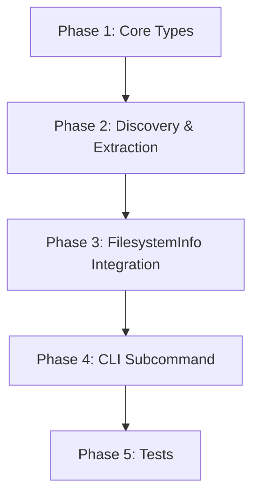

# Plan: RepoDocuments for Sniff Library

## Summary

Add a `docs` module to `sniff-lib` containing `RepoDocuments` and `MarkdownMeta` structs. `RepoDocuments` takes a directory path, discovers the git repo root, walks all `.md` files, and returns metadata including frontmatter fields, title extraction, xxhash content hashes, and file modification times. The CLI gets a new `docs` subcommand under the filesystem category.

## Design Decisions

1. **`last_updated`**: Simple `DateTime<Utc>` with resolution logic hidden internally
2. **`filepath`**: `PathBuf` (owned) for serializable structs
3. **Integration**: Add `docs: Option<Vec<MarkdownMeta>>` to `FilesystemInfo`
4. **Frontmatter parsing**: Reuse `serde_yaml` (already a dependency) with manual `---` delimiter parsing, consistent with darkmatter's approach but self-contained in sniff
5. **Hashing**: Add `biscuit-hash` dependency to sniff-lib (xxhash only, default feature)
6. **File walking**: Use `ignore` crate (already a dependency) for .gitignore-aware traversal
7. **Git root discovery**: Use `git2` (already a dependency) via `Repository::discover()`

## Plan

### Phase 1: Core Types and Module Structure
**Agent:** `general-purpose` | **Skills:** sniff, chrono, xx-hash | **Complexity:** Low
**Deps:** None | **Parallel:** No

**Goal:** Create the `docs` module with `MarkdownMeta` struct and `RepoDocuments` struct definitions.

**Files to create/modify:**
- `sniff/lib/src/filesystem/docs.rs` (new) - Core types and implementation
- `sniff/lib/src/filesystem/mod.rs` - Add `pub mod docs;` and re-exports
- `sniff/lib/Cargo.toml` - Add `biscuit-hash` dependency

**Types to define:**

```rust
// sniff/lib/src/filesystem/docs.rs

use chrono::{DateTime, Utc};
use serde::{Deserialize, Serialize};
use std::path::PathBuf;

/// Metadata for a markdown document in a git repository.
#[derive(Debug, Clone, Serialize, Deserialize)]
pub struct MarkdownMeta {
    /// Fully qualified file path to the document.
    pub filepath: PathBuf,
    /// Relative file path from the repo root directory.
    pub relative: String,
    /// The package in the monorepo this file resides in.
    /// None if not a monorepo or file is in the root folder.
    #[serde(skip_serializing_if = "Option::is_none")]
    pub package: Option<String>,
    /// Document title extracted from frontmatter "title" field,
    /// first H1, first H2, first H3, or empty string (in that priority).
    pub title: String,
    /// The frontmatter "model" property if defined.
    #[serde(skip_serializing_if = "Option::is_none")]
    pub model: Option<String>,
    /// The frontmatter "prompt" property if defined.
    #[serde(skip_serializing_if = "Option::is_none")]
    pub prompt: Option<String>,
    /// Last updated timestamp resolved from:
    /// 1. frontmatter "last_updated" (date or datetime)
    /// 2. frontmatter "updated_at" (date or datetime)
    /// 3. file system last modified time
    pub last_updated: DateTime<Utc>,
    /// xxHash (XXH64) of the document body (content after frontmatter).
    pub content_hash: String,
}

/// Discovers and analyzes markdown documents in a git repository.
pub struct RepoDocuments {
    /// The git repository root directory.
    repo_root: PathBuf,
    /// Monorepo package directories (name -> relative path), if applicable.
    packages: Vec<(String, PathBuf)>,
}
```

**Deliver:**
- `MarkdownMeta` struct with all fields and serde derives
- `RepoDocuments` struct with `repo_root` and `packages` fields
- `RepoDocuments::new(path: &Path) -> Result<Self>` constructor that discovers git root
- `biscuit-hash` added to `sniff/lib/Cargo.toml`

**Pass when:**
- [ ] `cargo check -p sniff` compiles
- [ ] Types are defined with correct derives (`Debug, Clone, Serialize, Deserialize`)

**If failed:**
- Rollback: Remove `docs.rs`, revert `mod.rs` and `Cargo.toml` changes
- Retry: Fix compilation errors

---

### Phase 2: Markdown Discovery and Metadata Extraction
**Agent:** `general-purpose` | **Skills:** sniff, xx-hash, chrono | **Complexity:** Medium
**Deps:** Phase 1 | **Parallel:** No

**Goal:** Implement the core logic: file walking, frontmatter parsing, title extraction, date resolution, and content hashing.

**Implementation details:**

1. **File walking** - Use `ignore::WalkBuilder` to walk from repo root, filtering for `.md` files
2. **Frontmatter parsing** - Parse YAML between `---` delimiters using `serde_yaml` into `serde_yaml::Value` (or `HashMap<String, serde_json::Value>`), extract `title`, `model`, `prompt`, `last_updated`, `updated_at` fields
3. **Title extraction** - Priority: frontmatter "title" > first `# H1` > first `## H2` > first `### H3` > `""`
4. **Date resolution** - Try frontmatter `last_updated` first (parse as date or datetime), then `updated_at`, then fall back to `std::fs::metadata().modified()`
5. **Content hashing** - Use `biscuit_hash::xx_hash()` on the body text (content after frontmatter)
6. **Package detection** - Match file path against known monorepo package locations (from `RepoInfo` or by detecting workspace member patterns)

**Key functions:**

```rust
impl RepoDocuments {
    /// Returns metadata for all markdown documents in the repository.
    pub fn documents(&self) -> Result<Vec<MarkdownMeta>> { ... }

    /// Returns metadata for markdown documents that have a "prompt" property.
    pub fn prompt_docs(&self) -> Result<Vec<MarkdownMeta>> { ... }
}

/// Standalone detection function matching sniff's pattern.
pub fn detect_docs(root: &Path) -> Result<Vec<MarkdownMeta>> { ... }
```

**Internal helpers:**

```rust
fn parse_markdown_meta(path: &Path, repo_root: &Path, packages: &[(String, PathBuf)]) -> Result<MarkdownMeta> { ... }
fn extract_frontmatter(content: &str) -> (HashMap<String, serde_yaml::Value>, &str) { ... }
fn extract_title(frontmatter: &HashMap<String, serde_yaml::Value>, body: &str) -> String { ... }
fn resolve_last_updated(frontmatter: &HashMap<String, serde_yaml::Value>, path: &Path) -> DateTime<Utc> { ... }
fn determine_package(relative: &Path, packages: &[(String, PathBuf)]) -> Option<String> { ... }
```

**Package detection strategy:**
- In `RepoDocuments::new()`, detect monorepo packages by checking for:
  - Cargo workspace members (parse root `Cargo.toml` for `[workspace] members`)
  - Top-level directories that contain their own `Cargo.toml`, `package.json`, etc.
- Store as `Vec<(String, PathBuf)>` where name is the directory name and path is relative

**Deliver:**
- `documents()` returns all markdown files with full metadata
- `prompt_docs()` filters to only documents with `prompt` frontmatter
- `detect_docs()` standalone function for integration with `detect_filesystem()`

**Pass when:**
- [ ] `cargo check -p sniff` compiles
- [ ] `cargo test -p sniff --lib` passes
- [ ] Can parse a markdown file with frontmatter and extract title, model, prompt, dates
- [ ] Falls back to file mtime when frontmatter dates missing
- [ ] Content hash is computed on body only (not frontmatter)

**If failed:**
- Rollback: Revert `docs.rs` to Phase 1 state
- Retry: Fix parsing/logic errors

---

### Phase 3: FilesystemInfo Integration
**Agent:** `general-purpose` | **Skills:** sniff | **Complexity:** Low
**Deps:** Phase 2 | **Parallel:** No

**Goal:** Wire `detect_docs()` into the existing `FilesystemInfo` and `detect_filesystem()` pipeline.

**Files to modify:**
- `sniff/lib/src/filesystem/mod.rs` - Add `docs` field to `FilesystemInfo`, call `detect_docs()` in `detect_filesystem()`
- `sniff/lib/src/filesystem/mod.rs` - Add re-exports

**Changes:**

```rust
// In FilesystemInfo:
pub struct FilesystemInfo {
    pub languages: Option<LanguageBreakdown>,
    pub git: Option<GitInfo>,
    pub repo: Option<RepoInfo>,
    pub formatting: Option<FormattingConfig>,
    /// Markdown documents in the repository
    #[serde(skip_serializing_if = "Option::is_none")]
    pub docs: Option<Vec<MarkdownMeta>>,
}

// In detect_filesystem():
let docs = detect_docs(root).ok();
```

**Deliver:**
- `docs` field on `FilesystemInfo`
- `detect_docs()` called during `detect_filesystem()`
- Re-exports of `MarkdownMeta` and `detect_docs` from `filesystem` module

**Pass when:**
- [ ] `cargo check -p sniff` compiles
- [ ] `cargo test -p sniff --lib` passes
- [ ] Running `sniff filesystem` in a git repo includes `docs` in JSON output

**If failed:**
- Rollback: Remove `docs` field from `FilesystemInfo`
- Retry: Fix integration issues

---

### Phase 4: CLI Subcommand
**Agent:** `general-purpose` | **Skills:** sniff, clap | **Complexity:** Low
**Deps:** Phase 3 | **Parallel:** No

**Goal:** Add `Docs` subcommand to sniff CLI under the filesystem detail section, with text and JSON output.

**Files to modify:**
- `sniff/cli/src/main.rs` - Add `Docs` variant to `Commands` enum, wire up in `to_output_filter()`, add to AFTER_HELP, handle in `main()`
- `sniff/cli/src/output/mod.rs` - Add `Docs` variant to `OutputFilter`, add `print_docs_section` re-export
- `sniff/cli/src/output/filesystem.rs` - Add `print_docs_section()` function for text output

**CLI integration:**

```rust
// In Commands enum (under filesystem detail sections):
/// Show markdown documents in the repository
Docs,

// In to_output_filter():
Commands::Docs => OutputFilter::Docs,

// In OutputFilter enum:
/// Show only markdown document metadata (filesystem subsection)
Docs,
```

**Output filter handling:**
- `OutputFilter::Docs` joins the filesystem detail filters group (alongside Git, Repo, Language)
- Config skips os, hardware, network when Docs is requested
- JSON output: flattened array of `MarkdownMeta`
- Text output: table/list showing filepath, title, package, last_updated, whether it has a prompt

**Text output format (example):**
```
Docs (12 documents, 3 with prompts)

  README.md
    Title: Dockhand
    Package: (root)
    Updated: 2026-01-15

  research/docs/architecture.md
    Title: Research Pipeline Architecture
    Package: research
    Updated: 2026-02-01
    Prompt: yes
    Model: gpt-5.2
```

**Deliver:**
- `sniff docs` command works (text output)
- `sniff docs --json` returns JSON array of `MarkdownMeta`
- Subcommand appears in help text under "Filesystem details"

**Pass when:**
- [ ] `cargo check -p sniff-cli` compiles
- [ ] `cargo test -p sniff-cli` passes (parsing tests for new subcommand)
- [ ] `sniff docs` produces text output in a git repo
- [ ] `sniff docs --json` produces valid JSON

**If failed:**
- Rollback: Remove Docs variant from Commands/OutputFilter
- Retry: Fix CLI wiring

---

### Phase 5: Tests
**Agent:** `feature-tester-rust` | **Skills:** sniff | **Complexity:** Medium
**Deps:** Phase 4 | **Parallel:** No

**Goal:** Comprehensive test coverage for the new docs module.

**Test categories:**

1. **Unit tests in `docs.rs`:**
   - `extract_frontmatter` with valid YAML, empty frontmatter, no frontmatter
   - `extract_title` priority: frontmatter > H1 > H2 > H3 > empty
   - `resolve_last_updated` with `last_updated`, `updated_at`, fallback to mtime
   - `determine_package` matching against package directories
   - Date parsing: ISO dates, datetime strings, invalid dates fallback

2. **Integration tests:**
   - `RepoDocuments::new()` on this repo (or tempdir with git init)
   - `documents()` returns non-empty list in a real repo
   - `prompt_docs()` filters correctly
   - Content hash is stable (same content = same hash)
   - Files in `.gitignore`'d directories are excluded

3. **CLI tests in `main.rs`:**
   - `Docs` subcommand parses
   - `Docs` maps to `OutputFilter::Docs`

**Deliver:**
- Unit tests for all helper functions
- Integration test with tempdir + git init
- CLI parsing tests

**Pass when:**
- [ ] `cargo test -p sniff --lib` passes
- [ ] `cargo test -p sniff-cli` passes
- [ ] All new tests exercise the documented behavior

**If failed:**
- Rollback: N/A (tests don't affect production code)
- Retry: Fix failing tests

---

## Dependency Graph



Critical path: P1 → P2 → P3 → P4 → P5 (linear)

## Risks

| Level | Category | Description | Affected | Mitigation |
|-------|----------|-------------|----------|------------|
| MEDIUM | technical | Frontmatter date parsing may encounter varied formats (ISO 8601, RFC 2822, bare dates) | Phase 2 | Parse with chrono's flexible parsers, fall back to file mtime on any parse failure |
| LOW | scope | Large repos may have many markdown files causing slow detection | Phase 2 | Use `ignore` crate for efficient .gitignore-aware walking; docs detection is already optional |

## Lessons Learned

(none yet)

## Package Changes

- [ADD(sniff-lib)]: `biscuit-hash` (path dependency) - xxhash for content hashing
    - Research status: complete (already used in 5+ workspace crates)
    - No external dependency added; this is a workspace-internal crate
