# Planning Process

- [x] Pre-flight Check [02:51:42]
    - [x] Plans directory ready
    - [x] Referenced files exist (5 review docs)
    - [x] Workspace structure verified (4 subpackages)
    - [x] Budget estimated: complex (~55%)
- [x] Prep Started [02:52:15]
    - [x] Identified Skills: rust, schematic, syn, rust-testing, thiserror
    - [x] Identified Subagents: Explore, Plan, completeness/correctness/concurrency/risk reviewers, plan-finalizer
- [x] Prep complete [02:53:00]
- [x] Clarify & Research [02:53:10]
    - [x] Clarification agent returned [02:54:30]
    - [x] Explore agent returned [02:54:45] - codebase mapped
    - [x] User answered 4 questions [02:55:30]
    - [x] Requirements updated with user decisions
- [x] Planning Subagent [agent: **Plan**] started [02:55:45]
    - [x] subagent skills used: rust, schematic, syn, rust-testing, thiserror, strum
    - [x] Planning completed [02:58:00] - 27 phases across 3 workstreams
- [x] All Pre-review Steps complete [02:58:05]
- [x] Reviews Started [02:58:10]
   - [x] Completeness Review - 10 gaps identified
   - [x] Concurrency Review - 6 phases reduction possible (24→18)
   - [x] Correctness Review - 9 issues, 3 high priority
   - [x] Risk Assessment - 4 high, 6 medium risks
- [x] Reviews Completed [03:02:00]
- [x] Plan Finalization started [03:02:10]
    - [x] subagent skills used: rust, schematic, syn, rust-testing
    - [x] Dependency graph generated
- [x] Plan finalized [03:06:00]
- [x] Final Steps [03:07:00]
    - [x] Lessons learned collected (2 items)
    - [x] Package research: 1 package (wiremock) identified
- [x] Summary reported [03:08:00]
    - Plan: .ai/plans/2026-02-06.plan-for-schematic-improvements.md
    - Phases: 28 (optimized critical path: 18)
    - Duration: 16m 18s
    - Workstreams: 3 (Ergonomics, Variant, Pagination)

## Plan

### Overview
- **Total Phases:** 28 (12 ergonomics + 7 variant + 8 pagination + 1 split)
- **Critical Path:** 18 phases (optimized from 24, 25% reduction)
- **Breaking Changes:** Workstream 2 only (variant API refactor)

### Workstream 1: Ergonomics & Documentation (12 phases)

| Phase | Name | Agent | Complexity | Parallel With |
|-------|------|-------|------------|---------------|
| 1.1 | DOCS_URL constant | code-writer | Low | 1.2, 1.3, 1.6 |
| 1.2 | From<&str>/String single-param | code-writer | Low | 1.1, 1.3, 1.6 |
| 1.3 | TryFrom<&str> RestMethod | code-writer | Low | 1.1, 1.2, 1.6 |
| 1.4 | #[must_use] async methods | code-writer | Low | 1.7 |
| 1.5 | Error handling examples | doc-writer | Low | - |
| 1.6 | From<Body> request structs | code-writer | Low | 1.1, 1.2, 1.3 |
| 1.7 | Schema module docs | doc-writer | Low | 1.4 |
| 1.7b | Builder pattern docs | doc-writer | Low | - |
| 1.8 | Doc style consistency | code-writer | Low | - |
| 1.9 | Merge impl blocks | code-writer | Low | - |
| 1.10 | #[non_exhaustive] enums | code-writer | Low | - |
| 1.11 | Integration tests (wiremock) | tester | Medium | - |

### Workstream 2: Variant API Refactor (7 phases)

| Phase | Name | Agent | Complexity | Key Change |
|-------|------|-------|------------|------------|
| 2.1 | Design validation | architect | Low | Confirm hook storage: HashMap<endpoint_id> |
| 2.2 | ResponseContext struct | code-writer | Low | Add to shared.rs |
| 2.3 | API struct + VariantBuilder | code-writer | Medium | variant() returns builder |
| 2.4 | VariantBuilder implementation | code-writer | High | Fluent methods + build() |
| 2.5 | Hook registration | code-writer | High | EndpointSpec trait + mutate_response |
| 2.6 | Pipeline integration | code-writer | High | Wire hooks into request<T>() |
| 2.7 | Integration tests (wiremock) | tester | Medium | Pre/post hooks verified |

### Workstream 3: Pagination Support (8 phases)

| Phase | Name | Agent | Complexity | Key Change |
|-------|------|-------|------------|------------|
| 3.1 | Design + dependency analysis | architect | Low | Parallel with W2 |
| 3.2 | Pagination types | code-writer | Medium | Page<T,S> with Clone+Debug bounds |
| 3.3 | API/Endpoint fields | code-writer | Low | pagination field on RestApi/Endpoint |
| 3.4 | RequestParts refactor | code-writer | Medium | Add query: Vec<(String, String)> |
| 3.5 | Pagination helpers | code-writer | Medium | Page, PaginatedEndpoint trait |
| 3.6 | Phase 1 strategies | code-writer | High | Offset/Page/Cursor/Continuation/Anchor |
| 3.7 | Integration tests (wiremock) | tester | High | All strategies tested |
| 3.8 | Real API examples | code-writer | Medium | OpenAI, HuggingFace pagination |

## Dependency Graph

```mermaid
flowchart TD
    subgraph W1[Workstream 1: Ergonomics]
        P1_1[1.1 DOCS_URL] --> P1_4[1.4 must_use]
        P1_1 --> P1_7[1.7 Schema Docs]
        P1_4 --> P1_5[1.5 Error Examples]
        P1_5 --> P1_8[1.8 Doc Style]
        P1_6[1.6 From Body] --> P1_9[1.9 Merge impl]
        P1_7 --> P1_7b[1.7b Builder Docs]
        P1_8 --> P1_10[1.10 non_exhaustive]
        P1_9 --> P1_11[1.11 Integration]
        P1_10 --> P1_11
    end

    subgraph W2[Workstream 2: Variant]
        P2_1[2.1 Design] --> P2_2[2.2 ResponseContext]
        P2_2 --> P2_3[2.3 API Struct]
        P2_3 --> P2_4[2.4 VariantBuilder]
        P2_4 --> P2_5[2.5 Hook Registration]
        P2_5 --> P2_6[2.6 Pipeline]
        P2_6 --> P2_7[2.7 Integration]
    end

    subgraph W3[Workstream 3: Pagination]
        P3_1[3.1 Design] --> P3_2[3.2 Types]
        P3_2 --> P3_3[3.3 API Fields]
        P3_3 --> P3_4[3.4 RequestParts]
        P3_4 --> P3_5[3.5 Helpers]
        P3_5 --> P3_6[3.6 Strategies]
        P3_6 --> P3_7[3.7 Integration]
        P3_7 --> P3_8[3.8 Real APIs]
    end

    subgraph Parallel[Parallel Execution]
        P1_1
        P1_2[1.2 From str]
        P1_3[1.3 TryFrom]
        P1_6
    end
```

## Risks

> Implementation risks identified during planning with mitigation strategies.

| Level | Category | Description | Affected | Mitigation |
|-------|----------|-------------|----------|------------|
| HIGH | technical | Hook type erasure with dyn Any | 2.3, 2.5 | Use HashMap<endpoint_id, Arc<dyn AnyResponseMutator>> keyed by endpoint |
| HIGH | scope | Pagination complexity (9 strategies) | 3.1-3.8 | Phased delivery: query-based first, link-based second, keyset third |
| HIGH | testing | Runtime behavior not tested by syn::parse2 | 1.11, 2.7, 3.7 | Add wiremock integration tests for all workstreams |
| HIGH | technical | Query param support missing in RequestParts | 3.4 | Refactor RequestParts to struct with query field |
| MEDIUM | technical | reqwest coupling in ResponseContext | 2.2 | Use Vec<(String, String)> for headers, not HeaderMap |
| MEDIUM | scope | strum::ParseError not exported | 1.3 | Use <Self as FromStr>::Err instead |
| MEDIUM | technical | Page<T,S> needs trait bounds | 3.2 | Add Clone + Debug bounds |
| MEDIUM | scope | DOCS_URL should be Option | 1.1 | Use Option<&'static str> to match RestApi.docs_url |

## Lessons Learned

> Discoveries about skills or memory resources that were inaccurate, incomplete, or missing.

- [DESIGN: variant-api-design.md]: Uses dyn Any for post_response_hook which is impractical - corrected to HashMap<endpoint_id> pattern
- [DESIGN: schematic-pagination-design.md]: RequestParts refactor needed for query params not explicitly called out as prerequisite

## Package Changes

> Dependencies to be added, updated, or removed during implementation.

- [ADD]: wiremock in cargo (dev-dependency) - Required for runtime integration testing (phases 1.11, 2.7, 3.7)
    - "How to mock paginated HTTP responses with wiremock?"
    - "How to verify request headers in wiremock matchers?"

