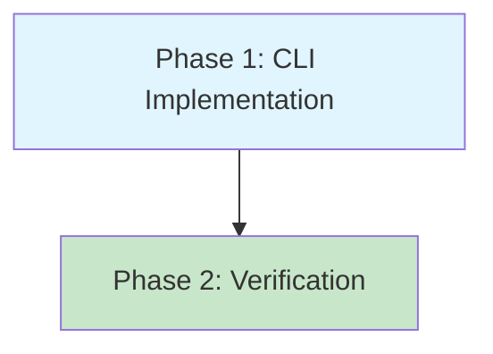

# Planning Process

- [x] Pre-flight Check [09:45]
    - [x] Catalogs validated
    - [x] Directories ready
    - [x] Budget estimated: simple (~25%)
- [x] Prep Started [09:46]
    - [x] Identified Skills: clap, rust, thiserror
    - [x] Identified Subagents: cli-developer, test-writer
- [x] Prep complete [09:47]
- [x] Clarify & Research [09:47]
    - [x] Clarification agent returned [09:48]
    - [x] No clarification needed - requirements explicit
    - [x] Requirements confirmed
- [x] Planning Subagent [agent: **Plan**] started [09:48]
    - [x] subagent skills used: clap, rust, thiserror, tokio
    - [x] Planning completed [09:50]
- [x] All Pre-review Steps complete [09:50]
- [x] Reviews Started [09:50]
   - [x] Completeness Review
   - [x] Concurrency Review
   - [x] Correctness Review
   - [x] Risk Assessment
- [x] Reviews Completed [09:52]
- [x] Plan Finalization started [09:52]
    - [x] subagent skills used: clap, rust, thiserror, color-eyre
    - [x] Dependency graph generated
- [x] Plan finalized [09:54]
- [x] Final Steps
    - [x] Lessons learned collected
    - [x] Package research status checked
- [x] Summary reported [09:54]

---

## Plan

### Phase 1: CLI Implementation
**Agent:** `cli-developer` | **Skills:** clap, rust, thiserror, color-eyre | **Complexity:** Low
**Deps:** None | **Parallel:** No

**Goal:** Implement complete homelab CLI with arcam subcommand.

**Deliver:**

1. **homelab/lib/Cargo.toml** - Rename package:
   ```toml
   [package]
   name = "homelab"  # Changed from "lib"
   ```

2. **homelab/cli/Cargo.toml** - Add dependencies:
   ```toml
   [package]
   name = "homey"
   version = "0.1.0"
   edition = "2024"

   [[bin]]
   name = "homey"
   path = "src/main.rs"

   [dependencies]
   homelab = { path = "../lib" }
   clap = { version = "4.5", features = ["derive", "env"] }
   tokio = { version = "1.48", features = ["full"] }
   color-eyre = "0.6"
   ```

3. **homelab/cli/src/main.rs** - Complete CLI:
   ```rust
   use clap::{Parser, Subcommand};
   use color_eyre::Result;
   use homelab::arcam::Arcam;

   #[derive(Parser)]
   #[command(name = "homey")]
   #[command(about = "Homelab automation CLI")]
   struct Cli {
       #[command(subcommand)]
       command: Commands,
   }

   #[derive(Subcommand)]
   enum Commands {
       /// Arcam PA240 amplifier control
       Arcam {
           /// Arcam host IP or DNS name
           #[arg(long, env = "ARCAM_AMP")]
           host: Option<String>,

           #[command(subcommand)]
           action: ArcamAction,
       },
   }

   #[derive(Subcommand)]
   enum ArcamAction {
       /// Power on the amplifier
       On,
       /// Power off the amplifier
       Off,
       /// Get current power state
       PowerStatus,
       /// Get current mute state
       MuteStatus,
       /// Toggle mute state
       MuteToggle,
   }

   #[tokio::main]
   async fn main() -> Result<()> {
       color_eyre::install()?;
       let cli = Cli::parse();

       match cli.command {
           Commands::Arcam { action, host } => {
               let host_str = host.ok_or_else(|| {
                   color_eyre::eyre::eyre!(
                       "Host required: use --host <IP> or set ARCAM_AMP environment variable"
                   )
               })?;

               let arcam = Arcam::from(host_str.as_str());

               match action {
                   ArcamAction::On => {
                       arcam.power_on().await?;
                       println!("ON");
                   }
                   ArcamAction::Off => {
                       arcam.power_off().await?;
                       println!("OFF");
                   }
                   ArcamAction::PowerStatus => {
                       let is_on = arcam.request_power_state().await?;
                       println!("{}", if is_on { "ON" } else { "OFF" });
                   }
                   ArcamAction::MuteStatus => {
                       let is_muted = arcam.get_mute_status().await?;
                       println!("{}", if is_muted { "MUTED" } else { "UNMUTED" });
                   }
                   ArcamAction::MuteToggle => {
                       let is_muted = arcam.get_mute_status().await?;
                       if is_muted {
                           arcam.mute_off().await?;
                           println!("UNMUTED");
                       } else {
                           arcam.mute_on().await?;
                           println!("MUTED");
                       }
                   }
               }
               Ok(())
           }
       }
   }
   ```

**Pass when:**
- [ ] `cargo check -p homelab -p homey` succeeds
- [ ] `cargo build -p homey` produces `homey` binary
- [ ] `homey arcam --help` shows all 5 actions
- [ ] `homey arcam on` without host shows error about `--host` or `ARCAM_AMP`
- [ ] `ARCAM_AMP=test homey arcam power-status` attempts connection (expect timeout/connection error)

**If failed:**
- Rollback: `git checkout -- homelab/cli/Cargo.toml homelab/lib/Cargo.toml homelab/cli/src/main.rs`
- Retry: Verify clap "env" feature enabled, check tokio features

---

### Phase 2: Verification and Polish
**Agent:** `test-writer` | **Skills:** rust | **Complexity:** Low
**Deps:** Phase 1 | **Parallel:** No

**Goal:** Verify CLI behavior and add basic tests.

**Deliver:**

1. **Manual verification checklist**:
   ```bash
   # Build
   cargo build -p homey

   # Help output
   ./target/debug/homey --help
   ./target/debug/homey arcam --help

   # Error handling (missing host)
   ./target/debug/homey arcam on  # Should error with helpful message

   # Env var support
   ARCAM_AMP=192.168.1.100 ./target/debug/homey arcam power-status  # Will timeout

   # Flag override
   ARCAM_AMP=old ./target/debug/homey arcam --host new power-status  # Uses 'new'
   ```

2. **Optional integration tests** in `homelab/cli/tests/cli.rs`:
   ```rust
   use assert_cmd::Command;
   use predicates::prelude::*;

   #[test]
   fn test_missing_host_error() {
       Command::cargo_bin("homey").unwrap()
           .args(["arcam", "on"])
           .assert()
           .failure()
           .stderr(predicate::str::contains("Host required"));
   }

   #[test]
   fn test_help_shows_actions() {
       Command::cargo_bin("homey").unwrap()
           .args(["arcam", "--help"])
           .assert()
           .success()
           .stdout(predicate::str::contains("on"))
           .stdout(predicate::str::contains("off"))
           .stdout(predicate::str::contains("power-status"))
           .stdout(predicate::str::contains("mute-status"))
           .stdout(predicate::str::contains("mute-toggle"));
   }
   ```

3. **Dev dependencies** (if tests added):
   ```toml
   [dev-dependencies]
   assert_cmd = "2.0"
   predicates = "3.0"
   ```

**Pass when:**
- [ ] All manual verification commands produce expected output
- [ ] `cargo clippy -p homey` has no warnings
- [ ] `cargo test -p homey` passes (if tests added)

**If failed:**
- Rollback: None needed (verification phase)
- Retry: Fix any clippy warnings or test assertions

---

## Dependency Graph



**Critical Path:** Phase 1 → Phase 2 (2 phases, sequential)

---

## Risks

| Level | Category | Description | Mitigation |
|-------|----------|-------------|------------|
| HIGH | dependency | Package rename from `lib` to `homelab` may break references | First deliverable with explicit verification checkpoint |
| MEDIUM | dependency | Missing tokio/homelab deps in CLI | Explicitly listed in Cargo.toml changes |
| LOW | scope | Integration tests add complexity | Made optional, clear dev-dependencies |

---

## Lessons Learned

- [SKILL: clap]: The "env" feature is required to support `#[arg(env = "...")]` - not included by default
- [PATTERN: rust-error-handling]: `Option::ok_or_else` with `color_eyre::eyre::eyre!` is preferred over manual `eprintln!` + `exit(1)`

---

## Package Changes

- [RENAME]: homelab/lib package from `lib` to `homelab`
- [ADD]: tokio 1.48 with full features - async runtime for Arcam network calls
- [ADD]: color-eyre 0.6 - rich error reporting with context
- [UPDATE]: clap features to include `env` - environment variable fallback support
- [ADD (optional)]: assert_cmd 2.0, predicates 3.0 - CLI integration testing
