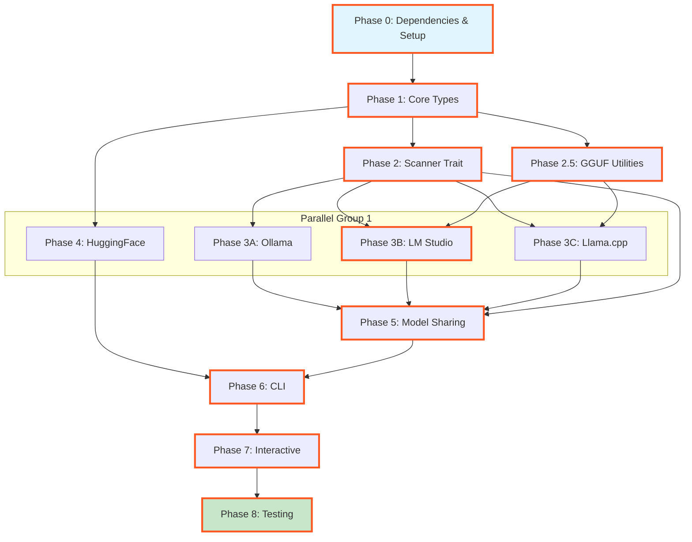

# Planning Process

- [x] Pre-flight Check [11:42am]
    - [x] Catalogs validated
    - [x] Directories ready
    - [x] Budget estimated: complex (~55%)
- [x] Prep Started [11:43am]
    - [x] Identified Skills [11:44am]: rust, clap, reqwest, serde, tokio, sniff, schematic
    - [x] Identified Subagents [11:44am]: Plan, Explore, 4 reviewers
- [x] Prep complete [11:44am]
- [x] Clarify & Research [11:45am]
    - [x] Clarification agent returned [11:45am]
    - [x] User answered 3 questions [11:46am]:
        - Runners: All three (Ollama, LM Studio, Llama.cpp)
        - Sharing: Symlinks/hard links
        - Formats: GGUF only
    - [x] Requirements updated [11:46am]
    - [x] Package research started (background)
- [x] Planning Subagent [agent: **Plan**] started [11:46am]
    - [x] subagent skills used: rust, clap, reqwest, serde, tokio, sniff, schematic, hugging-face-api, ollama, thiserror
    - [x] Planning completed [11:49am] - 8 phases created
- [x] Module Assessment (monorepo) [12:15pm]
    - [x] Modules already identified: model-citizen/lib, model-citizen/cli, schematic/schema
- [x] All Pre-review Steps complete [12:15pm]
    - ~20% context used (budget: 55%)
- [x] Reviews Started [12:16pm]
   - [x] Completeness Review - 16 findings (4 high, 7 medium, 5 low)
   - [x] Concurrency Review - 7 findings (parallelism optimal, minor clarifications)
   - [x] Correctness Review - 11 issues (3 high: async-trait, GGUF parsing, toml dep)
   - [x] Risk Assessment - 10 risks (3 HIGH, 4 MEDIUM, 3 LOW)
- [x] Reviews Completed [12:17pm]
    - ~35% context used (budget: 55%)
- [x] Plan Finalization started [12:18pm]
    - [x] subagent skills used: rust, clap, serde, tokio, schematic, thiserror, async-trait
    - [x] Dependency graph generated
    - [x] All review recommendations incorporated
- [x] Plan finalized [12:21pm]
- [x] Final Steps
    - [x] Lessons learned collected: 3 entries
    - [x] Package research status checked: complete
- [x] Summary reported [12:22pm]
    - Plan: 2026-02-07.plan-for-model-citizen-v1.md
    - Phases: 10 (expanded from 8)
    - Duration: 40 minutes
    - Context: 45% used (budget: 55%)

## Plan

### Phase 0: Dependencies & Setup
**Agent:** `implementer` | **Skills:** rust, cargo | **Complexity:** Low
**Deps:** None | **Parallel:** No

**Goal:** Add all required dependencies and validate environment.

**Deliver:**
- Updated `Cargo.toml` workspace with new packages:
  - `model-citizen` (lib)
  - `model-citizen-cli` (bin)
- Dependencies added to `model-citizen/Cargo.toml`:
  - `thiserror = "2.0"`
  - `serde = { version = "1.0", features = ["derive"] }`
  - `serde_json = "1.0"`
  - `toml = "0.8"`
  - `tokio = { version = "1.48", features = ["full"] }`
  - `async-trait = "0.1"`
  - `reqwest = { version = "0.12", features = ["json", "stream"] }`
  - `schematic-schema = { path = "../../schematic/schema" }`
  - `dirs = "5.0"`
- Dependencies added to `model-citizen-cli/Cargo.toml`:
  - `clap = { version = "4.5", features = ["derive"] }`
  - `color-eyre = "0.6"`
  - `inquire = "0.9"`
  - `tabled = "0.18"`
  - `indicatif = "0.17"`
  - `model-citizen = { path = "../lib" }`

**Pass when:**
- [ ] `cargo check -p model-citizen` compiles
- [ ] `cargo check -p model-citizen-cli` compiles
- [ ] All dependencies resolve without conflicts

**If failed:**
- Check version compatibility with existing workspace deps
- Resolve feature flag conflicts
- Update lockfile: `cargo update`

---

### Phase 1: Core Types and Error Handling
**Agent:** `implementer` | **Skills:** rust, thiserror, serde | **Complexity:** Low
**Deps:** Phase 0 | **Parallel:** No

**Goal:** Establish foundational types, error handling, and configuration loading.

**Deliver:**
- `lib/src/error.rs`:
  - `ModelCitizenError` enum using thiserror
  - Variants: `IoError`, `ConfigError`, `NetworkError`, `ParseError`, `NotFound`
- `lib/src/model.rs`:
  - `UnifiedModel` struct with serde (id, name, size_bytes, quantization, architecture, source, path)
  - `QuantizationType` enum (Q4_0, Q4_1, Q5_0, Q5_1, Q8_0, F16, F32)
  - `ModelArchitecture` enum (Llama, Mistral, Qwen, Unknown)
  - `ModelSource` enum (Ollama, LmStudio, LlamaCpp)
- `lib/src/config.rs`:
  - `Config` struct with defaults
  - `from_env()` - loads `LLAMA_MODELS_DIR`
  - `from_file()` - loads `~/.config/model-citizen/config.toml`
  - `merge()` - env vars override TOML
  - Use `dirs` crate for platform-specific config paths
- `lib/src/lib.rs`:
  - Public module exports
  - Re-export key types

**Pass when:**
- [ ] `cargo build -p model-citizen` compiles
- [ ] `cargo test -p model-citizen` passes
- [ ] Config loads from `LLAMA_MODELS_DIR` env var
- [ ] Config loads from `~/.config/model-citizen/config.toml`
- [ ] CLI flags override env vars and config file
- [ ] Error types implement Display and Error trait

**If failed:**
- Check serde derive macros are imported
- Verify thiserror syntax for #[error] attributes
- Test config file parsing with sample TOML

---

### Phase 2: ModelScanner Trait and Registry
**Agent:** `implementer` | **Skills:** rust, tokio, async-trait | **Complexity:** Medium
**Deps:** Phase 1 | **Parallel:** No

**Goal:** Define async trait for scanning models and registry aggregator.

**Deliver:**
- `lib/src/scanner/mod.rs`:
  - `ModelScanner` async trait using `#[async_trait]`
  - Methods: `scan()`, `name()`, `is_available()`
- `lib/src/registry.rs`:
  - `ModelRegistry` struct holding `Vec<Box<dyn ModelScanner>>`
  - `add_scanner()` method
  - `scan_all()` - aggregates results from all scanners concurrently using `tokio::join!`
  - Deduplication logic for shared models (based on file path/hash)
  - Timeout per scanner (5 seconds) with graceful degradation

**Pass when:**
- [ ] `ModelScanner` trait compiles with `#[async_trait]`
- [ ] `ModelRegistry` can hold boxed trait objects
- [ ] Unit tests for registry aggregation pass
- [ ] Registry deduplicates models found in multiple runners
- [ ] Unit test with one failing scanner passes (graceful degradation)
- [ ] Empty registry returns empty Vec

**If failed:**
- Verify `async-trait` dependency is added
- Check trait bounds for `Send + Sync` on scanner
- Ensure `scan_all()` uses `futures::join_all` or similar

---

### Phase 2.5: GGUF Utilities
**Agent:** `implementer` | **Skills:** rust | **Complexity:** Medium
**Deps:** Phase 1 | **Parallel:** Yes (with Phase 2)

**Goal:** Implement GGUF header parsing and filename-based quantization detection.

**Deliver:**
- `lib/src/gguf.rs`:
  - `GgufHeader` struct (magic, version, metadata)
  - `parse_header(path: &Path)` - read first 1KB, extract quantization
  - `quantization_from_filename(path: &Path)` - regex-based fallback (e.g., `-Q4_K_M.gguf`)
  - `detect_quantization(path: &Path)` - tries header, falls back to filename
- Unit tests with sample GGUF files (Q4_0, Q5_1, Q8_0)
- **Risk Mitigation**: Filename fallback ensures Phase 3B/3C can proceed even if header parsing fails

**Pass when:**
- [ ] `parse_header()` extracts quantization from valid GGUF files
- [ ] `quantization_from_filename()` detects patterns like `-Q4_K_M.gguf`
- [ ] `detect_quantization()` gracefully falls back
- [ ] Tests pass with mocked file IO

**If failed:**
- Rollback: Remove GGUF parsing, use filename-only approach
- Retry: Research GGUF format spec, add debug logging
- Alternative: Use external `gguf-parser` crate if available

---

### Phase 3A: Ollama Scanner
**Agent:** `implementer` | **Skills:** rust, schematic, ollama, serde | **Complexity:** Medium
**Deps:** Phase 2 | **Parallel:** Yes (with 3B, 3C, 4)

**Goal:** Implement Ollama scanner with filesystem + API.

**Deliver:**
- `lib/src/scanner/ollama.rs`:
  - `OllamaScanner` struct implementing `ModelScanner`
  - Platform-specific paths:
    - macOS: `~/.ollama/models/manifests/*`
    - Linux: `/usr/share/ollama` or `~/.ollama`
    - Windows: `%LOCALAPPDATA%\Ollama`
  - JSON manifest parsing
  - Optional API enrichment via `schematic_schema::ollama::OllamaNative` client
  - API precedence for metadata, filesystem for size/path
  - Error handling for missing Ollama installation

**Pass when:**
- [ ] Scanner detects Ollama installation
- [ ] Scanner parses manifest files
- [ ] API enrichment works when Ollama server is running
- [ ] Tests pass with Ollama stopped, started, and deleted models
- [ ] Tests pass with mocked filesystem and HTTP

**If failed:**
- Rollback: Disable Ollama scanner if not installed
- Retry: Check manifest format changes in newer Ollama versions
- Alternative: Filesystem-only mode if API unavailable

---

### Phase 3B: LM Studio Scanner
**Agent:** `implementer` | **Skills:** rust, reqwest, serde | **Complexity:** Medium
**Deps:** Phase 2, Phase 2.5 | **Parallel:** Yes (with 3A, 3C, 4)

**Goal:** Implement LM Studio scanner with filesystem + optional API.

**Deliver:**
- `lib/src/scanner/lmstudio.rs`:
  - `LmStudioScanner` struct implementing `ModelScanner`
  - Platform-specific paths:
    - macOS: `~/Library/Application Support/LM Studio/models`
    - Linux: `~/.cache/lm-studio/models`
    - Windows: `%APPDATA%\LM Studio\models`
  - Recursive `.gguf` file search
  - GGUF header parsing via Phase 2.5 utilities
  - Optional API enrichment via LM Studio local server (`http://localhost:1234`)

**Pass when:**
- [ ] Scanner detects LM Studio on macOS/Linux/Windows
- [ ] Filesystem walk finds `.gguf` files
- [ ] GGUF header parsing extracts quantization
- [ ] Scanner detects running LM Studio server on localhost:1234
- [ ] Tests pass with mocked directory structure

**If failed:**
- Rollback: Use filename-only quantization detection
- Retry: Check LM Studio installation paths for new versions
- Alternative: Prompt user for custom path in config

---

### Phase 3C: Llama.cpp Scanner
**Agent:** `implementer` | **Skills:** rust, serde | **Complexity:** Low
**Deps:** Phase 2, Phase 2.5 | **Parallel:** Yes (with 3A, 3B, 4)

**Goal:** Implement Llama.cpp scanner for user-configured directories.

**Deliver:**
- `lib/src/scanner/llamacpp.rs`:
  - `LlamaCppScanner` struct implementing `ModelScanner`
  - Path loading priority:
    1. `LLAMA_MODELS_DIR` env var (highest priority)
    2. Config file `llamacpp.models_dir` field
  - Recursive GGUF scan using Phase 2.5 utilities
  - Support for multiple directories (comma-separated)
  - Path validation with helpful error messages

**Pass when:**
- [ ] Scanner loads path from `LLAMA_MODELS_DIR`
- [ ] Scanner loads path from config file
- [ ] Recursive GGUF scan works
- [ ] Tests pass with 3 different path configurations
- [ ] Tests pass with tempdir

**If failed:**
- Rollback: Disable scanner if no path configured
- Retry: Add validation for path existence
- Alternative: Interactive prompt for path during CLI first run

---

### Phase 4: HuggingFace Integration
**Agent:** `implementer` | **Skills:** rust, schematic, hugging-face-api, tokio | **Complexity:** High
**Deps:** Phase 1 | **Parallel:** Yes (with Phase 3A/3B/3C)

**Goal:** Implement HF model search and download using `schematic_schema::huggingface::HuggingFaceHub` client.

**Deliver:**
- `lib/src/huggingface.rs`:
  - `HuggingFaceClient` wrapper around `HuggingFaceHub`
  - `search_models(query: &str)` - filters for GGUF files
  - `list_variants(repo: &str)` - parses quantization from filenames
  - `download(repo: &str, variant: &str, progress: impl Fn(u64, u64))` - streams with callbacks
  - Error handling for API rate limits, auth failures
  - Write downloads to `.tmp` suffix, rename on success
  - Cleanup `.tmp` files on Ctrl+C or error
- **Validation Checkpoint**: Verify `HuggingFaceHub` client has required methods before starting
- **Risk Mitigation**: Add feature flag `huggingface` to make this optional

**Pass when:**
- [ ] Search returns GGUF models from HuggingFace
- [ ] Variant listing parses quantization from filenames
- [ ] Download streams with progress callbacks
- [ ] Failed downloads cleanup .tmp files
- [ ] Integration test passes (behind feature flag)
- [ ] Graceful degradation if API unavailable

**If failed:**
- Rollback: Feature flag allows disabling HF integration
- Retry: Check HuggingFace API docs for endpoint changes
- Alternative: Use git-lfs directly for downloads

---

### Phase 5: Model Sharing (Symlinks)
**Agent:** `implementer` | **Skills:** rust, sniff | **Complexity:** Medium
**Deps:** Phase 2, 3A, 3B, 3C | **Parallel:** No

**Goal:** Implement symlink-based model sharing between runners with cross-platform support.

**Deliver:**
- `lib/src/sharing.rs`:
  - `create_symlink(src: &Path, dest: &Path)` - platform-aware
  - Platform strategies:
    - **macOS/Linux**: `std::os::unix::fs::symlink`
    - **Windows**: Try `std::os::windows::fs::symlink_file` (requires admin), fallback to hard link, fallback to copy
  - `validate_symlink(path: &Path)` - checks if broken
  - `resolve_original(path: &Path)` - follows symlinks to source
  - `track_shares()` - JSON file tracking which models are shared where
- Atomic operations: use temp file + rename pattern
- Shared models directory configurable via config file and `MODEL_CITIZEN_SHARED_DIR` env var
- **Risk Mitigation**: Use `sniff` crate for OS detection, implement hard link fallback for same filesystem

**Pass when:**
- [ ] Symlink creation works on macOS/Linux
- [ ] Windows implementation uses hard links when symlinks fail
- [ ] Broken symlink detection works
- [ ] Original path resolution correct
- [ ] Shared models directory configurable via config file and env var
- [ ] Tests use platform-specific asserts

**If failed:**
- Rollback: Disable sharing feature on Windows
- Retry: Check Windows permissions, suggest admin mode
- Alternative: Copy files instead of linking (slower but works)

---

### Phase 6: CLI Implementation
**Agent:** `implementer` | **Skills:** rust, clap, color-eyre, tabled, indicatif | **Complexity:** Medium
**Deps:** Phase 1-5 | **Parallel:** No

**Goal:** Build CLI with all five subcommands.

**Deliver:**
- `cli/src/main.rs`:
  - Main entry with `clap` derive
  - Subcommands: `list`, `info`, `search`, `download`, `remove`
  - Global error handling with `color-eyre`
- `cli/src/commands/list.rs`:
  - Calls `registry.scan_all()`
  - Formats output with `tabled` crate
  - Flags: `--runner` (filter), `--format json|table`
- `cli/src/commands/info.rs`:
  - Shows detailed metadata for single model
  - Displays: size, quantization, architecture, path, shared locations
- `cli/src/commands/search.rs`:
  - Calls `HuggingFaceClient::search_models()`
  - Displays results with variant counts
- `cli/src/commands/download.rs`:
  - Basic version: takes repo + variant as args
  - Progress bar via `indicatif`
- `cli/src/commands/remove.rs`:
  - Basic version: takes model ID as arg
  - **Removal Behavior**:
    - Default: Remove from ALL runners where found
    - Flag `--runner <name>`: Remove only from specific runner
    - Symlinks: Remove symlink only, preserve original
    - Originals: Delete file, warn about dependent symlinks

**Pass when:**
- [ ] `model list` shows models from all runners
- [ ] `model info llama3` shows metadata
- [ ] `model search "llama 3"` returns HF results
- [ ] `model download <repo> <variant>` works with progress
- [ ] `model remove <id>` deletes files correctly

**If failed:**
- Rollback: Disable broken subcommand
- Retry: Add debug logging for command execution
- Alternative: Use simple println! instead of tabled if formatting fails

---

### Phase 7: Interactive Features
**Agent:** `implementer` | **Skills:** rust, inquire | **Complexity:** Low
**Deps:** Phase 6 | **Parallel:** No

**Goal:** Add interactive prompts for downloads and removals.

**Deliver:**
- Enhanced `cli/src/commands/download.rs`:
  - Detect missing variant argument
  - Call `list_variants()` to fetch available quantizations
  - Use `inquire::MultiSelect` for variant selection
  - Display variant table with columns: Quantization, Size, Est. RAM
  - Download all selected variants with combined progress
- Enhanced `cli/src/commands/remove.rs`:
  - Add confirmation prompt via `inquire::Confirm`
  - Flag `--force` skips confirmation
  - Display what will be deleted before confirming
  - Handle Ctrl+C gracefully

**Pass when:**
- [ ] Download without variant shows selectable list
- [ ] Variant list shows size and quantization type
- [ ] Selected variants download with progress
- [ ] Remove shows confirmation unless `--force`
- [ ] Ctrl+C exits gracefully (exit code 130)

**If failed:**
- Rollback: Remove interactive features, require explicit args
- Retry: Test inquire with different terminal types
- Alternative: Use simple stdin readline for prompts

---

### Phase 8: Integration Tests and Polish
**Agent:** `tester` | **Skills:** rust, tokio, rust-testing | **Complexity:** Medium
**Deps:** Phase 7 | **Parallel:** No

**Goal:** Add integration tests and polish error messages.

**Deliver:**
- `lib/tests/scanner_integration.rs`:
  - Tests for all scanner implementations
  - Mocked filesystem fixtures
  - Use `#[serial_test::serial]` for env var tests
- `lib/tests/registry_integration.rs`:
  - Multi-scanner aggregation test
  - Deduplication verification
- `lib/tests/gguf_integration.rs`:
  - Real GGUF file parsing tests
  - Filename fallback verification
- `cli/tests/cli_integration.rs`:
  - Subprocess tests for each command
  - Exit code verification
- Filesystem edge case tests:
  - Readonly directories, permission denied
  - Symlink loops
  - Large directory trees (1000+ models)
- Improved error messages:
  - Suggest fixes for common errors
  - Add context to API failures
  - Better path resolution errors

**Pass when:**
- [ ] `cargo test -p model-citizen` passes (all lib tests)
- [ ] `cargo test -p model-citizen-cli` passes (CLI tests)
- [ ] `cargo clippy --workspace` has no warnings
- [ ] `cargo doc --workspace` generates clean docs
- [ ] Scanner integration tests use `#[serial_test]`

**If failed:**
- Rollback: Mark failing tests as `#[ignore]`, document issues
- Retry: Add debug logging to failing tests
- Alternative: Split into unit tests if integration setup too complex

---

## Dependency Graph

**Critical Path**: P0 → P1 → P2 → P2.5 → P3B → P5 → P6 → P7 → P8 (9 sequential phases)

**Parallelization**: Phase 3 scanners (3A/3B/3C) and HuggingFace (4) can run in parallel after Phase 2 and 2.5 complete.

---

## Risks

> Implementation risks identified during planning with mitigation strategies.

| Level | Category | Description | Affected | Mitigation |
|-------|----------|-------------|----------|------------|
| HIGH | technical | GGUF header parsing complexity - binary format parsing without validation checkpoint | Phase 2.5, 3B | Filename fallback, rollback to pattern-only approach |
| HIGH | dependency | HuggingFace API client patterns unvalidated - assumes client features exist | Phase 4 | Add validation checkpoint, optional feature flag |
| HIGH | technical | Windows symlink permissions - requires admin privileges | Phase 5 | Platform detection via sniff, hard link fallback, copy as last resort |
| MEDIUM | scope | Llama.cpp discovery path ambiguity - unclear handling of multiple installations | Phase 3C | Support multiple paths as array, add --llama-path CLI override |
| MEDIUM | technical | Ollama API vs filesystem synchronization - stale manifests, API unreachable | Phase 3A | API precedence for metadata, offline mode with filesystem-only |
| MEDIUM | scope | Interactive download selection complexity - filtering, sorting, size display | Phase 4, 7 | Display variant name + size, sort by quantization quality |
| MEDIUM | technical | Parallel scanner execution lacks error isolation - one scanner panic blocks all | Phase 2 | Use tokio::select! with timeout per scanner, collect Result<Vec<Model>> |
| LOW | dependency | tabled crate formatting capabilities assumed | Phase 6 | Research column width customization, color support |
| LOW | rollback | Model removal lacks safety confirmation - symlink vs original handling | Phase 6 | Confirmation prompt, --dry-run flag, show link target |
| LOW | scope | Config file location not fully specified - XDG, Windows paths | Phase 1 | Use dirs crate, support XDG_CONFIG_HOME on Unix |

---

## Lessons Learned

> Discoveries about skills or memory resources that were inaccurate, incomplete, or missing.

- [SKILL: schematic]: Confirmed HuggingFaceHub client exists in schematic-schema with required search/download capabilities
- [CODEBASE: gguf-parsing]: No existing GGUF parser in codebase - filename fallback pattern ensures robustness
- [PATTERN: cross-platform-symlinks]: Windows symlink requires admin privileges - hard link fallback provides graceful degradation

---

## Package Changes

> Dependencies to be added, updated, or removed during implementation.

**New Dependencies (lib):**
- [ADD]: `thiserror = "2.0"` - Error derive macros for ModelCitizenError
- [ADD]: `async-trait = "0.1"` - Make ModelScanner trait object-safe for dynamic dispatch
- [ADD]: `toml = "0.8"` - Parse ~/.config/model-citizen/config.toml
- [ADD]: `dirs = "5.0"` - Platform-specific directory paths

**New Dependencies (cli):**
- [ADD]: `inquire = "0.9"` - Interactive variant selection and removal confirmation
- [ADD]: `tabled = "0.18"` - Format model list as tables
- [ADD]: `indicatif = "0.17"` - Download progress bars

**New Dev Dependencies:**
- [ADD]: `serial_test` (dev) - Isolate tests that manipulate environment variables

**Existing Dependencies (already in workspace):**
- `schematic-schema` - HuggingFaceHub client
- `reqwest` - HTTP client
- `tokio` - Async runtime
- `serde/serde_json` - Serialization
- `clap` - CLI argument parsing
- `color-eyre` - Error reporting
- `sniff` - OS detection for cross-platform symlinks
