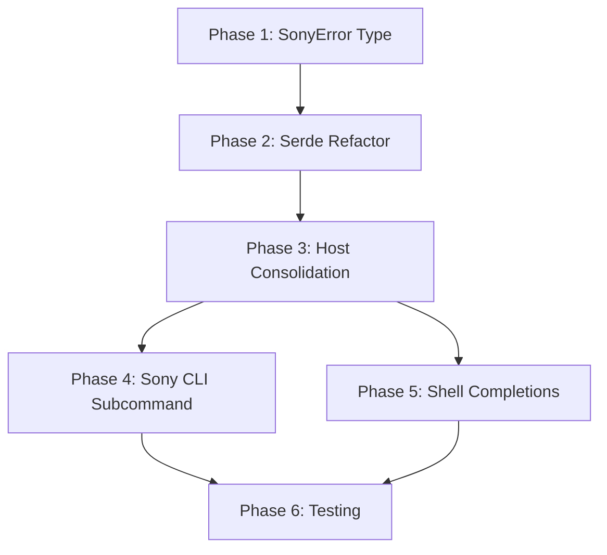

# Planning Process

- [x] Pre-flight Check [14:23:45]
    - [x] Catalogs validated
    - [x] Directories ready
    - [x] Budget estimated: medium (~40%)
- [x] Prep Started [14:24:02]
    - [x] Identified Skills [14:24:32]
    - [x] Identified Subagents [14:24:35]
- [x] Prep complete [14:24:35]
- [x] Clarify & Research [14:25:15]
    - [x] Clarification agent returned [14:25:10]
    - [x] User answered 2 questions [14:25:15]
    - [x] Requirements updated [14:25:20]
    - [x] No new packages needed (clap_complete already available)
- [x] Planning Subagent [agent: **Plan**] started [14:25:25]
    - [x] subagent skills used: **clap, rust, thiserror, color-eyre, serde**
    - [x] Planning completed [14:28:00]
- [x] Module Assessment (not required - single area)
- [x] All Pre-review Steps complete [14:28:00]
    - ~25% context used (budget: 40%)
- [x] Reviews Started [14:28:10]
   - [x] Completeness Review - plan matches requirements
   - [x] Concurrency Review - identified parallelization opportunity (Phase 4 || 5)
   - [x] Correctness Review - 8 issues found (serde rename_all critical)
   - [x] Risk Assessment - 2 HIGH, 2 MEDIUM, 3 LOW risks
- [x] Reviews Completed [14:30:00]
    - ~35% context used (budget: 40%)
- [x] Plan Finalization started [14:30:15]
    - [x] Incorporated 8 correctness issues
    - [x] Added parallelization (Phases 4 || 5)
    - [x] Updated dependency graph
- [x] Plan finalized [14:31:00]
- [x] Final Steps
    - [x] Lessons learned collected (2 items)
    - [x] Package changes documented (1 add, 1 do-not-add)
- [ ] Summary reported

## Plan

### Phase 1: Create SonyError Type
**Agent:** `rust-developer` | **Skills:** thiserror, rust | **Complexity:** Low
**Deps:** None | **Parallel:** No

**Goal:** Replace `Box<dyn Error>` with typed `SonyError` enum following the Arcam pattern.

**Deliver:**
- Add `SonyError` enum with variants: Http, Json, Api, NoContent, InvalidResponse
- Update all method signatures from `Result<T, Box<dyn Error>>` to `Result<T, SonyError>`
- Replace string error patterns with typed error variants

**Pass when:**
- [ ] `cargo check -p homelab` succeeds
- [ ] No `Box<dyn Error>` remains in `sony_receiver.rs`

**If failed:**
- Rollback: `git checkout -- homelab/lib/src/sony_receiver.rs`

---

### Phase 2: Refactor Serde Serialization (UPDATED per review)
**Agent:** `rust-developer` | **Skills:** serde, rust | **Complexity:** Low
**Deps:** Phase 1 | **Parallel:** No

**Goal:** Replace manual `Serialize` implementations, accounting for Sony API's acronym casing.

**Deliver:**
- Refactor 5 action enums using `#[derive(Serialize)]` with explicit `#[serde(rename = "...")]` for acronym variants
- **CRITICAL**: Variants with acronyms (SW, ID) need explicit renames:
  - `GetSWUpdateInfo` → `#[serde(rename = "getSWUpdateInfo")]`
  - `ActSWUpdate` → `#[serde(rename = "actSWUpdate")]`
  - `GetEciaDeviceInfo` → `#[serde(rename = "getEciaDeviceInfo")]`
  - `GetWuTangInfo` → `#[serde(rename = "getWuTangInfo")]`
- Add serialization unit tests BEFORE removing manual impls to capture expected JSON strings
- Keep `SonyReceiverEndpoints` manual impl (serializes paths, not camelCase)

**Pass when:**
- [ ] `cargo check -p homelab` succeeds
- [ ] Serialization tests pass proving correct JSON output
- [ ] No manual `impl Serialize for *Action` blocks remain

**If failed:**
- Rollback: `git checkout -- homelab/lib/src/sony_receiver.rs`
- Alternative: Keep manual impls if serde derive proves too complex

---

### Phase 3: Consolidate Host Enum
**Agent:** `rust-developer` | **Skills:** rust | **Complexity:** Low
**Deps:** Phase 2 | **Parallel:** No

**Goal:** Remove duplicate `Host` enum from `sony_receiver.rs` and use `crate::network::Host`.

**Deliver:**
- Add `Display` impl for Host in `network.rs`
- Remove local Host enum definition from `sony_receiver.rs`
- Add `use crate::network::Host;`

**Pass when:**
- [ ] Only one `Host` definition exists (in `network.rs`)
- [ ] `cargo check -p homelab` succeeds

**If failed:**
- Rollback: `git checkout -- homelab/lib/src/network.rs homelab/lib/src/sony_receiver.rs`

---

### Phase 4: Add Sony Subcommand to CLI (UPDATED per review)
**Agent:** `rust-developer` | **Skills:** clap, rust, color-eyre | **Complexity:** Medium
**Deps:** Phase 3 | **Parallel:** Yes (with Phase 5)

**Goal:** Add `sony` subcommand exposing all 30+ SonyReceiver methods with logical grouping.

**Deliver:**
- Add `Sony` variant to `Commands` with:
  - `#[arg(long, env = "SONY_RECEIVER")] host: Option<String>`
  - `#[arg(long, default_value = "10000")] port: u16`
- Create nested subcommand structure: System, Audio, Input, Playback, Debug
- Construct receiver with explicit `Host::Dns(host_str)` conversion
- Implement handler functions for each command group
- **CHECKPOINT after Phase 3**: Verify `cargo check -p homey` before starting

**Pass when:**
- [ ] `cargo check -p homey` succeeds
- [ ] `homey sony --help` shows all subcommand groups
- [ ] All 30+ methods are mapped to CLI actions

**If failed:**
- Rollback: `git checkout -- homelab/cli/src/main.rs`

---

### Phase 5: Add Shell Completions Support (UPDATED per review)
**Agent:** `rust-developer` | **Skills:** clap, rust | **Complexity:** Medium
**Deps:** Phase 3 | **Parallel:** Yes (with Phase 4)

**Goal:** Add `--completions` flag with shell setup examples.

**Deliver:**
- Add `clap_complete = "4.5"` dependency in Cargo.toml
- Add imports: `use clap_complete::{Shell, generate};`
- Modify Cli struct:
  ```rust
  #[arg(long, value_name = "SHELL")]
  completions: Option<Shell>,

  #[command(subcommand)]
  command: Option<Commands>,  // MUST be Option for completions mode
  ```
- Add `after_help` constant with SHELL COMPLETIONS section and examples
- Handle completions in main BEFORE subcommand dispatch:
  ```rust
  if let Some(shell) = cli.completions {
      generate(shell, &mut Cli::command(), "homey", &mut std::io::stdout());
      return Ok(());
  }
  ```

**Pass when:**
- [ ] `homey --completions bash` outputs valid completion script
- [ ] `homey --help` shows SHELL COMPLETIONS section with examples
- [ ] Supports Bash, Zsh, Fish, PowerShell
- [ ] `homey` without args shows helpful error

**If failed:**
- Rollback: `git checkout -- homelab/cli/src/main.rs homelab/cli/Cargo.toml`

---

### Phase 6: Testing and Verification
**Agent:** `feature-tester-rust` | **Skills:** rust-testing | **Complexity:** Low
**Deps:** Phase 5 | **Parallel:** No

**Goal:** Verify all CLI functionality and add integration tests.

**Deliver:**
- Add integration tests for: missing host error, help output, completions scripts
- Run clippy and fix any warnings
- Verify all help outputs

**Pass when:**
- [ ] `cargo test -p homey` passes all tests
- [ ] `cargo clippy -p homey` has no warnings

## Dependency Graph



**Critical Path:** P1 → P2 → P3 → (P4 || P5) → P6 (5 phases with parallelism)
**Parallelism:** Phases 4 and 5 can run concurrently after Phase 3

## Risks

> Implementation risks identified during planning with mitigation strategies.

| Level | Category | Description | Affected | Mitigation |
|-------|----------|-------------|----------|------------|
| HIGH | rollback | Breaking CLI error propagation: Phases 1-3 modify library affecting ~25 methods | 1,2,3,4 | Add checkpoint after Phase 3: verify `cargo check -p homey` before Phase 4 |
| HIGH | technical | serde rename_all produces WRONG output for SW/ID acronyms (getSWUpdateInfo → getSwUpdateInfo) | 2,4 | Keep manual Serialize impls for enums with acronyms OR add explicit #[serde(rename)] |
| MEDIUM | scope | Host Display impl: verify network.rs doesn't already have this | 3 | Check existing impls before adding, copy arcam.rs host_addr() pattern |
| MEDIUM | scope | 30+ CLI methods in one phase may be underestimated | 4 | Split Phase 4 into 4a (skeleton+System/Audio) and 4b (Input/Playback/Debug) |
| LOW | dependency | clap_complete is separate crate, not transitive | 5 | Add explicit dependency in Cargo.toml |
| LOW | technical | No device/mock for end-to-end testing | 6 | Focus on CLI structure tests; document device-dependent tests as TODO |
| LOW | rollback | Git rollback granularity: all phases modify sony_receiver.rs | 1,2,3 | Commit after each phase completion |

## Lessons Learned

> Discoveries about skills or memory resources that were inaccurate, incomplete, or missing.

- [SKILL: serde]: `#[serde(rename_all = "camelCase")]` does NOT handle acronyms correctly (SW → Sw, ID → Id) - Sony API requires exact casing like "getSWUpdateInfo"
- [SKILL: clap]: Shell completions require making `command` field `Option<Commands>` to allow `--completions <SHELL>` without subcommand

## Package Changes

> Dependencies to be added, updated, or removed during implementation.

- [ADD]: clap_complete 4.5 in homelab/cli - Shell completion script generation (not transitive from clap)
- [DO NOT ADD]: strum 0.26 - Mentioned in initial plan but unnecessary; serde derive sufficient for serialization
