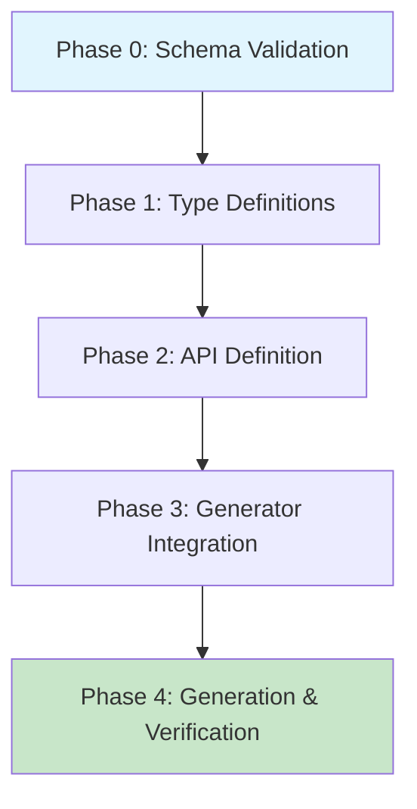

# Planning Process

- [x] Pre-flight Check [2026-02-08]
    - [x] Catalogs validated
    - [x] Directories ready
    - [x] Budget estimated: medium (~35%)
- [x] Prep Started [2026-02-08]
    - [x] Identified Skills: schematic, rust, serde (required); reqwest, tokio, rust-testing (suggested)
    - [x] Identified Subagents: Plan, correctness-reviewer, completeness-reviewer, risk-assessor, plan-finalizer
- [x] Prep complete
- [x] Clarify & Research [2026-02-08]
    - [x] Clarification agent returned
    - [x] User answered 2 questions
        - API variants: Native only
        - Auth strategy: Optional bearer token
    - [x] Requirements updated
    - [x] Package research: No new packages needed (using existing schematic)
- [x] Planning Subagent [agent: **Plan**] started [2026-02-08]
    - [x] subagent skills used: schematic, rust, serde, thiserror, rust-testing
    - [x] Planning completed: 4 phases identified
- [x] Module Assessment: Single module (schematic-definitions), not multi-module
- [x] All Pre-review Steps complete
- [x] Reviews Started [2026-02-08]
    - [x] Completeness Review: 12 gaps identified (3 high, 5 medium, 4 low)
    - [x] Concurrency Review: No parallelization recommended (sequential is optimal)
    - [x] Correctness Review: 15 issues found (4 high, 5 medium, 6 low)
    - [x] Risk Assessment: 1 high, 2 medium, 3 low risks
- [x] Reviews Completed
- [x] Plan Finalization started [2026-02-08]
    - [x] subagent skills used: schematic, rust, serde
    - [x] Dependency graph generated
- [x] Plan finalized
- [x] Final Steps
    - [x] Lessons learned collected: 3
    - [x] Package research: No changes needed
- [x] Summary reported
    - Plan: `.ai/plans/2026-02-08.plan-for-lm-studio-api-client.md`
    - Phases: 5
    - Duration: ~15 minutes planning

---

## Plan

### Phase 0: Schema Validation Research

**Agent:** `Explore` | **Skills:** schematic | **Complexity:** Low
**Deps:** None | **Parallel:** No

**Goal:** Confirm GetDownloadStatus endpoint structure and ChatBody input field requirements.

**Deliver:**

- Verification that GetDownloadStatus path is `/api/v1/models/download/status/{job_id}` (path param)
- Confirmation that ChatBody `input` field accepts both String and Array (requires untagged enum)
- Documentation of SSE streaming format for Chat endpoint

**Pass when:**

- [ ] Endpoint paths match official LM Studio v1 API documentation
- [ ] ChatBody input type requirements documented
- [ ] Response format (SSE vs JSON) confirmed for each endpoint

**If failed:**

- Rollback: None (research phase)
- Retry: Review alternate documentation sources

---

### Phase 1: Type Definitions

**Agent:** `rust-developer` | **Skills:** rust, serde, schematic | **Complexity:** Medium
**Deps:** Phase 0 | **Parallel:** No

**Goal:** Create comprehensive type definitions with proper serde annotations.

**Deliver:**

- `schematic/definitions/src/lmstudio/types.rs` with:
  - `ChatInput` untagged enum (String | Vec<Message>)
  - All request body types with `*Body` suffix
  - All response types with proper field naming
  - `#[serde(rename = "type")]` for `type_` fields
  - Nested types: LoadConfig, Integration, OutputItem, Stats, Quantization, LoadedInstance, Capabilities
  - Doc comments explaining SSE streaming where applicable

**Pass when:**

- [ ] `ChatInput` enum uses `#[serde(untagged)]`
- [ ] All `type_` fields have `#[serde(rename = "type")]`
- [ ] Request types use `*Body` suffix
- [ ] All types have `#[derive(Debug, Clone, Serialize, Deserialize)]`
- [ ] `cargo check -p schematic-definitions` passes

**If failed:**

- Rollback: Delete types.rs
- Retry: Fix serde attributes, verify against LM Studio examples

---

### Phase 2: API Definition

**Agent:** `rust-developer` | **Skills:** schematic, rust | **Complexity:** Medium
**Deps:** Phase 1 | **Parallel:** No

**Goal:** Create complete RestApi definition with all 6 endpoints properly configured.

**Deliver:**

- `schematic/definitions/src/lmstudio/mod.rs` with:
  - `define_lmstudio_api()` function returning RestApi
  - Auth: `AuthStrategy::BearerToken { header: None }` with `env_auth: vec!["LM_API_TOKEN"]`
  - Base URL: `http://localhost:1234`
  - `docs_url: Some("https://lmstudio.ai/docs/developer/rest")`
  - Explicit fields: `env_username: None`, `headers: vec![]`, `module_path: None`, `request_suffix: None`, `env_mapping: Some(EnvMapping::default())`
  - 6 endpoints with complete Endpoint structs

**Endpoints:**

| ID | Method | Path | Request | Response |
|----|--------|------|---------|----------|
| Chat | POST | /api/v1/chat | ChatBody | Binary (SSE) |
| ListModels | GET | /api/v1/models | None | ListModelsResponse |
| LoadModel | POST | /api/v1/models/load | LoadModelBody | LoadModelResponse |
| UnloadModel | POST | /api/v1/models/unload | UnloadModelBody | UnloadModelResponse |
| DownloadModel | POST | /api/v1/models/download | DownloadModelBody | DownloadModelResponse |
| GetDownloadStatus | GET | /api/v1/models/download/status/{job_id} | None | DownloadStatusResponse |

**Pass when:**

- [ ] All endpoints have: id, method, path, description, request, response, headers, params
- [ ] Chat uses `ApiResponse::Binary` (SSE streaming)
- [ ] GetDownloadStatus uses path param `{job_id}`
- [ ] Module exported in `lib.rs`
- [ ] `cargo check -p schematic-definitions` passes

**If failed:**

- Rollback: Remove lmstudio/ directory
- Retry: Review Ollama pattern at `schematic/definitions/src/ollama/mod.rs`

---

### Phase 3: Generator Integration

**Agent:** `rust-developer` | **Skills:** schematic, rust, clap | **Complexity:** Low
**Deps:** Phase 2 | **Parallel:** No

**Goal:** Register LM Studio API in schematic-gen CLI.

**Deliver:**

- Update `schematic/gen/src/main.rs`:
  - Add `"lmstudio"` to AVAILABLE_APIS constant
  - Add match arm: `"lmstudio" => define_lmstudio_api()`
  - Add import: `use schematic_definitions::lmstudio::define_lmstudio_api;`

**Pass when:**

- [ ] `schematic-gen validate --api lmstudio` succeeds
- [ ] `schematic-gen generate --api lmstudio --output /tmp --dry-run` succeeds
- [ ] `cargo build -p schematic-gen` passes

**If failed:**

- Rollback: Revert main.rs changes
- Retry: Verify import path matches module structure

---

### Phase 4: Code Generation & Verification

**Agent:** `feature-tester-rust` | **Skills:** rust-testing, schematic | **Complexity:** Medium
**Deps:** Phase 3 | **Parallel:** No

**Goal:** Generate client code and verify correctness through manual testing checklist.

**Deliver:**

- Generated `schematic/schema/src/lmstudio.rs`
- Unit tests in `lmstudio/mod.rs` and `lmstudio/types.rs`
- Manual verification checklist completion

**Verification Commands:**

```bash
# Generate code
just -f schematic/justfile generate

# Run tests
cargo test -p schematic-definitions -- lmstudio

# Verify compilation
cargo check -p schematic-schema

# Verify Binary response methods (HIGH RISK mitigation)
rg 'request_bytes' schematic/schema/src/lmstudio.rs

# Verify path param generates field
rg 'job_id.*String' schematic/schema/src/lmstudio.rs
```

**Pass when:**

- [ ] All manual verification checks pass
- [ ] `cargo test -p schematic-definitions -- lmstudio` passes
- [ ] `cargo check -p schematic-schema` passes
- [ ] Chat endpoint uses `request_bytes()` (Binary response)
- [ ] GetDownloadStatus has `job_id: String` field

**If failed:**

- Rollback: Delete generated lmstudio.rs, review Phase 2
- Retry: Fix ApiResponse variant, regenerate

---

## Dependency Graph



**Critical Path:** P0 → P1 → P2 → P3 → P4 (5 sequential phases, ~60-90 min implementation)

---

## Risks

| Level | Category | Description | Affected | Mitigation |
|-------|----------|-------------|----------|------------|
| HIGH | technical | Syntax-only tests don't verify runtime correctness | Phase 4 | 6-step manual verification checklist with rg commands |
| MEDIUM | scope | Path param vs query param ambiguity for job_id | Phase 0, 2 | Research phase confirms endpoint structure |
| MEDIUM | technical | SSE streaming response type must be Binary | Phase 2, 4 | Explicit ApiResponse::Binary + verification step |
| LOW | dependency | No new packages needed | All | Using existing schematic workspace |
| LOW | rollback | All changes are additive, easy git revert | All | Atomic commits per phase |
| LOW | technical | ChatInput union type requires untagged enum | Phase 1 | Use `#[serde(untagged)]` pattern |

---

## Lessons Learned

- [SKILL: schematic]: Binary response type is correct for SSE streaming endpoints (same as NDJSON) - confirmed by Ollama OpenAI-compatible API pattern
- [SKILL: schematic]: Path parameters like `{job_id}` automatically generate request struct fields as `String`
- [PATTERN: serde]: When API accepts multiple types for same field (String | Array), use `#[serde(untagged)]` enum

---

## Package Changes

> No dependencies to add, update, or remove. All required packages already in schematic workspace.

---

## File Manifest

| File | Action | Description |
|------|--------|-------------|
| `schematic/definitions/src/lmstudio/mod.rs` | CREATE | API definition with `define_lmstudio_api()` |
| `schematic/definitions/src/lmstudio/types.rs` | CREATE | Request/response types |
| `schematic/definitions/src/lib.rs` | MODIFY | Add `pub mod lmstudio;` export |
| `schematic/gen/src/main.rs` | MODIFY | Add lmstudio to CLI registry |
| `schematic/schema/src/lmstudio.rs` | CREATE | Generated client (auto-generated) |
