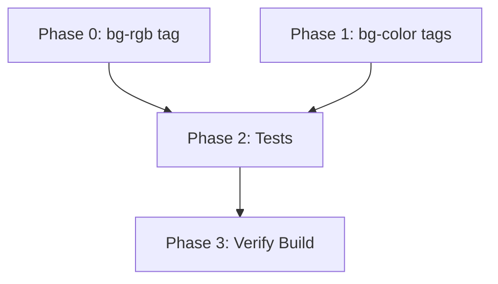

# Planning: Prose Background Color Support

- [x] Pre-flight Check
    - [x] Plans directory ready
    - [x] Budget estimated: simple (~25%)
- [x] Prep Started
    - [x] Identified Skills: biscuit-terminal, rust, rust-testing
    - [x] No subagents needed (simple task)
- [x] Clarify & Research
    - [x] Analyzed existing code pattern (foreground RGB/Tailwind)
    - [x] No ambiguity in requirements
- [x] Planning Complete
    - [x] 4 phases defined (Phase 0-3)
    - [x] Dependency graph generated
- [x] Reviews
    - [x] Risk assessment: LOW risk only
- [x] Finalization Complete

## Plan

### Phase 0: Add bg-rgb Block Tag
**Agent:** `orchestrator` | **Skills:** biscuit-terminal, rust | **Complexity:** Low
**Deps:** None | **Parallel:** No

**Goal:** Add `<bg-rgb X,Y,Z>text</bg-rgb>` block tag support for background RGB colors.

**Deliver:**
- New match arm in `block_tag_to_escape()` for "bg-rgb" tag
- Uses ANSI escape `\x1b[48;2;R;G;Bm` for background, `\x1b[49m` to reset

**Pass when:**
- [ ] `<bg-rgb 255,0,0>text</bg-rgb>` produces correct ANSI escape codes
- [ ] Parser handles whitespace correctly (e.g., `bg-rgb 255, 0, 0`)

**Code location:** `biscuit-terminal/lib/src/components/prose.rs:468` (after `rgb` handler)

---

### Phase 1: Add bg-{color} Block Tags for Web and Tailwind Colors
**Agent:** `orchestrator` | **Skills:** biscuit-terminal, rust | **Complexity:** Low
**Deps:** None | **Parallel:** Yes (with Phase 0)

**Goal:** Add `<bg-{color}>text</bg-{color}>` support for web colors and Tailwind palette.

**Deliver:**
- Extend the fallback `_` match arm (lines 512-530) to check for `bg-` prefix
- Strip `bg-` prefix, look up remaining color name in web/Tailwind tables
- Generate background escape code instead of foreground

**Pass when:**
- [ ] `<bg-coral>text</bg-coral>` works (web color)
- [ ] `<bg-red-800>text</bg-red-800>` works (Tailwind color)
- [ ] `<bg-alice-blue>text</bg-alice-blue>` works (hyphenated web color)

**Code location:** `biscuit-terminal/lib/src/components/prose.rs:512` (modify `_` fallback arm)

---

### Phase 2: Add Tests
**Agent:** `orchestrator` | **Skills:** biscuit-terminal, rust-testing | **Complexity:** Low
**Deps:** Phase 0, Phase 1 | **Parallel:** No

**Goal:** Add unit tests for new background color functionality.

**Deliver:**
- Test for `bg-rgb` block tag
- Test for `bg-{web-color}` block tag
- Test for `bg-{tailwind-color}` block tag
- Test unknown bg- tag preserved as-is

**Pass when:**
- [ ] All new tests pass
- [ ] Existing tests still pass
- [ ] `cargo test -p biscuit-terminal-lib` succeeds

**Code location:** `biscuit-terminal/lib/src/components/prose.rs:1159` (tests module)

---

### Phase 3: Verify Build
**Agent:** `orchestrator` | **Skills:** rust | **Complexity:** Low
**Deps:** Phase 2 | **Parallel:** No

**Goal:** Ensure all changes compile and pass CI checks.

**Deliver:**
- Clean cargo build
- Clean cargo clippy
- All tests pass

**Pass when:**
- [ ] `cargo build -p biscuit-terminal-lib` succeeds
- [ ] `cargo clippy -p biscuit-terminal-lib` has no warnings
- [ ] `cargo test -p biscuit-terminal-lib` passes

## Dependency Graph

**Critical Path:** Phase 0/1 (parallel) → Phase 2 → Phase 3

## Risks

| Level | Category | Description | Affected | Mitigation |
|-------|----------|-------------|----------|------------|
| LOW | technical | Namespace collision with existing `bg-red` atomic tokens | Phase 1 | Block tags take precedence; atomic tokens still work via `{{bg-red}}` syntax |

**Summary:** This is a low-risk, additive change. The existing pattern for foreground colors provides a clear template.

## Lessons Learned

(none yet)

## Package Changes

(none expected - this is internal enhancement)
