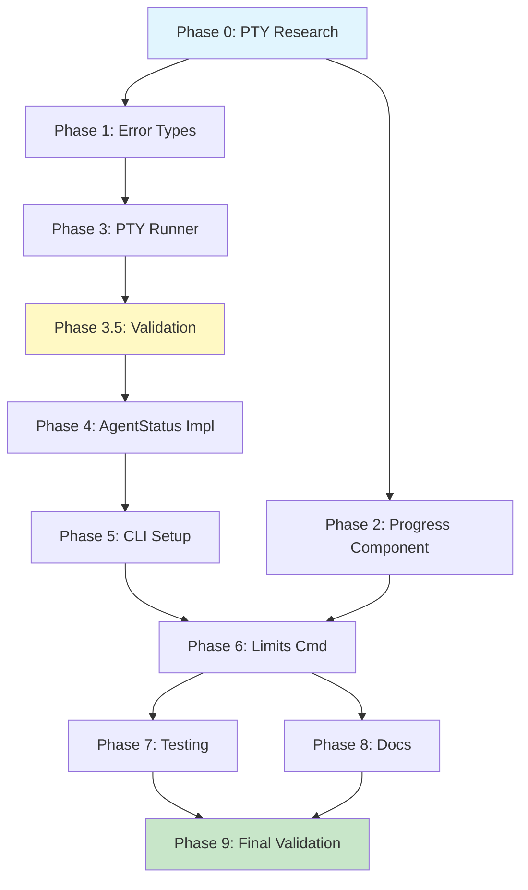

# Planning Process

- [x] Pre-flight Check [14:32:15]
    - [x] Catalogs validated
    - [x] Directories ready
    - [x] Budget estimated: medium (~40%)
- [x] Prep Started [10:29:50]
    - [x] Identified Skills [10:29:50]: rust, clap, unchained-ai, sniff, biscuit-terminal, tokio, thiserror
    - [x] Identified Subagents [10:29:50]: Plan, feature-tester-rust, rust-architect, requirement-clarifier
- [x] Prep complete [10:29:50]
- [x] Clarify & Research [10:30]
    - [x] Clarification agent returned [10:30]
    - [x] User answered 3 questions [10:31]: portable_pty, progress bars, Codex+Claude only
    - [x] Requirements updated [10:31]
    - [ ] Package research: portable_pty needed
- [x] Planning Subagent [agent: **Plan**] started [10:32]
    - [x] subagent skills used: rust, clap, unchained-ai, sniff, biscuit-terminal, tokio, thiserror
    - [x] Planning completed [10:35]: 8 phases created
- [ ] All Pre-review Steps complete
    - Budget check pending
- [x] Reviews Started [10:36]
   - [x] Completeness Review: 18 findings (5 high priority)
   - [x] Concurrency Review: 4 parallel opportunities identified
   - [x] Correctness Review: 12 issues (7 high priority)
   - [x] Risk Assessment: 2 HIGH, 5 MEDIUM, 3 LOW risks
- [x] Reviews Completed [10:38]
- [x] Plan Finalization started [10:40]
    - [x] subagent skills used: rust, unchained-ai, biscuit-terminal, clap, thiserror, tokio, sniff
    - [x] Dependency graph generated
    - [x] Added Phase 0 (PTY research) and Phase 3.5 (validation checkpoint)
- [x] Plan finalized [10:42]
- [x] Final Steps
    - [x] Lessons learned collected: 6 entries
    - [x] Package research status: portable_pty needs Phase 0 research
- [x] Summary reported [10:42]
    - Plan: .ai/plans/2026-02-09.plan-for-agentic-plan-limits.md
    - Phases: 10 (including P0, P3.5, P9)
    - Critical Path: P0 → P1 → P3 → P3.5 → P4 → P5 → P6 → P7/P8 → P9

## Plan

### Phase 0: Pre-flight Dependency Research
**Agent:** `general-purpose` | **Skills:** rust, unchained-ai | **Complexity:** Low
**Deps:** None | **Parallel:** No

**Goal:** Research portable_pty crate for tokio compatibility and PTY usage patterns.

**Deliver:**
- Verify portable_pty async/tokio compatibility
- Confirm strip-ansi-escapes v0.2 is appropriate
- Decision: portable_pty vs alternatives (tokio-pty-process)

**Pass when:**
- [ ] portable_pty async compatibility confirmed
- [ ] strip-ansi-escapes version confirmed
- [ ] No version conflicts with workspace dependencies

**If failed:**
- Retry: Try alternative tokio-pty-process crate
- Escalate to user if no tokio-compatible PTY solution found

---

### Phase 1: Error Types and Core Structs
**Agent:** `rust-architect` | **Skills:** rust, thiserror, unchained-ai | **Complexity:** Low
**Deps:** Phase 0 | **Parallel:** Yes (with Phase 2)

**Goal:** Define `AgentStatusError` enum and fix existing types in `AgentStatus.rs`.

**Deliver:**
- `unchained-ai/lib/src/primitives/services/error.rs` - New error module
- Updated `AgentStatus.rs` with `#[non_exhaustive]`, proper derives, fixed Default impl

**Pass when:**
- [ ] `cargo check -p unchained-ai` passes
- [ ] `AgenticStatusPlatform` has `#[non_exhaustive]`, `Hash`, `Eq`, `Clone`, `Copy`
- [ ] `AgentStatusError` derives `Debug`, `thiserror::Error`
- [ ] `AgentStatus::default()` returns placeholder (detection in async new() only)
- [ ] All types have Clone, Debug derives
- [ ] CapWindowSize has Display impl

**If failed:**
- Rollback: `git checkout -- unchained-ai/lib/src/primitives/services/`
- Retry: Review thiserror patterns from `sniff/lib/src/error.rs`

---

### Phase 2: Progress Component in biscuit-terminal
**Agent:** `rust-architect` | **Skills:** rust, biscuit-terminal | **Complexity:** Medium
**Deps:** Phase 0 | **Parallel:** Yes (with Phase 1)

**Goal:** Create reusable `Progress` component following `Renderable` trait pattern.

**Deliver:**
- `biscuit-terminal/lib/src/components/progress.rs` - New Progress component
- Updated `biscuit-terminal/lib/src/components/mod.rs` - Export Progress

**Pass when:**
- [ ] `cargo test -p biscuit-terminal` passes
- [ ] Progress renders correctly at 0%, 50%, 100%
- [ ] Color fallback works for limited color depth terminals
- [ ] `display()` method includes trailing newline
- [ ] Implements all 5 Renderable methods (render, fallback_render, layout, layout_mut, as_any)

**If failed:**
- Rollback: `git checkout -- biscuit-terminal/lib/src/components/`
- Retry: Follow `Prose` component pattern exactly

---

### Phase 3: PTY-based Status Fetching
**Agent:** `rust-architect` | **Skills:** rust, tokio, unchained-ai | **Complexity:** High
**Deps:** Phase 1 | **Parallel:** No

**Goal:** Implement PTY-based status fetching using `portable_pty`.

**Deliver:**
- `unchained-ai/lib/src/primitives/services/pty_runner.rs` - Generic PTY command runner
- `unchained-ai/lib/src/primitives/services/parsers.rs` - Output parsing for each platform
- Updated `Cargo.toml` with `portable_pty` and `strip-ansi-escapes` dependencies

**Pass when:**
- [ ] `cargo check -p unchained-ai` passes
- [ ] Unit tests mock PTY output and verify parsing
- [ ] ANSI escape sequences stripped before parsing
- [ ] Timeout handling works correctly (5s default)
- [ ] Ctrl+C (0x03) sent to terminate spawned process

**If failed:**
- Rollback: `git checkout -- unchained-ai/lib/`
- Retry: Check portable_pty examples, ensure PTY cleanup on error

---

### Phase 3.5: Validation Checkpoint
**Agent:** `rust-architect` | **Skills:** rust, unchained-ai | **Complexity:** Low
**Deps:** Phase 3 | **Parallel:** No

**Goal:** Validate PTY integration and error handling before CLI layer.

**Pass when:**
- [ ] `AgentStatus::default()` returns placeholder (not async)
- [ ] PTY runner works with mock command (e.g., `echo "test"`)
- [ ] ANSI stripping verified: `"\x1b[31mred\x1b[0m"` → `"red"`
- [ ] No panics or unwraps in error paths

**If failed:**
- Review Phase 1 and 3 implementations before proceeding

---

### Phase 4: AgentStatus Implementation
**Agent:** `rust-architect` | **Skills:** rust, sniff, unchained-ai | **Complexity:** Medium
**Deps:** Phase 1, Phase 3.5 | **Parallel:** No

**Goal:** Complete `AgentStatus` struct with working `new()`, `limits()`, `status()` methods.

**Deliver:**
- Completed `AgentStatus.rs` with all `todo!()` implementations replaced

**Pass when:**
- [ ] `cargo test -p unchained-ai` passes
- [ ] `AgentStatus::new(None).await` detects installed platforms
- [ ] `limits(Some(platform))` returns caps for specified platform
- [ ] `limits(None)` returns caps for all available platforms
- [ ] Method signatures have &self and proper Result return types

**If failed:**
- Rollback: `git checkout -- unchained-ai/lib/src/primitives/services/AgentStatus.rs`
- Retry: Verify sniff::programs::InstalledAiClients API

---

### Phase 5: CLI Setup with clap
**Agent:** `rust-architect` | **Skills:** rust, clap, unchained-ai | **Complexity:** Medium
**Deps:** Phase 4 | **Parallel:** No

**Goal:** Set up unchained-ai CLI with clap, clap_complete, and `limits` subcommand.

**Deliver:**
- `unchained-ai/cli/src/main.rs` - CLI entry point
- `unchained-ai/cli/src/commands/mod.rs` - Subcommand module
- `unchained-ai/cli/src/commands/limits.rs` - Limits subcommand
- Updated `unchained-ai/cli/Cargo.toml` with dependencies

**Pass when:**
- [ ] `cargo build -p unchained-ai-cli` succeeds
- [ ] `unchained --help` shows limits subcommand
- [ ] `unchained limits --help` shows platform option
- [ ] Shell completions generate correctly

**If failed:**
- Rollback: `git checkout -- unchained-ai/cli/`
- Retry: Follow sniff CLI pattern from `sniff/cli/src/main.rs`

---

### Phase 6: Limits Command Implementation
**Agent:** `rust-architect` | **Skills:** rust, biscuit-terminal, unchained-ai | **Complexity:** Medium
**Deps:** Phase 2, Phase 4, Phase 5 | **Parallel:** No

**Goal:** Implement `limits` subcommand with terminal-friendly progress bars.

**Deliver:**
- Completed `unchained-ai/cli/src/commands/limits.rs`
- Interactive progress bar display for each platform

**Pass when:**
- [ ] `unchained limits` displays progress bars for available platforms
- [ ] `unchained limits --json` outputs valid JSON
- [ ] `unchained limits --platform claude` filters to Claude only
- [ ] Colors render correctly with true color support
- [ ] Graceful fallback when no platforms installed

**If failed:**
- Rollback: `git checkout -- unchained-ai/cli/src/commands/limits.rs`
- Retry: Review biscuit-terminal usage in sniff CLI

---

### Phase 7: Justfile and Testing
**Agent:** `feature-tester-rust` | **Skills:** rust, tokio | **Complexity:** Low
**Deps:** Phase 6 | **Parallel:** Yes (with Phase 8)

**Goal:** Update justfile and add integration tests.

**Deliver:**
- Updated `unchained-ai/justfile` with CLI recipes
- `unchained-ai/cli/tests/integration_tests.rs` - CLI integration tests

**Pass when:**
- [ ] `just -f unchained-ai/justfile build` builds lib and CLI
- [ ] `just -f unchained-ai/justfile test` runs all tests
- [ ] `just -f unchained-ai/justfile lint` passes with no warnings
- [ ] Integration tests verify CLI output format

**If failed:**
- Rollback: `git checkout -- unchained-ai/justfile`
- Retry: Follow sniff justfile pattern

---

### Phase 8: Documentation
**Agent:** `rust-architect` | **Skills:** rust | **Complexity:** Low
**Deps:** Phase 6 | **Parallel:** Yes (with Phase 7)

**Goal:** Add documentation and update skill files.

**Deliver:**
- Updated `unchained-ai/cli/README.md`
- Updated `unchained-ai/lib/README.md` with AgentStatus docs
- Updated `.claude/skills/unchained-ai/SKILL.md` with new capabilities

**Pass when:**
- [ ] `cargo doc -p unchained-ai -p unchained-ai-cli` generates without warnings
- [ ] README includes usage examples for `limits` command
- [ ] Skill file documents the AgentStatus API

**If failed:**
- Rollback: `git checkout -- unchained-ai/*.md .claude/skills/unchained-ai/`
- Retry: Follow existing skill documentation patterns

---

### Phase 9: Final Validation
**Agent:** `rust-architect` | **Skills:** rust, unchained-ai | **Complexity:** Low
**Deps:** Phase 7, Phase 8 | **Parallel:** No

**Goal:** Final integration check and workspace validation.

**Pass when:**
- [ ] `cargo build --workspace` succeeds
- [ ] `cargo test --workspace` passes
- [ ] `cargo clippy --workspace` has zero warnings
- [ ] CLI binary works: `unchained limits`

**If failed:**
- Review failed phase, fix issues
- Run workspace commands individually to isolate failure

## Dependency Graph

**Critical Path:** P0 → P1 → P3 → P3.5 → P4 → P5 → P6 → P7/P8 → P9

## Risks

> Implementation risks identified during planning with mitigation strategies.

| Level | Category | Description | Affected | Mitigation |
|-------|----------|-------------|----------|------------|
| HIGH | technical | PTY platform-specific behavior (macOS vs Linux timing/cleanup) | P3, P4, P6 | Adaptive timeout, explicit platform testing, mock PTY in tests |
| HIGH | technical | Fragile output parsing (unstructured /status text) | P3, P4, P6 | Strip ANSI codes, multiple regex fallbacks, version detection |
| MEDIUM | technical | Async Default trait conflict | P1, P4 | Default returns placeholder, detection in async new() only |
| MEDIUM | dependency | portable_pty without prior research | P3 | Research before P3: tokio compat, cleanup, platform issues |
| MEDIUM | dependency | biscuit-terminal new dep in unchained-ai/cli | P2, P6 | Complete P2 first, test on 3+ terminal types |
| MEDIUM | scope | Progress component complexity underestimated | P2 | Start with static bar, copy Prose pattern, defer animation |
| MEDIUM | scope | Missing ANSI stripping in parser design | P3 | Add strip-ansi-escapes crate, explicit stripping step |

## Lessons Learned

> Discoveries about skills or memory resources that were inaccurate, incomplete, or missing.

- [CRATE: portable_pty]: Requires tokio compatibility verification - added Phase 0 research
- [PATTERN: strip-ansi-first]: Always strip ANSI escapes BEFORE parsing - prevents regex corruption
- [TRAIT: Renderable]: biscuit-terminal requires 5 methods, not just render() - layout management needed
- [RUST: Default-vs-async]: Default trait must be sync, document when it returns placeholder vs real data
- [ENUM: non_exhaustive]: AgenticStatusPlatform needs #[non_exhaustive] for forward compatibility
- [TESTING: mock-pty]: Real PTY calls in tests are flaky - always mock subprocess output

## Package Changes

> Dependencies to be added, updated, or removed during implementation.

- [ADD]: portable_pty in unchained-ai/lib - PTY spawning for CLI status commands
- [ADD]: clap_complete in unchained-ai/cli - Shell completion generation
- [ADD]: color-eyre in unchained-ai/cli - CLI error reporting
- [ADD]: biscuit-terminal in unchained-ai/cli - Terminal rendering components
- [ADD]: sniff in unchained-ai/lib - Platform detection for Default impl
- [ADD]: strip-ansi-escapes v0.2 in unchained-ai/lib - Remove ANSI codes before parsing
- [ADD-DEV]: assert_cmd v2.0 in unchained-ai/cli - CLI integration testing
- [ADD-DEV]: predicates v3.0 in unchained-ai/cli - Assertion helpers for tests
