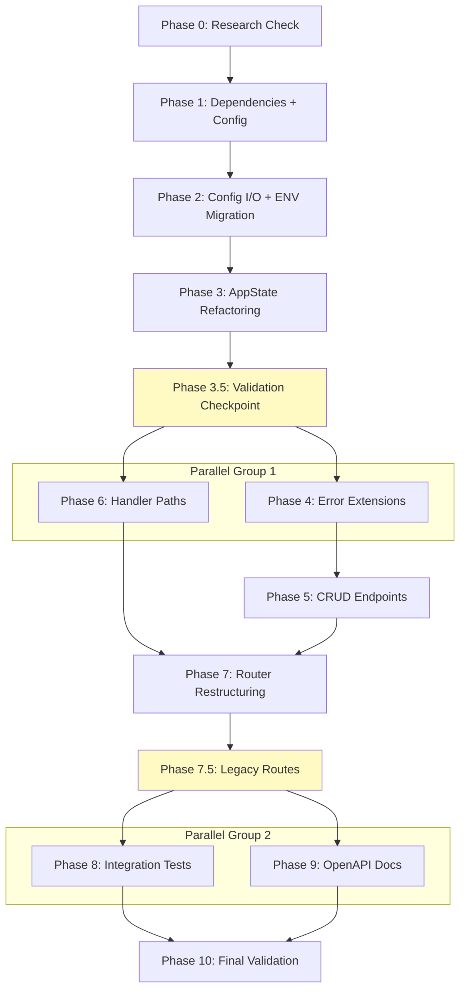

# Planning Process

- [x] Pre-flight Check [12:44pm]
    - [x] Catalogs validated
    - [x] Directories ready
    - [x] Budget estimated: medium (~40%)
- [x] Prep Started [12:45pm]
    - [x] Identified Skills [12:45pm]
    - [x] Identified Subagents [12:45pm]
- [x] Prep complete [12:45pm]
- [x] Clarify & Research [12:46pm]
    - [x] Clarification agent returned [12:46pm]
    - [x] User answered 3 questions [12:46pm]
    - [x] Requirements updated [12:47pm]
    - [ ] Package research started (background)
- [x] Planning Subagent started [12:48pm]
    - [x] subagent skills used: rust, axum, serde, tokio, homelab, thiserror
    - [x] Planning completed [12:50pm]
- [x] All Pre-review Steps complete [12:50pm]
- [x] Reviews Started [12:50pm]
   - [x] Completeness Review
   - [x] Concurrency Review
   - [x] Correctness Review
   - [x] Risk Assessment
- [x] Reviews Completed [12:52pm]
- [x] Plan Finalization started [12:52pm]
    - [x] subagent skills used: rust, axum, serde, tokio, thiserror, homelab, rust-testing, utoipa
    - [x] Dependency graph generated
- [x] Plan finalized [12:55pm]
- [x] Final Steps
    - [x] Lessons learned collected
    - [x] Package research status checked
- [x] Summary reported [12:56pm]

## Plan

### Phase 0: Pre-flight Dependency Research
**Agent:** `general-purpose` | **Skills:** rust, homelab | **Complexity:** Low
**Deps:** None | **Parallel:** No

**Goal:** Verify petname and dirs crate compatibility before integration.

**Pass when:**
- [ ] `docs/dependencies.md` consulted
- [ ] No version conflicts found
- [ ] petname v2 and dirs v6 confirmed compatible

---

### Phase 1: Dependencies + Config Struct
**Agent:** `general-purpose` | **Skills:** rust, serde, homelab | **Complexity:** Low
**Deps:** Phase 0 | **Parallel:** No

**Goal:** Add dependencies and create configuration data structures.

**Deliver:**
- Add `petname = "2.0"`, `dirs = "6.0"` to Cargo.toml
- Create `config.rs` with HomeyConfig, SonyReceiverService, ArcamAmpService structs
- Device name validation regex: `^[a-z0-9_-]+$`

**Pass when:**
- [ ] `cargo check -p homelab-server` succeeds
- [ ] Config structs have Serialize + Deserialize
- [ ] Clippy passes

---

### Phase 2: Config File I/O + ENV Migration
**Agent:** `general-purpose` | **Skills:** rust, serde, tokio, homelab | **Complexity:** Medium
**Deps:** Phase 1 | **Parallel:** No

**Goal:** Implement config persistence and ENV migration with petname generation.

**Deliver:**
- load() / save() / load_from() / save_to() methods
- migrate_from_env() with petname::Petnames::default().generate_one(2, "-")
- ConfigError enum (Io, Parse, InvalidDeviceName, InvalidHost)
- Clone-mutate-save pattern for minimal lock duration

**Pass when:**
- [ ] Unit tests for load/save with tempdir
- [ ] Unit tests for petname generation
- [ ] Validation rejects invalid names
- [ ] Empty Arcam host rejected

---

### Phase 3: AppState Refactoring
**Agent:** `general-purpose` | **Skills:** rust, tokio, axum, homelab | **Complexity:** High
**Deps:** Phase 2 | **Parallel:** No

**Goal:** Replace single-device state with multi-device configuration using tokio RwLock.

**Deliver:**
- Arc<tokio::sync::RwLock<HomeyConfig>> for config
- HashMap<String, Arc<SonyReceiver>> for sony_receivers
- HashMap<String, String> for arcam_hosts
- from_config() and get_sony()/get_arcam_host() methods

**Pass when:**
- [ ] Uses `tokio::sync::RwLock` explicitly
- [ ] get_sony() and get_arcam_host() handle missing devices
- [ ] Unit tests for from_config()

---

### Phase 3.5: Validation Checkpoint
**Agent:** `general-purpose` | **Skills:** rust, homelab | **Complexity:** Low
**Deps:** Phase 3 | **Parallel:** No

**Goal:** Validate AppState refactoring works before building CRUD layer.

**Pass when:**
- [ ] Server starts with refactored state
- [ ] `/health` endpoint returns 200
- [ ] No RwLock panics or deadlocks

---

### Phase 4: Error Type Extensions
**Agent:** `general-purpose` | **Skills:** rust, thiserror, homelab | **Complexity:** Low
**Deps:** Phase 3.5 | **Parallel:** Yes (with Phase 6)

**Goal:** Add error variants for CRUD operations.

**Deliver:**
- DeviceNotFound(String) → 404
- DeviceExists(String) → 409
- InvalidDeviceName(String) → 400
- ConfigIo/ConfigParse → 500

**Pass when:**
- [ ] All variants have correct HTTP status codes
- [ ] Unit tests verify mappings

---

### Phase 5: CRUD Endpoints
**Agent:** `general-purpose` | **Skills:** rust, axum, serde, homelab | **Complexity:** High
**Deps:** Phase 4, Phase 6 | **Parallel:** No

**Goal:** Implement CRUD for sony_receiver and arcam_amp with auto-save.

**Deliver:**
- GET/POST /sony_receiver/ and /arcam_amp/
- PUT/DELETE /sony_receiver/{name} and /arcam_amp/{name}
- Clone-mutate-save pattern for all mutations

**Pass when:**
- [ ] All 8 CRUD endpoints compile
- [ ] Name validation rejects invalid patterns
- [ ] Duplicate names return 409
- [ ] Missing devices return 404
- [ ] Config auto-saves on every mutation

---

### Phase 6: Handler Path Parameters
**Agent:** `general-purpose` | **Skills:** rust, axum, homelab | **Complexity:** High
**Deps:** Phase 3.5 | **Parallel:** Yes (with Phase 4)

**Goal:** Add `{name}` path parameter to all 16 control handlers.

**Pass when:**
- [ ] All handlers compile with Path<String>
- [ ] Handlers return 404 when device not found
- [ ] utoipa annotations include path parameters

---

### Phase 7: Router Restructuring
**Agent:** `general-purpose` | **Skills:** rust, axum, homelab | **Complexity:** Medium
**Deps:** Phase 5, Phase 6 | **Parallel:** No

**Goal:** Update routes: /sony → /sony_receiver, /arcam → /arcam_amp

**Pass when:**
- [ ] All CRUD endpoints accessible
- [ ] All control endpoints accessible with /:name parameter
- [ ] /health and /health/devices work

---

### Phase 7.5: Legacy Route Aliases
**Agent:** `general-purpose` | **Skills:** rust, axum, homelab | **Complexity:** Medium
**Deps:** Phase 7 | **Parallel:** No

**Goal:** Backward compatibility for /sony and /arcam routes via env vars.

**Pass when:**
- [ ] Legacy routes work when env vars set
- [ ] Legacy routes return 404 when env vars not set
- [ ] Warning logs visible on startup

---

### Phase 8: Integration Tests
**Agent:** `feature-tester-rust` | **Skills:** rust-testing, tokio | **Complexity:** High
**Deps:** Phase 7.5 | **Parallel:** Yes (with Phase 9)

**Goal:** Comprehensive tests with tempdir isolation.

**Deliver:**
- 15+ new CRUD tests
- Multi-device tests
- Legacy route tests
- Add tempfile + serial_test dev-dependencies

**Pass when:**
- [ ] `cargo test -p homelab-server` passes
- [ ] Minimum 20 total test cases
- [ ] No test interference

---

### Phase 9: OpenAPI Documentation
**Agent:** `general-purpose` | **Skills:** rust, utoipa | **Complexity:** Medium
**Deps:** Phase 7.5 | **Parallel:** Yes (with Phase 8)

**Goal:** Update OpenAPI for new endpoints.

**Pass when:**
- [ ] All CRUD endpoints documented
- [ ] All control endpoints show `{name}` parameter
- [ ] `/api-doc/openapi.json` returns valid JSON

---

### Phase 10: Final Validation & Documentation
**Agent:** `general-purpose` | **Skills:** rust, homelab | **Complexity:** Medium
**Deps:** Phase 8, Phase 9 | **Parallel:** No

**Goal:** Documentation updates and final validation.

**Pass when:**
- [ ] README documents all new features
- [ ] Full workspace builds and tests pass
- [ ] No clippy warnings

## Dependency Graph

**Critical Path:** P0 → P1 → P2 → P3 → P3.5 → P4 → P5 → P7 → P7.5 → P8 → P10

## Risks

> Implementation risks identified during planning with mitigation strategies.

| Level | Category | Description | Affected | Mitigation |
|-------|----------|-------------|----------|------------|
| HIGH | concurrency | RwLock deadlock from nested locks | 2, 3, 5 | Clone-mutate-save pattern enforced |
| HIGH | breaking | Breaking API changes /sony → /sony_receiver | 7, 7.5 | Phase 7.5 adds legacy route aliases |
| MEDIUM | consistency | State desync if config manually edited | 5, 10 | Document restart requirement |
| MEDIUM | testing | Test isolation with env vars | 8 | serial_test crate + tempdir |
| MEDIUM | dependency | petname quality/predictability | 2 | Test coverage for name generation |
| LOW | performance | Config file I/O on every mutation | 5 | Acceptable for homelab usage |

## Lessons Learned

> Discoveries about skills or memory resources that were inaccurate, incomplete, or missing.

- [PATTERN: clone-mutate-save]: Minimizes RwLock duration, prevents deadlocks in async contexts
- [PATTERN: backward-compatibility]: Legacy route aliases prevent breaking changes during migration
- [CRATE: tokio-rwlock]: Must use `tokio::sync::RwLock` not `std::sync::RwLock` in async code

## Package Changes

> Dependencies to be added, updated, or removed during implementation.

- [ADD]: petname v2 in cargo - random device name generation for ENV migration
    - Research status: complete (API: `Petnames::default().generate_one(2, "-")`)
- [ADD]: dirs v6 in cargo - home directory resolution for config file
    - Research status: complete (already used in biscuit-speaks, claudine, queue)
- [ADD-DEV]: tempfile v3.15 in cargo - isolated config directories for testing
- [ADD-DEV]: serial_test v3.0 in cargo - ensures env var test isolation
