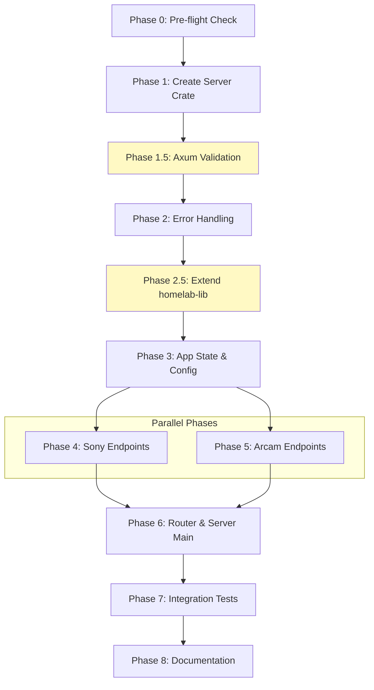

# Planning Process

- [x] Pre-flight Check [12:43pm]
    - [x] Catalogs validated
    - [x] Directories ready
    - [x] Budget estimated: medium (~40%)
- [x] Prep Started [12:44pm]
    - [x] Identified Skills [12:44pm]: axum, rust, tokio, tower, thiserror
    - [x] Identified Subagents [12:44pm]: Plan, feature-tester-rust
- [x] Prep complete with ~92% context available [12:44pm]
- [x] Clarify & Research [12:45pm]
    - [x] Clarification agent returned [12:45pm]
    - [x] User answered 3 questions [12:45pm]
        - Server location: New binary crate (homelab/server)
        - Device config: Environment variables
        - API auth: No authentication
    - [x] Requirements updated [12:45pm]
- [x] Planning Subagent [agent: **Plan**] started [12:45pm]
    - [x] subagent skills used: rust, axum, tokio, thiserror, serde, tower-http, homelab
    - [x] Planning completed [12:47pm]
- [x] Module Assessment (monorepo) [12:47pm]
    - homelab/server (new binary crate)
    - homelab/lib (minor extension)
- [x] All Pre-review Steps complete [12:47pm]
    - ~85% context remaining (budget: 40%)
- [x] Reviews Started [12:47pm]
   - [x] Completeness Review - 16 findings (1 high: missing GET /sony/volume)
   - [x] Concurrency Review - 7 findings (confirmed Phase 4||5 safe)
   - [x] Correctness Review - 10 findings (2 high: import paths, volume getter)
   - [x] Risk Assessment - 10 risks (1 high: first-time Axum)
- [x] Reviews Completed [12:48pm]
    - ~75% context remaining (budget: 40%)
- [x] Plan Finalization started [12:48pm]
    - [x] subagent skills used: rust, axum, tokio, thiserror, tower, tower-http, serde, rust-testing
    - [x] Dependency graph generated
- [x] Plan finalized [12:51pm]
- [x] Final Steps
    - [x] Lessons learned collected (6 items)
    - [x] Package research status: answered inline
- [x] Summary reported [12:51pm]
    - Plan: .ai/plans/2026-02-09.plan-for-homelab-rest-server.md
    - Phases: 10 (including Phase 0, 1.5, 2.5)
    - Duration: 8 minutes
    - Context: ~35% used (budget: 40%)

---

## Plan

### Dependency Graph



**Critical Path:** P0 → P1 → P1.5 → P2 → P2.5 → P3 → P4 → P6 → P7 → P8 (9 sequential, Phase 5 parallel with 4)

---

### Phase 0: Pre-flight Dependency Check
**Agent:** `general-purpose` | **Skills:** rust | **Complexity:** Low
**Deps:** None | **Parallel:** No

**Goal:** Verify homelab-lib has all required public APIs.

**Deliver:**
- Verify `homelab::sony_receiver::{SonyReceiver, SonyError}` exists
- Verify `homelab::arcam::{Arcam, ArcamError}` exists
- Verify `homelab::network::Host` is public
- List missing APIs for Phase 2.5

**Pass when:**
- [ ] `cargo doc -p homelab --no-deps` shows required types
- [ ] Missing APIs documented

---

### Phase 1: Create Server Crate Structure
**Agent:** `general-purpose` | **Skills:** rust, tokio | **Complexity:** Low
**Deps:** Phase 0 | **Parallel:** No

**Goal:** New binary crate with workspace integration.

**Deliver:**
- `homelab/server/Cargo.toml` with dependencies:
  - `homelab = { path = "../lib" }`
  - `axum = "0.7"`
  - `tower = "0.5"`
  - `tower-http = { version = "0.6", features = ["trace", "cors"] }`
  - `tokio = { version = "1.48", features = ["full"] }`
  - `serde = { version = "1.0", features = ["derive"] }`
  - `serde_json = "1.0"`
  - `tracing = "0.1"`, `tracing-subscriber = "0.3"`
- `homelab/server/src/main.rs` with tokio runtime
- Updated workspace `Cargo.toml`

**Pass when:**
- [ ] `cargo check -p homelab-server` succeeds
- [ ] Workspace includes `"homelab/server"`

**If failed:**
- Rollback: Remove `homelab/server/`, revert workspace

---

### Phase 1.5: Axum Validation Checkpoint
**Agent:** `general-purpose` | **Skills:** rust, axum | **Complexity:** Low
**Deps:** Phase 1 | **Parallel:** No

**Goal:** Validate Axum patterns before full build (mitigates first-time usage risk).

**Deliver:**
- Minimal working server with GET / handler
- Manual test: `curl http://localhost:3000/` returns 200

**Pass when:**
- [ ] Server starts without errors
- [ ] Ctrl+C shuts down cleanly

**If failed:**
- Consult Axum 0.7 docs, consider 0.6 fallback

---

### Phase 2: Core Error Handling
**Agent:** `general-purpose` | **Skills:** rust, thiserror, axum | **Complexity:** Medium
**Deps:** Phase 1.5 | **Parallel:** No

**Goal:** Robust error handling with IntoResponse.

**Deliver:**
- `src/error.rs` with `ServerError` enum:
  - `DeviceNotConfigured` → 404
  - `SonyError(SonyError)` → 502
  - `ArcamError(ArcamError)` → 502
  - `InvalidVolume(String)` → 400
  - `Timeout` → 504
- JSON format: `{"error": "msg", "code": "TYPE"}`

**Pass when:**
- [ ] Implements `Error`, `Display`, `IntoResponse`
- [ ] All variants map to correct HTTP status codes
- [ ] Clippy passes

---

### Phase 2.5: Extend homelab-lib
**Agent:** `general-purpose` | **Skills:** rust, serde | **Complexity:** Medium
**Deps:** Phase 2 | **Parallel:** No

**Goal:** Add missing `get_volume()` method to SonyReceiver.

**Deliver:**
- In `homelab/lib/src/sony_receiver.rs`:
  ```rust
  pub async fn get_volume(&self) -> Result<VolumeInfo, SonyError>
  ```
- Uses existing `AudioAction::GetVolumeInformation`
- Returns full `VolumeInfo` struct

**Pass when:**
- [ ] `cargo test -p homelab` passes
- [ ] Method follows `get_mute_status()` pattern

---

### Phase 3: Application State & Configuration
**Agent:** `general-purpose` | **Skills:** rust, tokio | **Complexity:** Medium
**Deps:** Phase 2.5 | **Parallel:** No

**Goal:** State management with env-based configuration.

**Deliver:**
- `src/state.rs` with `AppState`:
  ```rust
  pub struct AppState {
      pub sony: Option<Arc<SonyReceiver>>,
      pub arcam_host: Option<String>,
      pub request_timeout: Duration,
  }
  ```
- `AppState::from_env()` reading:
  - `SONY_RECEIVER_HOST` (host[:port], default port 10000)
  - `ARCAM_HOST` (host, port always 50000)
  - `REQUEST_TIMEOUT_MS` (default 5000)

**Pass when:**
- [ ] Works with zero, one, or both devices
- [ ] Host parsing handles IPv4/IPv6/DNS
- [ ] Invalid hosts return descriptive errors

---

### Phase 4: Sony Receiver Endpoints
**Agent:** `general-purpose` | **Skills:** rust, axum, serde, tokio | **Complexity:** High
**Deps:** Phase 3 | **Parallel:** Yes (with Phase 5)

**Goal:** REST handlers for SonyReceiver.

**Deliver:**
- `src/handlers/sony.rs` with correct imports:
  ```rust
  use homelab::sony_receiver::{SonyReceiver, SonyError};
  ```
- Endpoints (9 total):
  - `GET /sony/power` → get_power_status()
  - `POST /sony/power` `{"active": bool}` → set_power()
  - `GET /sony/volume` → get_volume() (from Phase 2.5)
  - `POST /sony/volume` `{"level": u32}` → validate 0-100, set_volume()
  - `GET /sony/mute` → get_mute_status()
  - `POST /sony/mute` `{"mute": bool}` → set_mute()
  - `GET /sony/inputs` → list_inputs()
  - `GET /sony/input/current` → get_current_input()
  - `POST /sony/input` `{"uri": string}` → set_input()
  - `GET /sony/system/info` → get_system_information()
- Volume validation: reject level < 0 or > 100 with 400
- Timeout wrapping with `tokio::time::timeout`
- Return 404 when device not configured

**Pass when:**
- [ ] All 9 endpoints compile
- [ ] Volume validation works
- [ ] Timeouts return 504

---

### Phase 5: Arcam Endpoints
**Agent:** `general-purpose` | **Skills:** rust, axum, serde, tokio | **Complexity:** Medium
**Deps:** Phase 3 | **Parallel:** Yes (with Phase 4)

**Goal:** REST handlers for Arcam.

**Deliver:**
- `src/handlers/arcam.rs` with imports:
  ```rust
  use homelab::arcam::{Arcam, ArcamError};
  ```
- Endpoints (7 total):
  - `GET /arcam/power` → request_power_state() returns `{"on": bool}`
  - `POST /arcam/power/on` → power_on()
  - `POST /arcam/power/off` → power_off()
  - `GET /arcam/mute` → get_mute_status() returns `{"muted": bool}`
  - `POST /arcam/mute/on` → mute_on()
  - `POST /arcam/mute/off` → mute_off()
  - `GET /arcam/mode` → get_amplifier_mode() returns `{"mode": "Stereo"|"Bridged"|"DualMono"}`
- Mode mapping: `match mode { 0 => "Stereo", 1 => "Bridged", 2 => "DualMono", _ => "Unknown" }`

**Pass when:**
- [ ] All 7 endpoints compile
- [ ] Mode mapping handles all values
- [ ] Timeouts return 504

---

### Phase 6: Router & Server Main
**Agent:** `general-purpose` | **Skills:** rust, axum, tokio | **Complexity:** Medium
**Deps:** Phase 4, Phase 5 | **Parallel:** No

**Goal:** Wire up router with middleware.

**Deliver:**
- `src/main.rs` with router:
  ```rust
  Router::new()
      .route("/health", get(health))
      .route("/health/devices", get(health_devices))
      .nest("/sony", sony_routes())
      .nest("/arcam", arcam_routes())
      .layer(TraceLayer::new_for_http())
      .layer(CorsLayer::permissive())
      .with_state(app_state)
  ```
- Health endpoints:
  - `GET /health` → `{"status": "healthy"}`
  - `GET /health/devices` → `{"sony": {...}, "arcam": {...}}`
- Server binding: `0.0.0.0:{PORT}` (default 3000)
- Graceful shutdown: 10s timeout on SIGTERM/SIGINT

**Pass when:**
- [ ] Server starts and responds to /health
- [ ] CORS headers present
- [ ] Request logs visible
- [ ] Graceful shutdown works

---

### Phase 7: Integration Tests
**Agent:** `feature-tester-rust` | **Skills:** rust-testing, tokio | **Complexity:** High
**Deps:** Phase 6 | **Parallel:** No

**Goal:** Comprehensive tests using mocked state.

**Deliver:**
- `tests/integration_tests.rs` with:
  - Mocked AppState (Option::None for unconfigured)
  - Tests for all 16 endpoints
  - Error cases: 404 (no device), 400 (invalid volume), 504 (timeout)
  - JSON response validation

**Pass when:**
- [ ] `cargo test -p homelab-server` passes
- [ ] Minimum 20 test cases
- [ ] Error format validated

---

### Phase 8: Documentation & Justfile
**Agent:** `general-purpose` | **Skills:** rust | **Complexity:** Low
**Deps:** Phase 7 | **Parallel:** No

**Goal:** Complete documentation and dev commands.

**Deliver:**
- `homelab/server/README.md` with:
  - Overview, Installation, Environment Variables table
  - API Endpoints with curl examples
  - Error response format, Development workflow
- `homelab/justfile` additions:
  - `server` - run in dev mode
  - `test-server` - run tests
  - `install-server` - install binary

**Pass when:**
- [ ] README complete
- [ ] Curl examples work
- [ ] Justfile commands execute

---

## Risks

| Level | Category | Description | Affected | Mitigation |
|-------|----------|-------------|----------|------------|
| HIGH | technical | First-time Axum usage | 2-6 | Phase 1.5 validation checkpoint |
| MEDIUM | api | Missing get_volume() wrapper | 4 | Phase 2.5 extends homelab-lib |
| MEDIUM | scope | 50+ possible endpoints | 4,5 | Limited to 16 endpoints (9 Sony + 7 Arcam) |
| MEDIUM | technical | SonyReceiver Arc lifecycle | 3,4 | Use Arc<SonyReceiver> in state |
| MEDIUM | technical | Env var validation | 3 | Validate at startup with clear errors |
| MEDIUM | technical | Request timeouts | 4,5 | Configurable timeout, enforce in handlers |
| LOW | correctness | Import paths | 4,5 | Specified correct module paths |
| LOW | testing | Mocking without devices | 7 | Option::None for unconfigured |
| LOW | scope | No authentication | 6 | Documented as internal network only |

## Lessons Learned

- [SKILL: axum]: First-time usage requires validation checkpoint
- [CRATE: homelab-lib]: Missing public API (get_volume) - Phase 2.5 added
- [PATTERN: error-handling]: Standardized JSON errors `{"error", "code"}` improve client UX
- [PATTERN: validation]: Volume validation (0-100) prevents invalid device state
- [PATTERN: timeouts]: Request timeouts crucial for unreliable network devices
- [CRATE: tower-http]: CORS and TraceLayer essential for REST APIs

## Package Changes

- [ADD]: axum 0.7 - Web framework for REST API
    - Integrates with tokio via `#[tokio::main]` and async handlers
- [ADD]: tower 0.5 - Service abstraction
- [ADD]: tower-http 0.6 - Middleware
    - Features: `trace` (logging), `cors` (browser access)
- [ADD]: tracing + tracing-subscriber - Structured logging
- [EXTEND]: homelab-lib - Add `get_volume()` method to SonyReceiver
