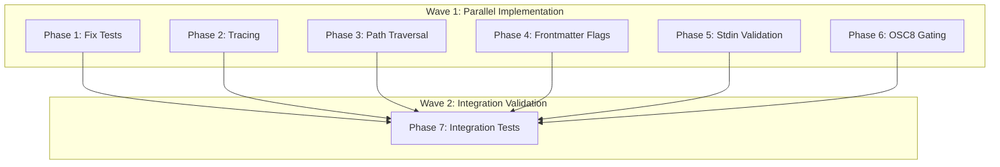

# Planning Process

- [x] Pre-flight Check [16:30]
    - [x] Catalogs validated
    - [x] Directories ready
    - [x] Budget estimated: medium (~40%)
- [x] Prep Started [16:31]
    - [x] Identified Skills [16:31] - rust, darkmatter, clap, thiserror, rust-testing, biscuit-terminal
    - [x] Identified Subagents [16:31] - Plan, completeness-reviewer, correctness-reviewer, risk-assessor, feature-tester-rust
- [x] Prep complete [16:31]
- [x] Clarify & Research [16:32]
    - [x] Clarification agent returned [16:32]
    - [x] User answered 1 question [16:33] - Implement frontmatter flags
    - [x] Requirements updated [16:33]
    - Defaults applied: assert_cmd testing, canonicalize+containment, gate OSC8, explicit TerminalOptions, single PR
- [x] Planning Subagent [agent: **Plan**] started [16:34]
    - [x] subagent skills used: rust, darkmatter, clap, thiserror, rust-testing, biscuit-terminal, tracing, color-eyre
    - [x] Planning completed [16:37] - 7 phases created
- [x] Module Assessment [16:34]
    - [x] subagent skills used: rust, darkmatter
    - [x] Cross-deps mapped: cli→lib→biscuit-terminal
- [x] All Pre-review Steps complete [16:37]
- [x] Reviews Started [16:38]
   - [x] Completeness Review - all 7 requirements covered
   - [x] Concurrency Review - Phase 4 dep on Phase 1 is false, can optimize to 2 waves
   - [x] Correctness Review - 8 issues: path error handling, OSC8 field missing, imports
   - [x] Risk Assessment - 1 HIGH (API existence), 3 MEDIUM (path/OSC8/tests)
- [x] Reviews Completed [16:40]
- [x] Plan Finalization started [16:41]
    - [x] subagent skills used: rust, darkmatter, biscuit-terminal
    - [x] Dependency graph generated
    - [x] Optimized to 2 waves (6 parallel + 1 sequential)
- [x] Plan finalized [16:43]
- [x] Final Steps
    - [x] Lessons learned collected (3 items)
    - [x] Package changes: tracing-subscriber may be needed
- [x] Summary reported [16:43]
    - Plan: 2026-02-10.plan-for-darkmatter-review-fixes.md
    - Phases: 7 (6 parallel + 1 sequential)
    - Waves: 2
    - Risks: 1 HIGH, 3 MEDIUM

## Source Document

```
darkmatter/docs/2026-02. darkmatter-review.md
```

## Findings Summary

| # | Severity | Title | Location |
|---|----------|-------|----------|
| 1 | HIGH | `--clean-save` treats stdin `-` as literal filename | cli/src/main.rs:105,110 |
| 2 | HIGH | Frontmatter CLI flags are no-ops | cli/src/lib.rs:225,229 + main.rs:82,90 |
| 3 | HIGH | Image path traversal not enforced | lib/src/markdown/output/terminal.rs:386,417,420 |
| 4 | MEDIUM | Hyperlink capability fallback bypassed | lib/src/render/link.rs + terminal.rs |
| 5 | MEDIUM | Library writes directly to stderr | lib/src/markdown/output/terminal.rs:412,426,442,457 |
| 6 | MEDIUM | Tests fail under NO_COLOR/dumb TERM | lib/src/markdown/output/terminal.rs tests |
| - | GAP | No CLI unit tests | darkmatter-cli |

## Plan

### Phase 1: Fix Environment-Coupled Tests
**Agent:** `feature-tester-rust` | **Skills:** rust, rust-testing, darkmatter | **Complexity:** Medium
**Deps:** None | **Parallel:** Yes (with Phase 2, 3)

**Goal:** Make terminal tests deterministic by explicitly setting `TerminalOptions`.

**Deliver:**
- Create `test_options()` helper returning deterministic TerminalOptions
- Update all tests using `TerminalOptions::default()` to use explicit settings
- Ensure tests pass under NO_COLOR=1, TERM=dumb

**Pass when:**
- [ ] `NO_COLOR=1 cargo test -p darkmatter` passes
- [ ] `TERM=dumb cargo test -p darkmatter` passes
- [ ] Normal `cargo test -p darkmatter` passes

**If failed:**
- Rollback: Revert test file changes
- Retry: Check if specific tests need different options

---

### Phase 2: Replace eprintln with tracing
**Agent:** `general-purpose` | **Skills:** rust, tracing, darkmatter | **Complexity:** Low
**Deps:** None | **Parallel:** Yes (with Phase 1, 3)

**Goal:** Replace 4 `eprintln!` calls in `ImageRenderer::render_image()` with `tracing::warn!`.

**Deliver:**
- Replace eprintln! at lines 412, 426, 442, 457 with tracing::warn!
- Use structured fields (image.path, error)

**Pass when:**
- [ ] No `eprintln!` calls remain in `render_image()`
- [ ] All 4 cases use `tracing::warn!` with structured fields
- [ ] `cargo test -p darkmatter` passes

**If failed:**
- Rollback: Revert to eprintln
- Retry: Adjust structured fields

---

### Phase 3: Enforce Image Path Traversal Prevention
**Agent:** `general-purpose` | **Skills:** rust, darkmatter, biscuit-terminal | **Complexity:** Medium
**Deps:** None | **Parallel:** Yes (with Phase 1, 2)

**Goal:** Reject image paths that escape base directory via path traversal.

**Deliver:**
- Reject absolute paths
- Canonicalize and enforce `starts_with(canonical_base)`
- Return placeholder for rejected paths

**Pass when:**
- [ ] `../../../etc/passwd` returns placeholder
- [ ] `/absolute/path.png` returns placeholder
- [ ] `./valid/image.png` works correctly
- [ ] Unit tests cover traversal attempts

**If failed:**
- Rollback: Revert path validation
- Retry: Check symlink/Windows edge cases

---

### Phase 4: Implement Frontmatter CLI Flags
**Agent:** `general-purpose` | **Skills:** rust, clap, darkmatter | **Complexity:** Low
**Deps:** None | **Parallel:** Yes (with 1, 2, 3, 5, 6)

**Goal:** Connect `--fm-merge` and `--fm-defaults` to existing Markdown API.

**CHECKPOINT (HIGH RISK):** Before implementation, verify `fm_merge_with()` and `fm_set_defaults()` exist in darkmatter-lib. If missing, hide flags behind feature gate.

**Deliver:**
- `--fm-merge-with` calls `md.fm_merge_with(data, MergeStrategy::PreferExternal)`
- `--fm-defaults` calls `md.fm_set_defaults(data)`
- Print updated markdown to stdout

**Pass when:**
- [ ] `echo "# Test" | md --fm-merge-with '{"title":"Hello"}'` outputs markdown with frontmatter
- [ ] `md doc.md --fm-defaults '{"draft":true}'` adds draft if missing
- [ ] Invalid JSON produces clear error

**If failed:**
- Rollback: Restore TODO comments
- Retry: Check MergeStrategy import path

---

### Phase 5: Reject --clean-save with stdin
**Agent:** `general-purpose` | **Skills:** rust, clap, darkmatter | **Complexity:** Low
**Deps:** None | **Parallel:** Yes (with Phase 4)

**Goal:** Prevent `--clean-save` from creating file named `-` when input is stdin.

**Deliver:**
- Check if path is `"-"` (stdin marker)
- Return clear error with alternative suggestion

**Pass when:**
- [ ] `echo "# Test" | md - --clean-save` produces error
- [ ] `md doc.md --clean-save` still works
- [ ] No file named `-` created
- [ ] Error suggests `--clean` alternative

**If failed:**
- Rollback: Revert single-line change
- Retry: Check path comparison logic

---

### Phase 6: Gate OSC8 Hyperlinks Behind Capability Detection
**Agent:** `general-purpose` | **Skills:** rust, darkmatter, biscuit-terminal | **Complexity:** Medium
**Deps:** None | **Parallel:** Yes (with 1, 2, 3, 4, 5)

**Goal:** Only emit OSC8 hyperlinks when terminal supports them.

**Deliver:**
- Add `osc_link_support` flag to rendering context
- Gate OSC8 emissions behind capability check
- Add `text [url]` fallback for unsupported terminals

**Pass when:**
- [ ] Links render as OSC8 in supporting terminals
- [ ] Links render as `text [url]` fallback in dumb terminals
- [ ] `TERM=dumb md doc.md` shows fallback format
- [ ] Table cell links work in both modes

**If failed:**
- Rollback: Revert to unconditional OSC8
- Retry: Check biscuit-terminal detection API

---

### Phase 7: Add CLI Integration Tests
**Agent:** `feature-tester-rust` | **Skills:** rust, rust-testing, clap, darkmatter | **Complexity:** Medium
**Deps:** Phases 1-6 | **Parallel:** No

**Goal:** Add comprehensive CLI tests using assert_cmd + predicates.

**Deliver:**
- Create `darkmatter/cli/tests/cli.rs`
- Cover all 6 bug fix scenarios
- Add basic functionality tests (--help, --html, --toc)

**Pass when:**
- [ ] `cargo test -p darkmatter-cli` passes
- [ ] Tests cover all 6 bug fixes
- [ ] Tests follow workspace patterns
- [ ] No flaky tests

## Dependency Graph



## Risks

> Implementation risks identified during planning with mitigation strategies.

| Level | Category | Description | Affected | Mitigation |
|-------|----------|-------------|----------|------------|
| HIGH | technical | Frontmatter API may not exist (fm_merge_with/fm_set_defaults) | Phase 4 | Verify API before implementation; if missing, hide flags behind feature gate |
| MEDIUM | technical | Path canonicalization edge cases (symlinks, non-existent paths) | Phase 3 | Handle canonicalize() errors gracefully; test with symlinks |
| MEDIUM | technical | OSC8 detection accuracy varies by terminal | Phase 6 | Test 5+ terminals; add DARKMATTER_FORCE_OSC8 env var override |
| MEDIUM | scope | Test isolation requires categorizing 95 tests by intent | Phase 1 | Create categorization matrix first before bulk-fixing |

## Lessons Learned

> Discoveries about skills or memory resources that were inaccurate, incomplete, or missing.

- [SKILL: darkmatter]: Frontmatter CLI flags (--fm-merge, --fm-defaults) may depend on unimplemented library API - need verification checkpoint
- [REVIEW: concurrency]: False dependency detection prevented optimal parallelization - Phase 4 was incorrectly blocked on Phase 1
- [SKILL: biscuit-terminal]: OSC8 capability detection patterns can be reused for other terminal capability checks

## Package Changes

> Dependencies to be added, updated, or removed during implementation.

- [VERIFY]: darkmatter-lib frontmatter API (fm_merge_with, fm_set_defaults) - Phase 4 depends on this
- [ADD]: `osc_link_support: Option<bool>` field to TerminalOptions struct - Phase 6 requires this
