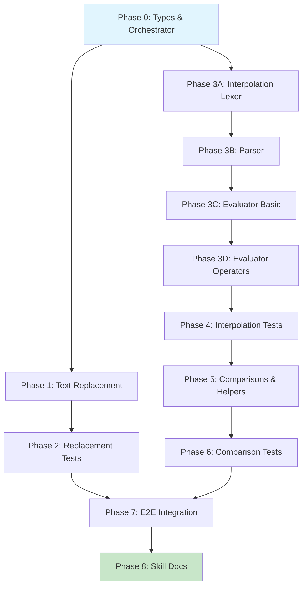

# Planning Process

- [x] Pre-flight Check [12:45pm]
    - [x] Catalogs validated
    - [x] Directories ready
    - [x] Budget estimated: complex (~55%)
    - [x] Codebase state reviewed (mod.rs, normalize/mod.rs, cleanup.rs)
- [x] Prep Started [12:45pm]
    - [x] Identified Skills [12:47pm]: rust, darkmatter, rust-testing, thiserror
    - [x] Identified Subagents [12:47pm]: Plan, correctness-reviewer, feature-tester-rust, risk-assessor
- [ ] Prep complete with {%} context available []
- [x] Clarify & Research [12:48pm]
    - [x] User answered 3 questions [12:48pm]
    - [x] Requirements updated [12:48pm]: Skip code interpolation, no alias, content-only
    - [ ] Package research started (background) []
- [x] Planning Subagent [agent: **Plan**] started [12:48pm]
    - [x] subagent skills used: rust, darkmatter, thiserror, rust-testing
    - [x] Planning completed [12:51pm]: 9 phases
- [ ] Module Assessment []
    - [ ] subagent skills used: LIST
- [ ] All Pre-review Steps complete []
    - )
- [x] Reviews Started [12:51pm]
   - [x] Completeness Review [12:53pm]: 24 findings
   - [x] Concurrency Review [SKIPPED: sequential pipeline]
   - [x] Correctness Review [12:53pm]: 16 issues
   - [x] Risk Assessment [12:53pm]: 1 high, 5 medium risks
- [x] Reviews Completed [12:53pm]
- [x] Plan Finalization started [12:53pm]
    - [x] subagent skills used: rust, darkmatter
    - [x] Dependency graph generated
- [x] Plan finalized [12:55pm]
- [x] Final Steps
    - [x] Lessons learned collected
    - [x] No package research needed (uses existing dependencies)
- [x] Summary reported [12:56pm]
    - Plan: `.ai/plans/2026-02-11.plan-for-stage1-transform-pipeline.md`
    - Phases: 12 (P0-P8, with P3 split into 3A-3D)
    - Critical path: 10 phases
    - Parallel: P1 + P3A after P0

## Current Baseline (from codebase review)

**Existing in darkmatter/lib/src/markdown/mod.rs:**
- `Markdown::cleanup(&mut self) -> &mut Self` - delegates to `cleanup::cleanup_content`
- `Markdown::normalize()` / `normalize_mut()` / `relevel()` - heading normalization
- Frontmatter support via `Frontmatter` struct with merge strategies

**Gaps to address:**
- No `transform()` orchestration API
- Text replacement not implemented (documented in text-replacement.md)
- Frontmatter interpolation not implemented (documented in interpolation.md)

**Design source:** `darkmatter/docs/stage1-design.md` (326 lines)

## Plan

### Phase 0: Types and Orchestrator Skeleton
**Agent:** `general-purpose` | **Skills:** rust, darkmatter, thiserror | **Complexity:** Medium
**Deps:** None | **Parallel:** No

**Goal:** Establish the transform module structure with complete type definitions and orchestration scaffolding.

**Deliver:**
- `transform/mod.rs` with public API (`transform()`, `transform_with()`, `transform_mut()`)
- `transform/types.rs` with `TransformOptions`, `TransformReport`, `TransformWarning`, `Stage1Stages`
- `transform/state.rs` with effective-state merge helpers
- `TransformContext` with field names: `now`, `utc`, `today`, `yesterday`, `tomorrow`, `dow`, `dow_abbr`, `year`, `month`, `month_name`, `month_name_abbr`, `env`
- `TransformOptions::new()` constructor (not Default - captures runtime)
- `Default` impl for `Stage1Stages` (all enabled)
- `TransformWarning` struct: `stage`, `message`, `line_number`
- Wire cleanup/normalization to existing implementations
- Add `MarkdownError::Transform(String)` variant

**Pass when:**
- [ ] `cargo check -p darkmatter-lib` passes
- [ ] `TransformOptions::new()` constructs with captured context
- [ ] Cleanup stage delegates to `cleanup::cleanup_content`
- [ ] Normalization stage delegates to `normalize::normalize`
- [ ] Unit test verifies stages run in sequence

---

### Phase 1: Text Replacement Engine
**Agent:** `general-purpose` | **Skills:** rust, darkmatter | **Complexity:** Medium
**Deps:** Phase 0 | **Parallel:** Yes (with Phase 3A)

**Goal:** Implement deterministic source-first text replacement.

**Deliver:**
- `transform/replacement.rs` with single-pass scanner
- Effective state resolution with `MergeStrategy`
- Overlap handling: longest key wins, lexicographic tie-breaking
- Value coercion: scalars→string, `null`→`""`, non-scalars ignored
- Non-recursive (output not re-scanned)

**Pass when:**
- [ ] `replace: {foo: bar}` transforms `foo` to `bar`
- [ ] Overlapping keys resolve deterministically
- [ ] `null` values replace with empty string
- [ ] Non-map `replace` is silently skipped

---

### Phase 2: Text Replacement Tests
**Agent:** `general-purpose` | **Skills:** rust, rust-testing | **Complexity:** Low
**Deps:** Phase 1 | **Parallel:** No

**Goal:** Comprehensive test coverage for text replacement.

---

### Phase 3A: Interpolation Lexer
**Agent:** `general-purpose` | **Skills:** rust, darkmatter | **Complexity:** Medium
**Deps:** Phase 0 | **Parallel:** Yes (with Phase 1)

**Goal:** Tokenize interpolation expressions.

**Deliver:**
- `transform/interpolation/lexer.rs` with tokenizer
- Tokens: `Variable`, `Dot`, `Pipe`, `Question`, `Colon`, `LParen`, `RParen`, `Comma`, `StringLiteral`, `NumberLiteral`, `CompOp`, `Eof`
- Skip code spans/blocks using `pulldown-cmark` offset_iter exclusion ranges

**Pass when:**
- [ ] `{{ foo }}` tokenizes to `[Variable("foo"), Eof]`
- [ ] Code spans `\`{{ foo }}\`` are NOT tokenized (exclusion working)
- [ ] Fenced code blocks with `{{` are NOT tokenized

---

### Phase 3B: Interpolation Parser
**Agent:** `general-purpose` | **Skills:** rust, darkmatter | **Complexity:** High
**Deps:** Phase 3A | **Parallel:** No

**Goal:** Build AST with correct operator precedence.

**Deliver:**
- `transform/interpolation/parser.rs`
- AST: `Variable`, `Literal`, `Fallback`, `Ternary`, `Comparison`, `FunctionCall`
- Precedence (high→low): function calls > comparison > fallback > ternary

**Pass when:**
- [ ] `{{ foo | "default" }}` parses to `Fallback(Variable, Literal)`
- [ ] `{{ x ? "yes" : "no" }}` parses to `Ternary`
- [ ] Invalid syntax returns parse error (not panic)

---

### Phase 3C: Interpolation Evaluator (Basic)
**Agent:** `general-purpose` | **Skills:** rust, darkmatter | **Complexity:** Medium
**Deps:** Phase 3B | **Parallel:** No

**Goal:** Evaluate AST for variables and literals.

**Deliver:**
- `transform/interpolation/evaluator.rs`
- Variable resolution: `foo`, `foo.bar`, `ctx.today`, `env.HOME`
- Unresolved variables → empty string

**Pass when:**
- [ ] `{{ title }}` with frontmatter resolves correctly
- [ ] `{{ ctx.today }}` evaluates to ISO date
- [ ] `{{ missing }}` evaluates to empty string

---

### Phase 3D: Interpolation Evaluator (Operators)
**Agent:** `general-purpose` | **Skills:** rust, darkmatter | **Complexity:** Medium
**Deps:** Phase 3C | **Parallel:** No

**Goal:** Add fallback and ternary evaluation.

**Deliver:**
- Fallback: `{{ color | "unknown" }}`
- Truthy ternary: `{{ color ? "known" : "unknown" }}`
- Truthiness: empty string, `null`, `false`, `0` are falsy
- Wire into orchestrator, update `interpolations_applied` counter
- Handle `fail_fast` option

**Pass when:**
- [ ] `{{ missing | "default" }}` uses fallback
- [ ] `{{ color ? "set" : "unset" }}` evaluates ternary
- [ ] `fail_fast = false` leaves original and adds warning

---

### Phase 4: Interpolation Core Tests
**Agent:** `general-purpose` | **Skills:** rust, rust-testing | **Complexity:** Medium
**Deps:** Phase 3D | **Parallel:** No

**Goal:** Comprehensive tests for interpolation (variables, fallback, ternary).

---

### Phase 5: Comparisons and Helpers
**Agent:** `general-purpose` | **Skills:** rust, darkmatter | **Complexity:** Medium
**Deps:** Phase 4 | **Parallel:** No

**Goal:** Extend grammar for comparison operators and helper functions.

**Deliver:**
- Comparisons: `==`, `!=`, `>`, `>=`, `<`
- Helpers: `length()`, `number()`, `round()`
- Auto string-to-number coercion

**Pass when:**
- [ ] `{{ count > 5 ? "many" : "few" }}` evaluates correctly
- [ ] `{{ length(name) >= 10 ? "long" : "short" }}` works
- [ ] `{{ number("42") }}` returns 42

---

### Phase 6: Comparison Tests
**Agent:** `general-purpose` | **Skills:** rust, rust-testing | **Complexity:** Low
**Deps:** Phase 5 | **Parallel:** No

**Goal:** Test coverage for comparisons and helpers.

---

### Phase 7: E2E Integration and Hardening
**Agent:** `general-purpose` | **Skills:** rust, darkmatter, rust-testing | **Complexity:** Medium
**Deps:** Phase 2, Phase 6 | **Parallel:** No

**Goal:** End-to-end integration tests and hardening.

**Deliver:**
- Golden file tests for full pipeline
- External state merge tests
- `fail_fast` behavior tests
- `cleanup_changed` detection (string comparison)
- Unicode robustness verification

**Pass when:**
- [ ] E2E test with all stages passes
- [ ] `cargo doc -p darkmatter-lib` clean
- [ ] `cargo clippy -p darkmatter-lib` passes

---

### Phase 8: Skill Documentation Update
**Agent:** `general-purpose` | **Skills:** rust, darkmatter | **Complexity:** Low
**Deps:** Phase 7 | **Parallel:** No

**Goal:** Update darkmatter skill documentation.

## Dependency Graph

**Critical Path:** P0 → P3A → P3B → P3C → P3D → P4 → P5 → P6 → P7 → P8 (10 phases)

**Parallel Opportunities:** Phase 1 and Phase 3A can execute concurrently after Phase 0

## Risks

> Implementation risks identified during planning with mitigation strategies.

| Level | Category | Description | Affected | Mitigation |
|-------|----------|-------------|----------|------------|
| HIGH | technical | Interpolation grammar/parser complexity - custom lexer+parser+evaluator with comparisons, ternary, helpers | Phase 4,5,6 | Build incrementally, add tests at each grammar step, use proptest for fuzzing |
| MEDIUM | technical | Unicode boundary handling in replacement scanner | Phase 2,3 | Use char_indices() not bytes, test with emoji/CJK |
| MEDIUM | technical | Code region detection edge cases for interpolation skipping | Phase 4,5 | Start without filtering, add later if needed |
| MEDIUM | scope | Phase 4 complexity underestimated (1.5-2x estimate) | Phase 4 | Split into substeps: lexer→parser→evaluator |
| MEDIUM | scope | Missing error recovery spec for fail_fast=false | Phase 1,4,8 | Document explicitly, add warning enum with severity |
| MEDIUM | technical | Merge strategy ambiguity (PreferExternal vs frontmatter) | Phase 1,2,4 | Document with examples, add integration tests |

## Lessons Learned

> Discoveries about skills or memory resources that were inaccurate, incomplete, or missing.

- [DESIGN_DOC: stage1-design.md]: TransformContext field names should match documented syntax (`ctx.now` not `ctx.now_local_iso`)
- [PATTERN: darkmatter]: Existing `normalize/types.rs` provides excellent pattern for report structures with summary methods
- [PATTERN: darkmatter]: `pulldown-cmark`'s `into_offset_iter()` already used in normalize/mod.rs - reusable for code region detection
- [PATTERN: darkmatter]: Codebase uses inline `#[cfg(test)] mod tests` rather than separate test files

## Package Changes

> No new dependencies required. Implementation uses existing darkmatter dependencies:
> - pulldown-cmark (already in use for cleanup, normalize)
> - serde_json (already in use for frontmatter)
> - chrono (transitive, for TransformContext timestamps)
