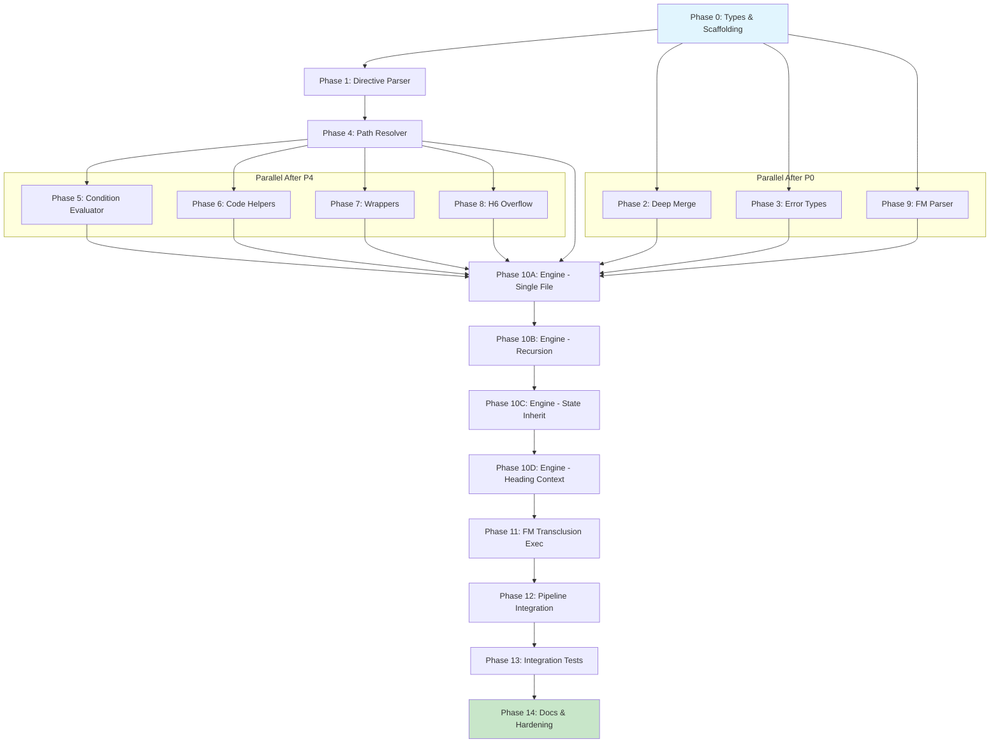

# Planning Process

- [x] Pre-flight Check [14:52]
    - [x] Catalogs validated
    - [x] Directories ready
    - [x] Budget estimated: complex (~55%)
- [x] Prep Started [14:52]
    - [x] Identified Skills [14:52] rust, darkmatter, thiserror, pulldown-cmark
    - [x] Identified Subagents [14:52] Plan, Explore, requirement-clarifier, reviewers
- [x] Prep complete [14:54]
- [x] Clarify & Research [14:54]
    - [x] Clarification agent returned [14:55]
    - [x] User answered 3 questions [14:56]
    - [x] Requirements updated [14:56]
- [x] Planning Subagent [agent: **Plan**] started [14:56]
    - [x] subagent skills used: rust, darkmatter, thiserror, pulldown-cmark, serde
    - [x] Planning completed [14:59] - 14 phases defined
- [x] Module Assessment [14:56]
    - [x] subagent skills used: rust, darkmatter
    - [x] 11+ modules impacted identified
- [x] All Pre-review Steps complete [14:59]
- [x] Reviews Started [15:00]
   - [x] Completeness Review - 26 gaps identified
   - [x] Concurrency Review - parallel opportunities validated
   - [x] Correctness Review - 16 issues found
   - [x] Risk Assessment - 4 HIGH, 6 MEDIUM risks
- [x] Reviews Completed [15:04]
- [x] Plan Finalization started [15:05]
    - [x] subagent skills used: rust, darkmatter, thiserror
    - [x] Phase 10 split into 4 sub-phases (10A-10D)
    - [x] Dependency graph generated
- [x] Plan finalized [15:08]
- [x] Final Steps
    - [x] Lessons learned: 4 items from reviewers
    - [x] Package changes: url crate verified present (v2.5)
- [x] Summary reported [15:10]
    - Plan: 2026-02-12.plan-for-stage2-transclusion-pipeline.md
    - Phases: 15 (P0-P14, with P10 split into P10A-D)
    - Duration: 18 minutes
    - Risks: 4 HIGH, 6 MEDIUM, 1 LOW

## Plan

### Phase 1: Scaffolding and Type Foundation
**Agent:** `general-purpose` | **Skills:** rust, darkmatter, thiserror | **Complexity:** Medium
**Deps:** None | **Parallel:** No

**Goal:** Add Stage 2 type infrastructure without changing runtime behavior.

**Deliver:**
- `TransformSource` enum (`Unknown`, `File(PathBuf)`, `Url(url::Url)`)
- `Stage2Stages` struct with `block_transclusion` and `fm_transclusion` bools
- `TransclusionOptions` struct (max_depth, allow_remote, code_fallback_language, etc.)
- Update `TransformOptions` with `stage2` and `transclusion` fields
- Update `TransformReport` with transclusion metrics
- Create `transclusion/mod.rs` skeleton with no-op stage wiring

**Pass when:**
- [ ] `cargo check -p darkmatter` passes
- [ ] Existing Stage 1 tests continue to pass
- [ ] New unit tests for Stage2Stages, TransclusionOptions, TransformSource

---

### Phase 2: Deep Merge Implementation
**Agent:** `general-purpose` | **Skills:** rust, darkmatter, serde | **Complexity:** Medium
**Deps:** Phase 1 | **Parallel:** No

**Goal:** Implement deep merge semantics for object values in state merging.

**Deliver:**
- `deep_merge(base: &Value, overlay: &Value) -> Value` function in state.rs
- Update `EffectiveStateBuilder::build()` to use deep merge
- Helper for merging `replace` maps specifically

**Pass when:**
- [ ] Unit tests verify recursive object merging
- [ ] Nested objects merge by key union
- [ ] Existing interpolation/replacement tests still pass

---

### Phase 3: Transclusion Error Types
**Agent:** `general-purpose` | **Skills:** rust, darkmatter, thiserror | **Complexity:** Low
**Deps:** Phase 1 | **Parallel:** Yes (with Phase 2)

**Goal:** Define comprehensive error types for transclusion operations.

**Deliver:**
- `TransclusionError` enum with all variants (ParseDirective, InvalidReference, CycleDetected, etc.)
- Update `MarkdownError::Transclusion(#[from] TransclusionError)`

**Pass when:**
- [ ] All error variants have meaningful Display implementations
- [ ] `#[from]` conversions work for io::Error
- [ ] Unit tests for error formatting

---

### Phase 4: Directive Parser
**Agent:** `general-purpose` | **Skills:** rust, darkmatter | **Complexity:** High
**Deps:** Phase 3 | **Parallel:** No

**Goal:** Parse `::file`, `::code`, `::url` directives with options from markdown content.

**Deliver:**
- `DirectiveKind` enum, `BlockDirective` struct, `BlockOptions` struct
- `parse_directives(content: &str) -> Result<Vec<BlockDirective>, TransclusionError>`
- Code block exclusion, JSON option parsing, quoted string support

**Pass when:**
- [ ] Parses `::file ./path.md`
- [ ] Parses `::code ./script.rs lang=rust`
- [ ] Parses `::file ./doc.md replace={"FOO":"BAR"} when="env.DEBUG"`
- [ ] Ignores directives inside code blocks
- [ ] Returns correct byte spans for replacement

---

### Phase 5: Path Resolver
**Agent:** `general-purpose` | **Skills:** rust, darkmatter, dirs | **Complexity:** Medium
**Deps:** Phase 4 | **Parallel:** No

**Goal:** Resolve directive targets to canonical filesystem paths.

**Deliver:**
- `resolve_path()` supporting `./`, `/`, `~`, `@` prefixes
- Repo root detection via `.git` traversal
- Security validation (repo-root escapes blocked)
- Canonical path generation for cycle detection IDs

**Pass when:**
- [ ] `./relative.md` resolves from source directory
- [ ] `~/path.md` expands HOME
- [ ] `@/path.md` finds repo root
- [ ] `MissingSourceContext` error for relative paths without `File` source

---

### Phase 6: `when` Condition Evaluator
**Agent:** `general-purpose` | **Skills:** rust, darkmatter | **Complexity:** Medium
**Deps:** Phase 4 | **Parallel:** Yes (with Phase 5)

**Goal:** Extend interpolation evaluator for `when` condition evaluation.

**Deliver:**
- Unary `!` operator support in lexer/parser
- `And`/`Or` combinator functions, `HasKey`/`Contains`/`Length` functions
- `evaluate_condition(expr: &str, state: &EffectiveState) -> Result<bool, TransclusionError>`

**Pass when:**
- [ ] `!missing` evaluates to true
- [ ] `HasKey(user, "name")` works
- [ ] `And(a, b, c)` requires all truthy
- [ ] `Or(a, b, c)` requires any truthy

---

### Phase 7: Code Transclusion Helpers
**Agent:** `general-purpose` | **Skills:** rust, darkmatter, syntect | **Complexity:** Medium
**Deps:** Phase 4 | **Parallel:** Yes (with Phase 5, 6)

**Goal:** Implement code-specific transclusion helpers.

**Deliver:**
- `infer_language(path: &Path, fallback: &str) -> String`
- `generate_safe_fence(content: &str) -> String`
- `wrap_in_code_block(content: &str, language: &str) -> String`
- `ensure_vertical_spacing()` (exactly one blank line above/below)

**Pass when:**
- [ ] `.rs` files get `rust` language
- [ ] Content with ``` gets ```` fence
- [ ] Output has exactly one blank line before and after

---

### Phase 8: Wrapper Formatters
**Agent:** `general-purpose` | **Skills:** rust, darkmatter | **Complexity:** Low
**Deps:** Phase 4 | **Parallel:** Yes (with Phases 5, 6, 7)

**Goal:** Implement quotation and disclosure wrapper formatting.

**Deliver:**
- `wrap_quotation(content: &str, attribution: Option<&str>) -> String`
- `wrap_disclosure(content: &str, summary: &str) -> String`

**Pass when:**
- [ ] Quotation adds `> ` prefix to each line
- [ ] Attribution adds `> — Attribution` line
- [ ] Disclosure wraps in `<details>` HTML

---

### Phase 9: Heading Overflow Handler
**Agent:** `general-purpose` | **Skills:** rust, darkmatter | **Complexity:** Low
**Deps:** Phase 1 | **Parallel:** Yes (with Phases 4-8)

**Goal:** Implement graceful H6 overflow to bold text.

**Deliver:**
- `relevel_with_overflow(content: &str, target: HeadingLevel) -> (String, Vec<TransformWarning>)`
- Headings beyond H6 become `\n\n**Title**\n\n`

**Pass when:**
- [ ] H2 at target H6 would be H7 → converts to bold
- [ ] Bold text has blank lines before and after
- [ ] Warnings generated for each conversion

---

### Phase 10: Transclusion Runtime and Engine
**Agent:** `general-purpose` | **Skills:** rust, darkmatter | **Complexity:** High
**Deps:** Phases 4, 5, 6, 7, 8, 9 | **Parallel:** No

**Goal:** Implement recursive transclusion execution with cycle detection.

**Deliver:**
- `TransclusionRuntime` struct with stack, max_depth, deepest_seen
- `execute_transclusion()` with recursive processing
- Cycle detection via stack membership
- State inheritance with deep merge

**Pass when:**
- [ ] Single file transclusion works
- [ ] Nested transclusion (A includes B includes C) works
- [ ] Cycle detection fails A → B → A
- [ ] Child state inherits from parent

---

### Phase 11: Frontmatter Transclusion
**Agent:** `general-purpose` | **Skills:** rust, darkmatter | **Complexity:** Medium
**Deps:** Phase 10 | **Parallel:** No

**Goal:** Implement `prologue` and `epilogue` frontmatter transclusion.

**Deliver:**
- Parse `prologue`/`epilogue` from frontmatter
- Execute after block transclusion
- `ignore_invalid` precedence handling

**Pass when:**
- [ ] Single prologue file prepended
- [ ] Array of epilogue files appended in order
- [ ] `ignore_invalid=true` skips with warning

---

### Phase 12: Pipeline Integration
**Agent:** `general-purpose` | **Skills:** rust, darkmatter | **Complexity:** Medium
**Deps:** Phase 11 | **Parallel:** No

**Goal:** Wire Stage 2 into the main transform pipeline.

**Deliver:**
- Update `run_transform_pipeline()` to call Stage 2 after Stage 1
- Report aggregation into `TransformReport`

**Pass when:**
- [ ] Full pipeline runs Stage 1 then Stage 2
- [ ] Report includes transclusion metrics
- [ ] E2E test with replacement + interpolation + transclusion

---

### Phase 13: Comprehensive Test Suite
**Agent:** `feature-tester-rust` | **Skills:** rust, darkmatter, rust-testing | **Complexity:** Medium
**Deps:** Phase 12 | **Parallel:** No

**Goal:** Create comprehensive integration and regression tests.

**Deliver:**
- Integration tests for all scenarios (nested includes, cycles, wrappers, etc.)
- Fixture files in tempfile trees
- `serial_test` for env-dependent cases

**Pass when:**
- [ ] All integration tests pass
- [ ] `cargo test -p darkmatter` passes
- [ ] Coverage of all error paths

---

### Phase 14: Documentation and Hardening
**Agent:** `general-purpose` | **Skills:** rust, darkmatter | **Complexity:** Low
**Deps:** Phase 13 | **Parallel:** No

**Goal:** Polish documentation, error messages, and warnings.

**Deliver:**
- Module-level documentation for transclusion/
- Update SKILL.md with Stage 2 documentation
- Improve error message quality

**Pass when:**
- [ ] `cargo doc -p darkmatter` generates clean docs
- [ ] SKILL.md includes transclusion examples

## Dependency Graph



**Critical Path:** P0 → P1 → P4 → P10A → P10B → P10C → P10D → P11 → P12 → P13 → P14 (11 sequential phases)

**Parallelization:**
- After P0: P2, P3, P9 can run in parallel
- After P4: P5, P6, P7, P8 can run in parallel

## Risks

> Implementation risks identified during planning with mitigation strategies.

| Level | Category | Description | Affected | Mitigation |
|-------|----------|-------------|----------|------------|
| HIGH | technical | Deep merge retrofit may break Stage 1 behavior | Phase 2, 10, 12 | Add comprehensive regression tests BEFORE changing merge logic |
| HIGH | scope | Recursive state management complexity (5+ interdependent concerns) | Phase 10 | Split into sub-phases: 10A non-recursive, 10B cycle detection, 10C state inheritance |
| HIGH | technical | Directive parser grammar complexity without formal grammar | Phase 4 | Start with minimal parser, add JSON parsing incrementally |
| HIGH | scope | TransformSource::File requirement impacts all existing callers | Phase 1, 5, 12 | Add infer_from_path() helper, document migration guide |
| MEDIUM | technical | Cycle detection may miss symlink loops | Phase 5, 10 | Track both canonical AND traversal paths, validate under repo root |
| MEDIUM | scope | Code transclusion replace semantics ambiguous (3 modes vs inherited only) | Phase 7, 10 | Clarify: ::code supports all three replace modes from ::file |
| MEDIUM | dependency | url crate may not be present for TransformSource::Url | Phase 1 | Verify url crate in Cargo.toml before Phase 1 |
| MEDIUM | rollback | Deep merge is breaking change, no semver versioning | Phase 2 | Bump to 0.x+1.0, add CHANGELOG entry |
| MEDIUM | technical | When condition evaluator reuses interpolation parser | Phase 6, 10 | Create isolated evaluate_condition() wrapper |
| LOW | scope | H6 overflow to bold text pattern untested | Phase 9 | Test edge case: nested H1-H5 at parent H5 context |

## Lessons Learned

> Discoveries about skills or memory resources that were inaccurate, incomplete, or missing.

- [DESIGN_DOC: transclusion-design.md]: url crate already present (v2.5) in Cargo.toml - no new dependency needed
- [REVIEW: completeness-reviewer]: Phase 10 complexity identified early - splitting into 4 sub-phases prevents underestimation
- [REVIEW: correctness-reviewer]: Deep merge is breaking change to Stage 1 - regression tests and CHANGELOG critical
- [REVIEW: risk-assessor]: @ path security boundary must be tested explicitly, not assumed from canonicalization

## Package Changes

> Dependencies to be added, updated, or removed during implementation.

- [VERIFIED]: url = "2.5" already present in darkmatter/lib/Cargo.toml - no changes needed
- [OPTIONAL]: petgraph - if cycle detection benefits from explicit graph representation (not required for stack-based approach)
